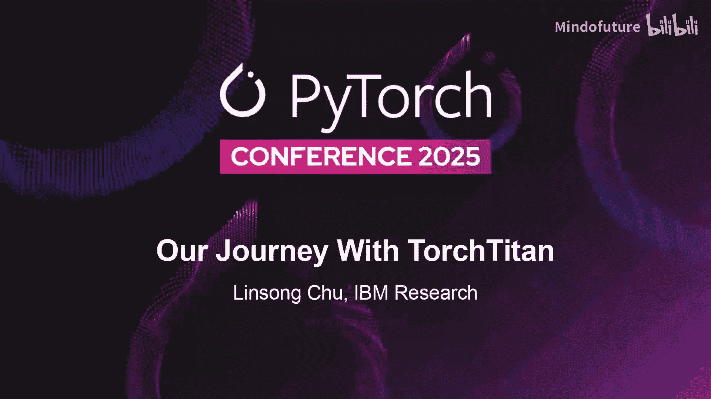
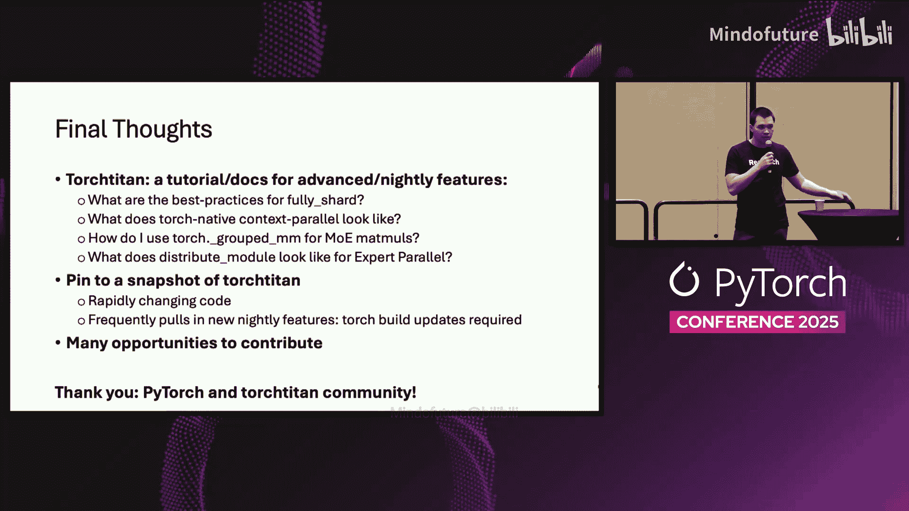

# 016：我们的 TorchTitan 实践之旅

在本教程中，我们将跟随 IBM Research 的 Garrett Goon 分享，深入了解 TorchTitan 这一 PyTorch 原生的大规模训练平台。我们将探讨其核心概念、IBM 团队如何将其用于生产级训练，以及它带来的性能优势与未来趋势。内容将涵盖从早期评估到实际运行 700 亿参数模型训练的完整旅程。

## P16.1：什么是 TorchTitan？🚀

TorchTitan 是一个完全基于 PyTorch 原生构建的大规模训练平台，主要用于大语言模型的预训练。它的核心优势在于无需外部依赖，并展示了如何结合完全分片数据并行、张量并行和流水线并行等多种并行策略，以纯 PyTorch 的方式进行端到端的训练。

上一节我们介绍了本教程的概述，本节中我们来看看 TorchTitan 的基本定义。

## P16.2：早期探索与评估阶段 🔍

在 IBM Research，我们拥有自己的开源训练框架 FMS-FSDP，并已将其用于生产。在 TorchTitan 初期，两者性能相当，没有更换的必要。然而，一些有前景的发展吸引了我们的注意。

以下是当时促使我们关注 TorchTitan 的几个关键因素：

*   **即将到来的 FP8 训练支持**：我们将在后面详细讨论 FP8 训练在 TorchTitan 中带来的好处。
*   **FSDP2 API 的出现**：这是一个更符合人体工程学且性能更高的全新完全分片数据并行 API。
*   **PyTorch 的卓越生态**：PyTorch 团队在构建优秀代码库和社区方面有着出色的历史，TorchTitan 的未来发展令人期待。

此外，我们与 PyTorch 团队在激活重计算方面有密切合作。传统的做法是对模型的每一层进行重计算，但这不够灵活。我们希望在 FMS-FSDP 中进行更选择性的重计算，这项合作成果最终被整合进了 TorchTitan。如今，PyTorch 的激活重计算已进化到可以对单个算子进行操作。

## P16.3：生产级训练之旅：Llama 3 70B 复现项目 🏗️

2024年4月，随着 Llama 3 的发布，我们在 IBM Research 内部启动了一个项目，旨在复现完整的 Llama 3 70B 模型训练。70B 规模的模型是一个理想的“金发姑娘”区域：它足够大，能力更强，适合研究高级工作流；同时又不需要过于特殊的训练设置，我们可以利用已有的基础设施。

为了确保 TorchTitan 满足生产需求，我们与 PyTorch 团队继续合作，进行了多项改进：

*   **异步检查点**：将检查点写入持久存储的操作从阻塞式改为非阻塞线程操作，显著提升了性能。此功能现已集成到 TorchTitan 中，只需一个标志即可启用。
*   **FP8 训练**：我们合作验证了使用低精度数据类型（Float8）进行训练的有效性。这包括在线性层使用 FP8 矩阵乘法，以及在 FSDP2 的 AllGather 通信中使用 FP8，后者可以节省一半的通信带宽。最终实现了约 50% 的吞吐量提升。此功能也已整合进 TorchTitan。

我们的实际训练于 2024 年底开始，基于 8 月份的 TorchTitan 代码快照。为了使其完全满足生产需求，我们添加了一些功能（其中许多现已并入上游 TorchTitan）：

以下是当时我们为实现生产就绪而添加的关键功能：

*   **Weights & Biases 支持**：用于跟踪训练状态。
*   **Hugging Face 适配器**：将分布式检查点 API 生成的多个小文件合并成单个 Hugging Face 格式的模型，便于评估和后续使用。
*   **更灵活的检查点恢复**：支持仅加载权重或同时加载权重与优化器状态。
*   **梯度累积**：实现对全局批次大小的更精细控制，以应对训练过程中计算资源的变化。
*   **更长上下文训练**：为 70B 模型集成如 YaRN 等高级位置编码，以提升长上下文性能。

## P16.4：数据加载器的生产就绪改进 📂

我们发现，数据加载是另一个需要改进以实现生产就绪的关键领域。为此，我们引入了自身训练框架 FMS-FSDP 中的一些特性。

以下是我们数据加载器实现的重要功能：

*   **可重新缩放性**：确保在不同数量的 GPU 上训练时，数据流出的顺序与原始设置完全一致。
*   **支持预分词数据或实时分词**。
*   **高效内存 shuffle**：降低随机打乱数据时的内存开销。
*   **高级多数据集采样**：支持以特定比例混合多个数据集。
*   **完全可检查点**：训练中断后恢复时，可以精确地从数据中断处继续。

## P16.5：训练成果与性能优势 📊

我们的全规模预训练运行完全基于 TorchTitan（仅添加了上述少量改进）。主要成果是：**使用 TorchTitan，我们仅用了三分之一的 GPU 小时数就达到了与基准相当的 70B 模型评估指标**。

这一性能提升主要来源于：

*   **FP8 改进**：FP8 矩阵乘法和 FP8 FSDP2 AllGather 带来了 1.5 倍的吞吐量提升。
*   **其他优化**：使我们仅用一半的 token 预算就达到了目标评估分数。

核心结论是：**通过少量补充，TorchTitan 已完全准备好进行端到端的生产级训练**。这是一个有力的证明，表明可以在 TorchTitan 中完成完整的企业级训练流程。

## P16.6：当前趋势与未来展望 🔮

TorchTitan 正在快速发展，展示着 PyTorch 原生的强大能力。变化的核心驱动力是新兴模型架构需要根本不同的训练范式或基础层。

最初，TorchTitan 非常专注于 Llama 模型。现在，它已经扩展支持更多模型，如 DeepSeek-V3、QWQ（实验性）和扩散模型示例。其中，**混合专家模型** 的需求是推动 TorchTitan 近期许多有趣变化的主要力量。

MoE 模型需要更专业的内核和成熟的专家并行支持。专家并行是指将不同的专家静态放置在不同的 GPU 上，这需要正确的梯度计算、特定的 FSDP2 API 设置、负载均衡机制以及可视化的路由指标。TorchTitan 在这些方面都取得了显著改进。一个未来的重要方向是集成 GPU 发起的 All-to-All 通信，这将极大助力专家并行训练。

这些支持新架构的工作带来一个副产品：**现在比以往任何时候都更容易将你自己的模型集成到 TorchTitan 中**。例如，我们在 TorchTitan 上构建了混合 MoE 模型，其中穿插了新颖的线性注意力变体（如 Mamba2），TorchTitan 为此类实验提供了一个成熟的框架。

此外，TorchTitan 的成熟度也使其可用于 IBM 自家 AI 芯片 Sire 的开发。我们需要持续测试主流模型（如 Llama、Granite），但使用完整大模型成本过高。因此，我们使用 TorchTitan 构建**微型模型**——它们保持原模型的结构和数值特性，但层数大幅减少。这能快速、低成本且真实地测试硬件，已成为我们开发流程中的重要工具。

## P16.7：TorchTitan 作为学习资源与使用建议 📚

我个人非常欣赏 TorchTitan 的一点是，它是一个关于最新、最先进 PyTorch 特性的绝佳**文档和教程来源**。你不仅能看到孤立的小代码片段，还能看到这些特性在完整端到端代码库中的实际应用。

例如：

*   **FSDP2 API 的最佳实践**：如何使用各种标志。
*   **专家并行的具体设置**：何时需要在前向传播后重新计算。
*   **超长上下文训练**：如何在不依赖第三方库的情况下进行上下文并行训练。
*   **MoE 特定操作**：如分组矩阵乘法（grouped MM）的参数和用法。
*   **DTensor API**：如何优雅地使用 DTensor API 在多个 GPU 上分布 MoE 模型并自动应用正确的通信模式。

对于实践者，我们总结了一些建议：

*   **固定代码快照**：由于代码和集成的 nightly 特性更新迅速，建议固定使用某个稳定的 TorchTitan 快照，以避免环境问题。
*   **积极参与贡献**：TorchTitan 已相当成熟，但在添加新模型、自定义配置、增加指标以及底层性能优化等方面，仍有大量贡献机会。

## P16.8：总结 🎯

本节课中我们一起学习了 TorchTitan 的核心价值与实践经验。我们回顾了 IBM Research 如何从早期评估 TorchTitan，到将其用于复现 Llama 3 70B 的生产级训练，并获得了显著的性能提升。我们看到 TorchTitan 正在快速演进以支持 MoE 等新架构，并且其成熟度已足以支持从大规模训练到微型模型构建乃至硬件测试等多种场景。最后，TorchTitan 本身也是一个学习 PyTorch 高级特性的宝贵资源。感谢 PyTorch 团队和 TorchTitan 社区带来的优秀体验。

---

## P16.9：问答环节精选 ❓

**问：TorchTitan 的目标用户是谁？**
**答：** 它适用于多种用户。既可用于端到端的生产运行（可能需要一些修改），也非常适合研究工作。研究者可以快速迭代模型设计和训练策略，而无需担心检查点、并行策略等基础设施问题，从而更专注于模型本身。

**问：你们运行过最大规模的集群是怎样的？性能如何？**
**答：** 抱歉，我无法回答这个具体问题。

**问：关于异步检查点，内存使用情况如何比较？**
**答：** 相关博客或 PyTorch 开发者帖子中提到了这一点。我记得至少有一个实验性的“零拷贝”选项，可能不会产生额外的内存开销（这指的是 CPU 内存，而非 GPU 内存）。目前默认设置是否需要额外的 CPU 内存拷贝，我需要核实。

**问：TorchTitan 是否集成了容错机制？**
**答：** TorchTitan 中有一些与容错相关的标志，但这不是我主要工作的领域，不确定其集成程度。我们的训练运行非常稳定，所以这不是我们主要关注的问题。

**问：与其他框架（如 DeepSpeed）相比如何？**
**答：** 我个人认为 TorchTitan 旨在作为 Megatron 等框架的替代品。它的纯 PyTorch 原生设计非常清晰、易于理解，在我看来比一些其他框架更简洁明了，使用体验非常积极。

**问：它是纯 PyTorch 原生的吗？还是有自定义 Triton 内核？**
**答：** 绝大部分是 PyTorch 原生算子。在部分 MoE 组件中，可能仍在使用一些 Triton 内核。但 99% 的情况下，它都是标准的 PyTorch。