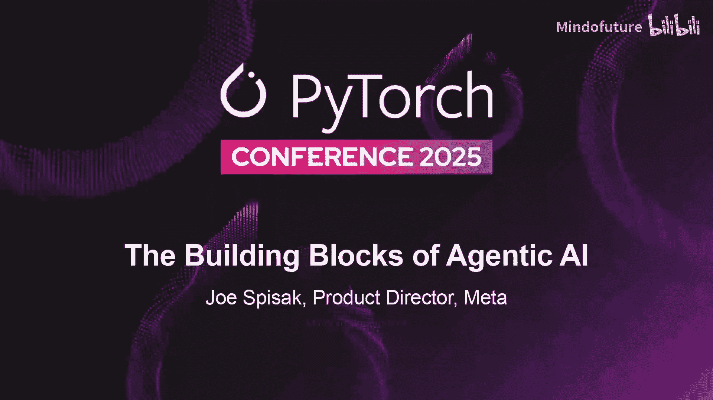
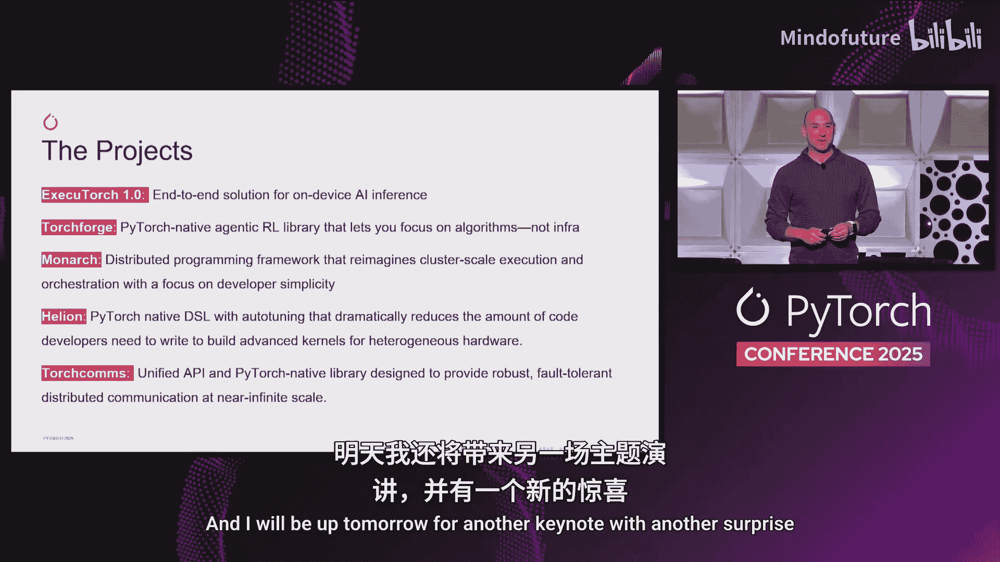

# 017：构建智能体AI的基石

在本节课中，我们将学习 Meta 超智能实验室产品总监 Joe Spisak 在 PyTorch Conference 2025 上分享的关于下一代 AI 开发栈的愿景与核心项目。我们将了解 Meta 如何基于三大原则构建一个面向未来、支持大规模和异构硬件的 PyTorch 原生生态系统。

## 概述与背景

上一节我们介绍了演讲的背景，本节中我们来看看 Joe Spisak 的开场白及其在 PyTorch 项目中的长期投入。Joe 在 Meta 工作，并有幸参与 PyTorch 项目近八年。他认为这是一段惊人的旅程，并对能与优秀的团队长期合作感到幸运。

## 下一代技术栈的设计原则

基于在 Meta 运营的庞大规模，团队一直在思考下一代技术栈。他们的设计遵循三个核心原则：

1.  **PyTorch 原生与生态互操作性**：构建的工具不仅在外观和体验上像 PyTorch，更注重与整个 PyTorch 生态系统的互操作性。目标是创建一个可供他人构建的基础，并在此基础上共同发展。
2.  **全方位扩展性**：Meta 的平台拥有数十亿用户，需要在所有维度上实现扩展。这包括在数千个 GPU 上进行模型训练、扩展推理能力，以及部署到移动设备和边缘设备。
3.  **硬件异构性**：世界是高度异构的。Meta 正在使用自研芯片构建数据中心，同时也投资于不同供应商。未来，设备上的加速器、数据中心的加速器需要协同工作，技术栈必须为这种异构的未来而构建。

## 全新发布的技术栈项目

基于上述原则，技术栈的每一层在过去一两年都经历了革新。以下是本次发布的核心项目介绍：

以下是本次发布的核心项目列表：

*   **ExecuTorch 1.0**：这是一个端到端的设备端开发框架，覆盖从可穿戴设备到手机。Meta 在公司内部广泛使用，并拥有包括高通、Arm、Cadence 在内的庞大生态系统。公式表示为：`ExecuTorch = 端到端设备端框架`。
*   **Torch Forge**：该项目旨在加速研究人员的工作，将基础设施从强化学习（RL）开发中抽象出来。它与 CoreWeave 及斯坦福大学合作展示，让研究人员能更简单地迭代算法。它构建在 Monarch 项目之上。
*   **Monarch**：这是一个重新构想分布式训练意义的项目。其单控制器架构比基于 PyTorch 分布式原语的方式更加 **PyTorch 原生**。Meta 认为这是未来大规模编排的方向。
*   **Healian**：该项目允许开发者用更少的代码编写内核，同时达到甚至超越峰值性能，因为它集成了自动调优功能。例如，用 Triton 可能需要 120 行代码实现的内核，在 Healian 中可能只需 30 行。
*   **Torch Comms**：这是一个专注于硬件异构性的通信集合库。为了打破该领域碎片化的现状并推动创新，Meta 联合了英伟达、AMD 等紧密合作伙伴及自研芯片团队，共同构建一个大家都能贡献、改进的健壮通信层，以应对未来近乎无限规模的 GPU 和计算单元。

## 总结与展望

本节课中我们一起学习了 Meta 为下一代 AI 智能体构建的基石技术栈。我们了解了其三大设计原则：PyTorch 原生与生态互操作、全方位扩展性以及硬件异构性支持。随后，我们详细探讨了五个新发布的核心项目：**ExecuTorch**、**Torch Forge**、**Monarch**、**Healian** 和 **Torch Comms**。整个技术栈仍处于早期阶段，Meta 欢迎所有人参与协作。可以查阅 PyTorch 官网的深度博文以了解更多细节。