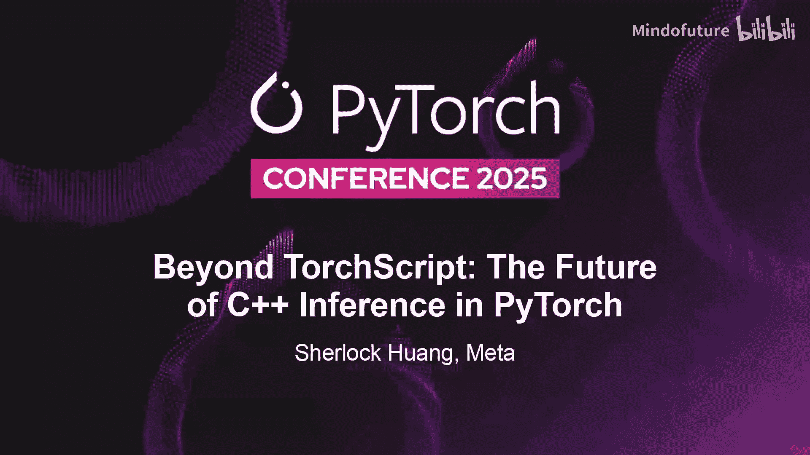
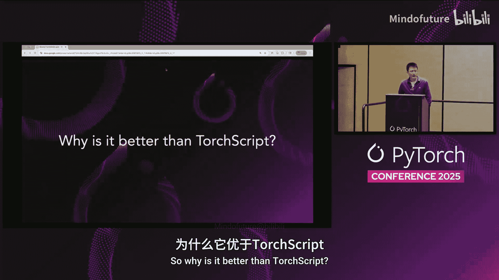

# 018：超越 TorchScript —— PyTorch 中 C++ 推理的未来 🚀

在本节课中，我们将学习为何需要脱离 Python 进行模型推理，回顾 TorchScript 的历史与局限，并了解其继任者 ExecuTorch 的设计理念与优势。我们将重点关注从研究到生产部署的演进路径。

## 为何需要脱离 Python 进行推理？🤔

上一节我们介绍了课程主题，本节中我们来看看脱离 Python 进行推理的根本原因。PyTorch 本身基于 Python，体验良好。但在生产环境中，尤其是特定场景下，必须脱离 Python 以获得更好的性能。

以下是几个关键原因：

1.  **追求极低延迟**：在自动驾驶等任务关键型系统中，每一微秒都至关重要。Python 作为解释型语言，其解释器层会引入额外的微秒级开销。为实现实时性，通常选择 C 或 C++ 实现。
2.  **资源限制**：在移动设备和嵌入式系统中，内存和功耗预算有限。Python 运行时环境通常较为庞大，不适合此类场景。脱离 Python 意味着没有 Python 运行时，可以获得更轻量、针对内存和功耗优化的方案。
3.  **简化部署流程**：部署时，我们希望将模型导出为一种紧凑、可移植的格式，以便轻松部署到多种环境，而无需部署整个 Python 环境。

经验法则是：在需要灵活性的繁重训练阶段使用 Python，但在生产环境进行高性能、低资源消耗的边缘推理时，转向 C++ 推理引擎。

## 回顾历史：TorchScript 及其挑战 🔄

上一节我们探讨了脱离 Python 推理的必要性，本节中我们将回顾实现这一目标的核心技术——TorchScript。TorchScript 是使 PyTorch 模型能够独立于 Python 运行的核心技术，历史上是连接研究模型与生产系统的桥梁。

创建 TorchScript 模型通常有两种方式：
*   `torch.jit.script`：通过解析 Python DSL 来创建静态计算图。
*   `torch.jit.trace`：在操作符级别进行追踪。

最终，你会得到一个 TorchScript 中间表示（IR）图。可以对此图进行各种优化、编译，并最终打包成 `.pt` 文件格式。结果产物随后被部署到运行时环境，例如 TorchScript 解释器或静态运行时。这是 TorchScript 栈的典型工作流程。

多年来，TorchScript 被部署在各种系统中，我们也遇到了多种问题。我们认为 TorchScript 是 PyTorch 图捕获和编译技术的第一代产品。随着时间的推移，我们开发了多次迭代，例如符号追踪和最近基于 PyTorch 2 的 Torch Export 图捕获。

以下是 TorchScript 面临的主要问题，从这些问题中，我们在新系统中做出了新的设计决策。

### 前端问题

首先，前端存在两个选项。
*   **Script 前端**：它对 Python 语法非常挑剔。你需要以特定方式编写模型才能使 `script` 正常工作。由于其本质，它无法支持许多 Python 特性，例如命名参数。这为 PyTorch 代码库增加了复杂性。
*   **Trace 前端**：它是基于追踪的操作符级系统。问题在于它**不健全**。最终得到的是一个直线型图，即使原始代码中存在 `if-else` 分支，你也看不到，它只会忠实记录此次追踪实例中遇到的操作。另一个问题是它**丢失了结构信息**，因为追踪发生在 C++ 分发器中，无法知晓外部 Python 世界的结构，难以将用户 Python 代码中的结构链接回 TorchScript 图。

### 优化与 IR 问题

接下来是优化相关的问题。当拥有计算图后，人们希望进行优化。然而，TorchScript IR 中的张量并不一定包含所有元数据。无法保证张量拥有形状、数据类型、步幅和布局等信息，而这些对于后续进行融合或内存规划等优化至关重要。人们通常通过运行额外的传递来填充信息，但这并不可靠。

另一个问题是 **TorchScript IR 向用户暴露了所有 Python 操作符**。截至目前，它有超过 2000 个操作符。如果一个后端试图集成 TorchScript IR，将面临巨大的接口表面，这通常阻碍了后端为大量模型实现一个合理良好的支持。

### IR 本身的设计问题

让我们看一个 TorchScript IR 本身的例子。以下是一个人工示例，函数接收字典、字符串和张量作为输入，在函数体中执行字典查找和字符串操作。TorchScript 的好处是，如果你将其脚本化，所有这些 Python 操作实际上都包含在 IR 中。你可以看到字符串连接、字典查找或字典设置等操作。

通常，AI 编译器只关心两件事：张量操作和形状计算。在 PyTorch 2 的生态中，这些是典型 AI 编译器关心的构造。但在 TorchScript IR 中，我们放入了许多非张量操作，从编译器角度看难以处理。这给 IR 引入了不必要的动态性，编译器通常会忽略它们或尝试编写补丁来消除它们。最终，对于试图构建后端或编译器的人来说，这不是一个合适的 IR。

关于控制流：人们喜欢控制流。TorchScript 的一个优点是能自动捕获 `if-else` 分支。然而，它也捕获了许多不一定需要是动态的内容。无论你是否打算让其动态，它们都被忠实地捕获在图中。在这个简单程序的例子中，它变成了一个复杂的 IR，结果图中包含 `if` 分支。对于编译器而言，分支是毒药，因为你无法看到全局图景，事物是局部化的，只能针对这个小 `if-else` 分支图进行优化，这阻碍了融合和重排序等全局优化。本质上，它引入了大量不必要的动态性，使得编译变得困难。

### 兼容性与运行时问题

最后是兼容性问题，存在多个层面的兼容性问题。
*   Python 和 PyTorch 本身在不断演进，TorchScript 与现代 Python 版本之间存在兼容性问题，更不用说 PyTorch 2 的新特性了。它的词法分析器无法跟上新发展。
*   由于 IR 暴露了 2000 多个操作符，并非所有操作符都能保证稳定。有时操作符定义被破坏，你的图就变得无效，运行时直接失败。
*   当你对图进行优化后，进入最终的运行时阶段。基于这样的图，你能构建的最佳运行时就是**解释器**。你只能逐节点运行应用了一些优化后的图，并且最终需要依赖 PyTorch 分发器来运行节点，分发开销较大。

综上所述，我们得出结论：我们曾尝试基于 TorchScript IR 构建多个版本的编译器，但未能基于它塑造出一个非常好的提前编译（AOT）编译器。我们意识到，增量修复这些问题非常困难。PyTorch 是一种动态语言，试图用有限的 IR 定义在静态图中捕获一切，这是一场必输的战斗。其次，问题源于 TorchScript 的根本设计，它试图捕获一切，任何 PyTorch 或 Python 的重大变更都会导致整个 IR 失效，因此向后兼容性不佳。最后，要达到真正的生产级运行时效率，我们必须从头重写。之前讨论的开销问题无法通过打补丁来修复。

因此，我们需要摒弃旧的解释器，建立一个不受早期设计选择束缚的新基础。重新开始是交付用户所需的高性能栈的唯一途径。

## 未来展望：ExecuTorch 🚀

上一节我们深入探讨了 TorchScript 的局限性，本节中我们来看看超越 TorchScript 的未来——ExecuTorch。基于上述所有限制和问题，我们决定从 PyTorch 2.9 版本开始**弃用 TorchScript**。

但请不要惊慌，这是一个**受控的日落计划**。需要明确的是，TorchScript 的弃用不会立即产生影响。一切将是受控的弃用，而非突然关闭。
*   所有现有的 TorchScript 构建仍将在一段时间内得到维护，但会**功能冻结**，我们不会在 TorchScript 上开发任何新功能。
*   只会修复安全漏洞相关的错误。
*   我们通过从 PyTorch 2.9 文档中删除 TorchScript 文档来开始这一重大转变，以此向世界表明我们不推荐新用户使用 TorchScript。
*   我们有一个明确的终止日期，计划在四个发布周期后，目标版本 2.14 时删除代码。这为社区和行业提供了充足的迁移和过渡时间。

现在，让我们展望未来，看看 TorchScript 之后是什么。过去几年，你看到了 TorchScript，看到了 PyTorch 2，我们一直在积极开发 TorchScript 的继任者——**ExecuTorch**。它基于我们创建的最新技术构建，源于 Torch Compile 和 Torch Export 栈。ExecuTorch 已达到通用可用性（GA）并发布了 1.0 版本。我们鼓励你将 ExecuTorch 作为 TorchScript 的替代解决方案。

ExecuTorch 遵循与 TorchScript 非常相似的栈：你有一个动态图模块，进行图捕获（新的图捕获方式是 `torch.export`，你会得到一个 **FX IR 图**），然后可以进行优化和 ExecuTorch 降低以优化它，最终变成一个可部署的二进制文件。你可以在你喜欢的移动、嵌入式或桌面环境中运行实际降低后的产物。

为什么 ExecuTorch 比 TorchScript 更好？
*   **图捕获前端不同**：我们大约两三年前发布了 Torch Export。它基于追踪进行图捕获，不会产生太多随机的 Python 语法，与现有 Python 特性的差距小得多。同时，由于 Dynamo 的存在，它具有健全性保证，在追踪期间捕获的动态形状能正确填充。FX IR 图中的所有张量都附有元数据信息，使得后端或编译器可以据此进行合理优化。
*   **兼容最新 PyTorch 2 进展**：它支持新特性，如 `TensorParallel`。你永远无法用 TorchScript 脚本化 `TensorParallel`，但可以用 Torch Export 导出它。对于在 Triton 中实现自己的内核，TorchScript 无法理解 Triton，但 Export 可以，因此能够捕获 Triton 内核。
*   **IR 优势**：如前所述，FX 图的所有节点元数据都已填充，提供了丰富的张量元数据集，允许你进行进一步优化。**Edge 方言**为可能出现在结果 FX IR 中的操作符集提供了更强的保证。你将得到一个我们精心挑选、维护并提供向后兼容保证的功能化操作符集，这就是 Edge 方言。如果你需要在自己的方言上进行进一步优化，也可以通过调整分解来自定义操作符集。
*   **丰富的优化与集成**：ExecuTorch 栈中集成了大量优化，如最先进的量化、内存规划等。ExecuTorch 还集成了众多委托后端，我们与所有硬件供应商密切合作，将后端移植到 ExecuTorch 栈中。
*   **高效的运行时**：ExecuTorch 运行时开销低、体积小（约 50 KB），底层是高效的 C++ 实现。它支持广泛架构，特别是针对移动端的 iOS 和 Android，以及嵌入式设备。

### 当前注意事项与下一步计划

需要提醒的是，ExecuTorch 目前主要针对移动、边缘和桌面设备。所有控制流都可以通过 Torch Export 捕获，但你需要进行重写，将其重写为 Torch 高阶操作符的形式。`TorchBind` 将不被支持。NVIDIA GPU 和 AMD GPU 支持处于实验阶段，我们正在将 AOT Inductor 引入 ExecuTorch 栈，能够通过 Inductor 将模型编译为 Triton 内核，并用 ExecuTorch 部署。

下一步计划包括：
*   继续支持更多桌面端模型。
*   前端将持续演进，以跟上新的 Python 和 PyTorch 特性。由于它是 PyTorch 2 原生，这更容易实现。
*   完善 AOT Inductor 以获得更好的 GPU 支持。
*   我们发布了两个示例模型：Whisper 和 Llama 3，它们是多模态生成模型，展示了将多模态生成模型通过 Export 并部署到 ExecuTorch 栈是多么容易。

ExecuTorch 已被广泛采用，生态系统中的多方都在使用它。

我们鼓励你尝试新的 ExecuTorch 栈，有教程和示例可供参考。我们也有 Discord 供开发者实时互动，并且始终可以通过 GitHub Issues 联系我们。

## 总结 📝

本节课中我们一起学习了 PyTorch 推理栈的演进。我们首先探讨了在生产环境中脱离 Python 进行推理的必要性，涉及低延迟、资源限制和简化部署。接着，我们回顾了 TorchScript 作为第一代解决方案的历史、其工作流程以及面临的主要挑战，包括前端限制、IR 设计问题、优化困难和兼容性痛点。基于这些挑战，我们了解到 PyTorch 官方决定弃用 TorchScript，并转向其继任者 ExecuTorch。最后，我们详细介绍了 ExecuTorch 的现代架构、优势（如基于 Torch Export 的健全捕获、丰富的元数据、Edge 方言、强大优化和高效运行时），以及当前的注意事项和未来发展方向。ExecuTorch 代表了 PyTorch 在移动、边缘和桌面设备上实现高效、可移植模型部署的未来。