# 019：开源训练后栈——Kubernetes + Ray + PyTorch + vLLM

在本节课中，我们将要学习现代AI工作负载（特别是训练后任务）的演变，以及由Kubernetes、Ray、PyTorch和vLLM等开源组件构成的软件栈如何协同工作以支持这些日益复杂的计算需求。

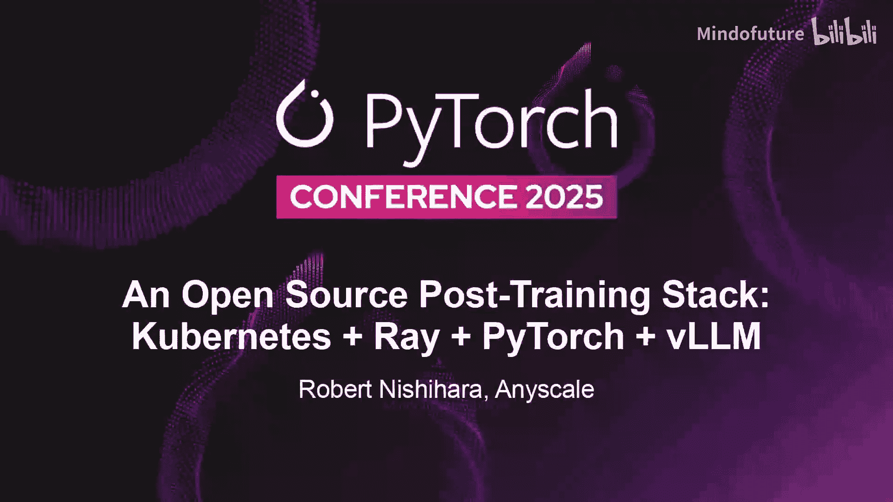

大家好，我是Robert。今天早些时候我做过演讲，现在想从技术层面更深入地探讨我们与Ray所做的工作。我将介绍Ray如何与Kubernetes、PyTorch、vLLM以及AI开源计算栈的其他组件集成，以支持训练后任务以及我们最近看到的一些更现代的计算密集型AI工作负载。

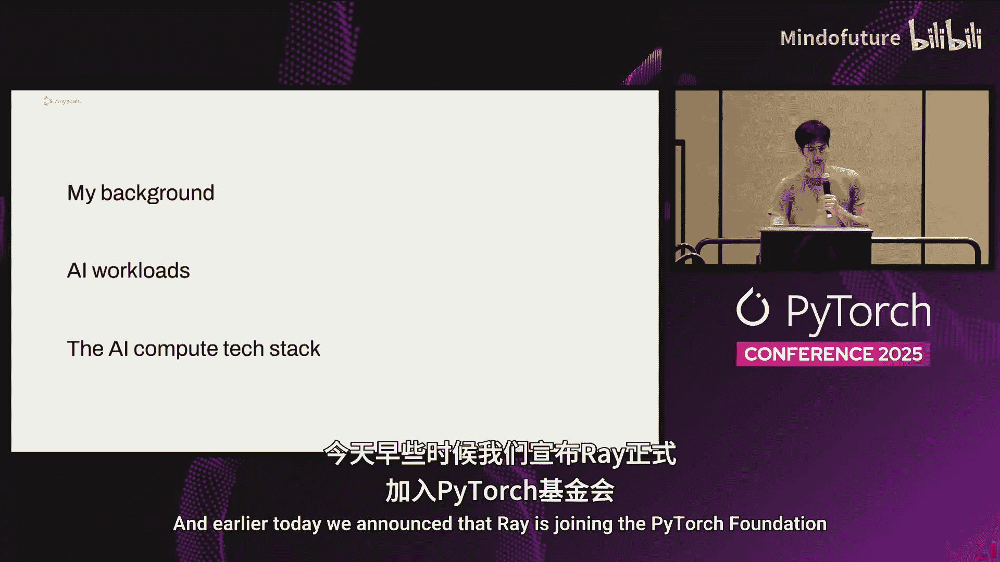

我想先分享一些我的背景，然后讨论过去一年AI是如何变化的，我们看到了哪些新的工作负载和需求，最后谈谈基础设施软件栈是如何演进以支持这些新工作负载的。

今天早些时候，我们宣布Ray将加入PyTorch基金会。我们对此感到非常兴奋。自从人们开始使用Ray以来，它就一直与PyTorch、vLLM以及PyTorch基金会中的其他项目一起被使用。因此，能成为该基金会的一部分对我们来说意义重大。

我的背景是，我大约在2012、2013年左右开始从事机器学习研究。当时我是伯克利分校的研究生，专注于深度学习算法、强化学习算法和优化算法。实际上，我并没有分布式系统或基础设施的背景。我们当时真正关注的是算法。但即使在那时，要真正实验AI、在算法上创新，你也必须进行实证研究。你必须运行实验，尝试新事物，看看它们是否有效。而要验证是否有效，你必须在一定的规模上进行，当然，当时的规模远不及今天。即使作为专注于算法和研究的人，我们大部分时间也花在了构建基础设施上。我们大部分时间都在构建系统，以便在集群上扩展计算、管理实例、在GPU上运行程序。因为这占用了我们所有的时间。我们认为有机会为分布式计算构建更好的工具。这促使我们在伯克利大学启动了Ray项目。

Ray的采用在过去一年里真正起飞了，这主要得益于生成式AI、当今的推理模型、智能体和强化学习。这些领域的发展真正导致了人们对Ray的需求激增，Ray的采用也呈爆炸式增长。其中很多变化就发生在最近一年。

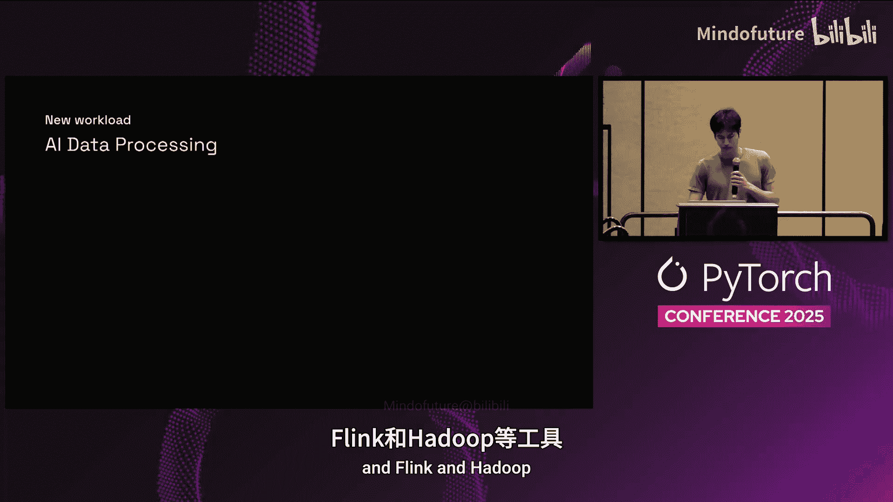

有许多用例让我非常兴奋，这包括成熟的科技公司，如Uber、Pinterest和Discord；也包括AI初创公司，如X AI、Physical Intelligence、Runway或Thinking Machines；还有传统企业。现在，Ray在整个行业中被广泛使用。

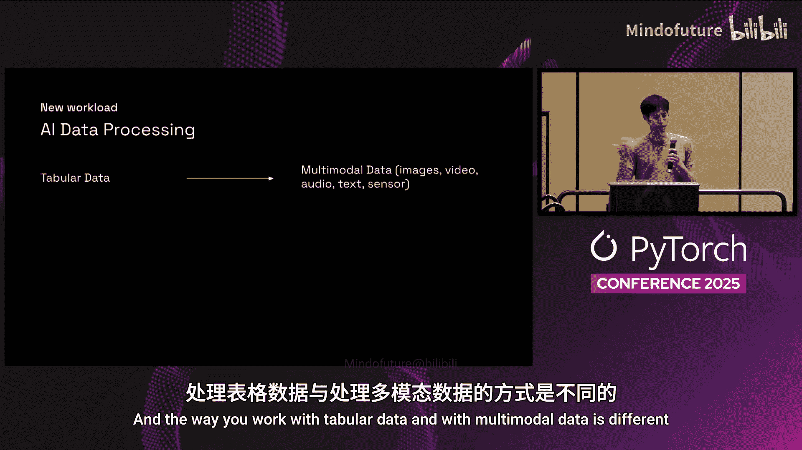

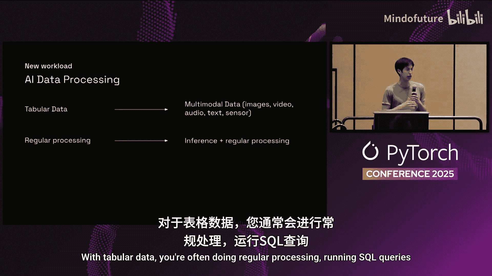

接下来，我想谈谈AI工作负载的一些变化，以及它们是如何变得更加复杂的。我将讨论数据处理和训练后任务。

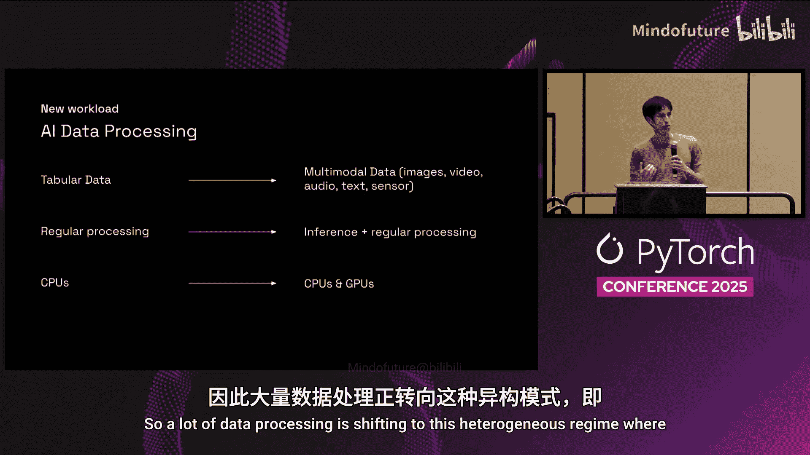

人们进行大数据处理已经有很长时间了。我们有像Databricks、Snowflake这样的公司，以及Spark、Flink和Hadoop这样的工具。

但数据处理的本质正在发生变化。表格数据的世界正越来越多地转向多模态数据。如今，人们处理视频数据、图像、音频、文本、机器人传感器数据等各种类型的数据。处理表格数据和多模态数据的方式是不同的。对于表格数据，你通常进行常规处理，运行SQL查询等。而对于视频，你不太可能对视频运行SQL查询。你通常是在这类多模态数据上运行推理以及其他处理。

数据处理正变得非常依赖推理。随着数据处理变得非常依赖推理，它也变得更加依赖GPU。因此，很多数据处理正在转向这种异构模式，即CPU加GPU的工作负载。

这与以前大不相同。因为当人们构建上一代数据处理系统（如Apache Spark、Snowflake、Flink、Hadoop）时，它们主要是为同构的CPU集群设计的，用于更类似SQL的查询、更简单的分析，并且通常更多是针对表格数据。因此，现在的转变，如果用一句话概括，就是从**在CPU上对表格数据执行SQL**，转变为**在GPU上对多模态数据执行推理**。这是一个相当大的转变。

这种转变很大程度上是由多模态模型变得越来越好所驱动的。想象一下，如果你在一家公司工作，有很多会议，你可能会录制其中一些会议，但大多数公司仍然不会录制大多数会议。为什么呢？因为没有人会回去看录像。因此，录制它并不能带来太多价值。即使今天使用AI来真正理解视频并从视频中获取价值，视频处理起来仍然很笨拙，很难操作。但随着这些模型变得更好，我们能够从各种类型的数据中获取越来越多的价值，我们将从数据中获得更多价值，并开始存储多得多的数据。因此，我认为我们会达到这样一个临界点：几乎一夜之间，每个人都在录制所有会议等等。我们已经开始看到一点这样的迹象，但我们仍然远未达到可能获得的价值。我认为我们将开始从多模态数据中获得更多的价值，随之而来的结果是，我们存储的多模态数据量将激增，我们为了从中获取价值而对这些多模态数据进行的推理量也将激增。因此，这里正在发生数据处理性质的巨大转变。

我想讨论的第二件事是强化学习。当然，我们都从AlphaGo、Atari和物理模拟器中了解过强化学习，这在2015、2016年非常热门，整个AI领域都聚焦于此。

强化学习最近真正卷土重来，因为它被用于构建真正强大的推理模型和智能体，例如DeepSeek。

从系统角度来看，这非常有趣。这是一张来自加州大学伯克利分校研究人员的图表，展示了Sky RL，这是一个用于训练后大语言模型的开源RL框架。它从系统角度说明了运行强化学习算法的构成。

如果你思考这与预训练或常规模型训练有何不同，图中标有“GRPO， PPO”的粉色方框基本上就是运行你的训练算法。如果你只是做常规训练，那就只有这个粉色方框。但要进行强化学习，你不仅要用模型进行训练，还要用模型来生成数据。所以你也在进行推理。这个过程是：你获取最新的模型权重，将其传送到数据生成端生成数据，然后再将数据传回进行训练。实际上比这更复杂，因为数据生成端有多个组件：有运行模型的推理部分，然后通常还有一个你正在模拟的环境。例如，如果你试图构建一个编码模型，那么你可能有一堆Docker化的代码库，配上GitHub issues，模型会发出诸如“克隆这个仓库”、“cd到这个目录”、“应用这个补丁”、“编译项目”、“运行这个测试套件”等命令，所有这些命令都在Docker容器中执行。因此，你需要扩展运行环境的容器，需要扩展推理，需要扩展训练。其中任何一个都可能成为瓶颈。你可能需要为这些不同的计算池准备不同的软件依赖、不同的计算资源。随着模型在训练过程中推理能力变得更好或推理时间更长，推理所需的计算量可能会增加，因此你需要将更多计算资源转向推理。随着你探索更长的推理路径，你可能希望分叉推理，探索多个不同的推理路径，然后再合并。你执行的不同环境可能都共享一些受速率限制的资源，比如一个LLM API，因此你需要协调所有这些你正在扩展的进程来处理速率限制。因此，强化学习带来了许多在常规训练中根本不会出现的系统挑战。这里的主要问题之一是异构性增加，有更多具有各自需求的移动部件。

Ray正是为异构性而设计的，包括硬件异构性和应用层异构性。因此，几乎每一个开源RL框架都构建在Ray之上。Ray是我们一直在开发的开源框架。在这里，Ray与训练引擎（如Megatron，如果你使用大型混合专家模型，或TorchTitan或FSDP）协同工作，处理进程编排、协调和数据移动。在服务端，我们看到很多SGLang、vLLM和其他引擎。这些是人们用于LLM训练后强化学习的一些技术栈。但这远未收敛，新的RL框架不断涌现，根据你使用的模型类型，合理的RL框架架构可能不同。因此，我预计在这个领域会有越来越多的迭代，然后才会收敛。

现在我想谈谈实际支持这类用例的软件栈。我们看到AI工作负载的复杂性在增长。

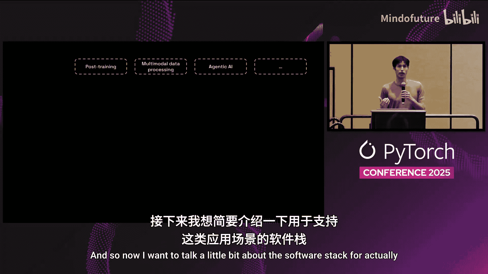

我们讨论了强化学习，讨论了结合AI的数据处理，所有这些都由底层的GPU驱动。因此，我想重复并强调我们看到的软件栈的几个不同层次。因为应用层的复杂性在增长，硬件层的复杂性也在增长，所以你需要一个介于两者之间的软件栈来连接应用和硬件，并帮助管理这种复杂性。这个软件栈必须解决这些类型的挑战，包括规模、资源管理、故障处理、可靠性等。

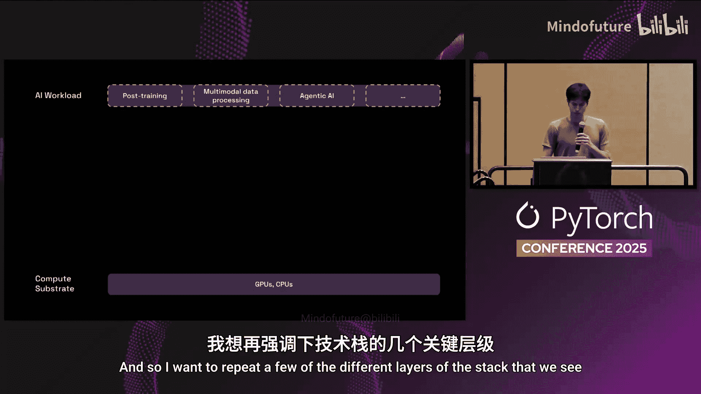

我们在这个栈中看到了几个常见的层次。我们都知道PyTorch，这是占主导地位的深度学习框架。这一层负责在GPU上高效地运行模型。围绕PyTorch有一个丰富的生态系统，用于处理模型并行、不同的并行策略、针对Transformer的优化，以及推理和训练引擎。但根本上，这一层是关于在运行模型时从GPU中榨取最大性能。然后是我们一直在构建的Ray，它位于分布式计算引擎层。这一层是关于解决扩展的分布式系统挑战，包括所有这些进程编排、协调。回顾一下这张图，你有所有这些不同的进程池需要管理，以实现自动扩展、处理故障、在它们之间移动数据、协调和同步它们。它们可能会失败，你可能需要自动扩展它们。这些都是关于解决这些分布式系统挑战的。

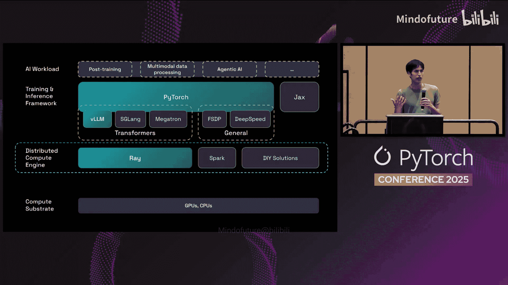
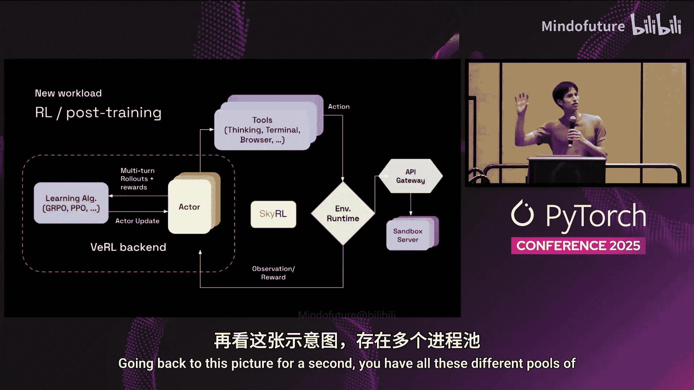
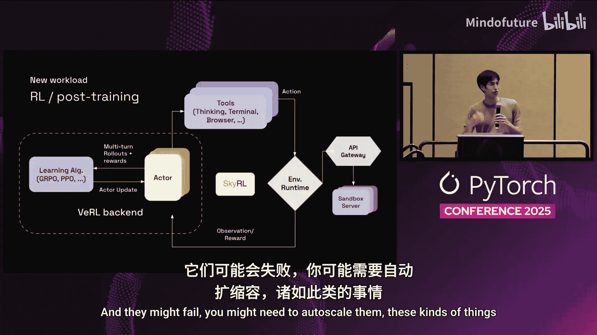

所有这些都运行在像Kubernetes或Slurm这样的容器编排器之上，容器编排器负责供应计算资源，处理更粗粒度的考虑，如用户多租户、作业多租户。所有这些共同提供了一个支持复杂AI应用的栈。

我想谈的一点是，我们实际上看到了这些不同层次之间大量的协同。我想举一个例子，说明这些层次通过相互感知可以更好地协同工作，为AI工作负载提供更好的支持。

那就是Ray和vLLM的集成。如果你试图部署大型混合专家模型，比如最大的DeepSeek模型之类的，这是一个多节点的事情，你不仅仅使用单个节点。要正确、高性能地完成这项工作，需要相当多的复杂性。做好它不仅需要优化在GPU上运行的代码，正确设置推理引擎，还意味着在进程编排和协调层也要做得很好。

因此，Ray和vLLM的开源社区紧密合作，真正实现了对vLLM工作进程的细粒度控制和放置。例如，如果你在进行分阶段解码分离，对于LLM推理，有处理输入的预填充阶段（这可能更受计算限制），还有生成令牌的解码阶段（这可能更受GPU内存带宽限制）。将它们分离到不同的计算池或不同的GPU上可能是有意义的，这样它们就不会相互干扰，从而获得更可预测的性能和更好的尾部延迟等。但当你这样做时，你可能对预填充阶段进行分片，对解码阶段进行分片，你有很多不同的工作进程。你可能想说，预填充侧的某些等级与解码侧的某些等级相匹配，这些对应着可能需要共置的不同进程。因此，表达这种关系在很大程度上是一个进程编排和协调的事情。随着模型变得更大，并行策略类型变得更加复杂，这种复杂性只会增加。例如，专家层有不同的并行策略，注意力层也有不同的并行策略。因此，要真正做好这件事，需要在这个软件栈的多个层次上都表现出色，而不仅仅是单个层次能处理的。

这就是我们通过两个开源社区之间的合作所能实现的事情。Ray与Kubernetes以及PyTorch的集成也可以这么说，但我只是想分享vLLM这个例子。

以上是关于我们如何看待软件栈演进以支持这些新兴AI用例的一些内容。所有这些的动机再次在于，AI工作负载的复杂性正在急剧增长，同时硬件侧的复杂性也在增长。

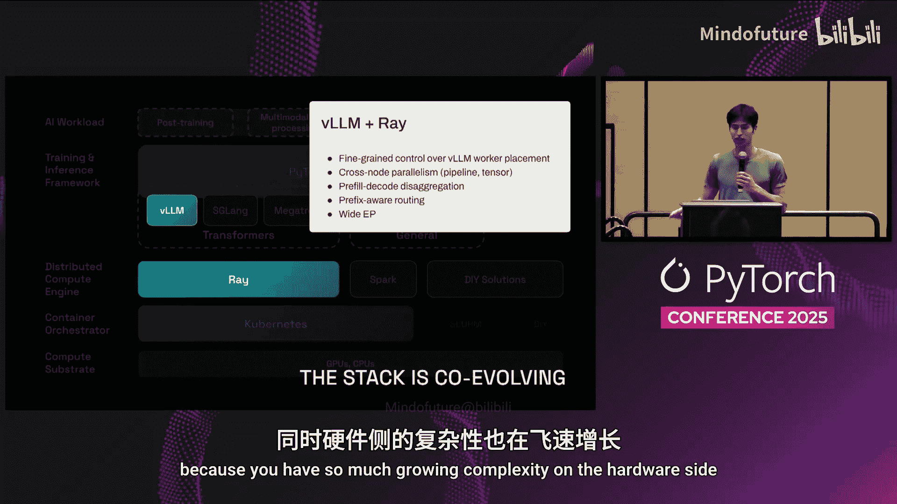

我想分享一下我们在Anyscale正在构建的东西。我们创立Anyscale是为了将Ray商业化并继续开发Ray。就在最近，我们今天将Ray捐赠给了PyTorch基金会。在Anyscale，我们正在大力投资和开发Ray。同时，我们正在构建我们的平台，这基本上是一个经过管理优化的Ray版本，带有大量围绕Ray的可观测性工具。因此，对于使用Ray的公司来说，这是运行Ray的最佳方式。

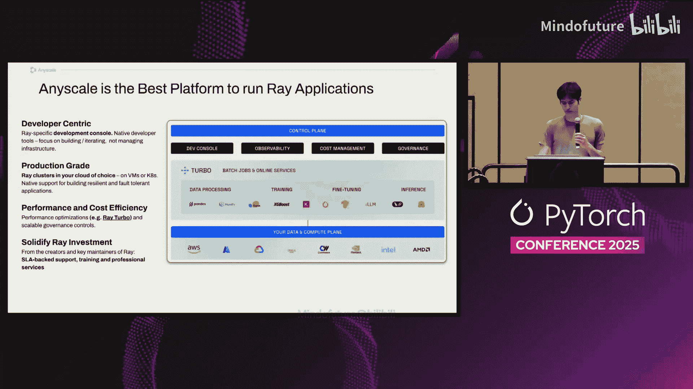

最后我想分享的是，类似于PyTorch大会，我们每年也有一个Ray峰会，今年是第四届，几周后将在旧金山举行。如果你在城里，这是一个深度技术性的观众和会议。如果你对强化学习感兴趣，来自Perplexity、Cursor、Thinking Machines的人将谈论他们如何扩展强化学习。还有很多从事机器人技术和其他领域工作的人。这基本上是一个AI和AI基础设施人员的聚会，我鼓励你去看看。

好的，我就讲到这里。非常感谢大家。我很乐意回答几个问题，或者之后和大家聊聊。

**问答环节**

**问：能谈谈将Ray捐赠给PyTorch基金会的背景吗？**

答：首先，我想说大多数成功的开源项目最终都会在某个时候进入一个基金会，比如PyTorch、Kubernetes。所以这是一个非常正常的结果。对我们来说，这实际上是向社区发出的一个信号，表明我们正在努力发展开源社区，我们将欢迎来自每家公司的贡献者，我们真的在努力使其成为一个社区项目。这是很重要的一部分。这真的是关于发展贡献者社区，发展开源社区。我还要说，因为Ray与PyTorch、vLLM等项目的使用如此紧密，这只是Ray一个非常自然的归宿。由于所有这些项目都专注于真正支持AI基础设施，所以这是一个非常好的体验。与PyTorch基金会和Linux基金会的合作很顺利。这并不意味着日常流程会有很大变化，不会突然采用所有那些繁重的流程。实际上一直很好。

**问：你对Monarch项目有什么看法？**

答：我认为Monarch有很多非常好的想法，我认为它从Ray那里汲取了一些灵感，比如单一控制器模型、Actor框架等。显然，它更原生地针对PyTorch，而Ray被设计为框架无关的，人们当然可以将Ray与PyTorch一起使用，但也可以与任何其他引擎一起使用。这是一个有趣的项目。

**问：为什么叫Ray？是《合金装备》的梗吗？**

答：我们实际上想了很多名字。第一个名字是Hermes，因为我们希望它快，我想这是希腊神话中一个跑得很快的神。然后我们改成了Orchestra，因为John Schulman建议的，它就像分布式系统，很多东西协同工作。但实验室里另一个项目有类似的名字冲突。所以我们改了，我想下一个是Photon，因为它快，像光，有积极的含义。然后我想又和其他项目有命名冲突。然后我们改成了Halo。但我不确定人们是否担心游戏《光环》的影响，所以我们改成了Ray，从那以后就没人抱怨了。是的，我们想的是像一束光，或者一些积极、快速、轻量级的东西。

**问：我们计划将Q-Ray也捐赠给PyTorch基金会吗？**

答：我们讨论过这个。我们想在这个会议上宣布，所以我们确信我们想把Ray捐赠给PyTorch基金会。但对于其他项目的最佳路径，我们不太确定。Ray项目GitHub组织下有很多仓库，Ray是主要的，但还有其他几个有趣的。我们不确定其他项目的最佳路径，所以我们决定先从Ray开始。在接下来的6到12个月里，我们将有时间思考其他项目的最佳路径。所以待定。

好的，我想我们就到这里。非常感谢大家。

---

**本节课总结**

在本节课中，我们一起学习了现代AI工作负载（特别是训练后任务和强化学习）的复杂性演变。我们探讨了数据处理正从**CPU上的表格数据SQL处理**转向**GPU上的多模态数据推理**。同时，强化学习等任务引入了进程编排、协调和异构资源管理等新的系统挑战。

为了应对这些挑战，一个分层的开源软件栈正在形成：
*   **PyTorch**：作为核心深度学习框架，负责在GPU上高效执行模型计算。
*   **Ray**：作为分布式计算引擎，负责解决跨多节点、多进程的编排、协调、自动扩展和容错等分布式系统挑战。
*   **Kubernetes**：作为容器编排器，负责底层的资源供给和粗粒度的多租户管理。
*   **vLLM等**：作为高性能推理引擎，与Ray深度集成，实现复杂的推理服务部署模式。

这些层次通过紧密协作（如Ray与vLLM的集成），共同为日益复杂的AI应用提供了强大、灵活且可扩展的基础设施支持。最后，Ray加入PyTorch基金会，标志着其作为AI基础设施关键组件地位的巩固，以及社区驱动发展的新起点。