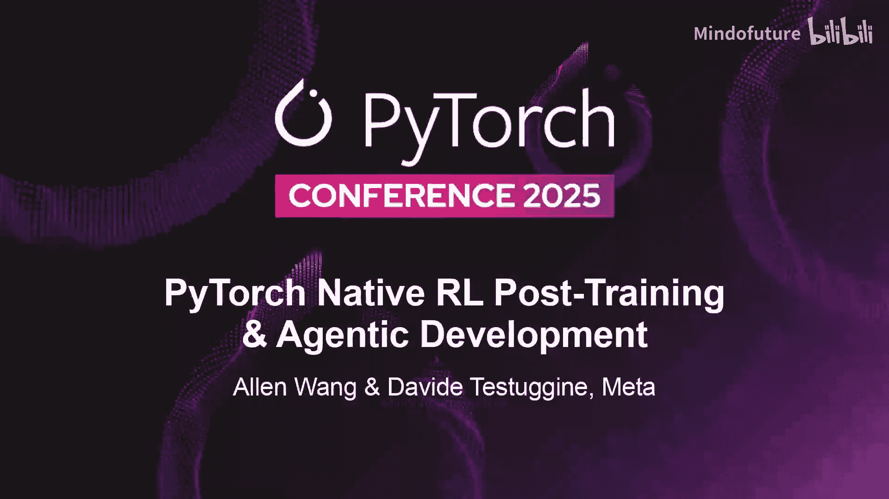
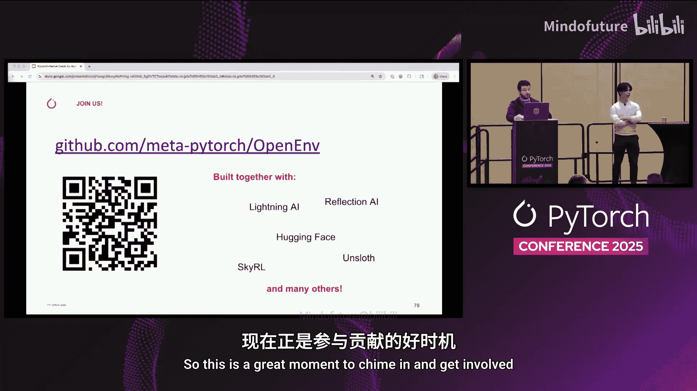

# 020：面向智能体的 PyTorch 原生栈

在本教程中，我们将学习如何构建面向智能体的 PyTorch 原生栈。我们将从智能体和强化学习的基础概念开始，探讨大规模分布式训练面临的挑战，并介绍我们为此构建的新项目，包括 Torch Forge 和 Open Environments。最后，我们将对整个栈进行总结。

## 🧠 什么是智能体？

智能体是当前的热门话题，但它们究竟是什么？它们仅仅是大型语言模型吗？并非如此。智能体更像是电影中描绘的 AI，它们不仅能与你对话，还能自主做出决策并采取行动。LLM 是智能体的重要组成部分，但仅靠 LLM 还不够。

目前行业内还没有一个完全统一的定义，但普遍认为，一个智能体至少需要具备以下要素：
*   **记忆**：包括长期记忆和短期记忆。
*   **规划能力**：能够思考和规划行动步骤。
*   **工具**：这是模型执行具体行动的关键。

工具尤为重要，因为它是模型与世界交互的接口。LLM 有清晰的文本输入/输出接口。我们可以通过文本序列化任何通信。例如，如果你想让 LLM 使用浏览器，只需以文本形式发送请求，并以 HTML 形式接收响应。你甚至可以在其中序列化图像。

我们通常将工具与要解决的问题联系起来。为解决特定问题而设计的所有相关工具，通常会被分组到一个**环境**抽象中。例如，你可以将浏览器和编译器组合成一个**编码环境**。而如果要构建一个**自动驾驶环境**，你可能会放入某种游戏引擎来模拟汽车的移动等。将游戏引擎暴露给编写 Python 代码的任务并不合理。因此，将事物封装到预打包的环境中是有益的。

拥有环境抽象也为我们思考智能体循环提供了很好的方式。在训练和部署时，让我们从普通语言模型转变为智能体的关键，正是在模型和环境之间构建这个循环。模型选择要执行的动作，环境则返回动作执行后的结果，我们称之为**观察**。这些观察中也可能包含用于训练的**奖励**。

## 🎮 一个简单示例：井字棋

让我们来看一个非常简单的例子。我能想到的最简单的例子是井字棋。环境持有棋盘状态并将其发送给网络。我们从一个空的棋盘状态开始，假设网络先走。

网络输出一个概率分布，表示它想在哪个位置落子。在井字棋中，只有 9 个可能的动作。假设它想在中心落子，我们采样概率最高的动作。然后，环境接收这个动作，计算新的棋盘状态，依此类推。注意，在这个例子中，我们有一个自动化的井字棋环境来响应你。因此，策略只扮演一个玩家，而环境会响应另一个玩家的移动。

## 🏋️ 如何训练这样的模型？

训练这类模型的传统方法是模仿玩家。你可以找一些人互相玩井字棋，或者与另一个游戏引擎对战，然后简单地收集他们所做的所有动作。不同的玩家对相同的情况可能做出不同的反应。基本上，你只需要对每一步进行交叉熵损失计算即可。

然而，这种方法有几个问题。获取数据成本高昂，数据收集速度受限于人的速度，这在如今拥有高速机器的时代并不快。同时，你也完全失去了探索的能力。这最终决定了模型性能的上限，其天花板就是为你玩井字棋的人的水平，这使得实现超人类性能变得几乎不可能。

## 🔄 解决方案：强化学习

一个可能的出路是强化学习。如果我们让模型自己玩，自己摸索什么有效、什么无效呢？这样，我们就可以让模型代替人类进行游戏，根据其输赢表现来训练它。

这看起来很诱人，但我们遇到了一个根本性问题。我们训练模型的方式总是先进行前向传播以构建计算图，然后进行反向传播以计算梯度。只要一切都是可微分的，这就能正常工作。

问题出在工具上。如果在中间有一个环境，前向传播工作得很好，但要进行反向传播，你必须通过环境进行反向传播，而环境通常**不可微**。我们中有多少人能写出 Chrome 浏览器的导数呢？

## 🐕 强化学习范式

一种可能的解决方法是转换范式，转向强化学习。它使用与监督学习完全不同的损失函数。我们遵循一个简单的规则：如果一个动作是好的，下次就更频繁地选择它；如果它是坏的，就减少选择它的频率。这实际上受到了巴甫洛夫对狗进行条件反射实验的启发。

这很容易实现。基本上，你只需要将好动作的对数概率向上推，将坏动作的对数概率向下推。例如，假设我们选择的井字棋动作是错误的，那么我们只需将其梯度向上推。

请注意，这比交叉熵损失效率低。交叉熵损失在这种情况下会给出完整的梯度谱。作为比较，你可以注意到我们在策略梯度中使用的是单个标量。

我们不必手动操作梯度累加器，只需让自动微分来处理。如果你简单地将对数概率乘以一个因子，那么梯度就会按比例缩放，点积求和后，你就得到了**原始策略梯度损失**。这是像 PPO 和 GRPO 这类方法的核心。今天我们不深入讨论这些方法的其他细节。

这展示了我们如何将强化学习作为一种工具，使我们能够通过不可微的环境进行训练。这很重要，因为它允许我们训练模型学习如何操作工具。我们付出的代价是效率：我们从每个样本中学到的东西比监督学习少得多。

## 📝 总结与新的技术栈需求

我们来总结一下。我们有一个通用的方法：在 LLM 领域，通常是先预训练语言能力，后训练工具使用。我们甚至有办法生成数据并对其进行训练。唯一的缺点是，这些数据的价值低于我们从人类那里收集的数据。

为这种新范式构建应用需要新的技术栈。今年我们主要关注两个领域：**基础设施**和**数据**。

正如我们已经看到的，强化学习在样本效率上较低。因此，在研究寻找更高效的样本方法的同时，在工程方面，我们致力于最大化现有方法的吞吐量，这需要新型的基础设施。

另一方面是数据。我们有办法生成合成数据，但我们仍然需要为模型创建现成的环境，并且需要构建适当的奖励流水线和评估框架来指导开发。所以，工作永无止境。

接下来，Alan 将详细介绍我们在基础设施方面的工作，之后我会回来谈谈数据部分。

## ⚙️ 构建可扩展的强化学习基础设施：Torch Forge

大家好，我是 Alan。我将谈谈我们如何构建可扩展的强化学习基础设施，以及我们的项目 Torch Forge。

到目前为止，我们已经讨论了强化学习的重要性。接下来 15 分钟，我的目标是带大家了解为什么这很复杂、为什么难以构建，以及我们如何一步步解决这些问题。

当你尝试实现一个分布式强化学习系统时，你会在以下几个领域遇到问题：**编排**、**性能**、**扩展**和**编程模型**。

我们将深入探讨每个领域，并从一个具体示例开始。

你现在看到的是一个生产环境中参考强化学习系统的示意图。这里有很多活动部件，但我们一起来梳理一下发生了什么。

基本流程是：你通常从问题库中采样一个问题，让策略生成响应。这些响应可能会与环境交互，形成一个循环，直到完成。完成后，它们由奖励模型进行评分。这些信息被存储在一个**回放缓冲区**中。我在这里描述的步骤通常称为** rollout 阶段**。

放入回放缓冲区的数据随后被用来训练更好的策略。每当我们更新权重时，这些更新后的权重会被发送到一个**参数服务器**，并传播回你的推理服务器。这个过程称为**训练过程**。训练步骤之后，循环继续。

所有这些在概念上其实相当简单，但我想指出几个挑战。

首先是**编排**：训练器、生成器、环境、奖励系统、回放缓冲区之间有很多需要协调的活动部件。

其次是**瓶颈管理**：注意这个系统实际上包含两个生产者-消费者循环。一个是 rollout 阶段为训练器生成数据，另一个是训练器将更新后的权重发送给 rollout 工作节点。你会发现，数据生成的速度实际上会影响训练器的空闲程度，反之亦然。如果处理不当，你可能会陷入一种尴尬的境地，比如你的训练器只有 10% 的时间在运行，其余时间都在等待数据完成，反之亦然。另外，如果你的生成器执行工具，例如，那也可能带来额外的延迟。有些工具快，有些慢。这种可变性会影响系统的端到端性能。

另一方面，**权重同步**也具有挑战性。需要频繁地将更新后的权重从训练器推送到生成器。但通常，这可能是数百 GB 甚至 TB 的数据。如果做得不够快，那么整个系统可能会再次成为瓶颈。这里的挑战在于，充分利用硬件的网络能力可能很复杂。

另一个问题是**扩展**：现代大模型通常太大，无法放入单个 GPU，这意味着你必须将模型分片到多个设备上。在解决瓶颈问题时，你可能会发现需要以特定方式分片，或者为了更高的吞吐量而复制某些特定组件。例如，我可能想要有多个生成器副本，每个副本使用 8 个 GPU，并可能为训练器分配 128 个 GPU。此外，如果使用环境，出于资源效率考虑，它们可能不使用 GPU。

除了所有这些挑战，强化学习在代码表达上也可能很困难。当你尝试用标准的 PyTorch 实现所有这些时，最终会编写所谓的 **SPMD 代码**，即单程序多数据。

最终的情况是，你编写一个在多个进程上运行的程序，并通过进程排名检查和集体通信来协调它们。例如，如果你是排名 0 的进程，你可能是协调器，负责收集轨迹、广播权重。如果你是生成器，你会生成轨迹并将其发送回排名 0，并接收回权重。如果你是训练器进程，你会接收轨迹，执行训练步骤，然后发送回权重。在这之下，你还需要管理集体通信，这可能很困难，比如 all-gather、scatter、all-reduce。你必须考虑哪个排名与哪个其他排名通信，如果单个排名失败，你还必须考虑这将如何影响程序中的其他排名。

换句话说，数据和控制流变得难以推理。你同时在思考 n 个排名，而不是思考逻辑组件实际在做什么。

## 📋 分布式强化学习的核心挑战

在我们继续之前，我们快速涵盖了很多内容，我想回顾一下到目前为止我们讨论的内容。分布式强化学习有几个基本挑战：

1.  **编排**：你需要协调许多组件，让它们协同工作可能很复杂。
2.  **性能**：这些组件以流水线方式运行，你需要确保不会阻塞其他组件，导致它们空闲。
3.  **扩展**：你需要管理不同的分片策略、复制以及可能的异构计算。
4.  **编程**：SPMD 迫使你思考排名和集体通信，而不是逻辑组件。

因此，你最终可能会在基础设施上花费比在实际算法上更多的时间。

## 🛠️ 解决方案：Torch Forge

鉴于此，我非常兴奋地宣布 **Torch Forge**。Torch Forge 由我们添加到生态系统中的几个新的 PyTorch 原生组件组成。我将从 Monarch 开始谈起，然后逐步介绍到 Torch Forge。

Torch Forge 建立在一个我们今天也宣布的新框架之上，这个框架叫做 **Monarch**。我们先简要介绍一下 Monarch。

Monarch 是一个基于可扩展参与者消息传递的 PyTorch 原生分布式编程框架。我们可以涵盖很多信息，但在这个演讲中，我们只关注三件事：

1.  **参与者网格**：参与者本质上可以看作是一个存在于进程中的 Python 类，可以是本地的，也可以是远程的。参与者可以与其他参与者通信，通常被组织成网格或参与者集合。可以通过单个调用向参与者网格的成员进行广播。
2.  **RDMA 传输**：Monarch 内置了原生 RDMA 支持，支持快速的点对点内存传输，这对于我们之前讨论的权重同步问题非常重要。
3.  **容错性**：Monarch 通过其监督树实现，提供了从故障中自动恢复的能力。

为了让你感受一下它的 API，Monarch 的典型工作流程是：你生成一些进程，定义你的参与者类，创建一个网格，然后调用你的参与者网格上的方法。这是非常清晰和命令式的 Python 代码。

总的来说，Monarch 使我们能够以命令式的方式编写分布式代码，而不是使用 SPMD 排名逻辑。我们明天有一个精彩的演讲，会更深入地介绍 Monarch 的内部原理。如果你想了解更多，信息在这里，如果你想拍下二维码，也可以用手机查看。但现在只需知道，Monarch 是使 Torch Forge 成为可能的基础。

## 🧩 Monarch 如何应用于强化学习？

正如我提到的，Monarch 让我们在逻辑组件级别进行编程，而不是在单个排名和集体通信级别。因此，我们可能想将生成器、训练器、奖励模型创建为参与者网格。我现在可以非常自然地开始与这些组件交互。我可以说“生成器，我想让你对这个特定的提示进行推理”，或者说“训练器，这里有一批数据要训练”。

得益于 Monarch 的单控制器执行模型，它编排一切，所以你只需将所有协调逻辑写成基本的 Python 代码。

我还想重要地指出，我们正在运行的底层组件本身也通常是 SPMD 作业。例如，我们可能想使用像 vLLM 这样的东西作为推理服务器，使用 TorchTitan 作为训练服务器，这两者都是用基本的 SPMD 实现的。因此，我们在这里使用 Monarch 并不是要取代它们，而是对它们进行编排。这使你有能力集成任何你已知的、能在规模上工作的现有生态系统组件。你在顶层获得了更简单的编程模型，同时保留了经过验证的 SPMD 实现的性能和可扩展性好处。

正如你所见，Monarch 为我们构建强化学习栈奠定了良好的基础。我们实际上在 Monarch 之上构建了一些其他核心组件，我称之为 **Forge Core**。

## 🎛️ Forge Core：控制平面与数据平面

Forge Core 由两个组件组成：**服务**和 **TorchStore**。你可以把它们看作是 Torch Forge 的控制平面和数据平面。

这里的**服务**决定数据应如何以及在哪里流动，管理配置、路由和编排。另一方面，**TorchStore** 根据这些决策实际移动和存储数据。

让我们先谈谈服务。服务是建立在 Monarch 之上的更高级抽象，旨在处理管理分布式参与者的一些操作复杂性。服务 API 允许你指定每个服务的形状和规模，并提供在副本级别操作的基本动作或副词。例如，我可能通过路由将请求负载均衡到一个副本，或者通过扇出命中我服务中的所有副本。

服务自动处理诸如负载均衡、自动重启和绕过故障的参与者网格进行路由等事情，并且还允许你独立扩展各个组件。它的设计是临时性的，这意味着你可以随任务启动和停止服务，这在处理机器学习工作负载时非常自然。

服务还提供了异构扩展的好处。例如，我可以启动 16 个策略副本和 1 个训练器。如果我后来决定需要更多策略副本，我也可以在配置中扩展它。

得益于服务，你现在可以像写伪代码一样编写你的强化学习算法。

让我们以 rollout 中的回合生成为例。有了服务，我们编写一个函数来采样提示、生成响应、对该响应评分，然后存储到回放缓冲区进行训练变得非常容易。因为这些服务为你处理了操作复杂性，你实际上可以像设计算法时使用的伪代码一样简单地表达它。

Torch Forge 给你的另一个超能力是**可组合性**。你可以编写一次 rollout 逻辑，然后将其组合成任何你想要的范式。

如果我们继续那个 rollout 生成循环，你可以用它轻松表达一个简单的同步强化学习循环：我们可以生成一整批回合，在该批次上运行训练步骤，然后更新推理服务器上的所有权重。

如果你想更并行化，你可以轻松地将其转变为完全异步的强化学习循环。例如，你可以通过创建多个异步 rollout 任务，然后创建一个单一的训练任务来在数据准备就绪时立即消费数据来实现。

这里我想指出的关键点是，你可以完全控制工作负载的异步性，并且可以用纯 Python 表达这一切。

## 💾 数据移动：TorchStore

好了，到目前为止我们已经介绍了服务如何处理控制平面问题。另一方面，让我们谈谈数据移动，这在扩展时也非常重要。

我们将面临的第一个挑战是**陈旧性挑战**。如果你采用离策略学习，你的策略最终会生成过时的 rollout，这可能会破坏你的强化学习训练。因此，你需要频繁更新权重，但更新权重可能很困难，因为每个训练步骤都会产生一个新的检查点，这可能是数百亿个参数，你需要将其从训练器移动到所有生成器副本。如果做得太慢，那么权重同步可能成为你的瓶颈。

另一个挑战是，你的训练器和推理服务器可能采用不同的分片策略实现。例如，你可能想在训练器上使用 FSDP，但在推理服务器上使用张量并行。因此，我们的传输设计需要考虑这一点。

最后，如果你想实现完全异步，即推理服务器可以在不同时间更新，你需要非常小心整体的 GPU 内存消耗，以免内存不足。例如，你可能无法在非常稀缺的 GPU 内存中保留模型的多个副本。

这就是 **TorchStore** 的用武之地。TorchStore 是一个新的分布式内存键值存储，针对 PyTorch 张量进行了优化，它建立在 Monarch 和 DTensor 之上。

TorchStore 允许我们设计这样的工作负载：训练器将分片的权重放入与训练器共置的 CPU 内存中，而我们的策略副本可以获取这些权重。在底层，权重实际上是通过 Monarch 的实现通过 RDMA 传输的。

这有助于解决几个问题：
*   由于我们可以通过 RDMA 传输权重，我们可以利用硬件可用的最高带宽通信。
*   由于我们能够将权重卸载到 CPU 内存，我们减少了对管理 GPU 内存的依赖。
*   由于我们建立在 DTensor 之上，我们有一种方法可以自动处理分布式拓扑之间需要完成的重新分片。
*   最后，它保留了使用像 NFS 这样的中央存储的用户体验，具有非常简单的 `put` 和 `get` API。

所有这些使我们能够完全解耦训练和生成，这对于从这样的系统中获得最大吞吐量至关重要。

## 🏗️ Torch Forge 技术栈全貌

有了所有这些列出的组件，让我们退一步，完整地看一下 Torch Forge 技术栈。

在最顶层，你有你的**强化学习算法**，这本质上是你编写和拥有的代码。

在下面，我们利用 **vLLM** 和 **TorchTitan**，它们是经过实战检验的、高性能且高度可扩展的推理和训练解决方案。

再往下，我们有 **Forge Core**，这是一个处理编排、协调、数据和容错的层。所有这些都是建立在 **Monarch** 之上的，而 Monarch 是我们的 PyTorch 原生分布式编程框架。

我想感谢我们在斯坦福扩展智能实验室的合作者以及我在 CoreWeave 的朋友们。斯坦福的团队能够使用 Torch Forge 集成他们的弱验证器项目 Weaver，来训练模型，以帮助在具有挑战性的推理基准（如数学和 GPQA）上取得进展。他们的反馈非常宝贵，确保我们构建了正确的框架，我们期待在取得成果时更广泛地分享。

我们也非常感谢 CoreWeave。没有他们，这次合作就不可能实现。我们能够使用一个拥有 512 个 NVIDIA H100 GPU、3.2 TB/s InfiniBand 的集群。我们运行了一个大规模的强化学习工作负载，以在生产规模上验证 Torch Forge 的能力。借助他们的技术栈，我们能够使用 Sonnet 或 Slurm on Kubernetes 加速我们的研究。我们都获得了使用最先进基础设施的绝佳体验，这提供了真正流畅高效的体验，使这种水平的实验和速度成为可能。

如果你有兴趣查看 Torch Forge、TorchStore 或 Monarch，你可以通过查看 GitHub 上的 Meta PyTorch 组织来找到它们。为了让这些更容易获取，我这里有二维码，如果你想查看的话。我们很期待看到你用 Torch Forge 构建什么模型。感谢你的时间，现在我将把它交还给 Davide 来结束本次演讲。

## 📊 回到数据：Open Environments

好的，我们开始晚了几分钟，所以我会快速浏览这部分内容。谢谢你，Alan。我们回到这张幻灯片。我们说过要投资于基础设施和数据。我们刚刚讨论了基础设施，现在让我们快速谈谈数据。

当你训练一个强大的智能体时，需要将你的基础模型暴露在各种情境中，以学习不同的技能。例如创意写作、编码、艺术、驾驶汽车、做数学等等，有很多技能。因此，作为一个社区，我们需要构建成千上万个环境。

当我们谈到环境如何将工具组合在一起时，我们提到了需要一个组件来评估智能体的表现。让我们快速谈谈这个。在我们的编码示例中，我们设置了一组编码问题发送给智能体，智能体将编写代码。我们如何评分呢？这取决于你。我们真正想要构建的是一个提供分数的系统，但你决定如何衡量、决定奖励什么，完全由你决定。

例如，如果你想从简单开始，我们可以只写一套规则，比如“你应该通过测试”。也许我们有一套你需要通过的单元测试，如果你没通过，就会得到负分，否则就是正分。随着时间的推移，你可以让它变得越来越复杂，设计越来越多的激励。例如，你可以加入代码风格的激励。你可以看到这个流水线如何随着时间的推移变得越来越复杂。这真的是一门艺术，是关于设计正确的激励并观察什么有效的过程。

我们希望你能花时间做这些事情，表达你的创造力，而不是花时间编写基础设施代码。

因此，我们推出了一个名为 **Open Environments** 的新计划。我们明天有一个发布演讲，但今天我先给你一个快速预览，别告诉别人，就我们之间知道。

我们领域的大多数人已经构思了大致相同的想法：类似 Gym 的 API、容器、本地工具、MCP 工具。我们只是提出一种标准化的方式，以便每个人都能从彼此的工作中受益。

我们目前仍在制定核心环境规范，并将在未来几周内研究奖励流水线和评估框架。

当然，要做到这一点并能够协作，我们需要一个中心。因此，我们很高兴与 Hugging Face 合作，将其作为 Hugging Face Space 添加到他们的 Hub 中。这将允许每个人创建新环境，与社区分享。这将有助于更快地分享信息，加速进展。总的来说，我们认为这将提高可重复性，使我们不仅能分享模型和权重本身，还能分享整个评估框架、整个奖励流水线以及与之相关的一切。

现在还处于早期阶段，我们从一开始就公开开发。请去查看一下。你会找到示例代码和一系列 RFC。这是参与进来的好时机。

这里也有你的二维码。我想快速感谢我们的团队和合作者。我很荣幸能代表今天这么多有才华的人的工作。感谢你们和我们在一起。

## 🎯 总结

在本节课中，我们一起学习了面向智能体的 PyTorch 原生栈。我们从智能体的基本定义和核心要素（记忆、规划、工具）开始，通过井字棋的例子理解了智能体与环境交互的循环。我们探讨了传统模仿学习的局限性，并引入了强化学习作为解决方案，特别是其通过策略梯度处理不可微环境的能力。

接着，我们深入探讨了构建大规模分布式强化学习系统时面临的四大挑战：编排、性能、扩展和编程模型。为了应对这些挑战，我们介绍了全新的技术栈：

1.  **Monarch**：PyTorch 原生的分布式编程框架，基于参与者模型，提供了命令式的编程接口、高效的 RDMA 传输和容错能力。
2.  **Torch Forge**：建立在 Monarch 之上的强化学习基础设施，包含：
    *   **Forge Core (Services)**：高级抽象，用于声明式地编排和协调分布式组件（如训练器、生成器），简化了算法表达。
    *   **TorchStore**：分布式内存键值存储，针对 PyTorch 张量优化，解决了权重同步、跨拓扑重新分片和内存管理的难题。
3.  **Open Environments**：一项旨在标准化智能体环境、奖励流水线和评估框架的社区计划，通过与 Hugging Face Hub 集成，促进协作和可重复性。

这个技术栈的目标是让研究人员和工程师能够更专注于算法设计和创意表达，而不是底层基础设施的复杂性，从而加速智能体领域的创新和发展。