# 022：Thunder——零成本分布式优化PyTorch模型 🚀

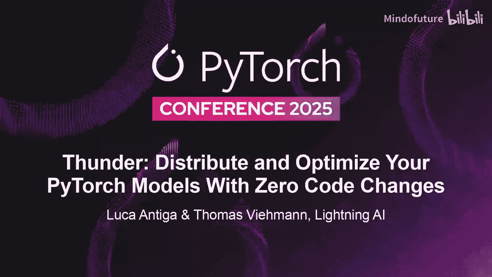

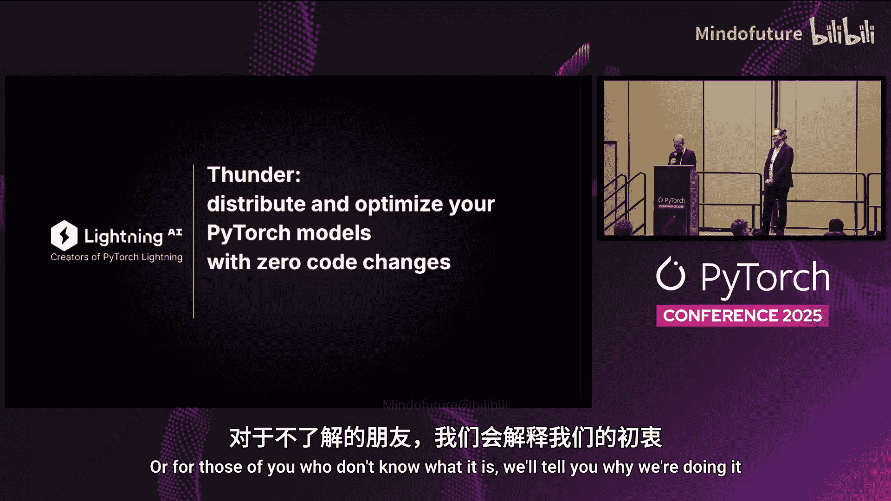

在本节课中，我们将学习如何使用Thunder工具，在不修改模型源代码的情况下，对PyTorch模型进行分布式优化和性能提升。我们将了解其核心设计理念、中间表示（IR）以及如何通过可组合的转换来优化模型。

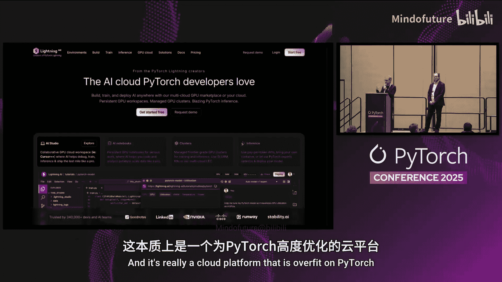

---

## 概述

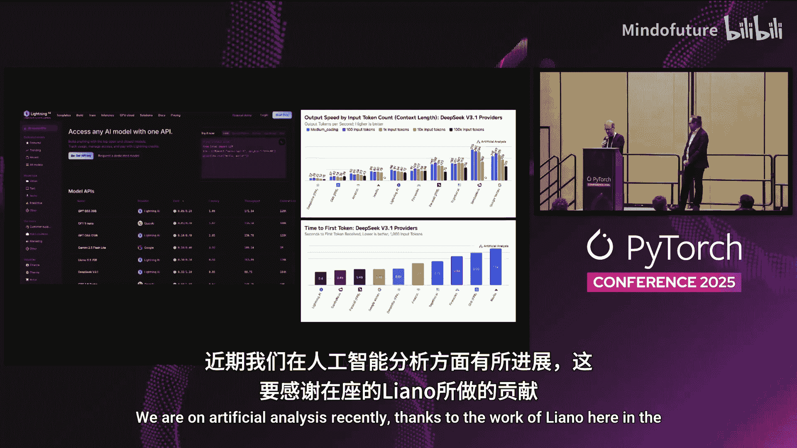

Thunder是由Lightning AI团队开发的一款工具，旨在帮助开发者将PyTorch模型的计算图转换为更高效、可分布式执行的版本。其核心思想是将模型定义与优化策略解耦，通过程序化地转换中间表示（IR）来实现性能优化，而无需用户成为编译器专家。

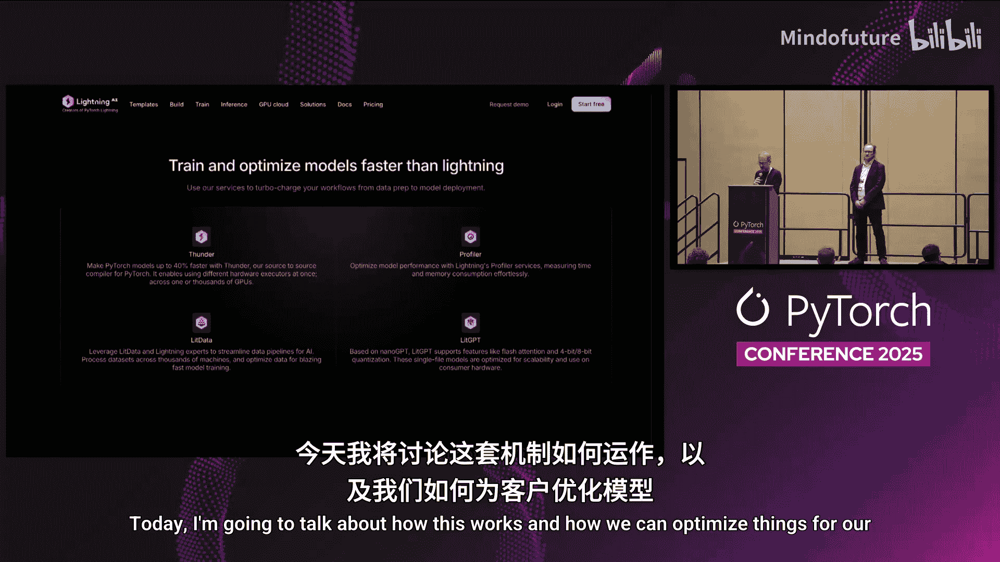

---

## Lightning AI平台简介

我们来自Lightning AI，开发了Lightning AI平台。这是一个专为PyTorch优化的云平台，用户可以获得免费账户和GPU计算额度。平台支持从模型训练到推理部署的全流程，并能帮助用户充分利用计算资源，通过一系列开源工具栈优化模型性能。

---

## 传统优化方式的挑战

上一节我们介绍了平台背景，本节中我们来看看传统模型优化方式面临的挑战。通常，优化模型性能是一个迭代过程：

1.  编写模型源代码。
2.  使用编译器（不一定是`torch.compile`）并调整编译标志。
3.  观察GPU利用率，如果效果不佳，则返回修改源代码（例如添加上下文管理器或调整计算表达方式）。
4.  重复此过程。

这种方式存在两个主要问题：
*   **工作量大**：针对每个模型都需要重复进行优化调整。
*   **难以迁移**：在一个模型上获得的优化经验很难直接复用到另一个模型上，导致组合性爆炸。

---

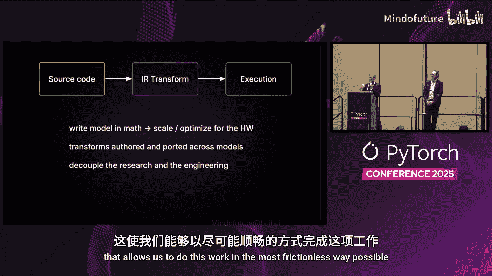

## Thunder的设计理念：基于IR的转换

我们认为存在一种更好的方式，能提供更多控制权，这正是Thunder的设计出发点。PyTorch编译器正演变成一个工具包，这为我们提供了共同的基础。

我们的方法如下：
1.  从源代码获取计算图，并生成一个中间表示（IR）。
2.  在IR级别进行程序化转换。这使得开发者能够友好地将计算转换为更符合性能目标或分布式需求的形式，而无需深入编译器底层。
3.  这些IR转换是**可移植**和**可组合**的。例如，你可以编写一个通用的分布式策略转换，将其应用于多个模型，将单GPU模型转换为跨GPU或跨机器运行的版本。

这样，用户的研究工作（模型设计）与我们的优化工作（IR转换）得以解耦。我们的目标是创建一个工具，让这种优化工作能够以尽可能无摩擦的方式进行。

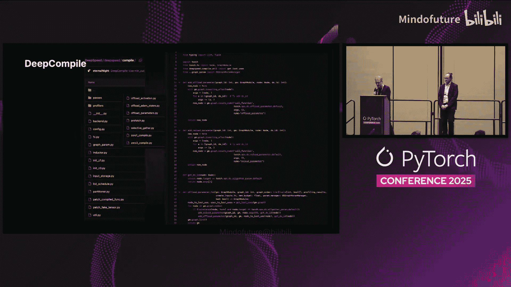

---

## 相关工作与设计空间

已有一些工具在类似的设计空间中运作。例如：
*   **DeepSpeed**：其DeepSpeed Compile能在编译器IR级别自动应用参数分片、通信调度和内存感知执行，实现全局分析和优化。
*   **vLLM**：在处理推理编译时，也采用了一套Pass（转换）系统。

我们的假设是，未来程序转换领域的空白将被一个或多个工具填补，这些工具将使我们能够分布式扩展和优化模型。无论最终形态如何，我们都希望构建一个兼具PyTorch强大表现力和易用性的工具，让研究人员无需成为编译器工程师也能进行此类优化。

---

## Thunder的核心架构

上一节我们探讨了设计理念，本节中我们来看看Thunder的具体实现架构。Thunder遵循以下几个核心原则：

1.  **解耦模型与优化**。
2.  **易于使用的IR**：其IR基于Python，易于检查、分析和运行。
3.  **丰富的全图转换**：通过“crafted bricks”实现。
4.  **多执行器分发**：可以将IR的不同部分分发给不同的后端执行器执行。

### Thunder的中间表示（IR）

Thunder的IR具有层次结构。最高层是纯粹的函数式计算图跟踪（trace）。此外，还有**前奏（prologue）**和**尾声（epilogue）**部分，负责在nn.Module领域和纯函数式领域之间进行转换，这些部分同样可以被转换。

操作（如Linear）会被分解为类似XLA HLO的原始操作（primitives）。每个执行器可以选择执行高级操作，或执行分解后的原始操作。例如，分解后的原始操作可能不包含自动广播，因此你会看到显式的广播操作。

我们编写了一个用Python实现的CPython解释器，用于跟踪通用程序并理解字节码。这使我们能够轻松扩展解释器，以支持新的语言结构，从而更容易获得模型的全计算图。

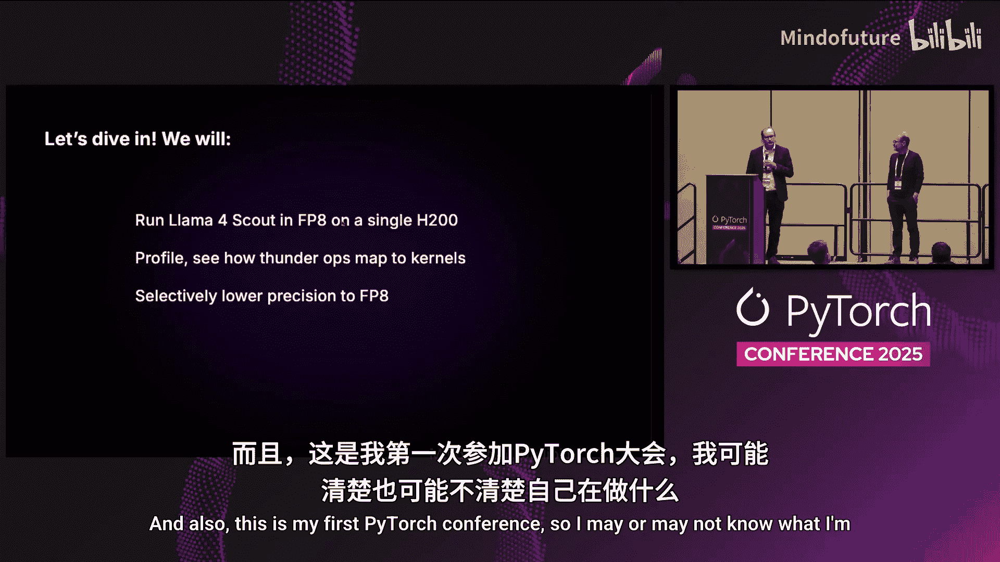

---

## 实战演示：优化LLaMA模型

现在，让我们通过一个具体例子，看看如何使用Thunder优化一个大型语言模型。我们将尝试在单个H200 GPU上运行LLaMA Scout模型。

### 初始尝试与性能分析

LLaMA Scout默认是拥有1090亿参数的FP16模型，无法直接放入单个GPU。我们首先尝试运行其中的两个层。

```python
# 使用Thunder编译模型
compiled_model = thunder.compile(model, recipe=transformer_recipe)
```

初始性能与原始Transformers库相近。为了优化，我们必须先进行测量。我们使用PyTorch Profiler，并配合Thunder的一个插件，该插件能以高细节度进行分析。

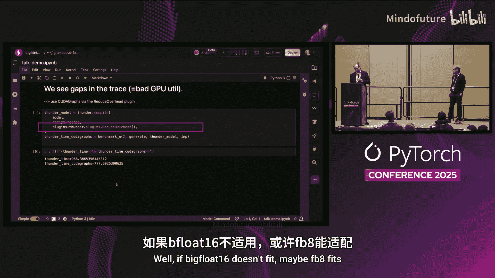

分析结果显示，在性能跟踪图中，底层计算核心（CUDA kernels）的执行流存在间隙，这表明GPU利用率不佳。

### 应用优化转换

为了解决这个问题，我们可以应用`cudagraphs`转换。Thunder以插件形式提供了开销较低的CUDA Graphs支持，它能识别哪些操作可被图化，并处理相关输入限制。

应用此转换后，我们消除了执行间隙，获得了可观的加速。

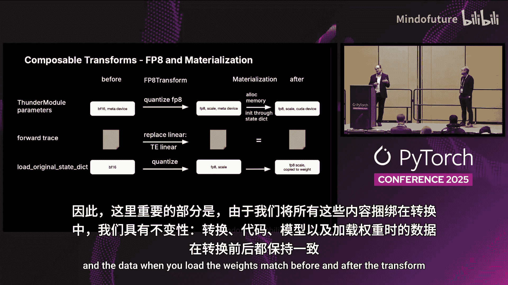

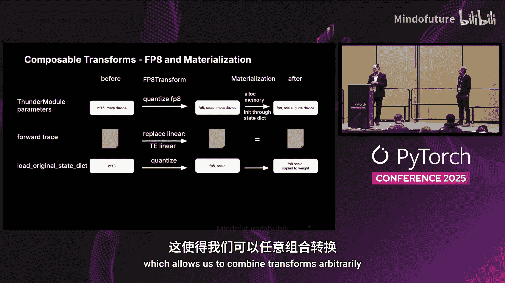

### 量化与内存优化

为了运行完整模型，我们尝试使用FP8精度。我们创建了一个8-bit量化转换，利用NVIDIA Transformer Engine来执行模型，而**无需修改原始Transformers库的源代码**。

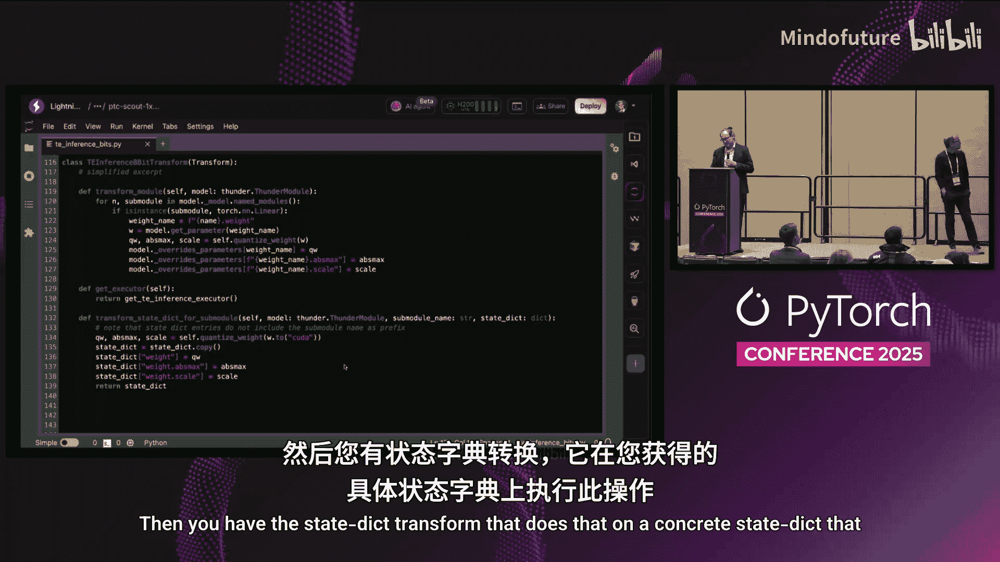

转换过程如下：
1.  在元设备（meta device）上实例化模型，不占用实际内存。
2.  应用8-bit量化转换，此时模型已能放入GPU内存。
3.  将模型实际加载到设备上。

这个转换会一致地修改模块本身、参数、计算图和程序状态字典（state dict）。这种一致性保证了转换的可组合性。

### 转换的构成

一个完整的转换通常包含三部分：
1.  **模块转换**：识别并替换模型中的特定层（如Linear），量化权重并添加缩放信息。
2.  **状态字典转换**：对具体的状态字典（一个普通的PyTorch字典）进行量化处理。
3.  **计算图转换**：在计算图跟踪中搜索相应操作（如linear），并将其替换为优化后的版本（如Transformer Engine驱动的线性层）。

通过这种接口，我们可以组合多个强大的转换。

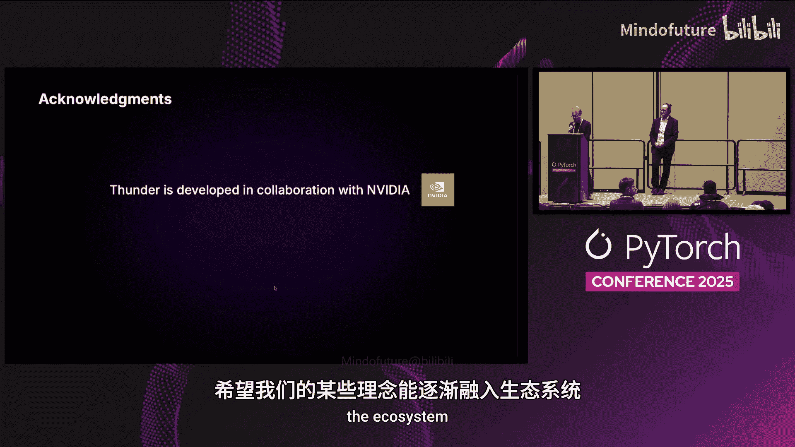

---

## 高级特性与未来协作

Thunder支持更高级的硬件和分布式策略。例如，在NVIDIA B200上运行LLaMA 4 Maverick模型时，可以结合张量并行（Tensor Parallelism）和DTensors支持。

Thunder正在与NVIDIA和PyTorch核心团队紧密合作。我们的目标是与PyTorch生态更深度地融合，因为Thunder本质上拥抱了nn.Module，其IR也是纯PyTorch的。我们期望这些想法能更多地融入生态系统。

---

## 总结

本节课中我们一起学习了Thunder工具的核心概念与应用。我们了解到：
*   Thunder通过**中间表示（IR）** 和**程序化转换**，将模型优化与模型定义解耦。
*   它提供了**可组合、可移植**的转换，例如量化、分布式策略（如FSDP）等，可以一次性开发并应用于多个模型。
*   通过**多执行器分发机制**，可以灵活地将计算图的不同部分交给最适合的后端（如CUDA Graphs、TensorRT、Eager PyTorch）执行。
*   实战中，我们看到了如何利用Thunder分析性能瓶颈，并通过应用转换（如CUDA Graphs、FP8量化）来优化LLaMA模型的运行效率和内存占用。


Thunder代表了模型编译和优化的一种演进方向，旨在为研究人员和开发者提供更强大的控制能力，同时保持PyTorch的易用性和表现力。