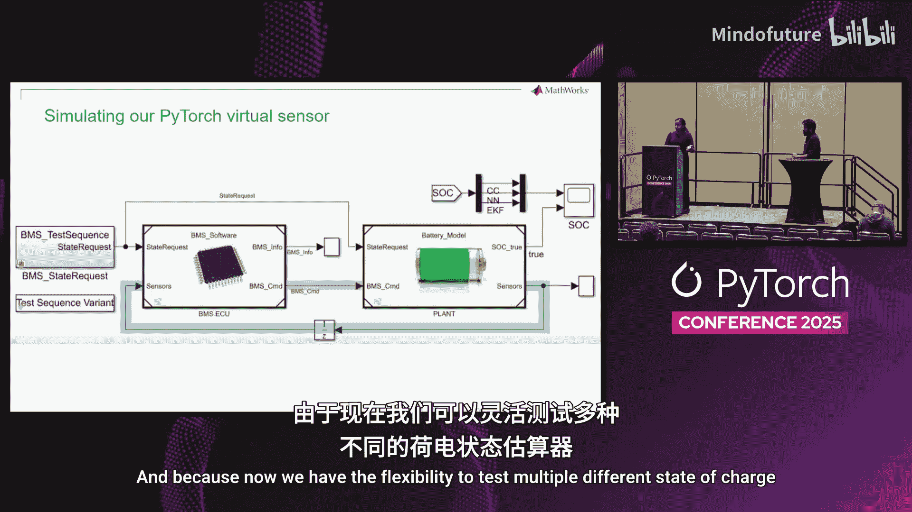
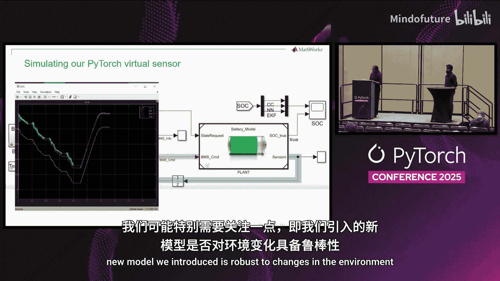
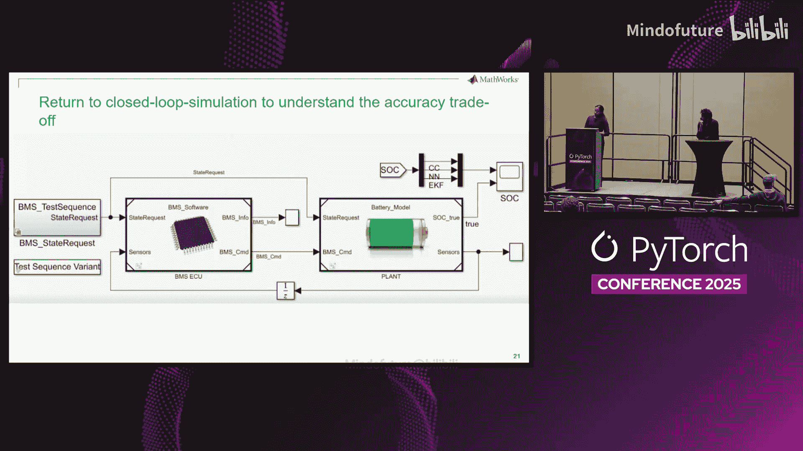
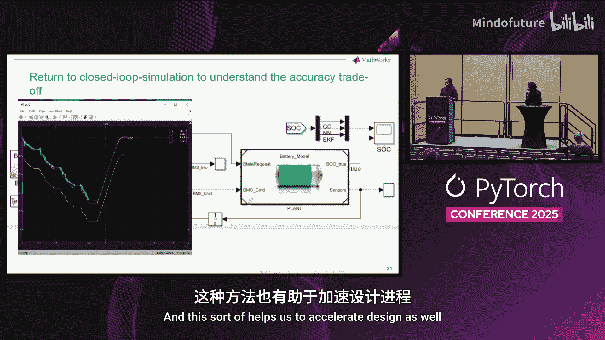
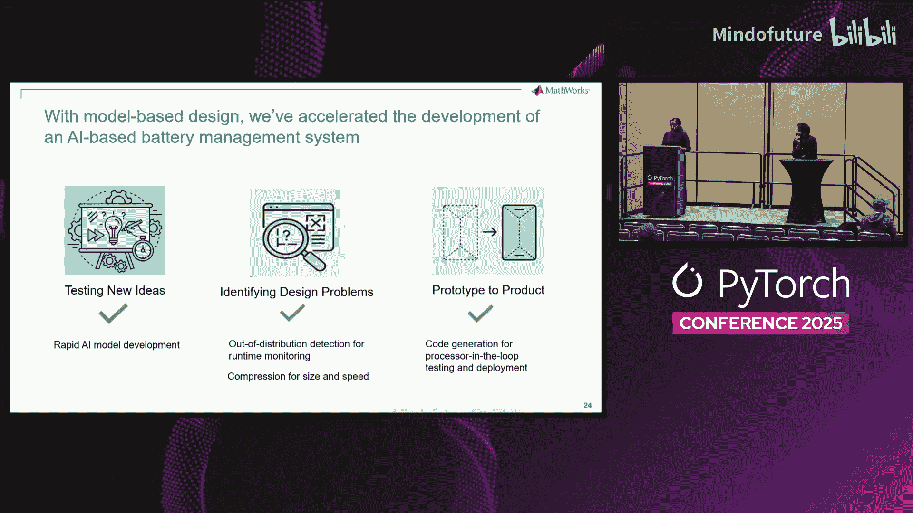

# 023：弥合鸿沟——在复杂工程系统中嵌入式部署PyTorch深度学习模型

## 概述

在本教程中，我们将学习如何将PyTorch深度学习模型集成到复杂的嵌入式工程系统工作流中。我们将以电池管理系统为例，介绍如何使用基于模型的设计方法，从模型训练、系统集成、仿真测试到最终在资源受限的硬件上部署的完整流程。通过本教程，您将理解如何克服从原型到产品部署过程中的主要挑战。

## 基于模型的设计简介

上一节我们概述了课程目标，本节中我们来看看什么是基于模型的设计。

基于模型的设计是一种在开发全过程中使用模型的方法。这里的模型并非特指PyTorch AI模型，而是指能够模拟物理或算法组件行为的数字孪生模型，例如发动机、螺旋桨或车辆车身模型。

这些模型从需求定义阶段开始，贯穿于架构设计、仿真测试，并逐步引入真实环境或硬件在环测试。这种方法使我们无需直接构建物理系统，就能完成整个开发流程。

## 电池管理系统示例

上一节我们介绍了基于模型的设计，本节中我们来看看具体的应用示例。

我们以电池管理系统为例。BMS通常包含** supervisory control logic**（监控控制逻辑）、**balancing logic**（均衡逻辑）和**state of charge estimator**（荷电状态估算器）。

监控与均衡逻辑负责向复杂系统中的其他部分（如电动汽车的电机控制器）发出指令。荷电状态估算器则是一个“传感器”，用于确定电池的可用电量。

为了测试估算器，我们将使用一个包含电池组和模拟负载的电池模块。本教程的目标是将一个深度学习模型集成到荷电状态估算器中。

## 嵌入式工程师面临的挑战

在设计和创建此类系统时，嵌入式工程师面临三大挑战。

以下是工程师面临的主要挑战列表：

1.  **快速测试新想法**：需要以低成本、高效率的方式验证新方案，例如，不能为了测试新的防抱死刹车系统创意而去撞毁真车。
2.  **早期识别设计问题**：需要在全系统场景中使用各个模块，以便尽早发现问题。
3.  **从原型平滑过渡到产品**：需要减少摩擦，使解决方案具备可扩展性。

基于模型的设计正是工程师应对这些挑战的方法。

## 构建物理与算法模型

基于模型的设计工具允许我们对物理系统和算法进行建模。

以电池组为例，您可以从最基本的电芯开始定义属性，如几何形状、质量和能量。然后，可以将这些电芯组合起来构建完整的电池包模型。这使您能够在尽可能接近真实世界的环境中测试整个系统。

除了物理组件，工程系统还包含算法部分。例如，在荷电状态估算器中，您可以在多种卡尔曼滤波和库仑计数算法中进行选择。基于模型的设计提供了模块化开发的能力，并允许在全系统背景下进行测试。

## 引入PyTorch模型

上一节我们介绍了传统的算法模型，本节中我们来看看为何以及如何引入PyTorch模型。

我们将用PyTorch模型替换传统的扩展卡尔曼滤波器。扩展卡尔曼滤波器需要电池的动态模型，其准确性难以保证。而深度学习模型仅需电池的输入输出数据，因此能更容易地适配不同的电池化学体系。如果选择合适的模型，其效率甚至可能高于传统滤波器。

假设我们已有一个训练好的PyTorch模型，其架构和性能均满足任务要求。但训练完成并非终点，我们需要借助基于模型的设计来分析不同权衡取舍，并相应调整模型。

## 模型集成与系统仿真

现在，我们将PyTorch模型集成到现有系统中。

我们的系统是模块化的。我们引入一个**模型选择器**子系统，它允许我们在传统卡尔曼滤波器和新的PyTorch卷积模型之间切换。

集成后，我们模拟整个电池系统。电池模型向BMS提供电压、电流和温度数据，BMS内部使用PyTorch模型处理这些数据并返回荷电状态值，然后BMS再向电池模型发出指令（如充电、保持稳态）。

通过这种灵活性，我们可以检查输出值，比较新旧方法的性能，并确保整个系统（而不仅仅是估算器）的行为符合预期。

## 确保模型鲁棒性

我们特别需要关注新模型对环境变化或数据随时间变化的鲁棒性。

训练模型使用的是精心策划的数据集。但在实际部署中，数据来自物理传感器，可能出现故障、退化或失效。因此，我们需要确保模型对此具有鲁棒性。

我们在系统中增加一个新需求：当温度、电压或电流读数表明某个传感器可能失效时，系统应能检测并发出警报。为此，我们在荷电状态估算器旁边添加一个**离群数据检测器**子系统。

为了模拟传感器故障，我们可以在仿真运行时为这些变量添加漂移或噪声。例如，电压应保持稳定，若出现持续向下或向上的漂移，则表明传感器可能有问题。

为了检测这种噪声，我们训练一个新的二元分类器（判别器），其任务是判断新的传感器读数是否属于训练数据分布之内。如果在运行过程中持续出现大量离群读数，则表明系统可能出现问题。

## 向硬件部署过渡

到目前为止，所有工作都在软件中进行。接下来，我们需要在目标硬件（微控制器）上测试系统。

我们以**TIC2000微控制器**为例。该硬件运行C/C++代码，我们可以从系统模型自动生成C++代码并部署。但需要注意其内存和速度限制（每秒百万次浮点运算级别），模型必须轻量且计算需求低。

为了确保模型能在BMS上运行，我们使用**处理器在环测试**。流程如下：首先，从模型自动生成C++代码并部署到微处理器上运行；然后，将微处理器的输出返回给电池模块，与系统其余部分通信。

在此阶段，我们可能会遇到模型过大无法放入设备内存的问题。

## 模型压缩

为了解决内存限制，我们需要对模型进行压缩。

压缩技术主要分为两类：**结构性压缩**（通过移除神经元或连接来减少模型大小或复杂度）和**数据类型压缩**（即量化）。本教程采用量化方法，通过降低可学习参数或激活值的精度来减少内存使用和计算时间，同时力求保持精度。

我们按以下步骤进行量化：

1.  **校准**：确保在降低精度后，仍能表示模型所需的所有可能数值范围。
2.  **量化**：执行精度转换。
3.  **验证**：确认量化后的模型精度损失在可接受范围内。

这是一个迭代过程。如果量化后性能不达标，可能需要返回重新考虑模型架构。

量化完成后，我们将压缩后的模型重新集成到电池系统中，再次在闭环仿真中测试其功能。现在，我们可以在多个压缩级别上进行仿真，以理解模型精度与效率之间的权衡关系。基于模型设计的优势在于，我们可以在进入硬件阶段之前，在闭环环境中进行仿真和早期功能验证，从而加速设计进程。

## 最终硬件测试与总结

现在，我们已经生成了代码并压缩了模型以满足硬件约束，可以再次在硬件上进行处理器在环测试。

我们替换模型，生成新的代码，部署到微控制器上。由于模型现已显著缩小并适配内存，部署应能成功。然后，我们验证硬件产生的结果与纯软件仿真结果是否一致。

回顾整个过程，我们使用基于模型的设计工具解决了多项挑战：我们从一个新想法（使用PyTorch网络构建虚拟传感器）开始，通过闭环仿真实验比较性能；我们遇到了问题（需要确保模型对环境变化鲁棒且能适配硬件）；最终，我们使用处理器在环测试，在部分组件仍为仿真的情况下，成功在真实硬件上运行了系统。这是一个帮助我们克服挑战的迭代过程。

最后，让我们再次放大视角。电池系统只是一个更庞大系统中的一个微小组成部分，该系统的每个组件都有其复杂性，并与其他系统相互连接。使用基于模型的设计，我们可以对其中每一个部分进行适配、测试和仿真。

## 本节课总结

在本节课中，我们一起学习了如何将PyTorch深度学习模型集成到复杂的嵌入式工程工作流中。我们以电池管理系统为例，详细介绍了从模型集成、鲁棒性测试、仿真验证，到通过量化进行模型压缩，最终在资源受限的微控制器上成功部署的完整流程。关键在于利用基于模型的设计方法，在早期通过仿真识别问题，迭代优化，并平滑过渡到硬件部署，从而有效弥合了AI模型原型与复杂工程系统产品之间的鸿沟。