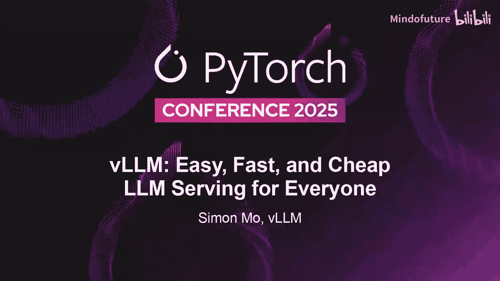
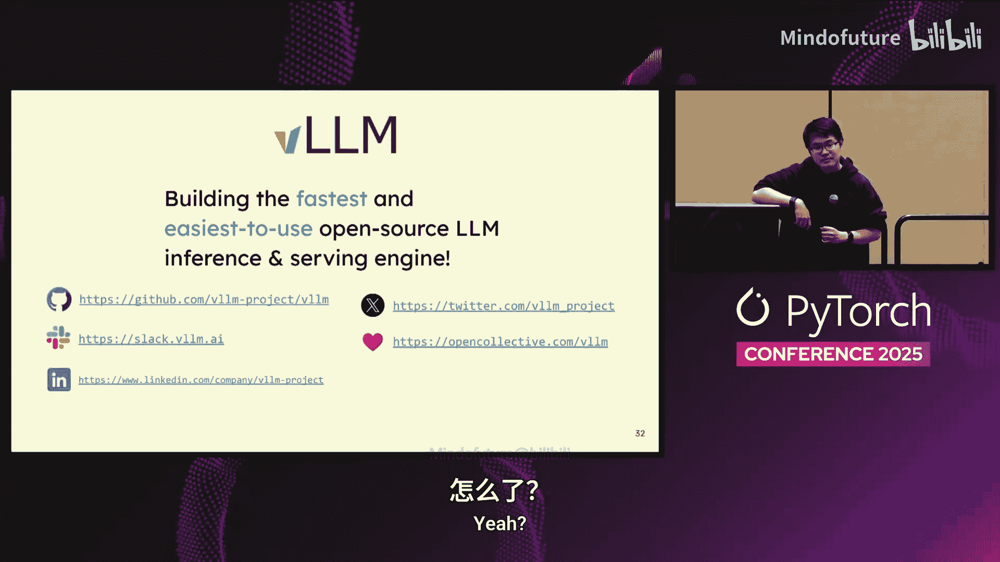

# 024：为所有人提供轻量、快速、经济的LLM服务



## 概述

在本教程中，我们将学习vLLM项目。vLLM是一个开源的大型语言模型推理和服务引擎，旨在提供最快、最易用的体验。我们将了解它的起源、核心设计、使用方法、技术特性以及与PyTorch生态系统的紧密集成。

---

## vLLM的起源与目标

vLLM最初是一个研究项目，但迅速成为大语言模型推理的首选引擎。我们的目标是构建最快、最易用的开源LLM推理和服务引擎。从更广阔的视角看，vLLM被视为一个生态系统，其中模型、加速器和框架协同工作。

从模型供应商的角度看，vLLM是一个可信赖的平台，是实现模型最高效运行的首选引擎。从加速器供应商的角度看，一旦他们能为新模型添加内核，任何优化都能惠及vLLM中过去和未来的200多种模型架构。在框架层面，vLLM已成为当今许多RL框架的默认推理引擎，同时也被用于奖励建模、合成数据生成等更多场景。

---

## 与PyTorch的深度集成

vLLM基于PyTorch构建，并与PyTorch共同发展。一方面，vLLM帮助测试了许多PyTorch特性，如`torch.compile`、`power flex attention`、`torch AO`。另一方面，我们几乎利用了PyTorch库的每一个方面，例如插入我们自己的内存分配器、添加新的加速器插件，以及充分利用`torch.compile`来实现最佳的推理速度。

vLLM也是PyTorch基金会项目的一部分。我们直接与基金会的所有成员合作，确保vLLM的开发是开放的，并由所有成员共同治理，以保证项目的长期性和共享治理。

---

## 项目规模与合作伙伴

截至目前，vLLM在GitHub上拥有超过60，000颗星，每月合并约800个PR。为了管理如此规模的项目，我们离不开众多行业合作伙伴的支持，例如Meta、Red Hat、Anyscale、Hugging Face等公司。这些合作伙伴专注于vLLM的开源选项，支持不同的模型和硬件，确保用户能在最新的前沿模型上获得最佳优化。

---

## 如何使用vLLM

以下是使用vLLM的两种主要方式。

### 作为推理库使用

vLLM可以作为Hugging Face Transformers推理的近乎直接替代品。与使用填充进行大批量处理不同，vLLM通过`LLM`接口提供连续批处理功能。

`LLM`接口允许你初始化一个大语言模型，并直接运行你的提示列表。这个列表可以包含数百万个条目。

**代码示例：**
```python
from vllm import LLM

llm = LLM(model="meta-llama/Llama-2-7b-hf")
outputs = llm.generate(["Hello, my name is", "The capital of France is"])
```

### 作为服务器使用

vLLM可以作为OpenAI API服务器的直接替代品。这意味着任何设计用于与OpenAI协议通信的应用程序，现在都可以直接与vLLM对话，从而解锁所有开源语言模型。

一个非常新的消息是，从今天早上开始，我们已经合并了对Anthropic API协议的支持。现在，你可以将你的Claude代码和相关应用程序指向Anthropic协议，直接与开源模型对话。未来我们将看到更多此类用法。

---

## 模型支持与生态系统

除了直接使用vLLM，我们还支持将其拆分开来，以便许多框架可以直接利用vLLM的内部组件或低级抽象结构，将其集成到现有的框架和应用程序中。

我们经常直接与训练和开源模型的团队合作。在很多情况下，你会看到我们所谓的“第零天支持”。这意味着模型权重在Hugging Face Model Hub或其他平台公开的瞬间，你就能下载并用vLLM运行它。

对于尚未与我们有直接合作关系的模型，好消息是我们与Hugging Face合作，支持了“Transformers后端”。这允许你在vLLM服务器中通过一个标志，接入那些尚未在vLLM中获得原生支持的模型，但你可以直接使用Transformers的实现来运行它们。这样做的好处是，你可以在预训练、强化学习和推理中使用相同的代码、相同的模型定义。

---

## 视觉与语言模型支持

我们也开始了对视觉语言模型的支持。我们最近因支持DeepSeek-VL系统而登上了许多头条新闻，同时也支持了Qwen-VL。我们的设计架构支持你相当容易地添加新的模态，这只是一个开始。你可以使用vLLM执行OCR任务、视觉理解，未来我们也很兴奋地开始支持多模态输出，例如视觉Transformer风格的图像生成。

---

## 准确性与性能

我们非常重视准确性。以支持OpenAI的GPT模型为例，我们花费了30天中的20多天来确保我们能从模型中输出完全相同的比特级对数概率，这样你得到的就是你想要的模型，而不是存在静默错误或问题的版本。

就在今天，我们宣布支持批处理不变性。这是与Sky Machine Labs以及Meta长期合作的成果，它确保了无论批次中有多少请求，无论批次结构如何，你都能随时间推移获得完全相同的输出。这一特性被严格用于验证准确性，特别是确保你的模型与训练框架得到的完全一致。

准确性是一方面，另一方面我们优先考虑性能。我们投入了大量资源来保证性能。例如，我们与PyTorch开发团队合作，建立了一个夜间性能仪表板，对每一次代码提交都运行大量测试，以确保没有性能回归，并且只会变得更好。

---

## 新技术洞察

现在，我将花几页幻灯片谈谈我们针对当前新趋势正在开发的新技术洞察。首先，我将简要总结两种技术和接口，然后深入探讨我在分布式推理方面的工作。

### 混合内存分配器

观察模型的发展趋势，我们从像Llama和GPT这样的密集Transformer开始，逐渐转向像Mixtral这样的混合专家模型，再到像DeepSeek和Llama 3.1这样更大的MoE模型。这是前馈网络方面的变化。

在注意力机制方面，我们看到了超越典型多头注意力的许多创新。例如，我们看到了来自DeepSeek的MLA注意力。人们还在改进注意力机制的二次方行为上不断创新。

因此，我们开始构建一个名为**混合内存分配器**的系统。它允许你高效管理具有混合内存需求的模型的KV缓存，例如同时具有滑动窗口和完全注意力机制的模型，或者滑动窗口、完全注意力和内存带宽或安全空间模型块。我们允许通过不同的复杂设计来良好管理和高效服务这些模型。

### KV缓存传输与存储

随着上下文窗口变得越来越大，对管理KV缓存、移动它的需求也越来越高。以100K上下文窗口为例，管理其KV缓存所需的内存相当大。有时，重新计算可能比将缓存卸载到CPU或远程存储然后再加载回来更慢。

因此，我们与Own Cache等团队合作，构建了一个名为**KV连接器**的接口。现在，vLLM可以支持卸载KV缓存、压缩KV缓存以及以多种方式传输KV缓存。例如，你可以将KV缓存存储在AWS S3等对象存储中，或者直接将其移动到CPU RAM供后续使用。

### 解码上下文并行

另一个与KV缓存和注意力相关的新创新是：随着注意力机制变得更高效，在大规模服务时，你通常会看到一种“长尾效应”。这意味着如果每个GPU都在运行自己的请求，有时一个包含大量输入令牌的请求会拖慢所有其他请求。

因此，我们与开源了世界上首个现代万亿参数Transformer模型K2的团队合作，他们开源了所谓的**解码上下文并行**。解码上下文并行允许你在不同计算节点之间分片和条带化输入上下文。与张量并行、流水线并行等相比，这是一种新的并行化维度。它真正帮助你解决了长尾问题。使用这种方式服务DeepSeek-V3.1模型，你立即可以获得更多的KV缓存空间以及更好的吞吐量。



---

## 分布式推理

现在，我将更深入地探讨分布式推理。这是我们过去几个月的核心重点。虽然vLLM可以很好地服务于单个GPU组上的单个模型，但我们如何扩展它呢？这涉及到思考分布式的不同方式。

一种方式是从引擎向外的视角思考。我们可以考虑不同的并行策略、容错性和弹性。vLLM实现了所有这些。

另一种方式是从集群向内的视角思考，特别是从管理数千甚至更多GPU的大规模集群管理者的角度。你实际上需要担心路由、缓存和运维。

这就是**LMD**作为一个社区项目出现的原因，它专注于真正将集群操作员的视角与推理引擎的视角粘合在一起。你看，Kubernetes等系统的世界很大程度上是为微服务设计的，处理的是快速、统一且廉价的请求。而另一方面，LLM推理的成本要高几个数量级，统一性差得多，并且需要从集群角度进行更多的加速和考虑。

LMD通过与Kubernetes原语深度集成来帮助解决这个问题。例如，当请求到达时，它会经过推理网关，并能够智能地选择和路由到不同硬件上的不同vLLM实例。这也提供了许多可复现的示例。我们一年前面临的一个挑战是，你无法以可复现的方式扩展vLLM。每个集群的行为都不同，每个人都有不同的网络拓扑要求。LMD通过构建在Kubernetes和原语之上，真正帮助我们的社区建立了不同的、可直接复现和调整的成熟路径，以便你可以直接应用到你的设置中。这包括智能推理调度、预填充/解码分离、KV缓存管理和宽专家并行。

我将快速说明其中的几个。

*   **智能推理调度**：这是一种将问题框架化为更智能地路由请求和负载均衡请求的方式。如今以分布式方式部署vLLM的一种方法是将其放入Kubernetes服务并进行轮询负载均衡。这通常效果不佳，因为不同的请求是如此不均匀，你无法获得最佳的平衡方法。LMD支持前缀感知路由和负载感知路由。前缀感知路由可以匹配到正确的前缀树，从而在请求已被处理时始终获得更低的首次令牌生成时间。负载感知路由则能够抓取并智能分析vLLM特定的指标，以路由到正确的Pod。

*   **预填充/解码分离**：LMD与vLLM集成本身，提供了一种利用NVIDIA NVLink库在GPU之间高效传输的方法，以及在AMD和TPU上的对应方法，能够直接将KV缓存从预填充实例传输到解码实例。通过分离预填充和解码，这允许你在两者之间运行不同的并行化策略、部署选项和扩展。

*   **宽专家并行**：如今服务万亿参数模型的典型方式不是让一个GPU或一个节点拥有万亿参数的显存，而是将其扩展到更大的池中。这允许你高效管理大批量请求并将其分布到多个计算节点上。LMD允许你在Kubernetes上直接轻松地管理这一点，使其更具可复现性和易用性。

此外，我们还利用了来自DeepSeek团队的优化，例如执行专家并行负载均衡，你可以在模型内移动专家，移动副本，以实现更高的利用率得分，以及双批次重叠。这项工作同样受到DeepSeek正在进行的通信与计算重叠工作的启发，以确保在这种大规模分布式设置中，网络的每个部分、内存带宽和计算资源都得到充分利用。

---

## 总结

在本教程中，我们一起学习了vLLM项目。我们了解了vLLM作为一个高性能、开源的LLM推理和服务引擎的定位。我们探讨了它与PyTorch生态系统的深度集成、两种主要的使用方式（作为库和作为服务器）、对广泛模型和硬件的支持，以及其对准确性和性能的承诺。我们还深入了解了其前沿的技术特性，如混合内存分配器、KV缓存管理和解码上下文并行。最后，我们介绍了vLLM在分布式推理方面的进展，特别是与LMD项目结合，以解决大规模集群部署的挑战。vLLM的路线图是加倍投入所有这些方面，继续推动高效、易用的LLM服务边界。