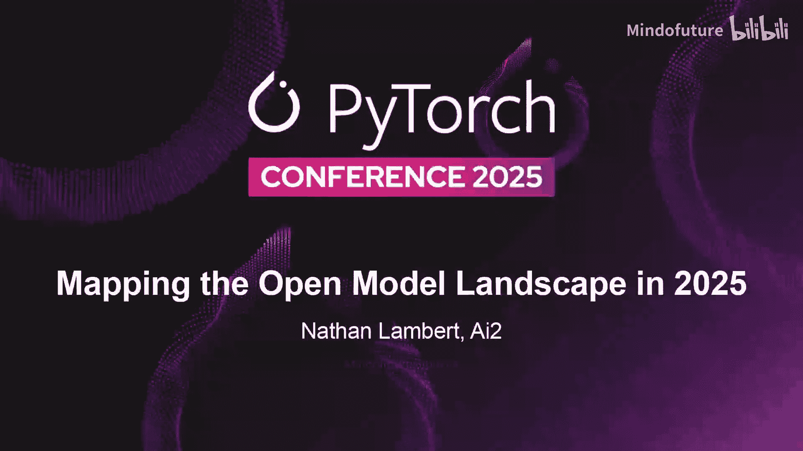
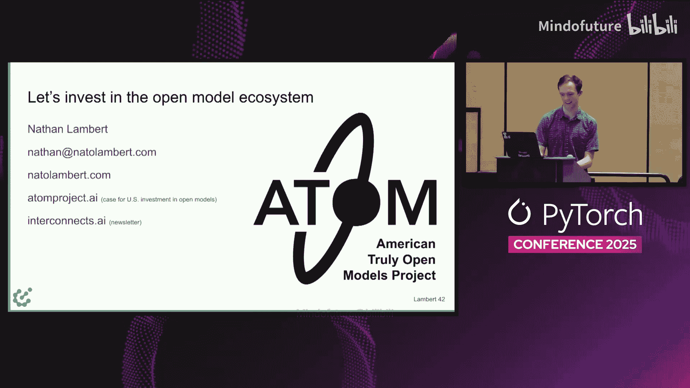

# 025：2025年开放模型生态全景与趋势分析

## 概述

在本节课程中，我们将跟随Nathan Lambert的视角，系统性地回顾2025年开放模型生态的发展历程、关键转折点与核心趋势。我们将分析从DeepSeek R1发布到中国模型崛起等一系列事件，探讨不同参与者的策略，并理解开放模型在技术、商业和地缘政治层面的深远影响。

---

## 章节 1：2025年开放模型格局的演变

### 1.1 2025年之前的稳定格局

在深入2025年之前，我们需要了解当时的模型生态。Llama系列曾是默认的主导模型，其不同尺寸的模型易于人们下载和使用。Mistral一度在欧洲公司中获得了比美国公司更高的采用率，规模几乎超过了Llama。DeepSeek在发布V3和R1之前，其实验室已经因其出色的输出和研究而备受关注。Glen被视为紧随Llama步伐的参与者。虽然这些模型尚未完全突破，但所有要素都已准备就绪，将在一年内发生变化。

### 1.2 2025年的开端：DeepSeek时刻

2025年始于DeepSeek。一月份，我们见证了DeepSeek R1的发布。我们讨论的许多事情都源于此，以及各个公司和社区在看到开放模型在推理模型成为新事物后依然能够规模化成功的验证后，是如何反应的。

我们无需重述DeepSeek的故事。随着时间进入三月，开放生态中出现了一些可能比人们谈论得更多的、更令人兴奋的模型，例如Gemma，以及我们在AI2开发的OMmo 232B。Gemma仍然是谷歌推出的一个非常强大但讨论不多的模型。OMmo 232B至今仍是最好的完全开放模型，我们发布了其训练数据、训练代码等，而不仅仅是权重。

### 1.3 主题的切换：Llama 4与Qwen 3

随后，故事的主题发生了切换。Llama 4和Qwen 3在短短几周内相继发布，它们感觉像是两个截然不同的事件。

我记得Llama 4发布时，我正坐在笔记本电脑前，心想为什么Meta要在一个周六下午发布它，感觉有点不对劲。从技术层面看，这次发布对他们来说并不算非常成功。发布一个开放模型并确保所有工具和模型都能被用户正常使用，其中有很多困难之处。

仅仅几周后，Qwen 3发布了，它立即在这些开箱即用的架构中获得了关注。从那时起，我们看到他们如何继续基于这个品牌模型系列进行构建，并获得了大量使用。

### 1.4 夏季的浪潮与中国新进入者

夏季来临，许多新的中国参与者开始涌现。几乎每周我们都会看到一家不同规模的中国科技公司发布模型，要么是百度这样的老牌大公司，要么是像Minimax这样获得大量资金的所谓AI初创公司。人们并不完全清楚它们的走向。

我们看到了Minimax M1等模型。我引用这篇论文是因为他们提出的CiISpo R算法（一种序列级重要性采样）最近在一些重要的元工作中被引用。许多中国实验室正在进行前沿研究，值得关注。

然后在七月，我们看到了来自智谱AI的Kimi K2、GLM 4.5，以及其他一些不太引人注目的模型。我描述这些模型时说，如果DeepSeek没有发生，那么这个夏天就会因为人们思考模型商品化、真正的竞争或开放与封闭模型之间的差距而发生同样的轰动。此后，这种趋势一直在持续。

### 1.5 持续的发展与更新

我认为美国生态系统出现了一些积极的迹象，我稍后会再谈，比如OpenAI的o1系列。这个模型在发布时有些笨拙，但后来表现好多了。英伟达也发布了一些包含开放数据的模型。这个Nemeron nanono是一个90亿参数的模型，在该尺寸上与Qwen竞争。然后是另一个字节跳动的模型。所以这基本上更多是相同的情况。

然后我们进入了模型更新阶段，Qwen发布了更多东西。到了十月，还有更多我可以补充的内容。我后面有一些更近期的Qwen发布信息。

所以这是非常波澜壮阔的一年。如果你回顾开放模型的其他任何一年，都不会像这样。可能只是几次Mistral发布，几次Llama发布。而今年是 relentless 的，更符合人们普遍关注AI时的感受，开放模型现在已成为那场快速讨论的一部分。

---

## 章节 2：模型参与者的类型与评估指标

### 2.1 两种类型的模型参与者

我喜欢描述两种类型的模型参与者，它们在人们如何使用以及最流行的展示生态系统赢家的指标上变得非常不同。

展示生态系统哪些模型领先的最流行指标之一是Hugging Face下载量或下游模型数量。下载量是指对仓库（一个git仓库）的任何wget或curl请求。因此，下载量是一个非常混乱的指标。

对于像Llama、Qwen甚至Gemma和AI2的模型，下载量是一个合理的指标，因为它显示了跨一个模型家族，它们在网络上获得了多少关注。但对于像DeepSeek这样被应用到大量国际技术产品中的模型，所有那些严肃的产品都只会将DeepSeek下载一次到他们的基础设施中，然后就不再显示了。

所以，下载量是极不完美的。根据你查看的模型类型，你需要不同的分析视角。

### 2.2 中国模型提供商的崛起

我描述这种现象时提到，我不断看到这些中国模型提供商变得更加突出。我直接收到了他们的联系，这是一件非常有趣的事情，许多中国公司有兴趣与我交谈，而我从未收到过来自西方实验室的类似“嘿，我们至少像我们的新模型，你想要一个简报吗？”这样的联系。这是一种非常有趣的体验，关于他们多么直接地希望与像在这个房间里的人们接触，并让他们使用他们的模型、了解其弱点。

这种海啸般的浪潮在夏天真正袭来，其中一个令人惊讶的事情是：Llama在七月哪里去了？我认为我们看到了他们关于超级智能备忘录的更新，其中引用了这样的话：“我们必须谨慎选择开源什么。”而就在一年前，在谈论Llama 3时，扎克伯格发表了我认为是关于开源AI的最佳论点之一的Meta博客，标题是“为什么开源是前进的道路”。这恰恰表明，在开放领域没有戏剧性的锁定效应时，个体公司可以改变得非常快。

这种情况一直持续到今天，我听到关于Llama 3 48B的传闻。Llama 3 18B是Hugging Face上有史以来使用最多的模型之一，所以我认为这对他们来说是非常合理的，因为他们可以非常容易地改进这些模型。进步的步伐如此之快，从Llama 3 18B更新对许多人来说将是极好的。扎克伯格在八月的财报电话会议上提到了Llama 4.1和4.2，所以仍然有迹象表明事情正在发生，并且对这个品牌有兴趣。

但是，如果你与使用这些模型构建产品的人交谈，信任在技术层面上是一件大事。你实际上需要完成很多事情才能使你的技术栈与开放模型协同工作：你必须设置正确的聊天模板，找出适合它的提示词，并建立你的测试流程。所以，一旦你转向Qwen，仅仅放入下一个Llama模型进行测试并切换回来并不那么明显。根据非公开讨论，许多人正在基于Qwen进行构建。

就在前几天，Airbnb的CEO大肆吹嘘他使用Glen多于OpenAI。我不知道这有多少只是两者之间的公关策略，但我确实认为我们将继续从愿意公开表示他们正在基于某个中国实验室的XYZ模型进行构建的公司那里获得更多轶事，因为这些模型数量众多，你更有可能为你正在开发的应用找到完美的利基市场。有时你只需要尝试一堆模型，才能看到哪个有效。

---

## 章节 3：Qwen的策略与生态系统影响

### 3.1 Qwen的全面布局

我认为这是一个有趣的方面，我只是想列举Qwen正在做的一部分事情。要知道Qwen只有几百人，他们可能面临非常真实的资源限制。我曾与他们交谈，感觉我在AI2的工作也处于研究资源限制的边缘，即如果我们得不到资源，随着模型进展如此之快，我们将很难保持相关性。而Qwen的人说他们也是如此，但与此同时，他们训练了如此多的模型，推出了如此多的东西，这令人印象深刻。这非常全心全意，就像他们为了热爱而做这件事。我还没有机会与他们的战略和研究人员交谈，但这真的感觉就像他们想训练很多模型，他们在模型之间共享大量基础设施和数据，他们试图将东西推向世界。这些长尾发布中的任何一个，比如文本转语音或音频识别，可能只是Qwen的一两个人说“我想让这个成为现实”，这在更大的生态系统中是一件非常小的事情，但它确实增加了价值。我认为更多公司可以采取类似的方法。

### 3.2 采用度指标的转变

基于这种方法，我们为一个名为“Adam项目”的倡议做了一些工作，旨在倡导对开放模型生态系统进行更多投资。我们查看了ChatGPT之后每一个主要的语言模型或相关家族，并查看了经过一些过滤的累计下载量。

我提到下载指标可能被破坏，有很多时候下载量明显被放入了类似CDN的地方，一天内出现了1000万次下载的峰值。所以我们移除了这些，只查看相关模型。就在最近几个月，Qwen的累计采用度指标已经开始超过Llama。这对于生态系统中的任何人来说都是期待已久的，但代表了权力的转移，以及在人们用于各种长尾任务方面，什么是真正的默认选择。我认为这其中很多是信息处理，而不是像ChatGPT直接竞争对手那样的东西。

即使你看Qwen CEO在做什么，我在下一张幻灯片上有一张图片，上面写着：我认为Qwen正试图成为默认选择，成为每个人都知道可用的东西。这延伸到硅谷科技公司之外的许多市场，延伸到世界各地，那里的人们想要尝试AI，他们拥有已知的计算预算，他们不想注册付费服务，他们只想下载一些东西并在自己的领域尝试。

### 3.3 Qwen的市场定位

如果你去看，这是最近一次阿里云大会（类似于Google Cloud Next的会议）上的照片，CEO literally 把这个放到了幻灯片上，上面写着“LLM，下一个操作系统”，然后他们继续谈论Qwen。这就是为什么我上一张幻灯片的类比并不夸张，当CEO说出几乎完全一样的话时。

当你以不同的方式，即性能能力方面呈现这些数字时，你可能会看到一些滞后。左边是Artificial Analysis的指数（很难说），这是一个由六到九个基准测试组成的复合指数。我们在2025年8月截取了这些数据，这很困难，因为他们会更改其复合指数中的基准测试，所以Y轴上的数字可能会根据你查看其网站的时间而变化。我给他们（如果有人认识那里的人）的免费建议是，他们应该将其编入索引，以便成为“智能指数V2”，这样你就可以查看所有以前的版本。我很乐意和他们谈谈这个。

但你可以看到这些主要由Qwen和DeepSeek驱动的中国模型缓慢而稳定的进步，以及这些数量众多且频繁的发布，正在这个智能基准测试上超越其他模型，无论是美国的还是欧洲的。Ella Marina 这两个基准都不完美。但如果你能获得更多事物的数据，我猜你会看到同样的趋势。

---

## 章节 4：中国开放模型生态的深度分析

### 4.1 多样化的参与者

了解这件事真正有趣的一点是，中国生态系统中不断涌现出多少组织。这就像我们整理的一个略带讽刺的层级列表，主要是为了这篇博客文章，目的只是为了说明不同实验室的特征是什么，他们发布什么类型的东西，以及在中国生态系统中，有哪些不同类型的群体参与了这个更广泛的社区？

比如，每个人都知道深度求索和智谱AI，但在夏天，我认为Moonshot AI和ZDT AI在使用开放模型的人群中变得更加家喻户晓。与此同时，还有大量其他混合体，无论是开始发布模型的腾讯和华为等老牌公司，甚至是像OpenBMB、InternLM这样的小型实验室，它们发布数据和研究报告以及小型模型的混合体。例如，我曾从事奖励建模工作一段时间，来自OpenBMB和InternLM的一些小组在这些研究领域发布了非常强大的利基模型。

### 4.2 新进入者与行业压力

与此同时，你还有像美团这样的中等规模科技公司（相当于Doordash）作为新进入者，发布了一个具有极强基准测试的万亿参数稀疏MOE模型。这对我来说就像是，我完全不知道他们为什么这样做，但我计划询问他们，并希望很快与大家分享，因为我认为这将揭示这张幻灯片上的某些事情：许多公司似乎面临着非常直接的社区压力或高管压力，认为发布一个强大的开放模型是在中国做AI的方式。我认为，拥有多种类型的开放模型有很多下游好处，人们可以弄清楚如何使用它们以及什么是最佳实践，这创造了一个比我们在美国看到的围绕AI的相当秘密的做法更加自由流动的信息环境。

### 4.3 微调模型的趋势

如果我们回到这些基于Hugging Face指标的分析，我们做的另一个分析可以使这一点相对于累计下载量更清晰，那就是每月微调模型的数量统计。

所以，如果你获取Hugging Face上所有基于Llama或Qwen或其他模型的微调模型，并过滤掉那些至少有几次下载的模型（因为你可以上传很多从未被看到的模型），你可以看到这种持续的转变。最初主要是Mistral，然后是Mistral和Llama，再然后是Qwen。这种转变随着时间的推移是持续的，并且清晰地表明了人们在Hugging Face上使用什么。

### 4.4 采用度的根本性转变

我们称之为采用度真正开始超越的转折点。我认为2025年夏天正处于这一转变的轨道上，我预计这种中国生态系统将继续扩张并成为更普遍的常态。但我认为这值得投资，因为这些模型将会有越来越多的用途，随着时间的推移我们会了解它们的用途。今年的Cloud Code就是一个例子，在我看来，未来还会有更多类似的应用。

### 4.5 中国开放战略的持续性

我经常被问到中国是否会继续其开源战略。我不是中国问题学者，所以当人们说我们需要找到那些研究了中国经济和工业运作数十年的人时，我总是觉得很有趣。我开始了解这一点，看起来深度求索确实设定了这个行业规范，人们将继续下去。有一些长期存在的描述中国科技行业的方式，以及它如何特别影响实体商品，即中国公司通常追求市场份额而非利润。开放模型确实符合这一点，但我们需要进行更深入的研究，以了解中国公司追求这些策略和物质领域的动机，从而理解这是否会转化为AI领域。

所以，我认为除非AI变得强大到引起政府的注意，否则这种情况将会继续。但作为一个没有深入研究试图理解中国政府想法的人，我对此没有把握。

---

## 章节 5：开放模型的倡导、风险与未来投资

### 5.1 倡导开放模型的必要性

根据受众的不同，我认为这是一个对开放模型高度同情的受众。仍然有很多人认为对开放模型采取严厉的控制方法是正确的方式。当我在政策受众中做关于开放模型的演讲，受众分布混杂时，我经常会收到这样的问题：我们不应该禁止开放模型以便提前防范风险吗？我认为，作为开放模型的倡导者，做好准备很重要，因为在美国这样的地方，由于数字信息的流动方式和训练模型的成本正在急剧下降，你实际上无法做到这一点。因此，总会有其他国家的人想要花费数百万或数百亿美元训练一个模型，并将其上传到互联网上，而我们几乎无法阻止这一点。我们需要思考如何设计互联网协议和一切，因为将会有来自不同领域的人们使用开放模型采取我们可能不喜欢的行动，但我们需要理解技术的尖端并思考他们将会做什么。

### 5.2 本地模型与社会影响

我思考这个问题的方式之一是通过本地模型。我认为很多人展示了封闭模型和开放模型的性能对比图，这总是让我有点恼火，但我觉得这个更有趣：它是封闭模型和本地模型之间的差距。我认为在很多领域，如果任何人都可以在他们的笔记本电脑上不受限制地运行某个多模态模型，那可能会导致我们需要作为一个群体去适应的社会演变。就像我们有了SOA2应用程序，我不知道当这些能力以更少控制的方式扩散时会发生什么。我确实预计这会在未来几年发生。这并不真的是禁止开放模型的理由，而只是更多地研究它们在做什么，并真正深入思考这种现实对我们从商业到生活的一切意味着什么。

### 5.3 技术领导力的机会与投资

与此同时，虽然我们谈论了很多，展示了中国正在领先。我认为这是对他们所做的大量艰苦出色工作的赞扬。但我也是一个美国人，我认为这里存在技术领导力的机会，我认为有办法在这方面进行投资。

其中之一是，我们需要开放模型有很多不同的原因。我认为仅仅开放权重的模型只能说服一部分受众，这就是为什么我致力于研究那些开放数据和一切内容的模型，这对研究非常重要，而研究是长期创新的引擎。我们并不真正知道这些模型在不同国家的分布和控制将如何随着时间的推移而变化，我认为仅仅拥有多个参与者就能为生态系统带来很多弹性。

### 5.4 权力分散与积极信号

这也变得像是我个人的一个理由，即减少权力集中。如果你相信AI进步会持续多年，我认为这将是我们这个时代最有价值的技术之一。我认为大型科技公司的权力已经产生了非常强烈的市场效应，而这种影响力可能会变得更强。所以你应该选择你的理由，并更多地思考这些。

但像OpenAI的o1系列实际上是一个我非常喜欢传播的积极信号。我认为这些模型在发布时声誉不佳，尤其是在像Harmony聊天模板这样的事情上存在很多小问题，所以他们在技术层面引入了一种全新的管理与模型交互的方式，社区需要一点时间才能开始工作。但自那以后，下载量以及当我询问在这些领域工作的人时，印象一直非常积极，特别是对于这种能够推理和使用工具的智能核心。

我得到了一个DGX Spark盒子，我想再给这个模型一次机会，因为生态系统中有更多参与者是好事。而且，从营销角度看，OpenAI是美国最常与AI关联的公司，这为那些就是否开源模型做决策的高管提供了很多掩护，因为最大的名字最近已经这样做了。我希望这些因素能产生复合效应。

### 5.5 学术投资与未来需求

以AI2为例，我们刚刚从NSF获得了一笔为期四年、1亿美元的资助，以加倍努力，让强大的语言模型对学术界更易获取，并让更多学者获得进行计算和进行此类研究的工具和技能。我认为这是NSF有史以来最大的计算机科学奖项，这真是一件大事。我有点相信AGI，所以我认为这实际上还不够。我可以解释一下：我之前告诉过你，OMmo 232B是有史以来最好的开放模型，在性能上更接近原始的GPT-4，但由于算法效率的提升，攀登基准测试变得容易得多。但如果我们想让人们研究像Cloud Code这样的完全开放的智能体以及未来的任何东西，我认为我们需要在建模能力方面取得更深层次的、另一次阶跃式的进步。

### 5.6 投资的必要性与成本估算

我认为，一旦我们达到那个水平，我们将有更多时间看看那种大型实验室关于扩展模型持续获得更多性能的童话是否成真，然后看看我们是否需要重新投资更多于开放模型。但我认为，深度求索那种6000亿到万亿参数的规模已经被证明在模型能力方面非常高。让完全开放的模型达到那个水平，以便学者和任何其他想要理解AI的人能够研究，是一个非常重要的里程碑。

所以我认为，如果我们不投资，人们可能会认为他们正在使用相关的模型，而实际上并非如此，这让我担忧。所以我认为我们只需要在这些年里继续推进。我估计的成本大约是1亿美元，与所有风险投资轮次相比，这并不算太疯狂。所以如果你想做这件事，我很乐意谈谈。我称之为“Adam项目”，这对我来说有点爱国主义的意味，我必须接受这一点。但如果你想谈论这个，这里有所有的信息。

---

## 问答环节

### 问题 1：开源与开放权重的区别

**提问者**：你能简要概括一下开源和开放权重之间的区别吗？如果碰巧熟悉OSI的定义，也请一并说明。

**回答**：我试着分层解释。我认为特别是在2023年和2024年，这是开放模型中一个非常大的讨论话题。我认为这意味着开放模型正在变得更好，因为人们实际上在使用它们，定义不再是最热门的事情。但这是一场已经进行过多次的辩论，我曾深入参与其中，即开放权重模型与开源模型之争。

*   **开放权重模型**是一个相当清晰的术语，指权重被上传到Hugging Face，运行推理或微调它的代码是可用的，但很大程度上，获得它的过程是不可复现和记录的。尤其是数据是一个主要方面，关于数据实践可能记录或不记录不同的事情，还有训练代码。所以像Llama这样只发布权重的模型属于开放权重。
*   **开源模型**则像AI2的OMmo模型、Hugging Face的Pythia小模型或EleutherAI的Pythia模型，这些模型附带了中间训练检查点、训练代码、日志和数据，试图让任何人都能真正深入到训练的任何部分，并根据需要进行更改。这回到了开源软件关于可复现性和自由度的论点。

这样回答可以吗？我不知道里面是否还有另一个问题。

### 问题 2：中国模型作为潜在影响力工具的担忧

**提问者**：嗨，我知道字节跳动，以及一般的中国公司，在社交媒体方面受到了很多批评，可能利用它来操纵美国人民。你认为这些开源/开放权重模型是这种跨海影响的另一个潜在途径吗？

**回答**：我认为目前不是。根据他们取得多大的成功，我现实的预期是，我们可能会看到政府官员实际上在这些公司工作的情景。所以我认为这是一个难以平衡的真正担忧。

我将其描述为一种我们实际上无法证明其不存在的事情。所以，就像如果DeepSeek可以编写和运行代码，就不可能100%可靠地证明DeepSeek没有植入后门，尽管我会以我的信誉告诉人们，我确信那不会影响你。所以这有点像这样的事情，因为它无法被证明，我认为我们将无法摆脱这种叙事，尽管目前控制的可能性我认为接近于零。

个人社交媒体算法的设计方式比一个你只下载一次的模型在追踪方面要狭隘得多。所以我认为在结构性方面有一些更好的地方，因为追踪机制内置得更少。但在某些方面也更糟，因为你无法证明人们想知道的一些事情。

### 问题 3：在欧洲构建主权AI解决方案

**提问者**：抱歉，嗨，谢谢你的演讲。我刚从欧洲过来，我知道开源模型和开放网络模型在欧洲生态系统中至关重要。我的问题是：由于对美国和其他国家云的依赖，欧洲的主权现在是一个主要话题。我们有Mistral，但它表现不佳，不如你展示的中国公司。如果我想为金融服务或医疗保健构建一个像ChatGPT一样完全主权的LLM解决方案，你会建议使用什么技术和方法来构建一个主权解决方案？这可能吗？因为像DeepSeek这样的开放模型是开放权重的，但如何控制它？那么，你能成为主权者并且今天可能吗？

**回答**：我认为这个问题有点令人困惑，因为我们正处于一个过渡阶段，这一切正在建立。总体而言，我认为核心是，主权AI是许多公司、国家或联盟会非常重视的真实事物。所以我预计欧洲将继续成为其中的一部分。我们最近在Mial看到了瑞士模型之类的东西，然后是中东，然后是其他权力参与者。

最终，在我看来，主权AI由一些计算堆栈和一些建模堆栈组成，大多数人两者都有。但现在有点不太清楚，因为模型进展太快了。所以，就像如果你刚刚得到像Mistral这样有某些公开和私有模型的公司，很难了解其能力，然后你听说像Qwen 4发布了，你会想，哇，它太好了。但随着时间的推移，我认为其中一些会趋于正常化，主权AI在欧洲以及任何地方都会成为一个更可预测的事情。但这也是一个奇怪的世界，这项技术被世界各地的各种地理区域高度主权化了。

### 问题 4：开放模型的局限性解释

**提问者**：我有点困惑。我听到你说在开发开放模型方面存在所有这些竞争。但你也说开放模型有些有限，并且落后于更大的模型。你提到了GPT-4，我想知道你能进一步解释一下这种局限性吗？这种局限性是竞争不足还是创新不足？你指的是什么？

**回答**：我脑海中一直保留着三种模型能力。一种是前沿模型，即OpenAI等公司的模型。然后是其他开放权重模型，如DeepSeek、Qwen。然后是我所做的工作，即完全开源模型，这是另一个类别，如AI2的OMmo。如果你是一名研究人员，需要理解预训练动态或预训练中由于数据导致的记忆问题，你需要拥有这些开放权重或封闭模型所没有的数据。所以，这就像是前沿模型、开放权重模型，然后是完全开源模型。根据所有这些，它们将具有非常不同的特征。

所以我认为我们看到前沿模型正在解决IMO数学问题，开放权重模型在一堆基准测试上非常强大，但我认为在实践中主要用于自动化任务并针对狭窄任务进行微调。但如果是这些完全开源的模型……我之前关于OMmo 32B的说法是，它更落后，尽管这是目前存在的最好的完全开放模型。所以我认为，根据用户的不同，有不同的要求，然后它们都进入了AI能为他们做什么的不同水平。

### 问题 5：其他基础模型的开源计划

**提问者**：很棒的演讲。我在网上看过这个演讲，所以我主要关注的是LLM视角。你是否对其他类型的基础模型做过类似的研究？比如想到的CLIP类模型、Meta的感知编码器或DALL-E 3之类的东西？你有计划为那些模态做任何基础开源模型或类似的事情吗？

**回答**：我认为这项工作值得做。我只有这么多时间。我可以说，总的来说，似乎对标准语言模型投资过度，但仍然有很多人取得了很多突破。然后，对其他模型的投资较少，参与者也较少，这导致了更不规则的进展跳跃，开放模型可能在某些方面是最好的，诸如此类。这使得监控有点棘手，可能会出现奇怪的反转。我敢打赌，在利基领域，你会看到这样的情况：我敢打赌前沿模型在某些方面真的很差，而有一个小模型在那个方面真的很好。我认为，如果你试图做产品或小型初创公司或专业化，那可能是一个更有趣的工作领域。但我没有一个好的答案，只能说你可能在某种程度上是对的。

### 问题 6：Gemma模型采用度不高的原因

**提问者**：嘿，最后一个问题。那么，为什么你认为Gemma模型没有得到它们本可以获得的那么多采用？

**回答**：我不会回答关于最终有很多细微差别的问题，其中一些是感觉上的，一些是实施层面的。我认为过去，例如，Gemma据说在库中使用了不同的Transformer注意力内核，所以如果你不这样做，第一次尝试时你会遇到性能下降或硬错误。所以我认为在感觉、许可证以及发布时可能存在的问题等方面，分布非常广泛。我想我被打断了。所以我们就在这里结束吧。抱歉。

---

## 总结

在本节课中，我们一起学习了2025年开放模型生态系统的全景图。我们从年初的DeepSeek R1时刻开始，回顾了Llama、Qwen等关键参与者的策略转变，深入分析了中国模型生态的崛起、多样化参与者及其背后的行业动力。我们探讨了评估模型影响力的不同指标及其局限性，并思考了开放模型在技术竞争、地缘政治和未来投资方面的重要意义。最后，通过问答环节，我们澄清了开源与开放权重的区别，讨论了主权AI构建、模型局限性等实际问题。整个历程表明，开放模型生态正以前所未有的速度和多样性发展，成为塑造AI未来的关键力量。