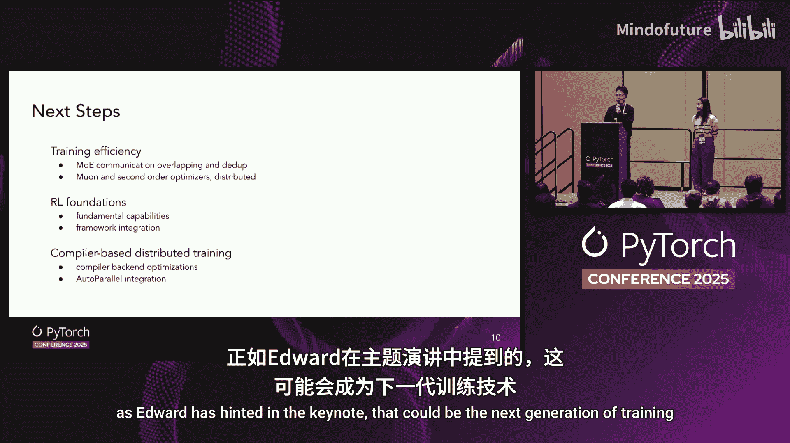

# 026：解锁生成式AI的未来——TorchTitan最新进展 🚀

在本节课中，我们将学习TorchTitan的最新进展。TorchTitan是一个基于PyTorch原生的大规模生成式AI模型训练平台。我们将回顾其核心设计，并详细介绍今年新增的关键功能与改进。

## 平台概述与设计哲学

上一节我们介绍了课程目标，本节中我们来看看TorchTitan的基本定位。

TorchTitan是PyTorch原生的大规模生成式AI模型训练平台。我们在2024年的PyTorch大会上首次介绍了TorchTitan，并展示了如何使用原生PyTorch训练Llama 3模型。

去年我们介绍了TorchTitan的三个核心组件。

以下是这三个核心组件：

1.  **可组合的3D并行训练**：包括完全分片数据并行（FSDP）、张量并行和流水线并行。我们的设计理念是尽可能解耦模型代码与基础设施代码，使您的模型代码更清晰、更高效。
2.  **高效的训练技术**：我们利用PyTorch原生的激活检查点、混合精度训练和`torch.compile`来提升效率。
3.  **生产就绪的训练功能**：我们在上述基础上增加了许多生产就绪的功能，包括分布式检查点、飞行记录器调试、矩阵日志和PyTorch性能分析。

## 2025年新增功能

上一节我们回顾了TorchTitan的基础，本节中我们来看看今年基于社区反馈新增的功能。

今年初，我们发起了一项关于新功能的投票。根据社区投票结果，我们带来了以下新功能。

以下是今年新增的四大功能：

1.  **从3D并行扩展到5D并行**：今年我们支持了上下文并行（在序列长度维度上进行分片）以及专家并行（用于混合专家模型）。
2.  **基于编译器的并行**：我们引入了`torch.distributed.fsdp2`和自动并行，这些在今天的大会主题演讲中也有提及。
3.  **容错训练**：我们利用`torch.distributed.ft`在TorchTitan中引入了容错能力，现已展示支持容错的FSDP和半精度训练。
4.  **低精度训练**：我们通过`torch.ao`支持了低精度训练，目前TorchTitan中已包含MX FP8训练和Rowwise FP8训练的配方。

## 支持的模型与扩展性

上一节我们介绍了新增功能，本节中我们来看看TorchTitan目前支持的模型范围。

去年我们主要讨论了Llama 3，但今年我们极大地扩展了支持范围。我们的目标是展示每个类别中前沿模型的N维并行能力。

以下是今年新增支持的模型类别示例：

*   **解码器模型**：例如 Llama 3。
*   **混合专家模型**：例如 DeepSeek-V3、Qwen-MOE 和刚刚发布的Grok-1。
*   **扩散模型**：例如 Flux。
*   **视觉语言模型**：例如 SigL。

## 性能展示：以DeepSeek-V3为例

上一节我们了解了支持的模型，本节中我们深入看看具体的性能数据。

我们将以DeepSeek-V3模型为例进行更多讨论。在当前的TorchTitan中，我们应用了多项技术，例如专家并行中的`torch.grouped_matmul`、选择性激活检查点以及用于令牌分发与组合的NVIDIA `auto_token`。

在DeepSeek-V3模型的整个训练中，我们结合`torch.compile`实现了约57.5%的模型浮点运算利用率。需要注意的是，由于GPU资源有限，我们并未在激活检查点部分应用自动优化。如果能够应用这些优化，MFU数值还会进一步提升。

我们清楚地知道，未来我们希望在TorchTitan的DeepSeek训练中引入DPP风格的通信去重和1F1B流水线调度，这也将有助于社区。

## TorchTitan框架化与核心抽象

上一节我们看了具体模型的性能，本节中我们来了解TorchTitan如何从一个示例演变为一个框架。

去年TorchTitan主要是关于Llama 3的3D并行训练示例。今年我们希望支持更多模型，并围绕TorchTitan激发更多创新，因此我们引入了一些扩展点。但我们在这方面相当谨慎，因为我们仍然希望保持TorchTitan的简洁性。

我们有一个核心抽象：**训练后台**。它由模型定义、并行化函数以及训练组件（如分词器、数据加载器、优化器和损失函数）组成。此外，我们还托管了Hugging Face转换映射，以便您的状态字典可以在TorchTitan和Hugging Face格式之间相互转换。

我们还引入了模型转换器，使您能够进行原地运行时模型转换。这对于量化研究或希望将某些模型层切换为您自己优化的融合实现特别有用。

我们拥有Dconfig，其目的是让您可以复用基础配置，并为您自己的训练进行扩展。我们可以以非常模块化和层次化的方式实现这一点，使其简单易用。

最后，为了促进TorchTitan内部的贡献和创新，我们托管了“实验”文件夹。我们邀请人们在此贡献项目，将其作为创新的中间地带。目前，该文件夹中包含一些视觉语言模型、作为编译器导向并行的简单FSDP和自动并行示例，以及一个我们刚从Torch Forge演讲中听说的强化学习训练器接口。我们欢迎社区向此投票贡献项目。

## 与生态系统的集成

上一节我们介绍了框架的核心设计，本节中我们来看看TorchTitan如何与外部生态系统集成。

我想提一下我们与Hugging Face的集成。我们进行集成有两个主要原因。

第一个原因是，用户不断向我们反馈，现在很少有人从头开始预训练，大家都在进行微调，因此请支持从Hugging Face加载权重并发布回Hugging Face。这是我们的一个动机。现在，您可以无缝地从Hugging Face检查点加载，用TorchTitan训练，然后将模型发布回Hugging Face。这可以帮助我们进行推理、评估、微调甚至强化学习。

这引出了第二个原因：对于像Torch Forge这样做强化学习并使用TorchTitan训练器的框架，您现在可以使用TorchTitan进行训练，并使用您喜欢的推理引擎进行推理，因为大多数推理引擎都支持Hugging Face的模型定义。

我们还想预告一下，目前我们正在开发一个PR，以在TorchTitan中原生集成对原始Hugging Face模型定义的训练。这将意味着您不再需要花费数天到数月的时间在TorchTitan中添加新模型，您可能在发布当天就能获得支持。

我们还展示了我们正在与强化学习框架集成，以便人们可以使用TorchTitan作为高效的训练后端。这在今天发布的Torch Forge中得到了演示。同时，我们也在与其他流行的强化学习框架（如Verro）合作，使其对所有框架更加友好。

## 采用案例

上一节我们讨论了生态集成，本节中我们来看看TorchTitan的实际应用。

关于采用情况，主要有三个技术类别。

以下是三个主要的采用类别：

1.  **前沿研究实验室**：例如，来自News Research和Poe的案例。在News Research的案例中，他们的TorchTitan使用方式非常像我们的开源版本，他们能够在不做太多改动的情况下训练出顶尖的大语言模型。而在Poe的案例中，他们围绕TorchTitan构建了一个生产级复杂系统。看到这两种情况非常有趣。在后一种情况下，他们正在万级规模的集群上进行训练。
2.  **云平台集成**：现在，您几乎可以在每个云平台上训练TorchTitan。
3.  **学术界应用**：这是我们设计TorchTitan时考虑的最重要案例。今年，我们有一篇关于TorchTitan的论文被SELR 2025接收。在新加坡，我们在SML上有两次研讨会亮相。最后，有大量已发表的论文基于TorchTitan作为实验平台。

## 未来规划与总结

上一节我们看到了TorchTitan的广泛应用，本节中我们最后来看看未来的发展方向。

我们需要提升训练效率。正如您所见，DeepSeek训练还有很大的改进空间。我们正在考虑集成二阶优化器，以及更多如Kahneman训练所展示的下一代优化器。

我们正在构建强化学习的基础能力，我们认为这些能力对强化学习有用，包括更好地保持训练用模型和推理用模型之间的一致性。

最后，我们正在构建更多基于编译器的分布式训练能力。我们已经将简单FSDP作为前端托管，但我们正在考虑在后台进行更多编译后端优化，以提高训练效率。最终，我们正在考虑集成自动并行，正如Edward在主题演讲中暗示的，这可能是下一代训练方式。

最后，我要感谢所有的TorchTitan贡献者和在场的观众。

本节课中我们一起学习了TorchTitan的最新进展，包括其从3D到5D并行的扩展、基于编译器的优化、容错能力、低精度训练支持，以及其作为一个框架与Hugging Face等生态系统的深度集成。我们还看到了它在研究实验室、云平台和学术界的广泛应用，并展望了其在训练效率、强化学习和编译器优化方面的未来规划。