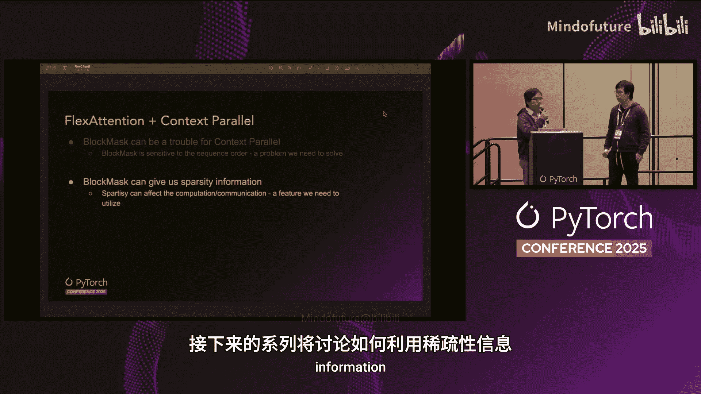

# 027：结合FlexAttention与Context Parallel


## 概述
在本节课中，我们将学习如何将FlexAttention这一灵活的注意力机制API与Context Parallel（上下文并行）训练范式相结合。我们将探讨其中的关键挑战，特别是如何处理`BlockMask`，并介绍一种创新的负载均衡策略以优化长序列训练的性能。

---

## FlexAttention 快速回顾
上一节我们介绍了FlexAttention的基本概念，本节中我们来看看它的核心定义。

FlexAttention是一个灵活的API，它允许用户传入可选的评分函数或掩码函数，以自定义注意力行为。

其核心在于两个关键函数，它们接收Q（查询）、K（键）、V（值）的索引作为输入：
*   **评分函数**：用于自定义注意力分数计算。
*   **掩码函数**：用于决定特定的Q-K-V三元组是否参与计算（即是否被掩码）。

用伪代码表示其核心思想如下：
```python
# 伪代码示意
attention_scores = score_function(Q_indices, K_indices, V_indices)
attention_mask = mask_function(Q_indices, K_indices, V_indices)
```

---

## Context Parallel 简介
Context Parallel是一种分布式训练范式，它将长序列分割成多个子序列（chunks），分配到不同的设备上。

在计算嵌入或前馈网络层时，各设备间无需通信。然而，当需要进行注意力操作（如FlexAttention）时，设备需要获取完整的K（键）信息。

目前有两种主流方法解决此通信问题：
1.  **All-Gather**：通过全局收集操作汇聚所有设备的K信息。
2.  **Ring Attention**：通过环状通信方式，将通信与计算重叠进行。

当前实现主要支持All-Gather方式，Ring Attention版本仍在开发中。

---

## 结合挑战：BlockMask的处理
将FlexAttention与Context Parallel结合时，一个关键挑战在于`BlockMask`。

`BlockMask`不仅包含序列信息，还包含了掩码函数。因此，它不能像普通输入张量那样简单地沿序列维度进行分割或分片。

`BlockMask`给应用Context Parallel带来了麻烦。但同时，它也提供了宝贵的稀疏性信息——它指明了哪些Q-K-V对被掩码，不参与计算。

更高的稀疏性意味着更低的计算量。这是我们在设计Context Parallel策略时需要充分利用的信息。

---



## 解决方案：Context Parallel Sharding
为了解决`BlockMask`的分片问题，我们引入了`context_parallel_shard` API。

该API接收输入数据（如输入张量或标签）和`BlockMask`作为参数。其工作逻辑如下：
*   当检测到输入是普通张量时，API会简单地沿序列维度对其进行分片。
*   当检测到输入是`BlockMask`时，API首先同样沿序列维度分片，但**关键步骤**在于：它会根据提供的设备网格信息（其中包含了Context Parallel的配置）**重写掩码函数**，使得本地的Q、K、V索引能够正确映射回全局索引。

此外，该API还包含一个`load_balance`参数，这对于我们接下来要讨论的负载均衡至关重要。

---

## 利用稀疏性：负载均衡策略
上一节我们介绍了处理`BlockMask`的方法，本节中我们来看看如何利用其稀疏性信息进行负载均衡。

我们针对不同密度的掩码对FlexAttention进行了基准测试，发现其前向和反向传播时间与掩码密度成正比。

这意味着，如果我们在分片Q、K、V张量时采用不平衡的方式，计算负载在各设备间的分布将不均匀，从而导致性能下降。

负载均衡的目标是**最小化所有设备中最大的计算密度**。一种实现方法是在分片前，对Q、K、V张量进行重新排序。这个问题可以建模为一个“多路数字划分问题”。

以下是两种负载均衡策略的对比：

**头尾负载均衡**
这是一种常用于平衡因果掩码的策略。
*   **工作原理**：首先将Q索引分成 `2 * CP_SIZE` 个块（例如CP_SIZE=4，则分成8块）。然后将密度最低的块（Q0）与密度最高的块（Q7）组合分配给GPU 0，将Q1与Q6组合分配给GPU 1，以此类推。
*   **效果**：在理想的因果掩码模式下，它能实现完美的均匀密度分布。

**处理时间轮询负载均衡**
然而，像“头尾法”这样的静态启发式方法并非总是有效，因为它们假设掩码具有特定的密度模式。例如，将其应用于“文档因果掩码”时效果可能不佳。

因此，我们提供了一种**自动负载均衡**方法，它可以分析掩码密度并据此生成负载均衡计划。我们称之为“处理时间轮询”法。

其步骤如下：
1.  **计算行密度**：为每个Q索引计算其行密度（对于FlexAttention，此信息已预计算并存储在`BlockMask`中）。
2.  **按密度排序**：根据密度对Q索引进行排序。
3.  **轮询分配**：
    *   在第一轮，选取密度最低的4个Q索引，按顺序分配给GPU 0, 1, 2, 3。
    *   在下一轮，选取接下来的4个Q索引，但以**相反顺序**（GPU 3, 2, 1, 0）分配。
    *   持续以这种“之字形”顺序进行分配。

这种方法能带来更均匀的密度分布。

---

## 性能基准测试
我们对上述两种策略进行了性能基准测试。测试环境为TitanML Llama模型训练，使用文档掩码，并变化文档大小，序列长度固定为128K。

以下是测试结果：

**测试1：小文档（多数文档长度<4000）**
*   **掩码密度**：约2%（很低）。
*   **头尾法**：由于负载均衡步骤本身有计算开销，且实际密度分布与其假设不符，因此性能略有下降。
*   **PTR法**：在此情况下仍显示出正向的性能增益。

**测试2：中到大文档（每100个文档合并）**
*   **掩码密度**：从2%增加到约15%。
*   **头尾法**：显示出正向性能增益。
*   **PTR法**：显示出超过20%的显著性能增益。

**测试3：标准因果掩码（整个128K序列属于同一文档）**
*   **两者表现**：由于因果掩码下极端的计算不平衡，两种策略都显示出超过50%的性能增益。

---

## 未来工作
最后，我们分享一些未来的工作计划。

**短期目标：降低负载均衡算法开销**
潜在解决方案包括：
*   使用Torch Compile来加速计算。
*   将负载均衡算法卸载到CPU执行。
*   将负载均衡步骤移至数据加载阶段进行。

**长期目标**
*   集成Ring Attention。
*   开发感知稀疏性的通信优化。

---

## 总结
本节课中我们一起学习了如何将FlexAttention与Context Parallel结合以进行高效的长序列训练。我们深入探讨了处理`BlockMask`的核心挑战，并介绍了一种创新的、基于处理时间轮询的自动负载均衡策略，该策略能有效利用注意力掩码的稀疏性，显著提升分布式训练性能。相关API已在PyTorch Nightly版本中提供，欢迎大家尝试。