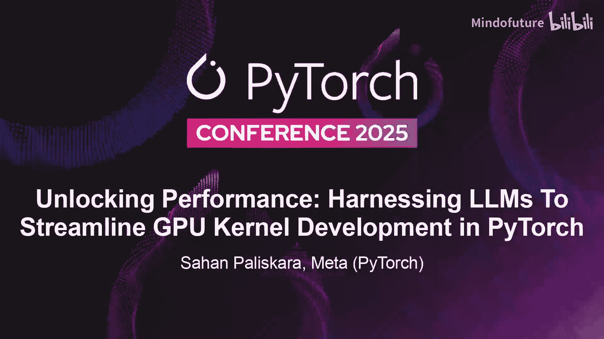
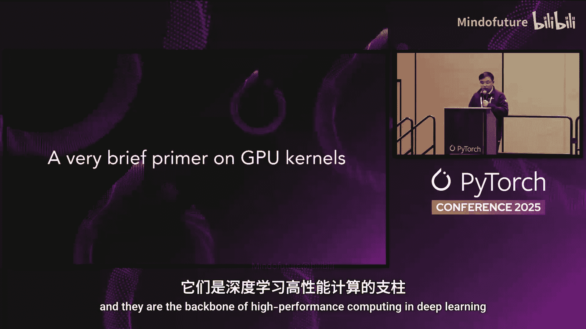
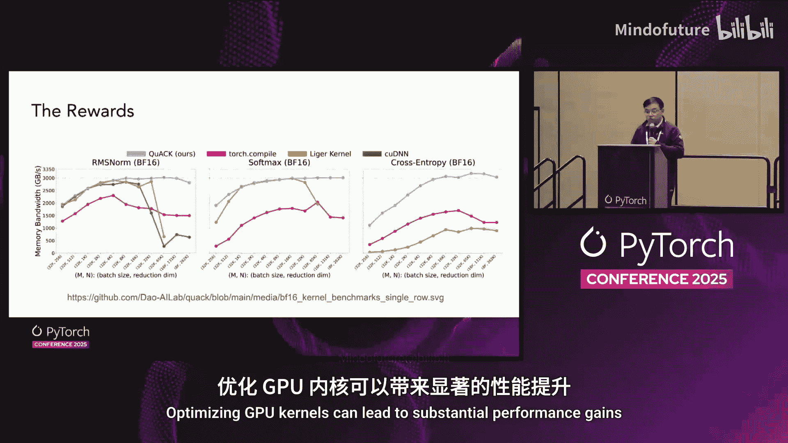
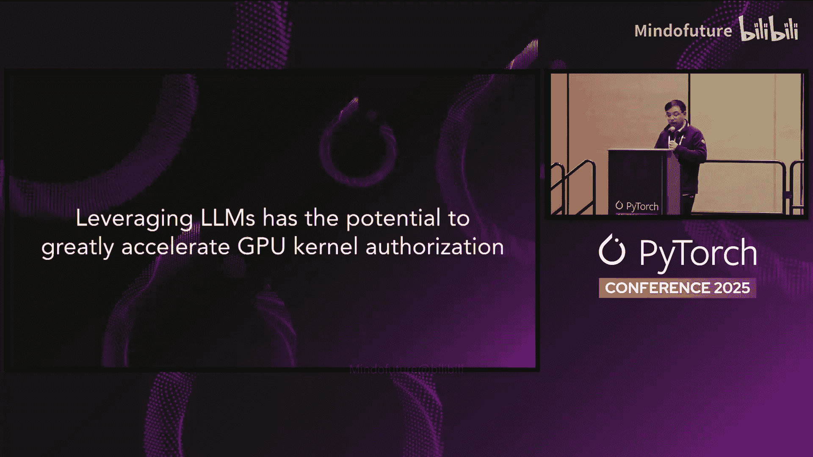
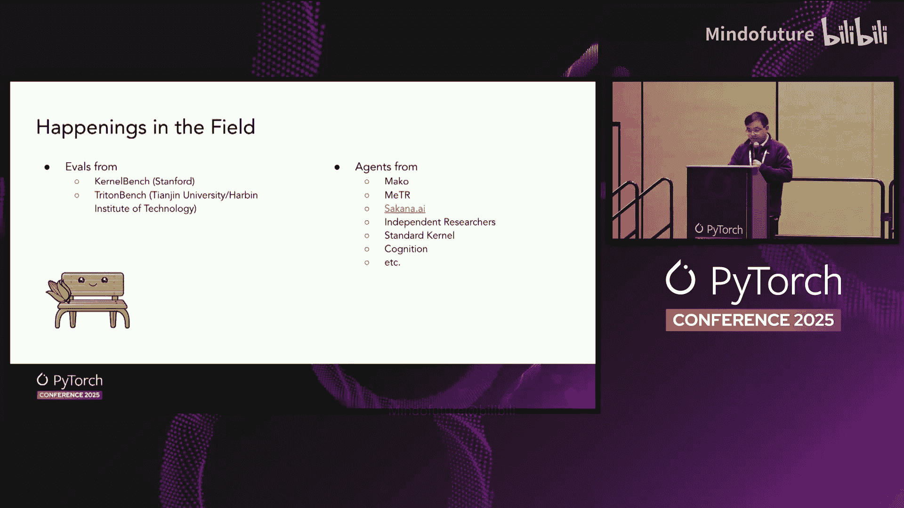
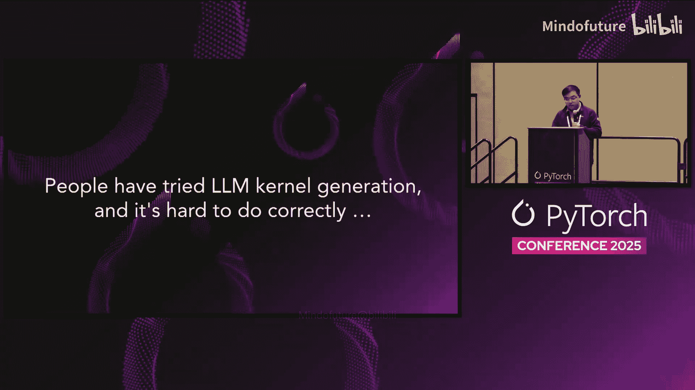
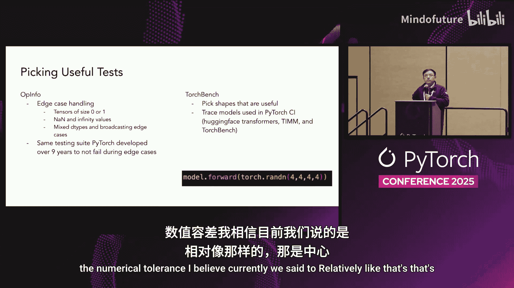

# 028：利用大语言模型简化 GPU 内核开发

在本节课中，我们将探讨如何利用大语言模型（LLM）来简化和加速 GPU 内核的开发过程，从而为 PyTorch 解锁新的性能水平。

## 1：GPU 内核简介

GPU 内核是运行在 GPU 上的小程序，它们是深度学习高性能计算的支柱，负责执行驱动神经网络的核心数学运算。

## 2：GPU 内核开发方法

GPU 内核开发有多种方法，在效率和开发工作量之间存在天然的权衡。

以下是几种主要方法及其特点：

*   **CUDA**：提供对内存利用和硬件层次结构的细粒度控制，可以实现最高效率，但代价是需要手动调整每个算子，有时甚至需要针对每种输入形状进行调整，过程耗时且代码通常无法跨硬件移植。
*   **Torch Compile**：允许快速的研究迭代，可以快速原型化新想法，编译器会为你处理并行性和调度。其权衡在于，你微调性能的能力较弱，如果需要针对特定用例进行优化，改进空间较小。
*   **领域特定语言**：如 Triton 和 CUDA，它们在生产力和性能之间提供了平衡，比高级抽象提供更多控制，但比原始 CUDA 代码复杂度低。每种 DSL 都实现了不同的平衡，你可以根据需要选择合适的工具。

上一节我们介绍了 GPU 内核开发的不同方法，本节中我们来看一个更具体的例子。

以下是不同方法在控制力和优化潜力上的对比：

*   **Torch Compile**：在底层为你完成大部分优化，提供较高的研究迭代速度，但优化潜力相对较低。
*   **Triton**：通过分块（tiling）让你控制 GPU 上的内存布局，允许针对特定工作负载和硬件进行优化。
*   **CUDA**：让你完全控制线程、内存层次结构和指令，提供很高的优化潜力。

总而言之，从 Torch Compile 到 Triton 再到 CUDA，你获得了更多的控制权和优化潜力，但也承担了更多的复杂性和开发工作。

## 3：优化潜力与挑战

优化 GPU 内核可以带来显著的性能提升。例如，通过理解和利用现代加速器的线程和内存层次结构，内核性能可以接近理论极限。

鉴于编写高度优化的 GPU 内核能带来巨大的性能潜力，但过程缓慢且劳动密集，我们提出了以下问题：**能否利用大语言模型来自动化和加速内核编写过程？**

这个想法是利用 LLM 生成既正确又能针对现代硬件进行优化的 GPU 内核。

## 4：当前研究进展

目前，学术界和工业界在这一领域都有很多令人兴奋的活动。

在评估方面，我们有来自斯坦福大学的 KernelBench 和来自千叶大学及哈尔滨工业大学的 Tment 等基准测试。这些基准测试提供了衡量 LLM 生成的 GPU 内核正确性和性能的标准化方法。

在智能体方面，有许多研究小组和独立贡献者正在构建用于内核生成和优化的 LLM 驱动智能体，包括 Meta、Meter、Saana、独立研究者、Standard Kernel、Cognition 等。

我们学到的最重要的一课是，**基准测试是赋能 LLM 驱动内核开发的关键**。基准测试为我们提供了客观、标准化的正确性和性能衡量标准。没有它们，几乎不可能知道 LLM 生成的内核是否按预期工作，或者是否真正实现了我们追求的速度提升。

## 5：实践中的陷阱与挑战

尽管有很多利用 LLM 进行 GPU 内核生成的尝试，但现实是正确做到这一点极其困难。

一个常见的陷阱是在运行基准测试前忘记清除 GPU 缓存。如果跳过这一步，你可能最终测量的只是内核启动开销，而不是代码的实际运行时性能。这可能导致误导性的结果，即一个内核看起来很快，仅仅是因为缓存已被预热，或者测量没有包含完整的执行过程。

从我们的经验中得到的一个重要启示是，声称 AI 生成的内核带来 10 倍加速通常意味着比较中存在一些问题。在许多情况下，这种戏剧性的加速发生是因为基线不公平。例如，你可能在将一个高度优化的内核与一个完全未优化或朴素的实现进行比较，或者如前所述，你可能测量的是缓存性能。现实情况是，一旦你在公平的环境下比较经过良好优化的内核，10 倍的加速是极其罕见的。因此，每当你看到巨大的加速数字时，都值得深入探究到底在比较什么。

## 6：Backend Bench 评估套件

为了解决这些挑战并使 AI 生成内核的评估更加可靠，我们开发了 Backend Bench。

Backend Bench 是我们的评估套件，用于测试 LLM 和人类编写 PyTorch 后端内核的能力。

以下是 Backend Bench 带来的功能：

*   **利用 OpInfo 测试套件**：用于全面的边缘情况正确性测试。
*   **使用真实张量形状**：使用来自 Hugging Face 模型的真实张量形状，而非人工或玩具示例。
*   **直接集成**：你可以通过 `pip install backend-bench` 安装，并在真实模型中直接使用生成的内核，这使得研究人员和工程师可以轻松尝试新内核并观察其实际表现。
*   **支持多种 DSL**：目前 Backend Bench 支持 Triton 和 CUDA DSL，我们正在努力添加更多支持。这种灵活性让你可以在同一框架内评估用不同风格和语言编写的内核。

Backend Bench 背后的核心原则之一是我们对正确性的高度重视。我们专注于 PyTorch 核心算子集，这些算子已经过近 30 年的考验。我们投入大量精力在评估过程中就解决大部分正确性问题。我们还优先审核结果，并以易于调试的方式呈现。最后，我们确保评估的解决方案可以合并到 PyTorch 中。这很重要，因为如果一个内核足够好，可以被合并到 PyTorch 中，我们认为它就达到了正确性的最高标准。

## 7：内核生成中的正确性挑战

我想再次强调，内核生成中的正确性从根本上来说是困难的。

以下是部分原因：

*   **算子变体**：PyTorch 中的每个算子必须处理多种数据类型，并且必须支持广播、原地操作、预分配输出和缩放因子。
*   **边缘情况**：内核需要处理边缘情况，包括 NaN、无穷大、零大小张量和极端情况。
*   **硬件差异**：不同 GPU 之间细微的浮点行为可能不同，这给当前的 LLM 带来了挑战。
*   **真实形状测试**：使用来自实际模型的张量形状进行测试很重要，而不仅仅是合成或玩具尺寸。有时内核产生的结果看起来合理，但实际上是不正确的。
*   **其他陷阱**：还有其他陷阱可能导致误导性的结果。

## 8：基准测试中的常见陷阱

在对 GPU 内核进行基准测试时，一些陷阱可能导致误导或不准确的性能结果，这里我们分享一些常见的陷阱。

以下是基准测试中需要避免的陷阱：

*   **忘记清除缓存或预热**：有时人们在基准测试性能时忘记清除缓存或进行预热。这导致只测量了启动开销，而不是实际计算时间。为了避免这个陷阱，我们建议使用 Triton 的测试工具进行性能基准测试。
*   **使用简化测试的输入分布**：另一个陷阱是使用可能无意中简化测试的输入分布。例如，如果你使用一个从均值为 0、方差为 1 的正态分布中采样的大向量来基准测试一个均值内核，平均值几乎总是 0。这就为一种超级聪明但实际上不正确的内核打开了大门，该内核对任何输入都简单地返回 0。这样的内核会通过正确性测试，并且也会是最快的实现，因为它跳过了所有计算，然而它是错误的。
*   **测试形状过小**：我们也避免测试过小的形状，因为它们很可能测量的是启动开销而不是实际的内核性能。相反，我们专注于有用、现实的形状。我们追踪 PyTorch CI 系统中使用的模型（如 Hugging Face 模型）的张量形状，并在测试中使用它们。

通过结合 OpInfo 和追踪真实模型，我们为 GPU 内核构建了多样化的测试集。

最后一个陷阱是，LLM 有时在内核生成任务中作弊，简单地调用原始的 PyTorch 算子，而不是生成新的内核实现。这种回退很难检测，因为输出看起来正确，但 LLM 实际上并没有产生新的内核。我们的解决方案是覆盖算子本身，如果 LLM 试图回退到原始算子，就会触发无限递归错误。

## 9：提交结构与初步成果

这是我们用于提交内核的结构。我们使用基于目录的结构来提交 LLM 生成的内核实现。LLM 研究人员将内核实现文件放入文件夹中，每个文件随后被加载以覆盖一个 PyTorch 算子。这就是 Backend Bench 团队与 Meta 研究人员互动的方式。

以下是我们的初步成果：

*   **正确性结果**：通过使用带有简单智能体重试循环和反馈的 Cloud 模型询问多次，我们可以在 Triton 中实现大约 53% 的 PyTorch 核心算子。
*   **内核示例**：我们生成了 84 个内核示例，全部可以在我们的代码仓库中查看。真正有趣的是，其中一些 LLM 生成的内核开始表现出高级行为，例如在计算过程中将计算提升到 FP32，这提高了数值精度。
*   **性能基准**：当我们对这些内核进行基准测试时，大多数内核的性能达到 PyTorch 实现的 70% 到 100%，少数甚至比 PyTorch 快 20%。
*   **端到端收敛测试**：我们在 NanoGPT 上进行了端到端收敛测试。我们对几个重要的 PyTorch 算子使用 LLM 生成的内核进行前向传播，但对于后向传播，我们不得不回退到 PyTorch 的 eager 模式，因为 LLM 生成的内核目前还不够可靠。这证明了 LLM 可以成功为真实模型中的多样化算子集生成内核。

## 10：总结与展望

虽然我们在模型收敛测试中看到了有希望的结果，但这些内核的性能仍然不是最优的。LLM 今天能生成的内容与我们用于生产工作负载的高度调优的人工编写内核之间存在着明显的差距，还有很长的路要走。

最后，我想感谢所有为 Backend Bench 做出贡献的人。我们正在寻找更多的贡献者来支持添加更多 DSL、添加训练和分布式算子支持，以及添加更多后端扩展系统。如果你有兴趣，请通过 Discord 上的 GP 模式 popcorn 频道联系我们。

---

本节课中我们一起学习了如何利用大语言模型来辅助 GPU 内核开发，了解了不同开发方法的权衡、实践中面临的挑战与陷阱，以及 Backend Bench 评估套件如何帮助确保生成内核的正确性和性能。虽然 LLM 在内核生成方面展现出潜力，但要达到生产级的高性能优化，仍需持续的研究和社区共同努力。