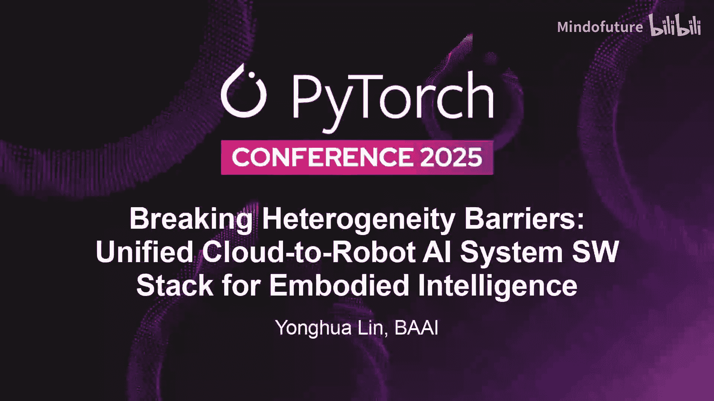
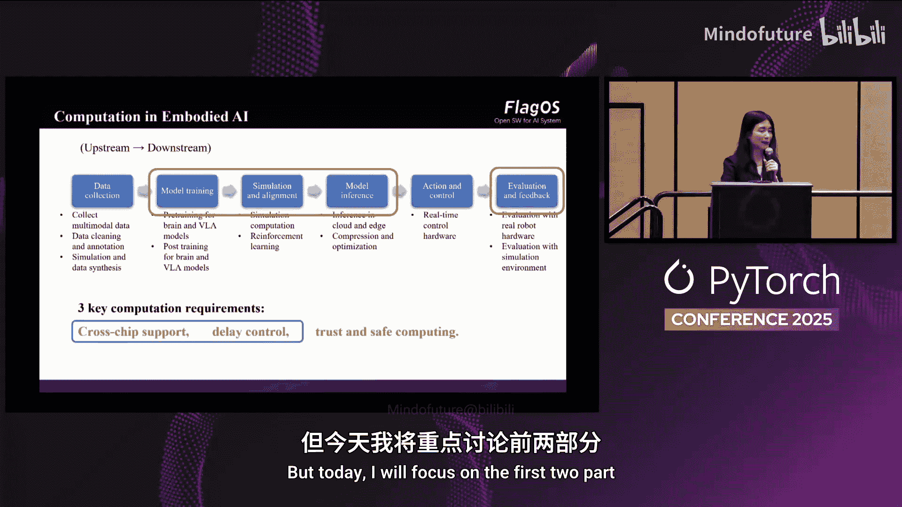
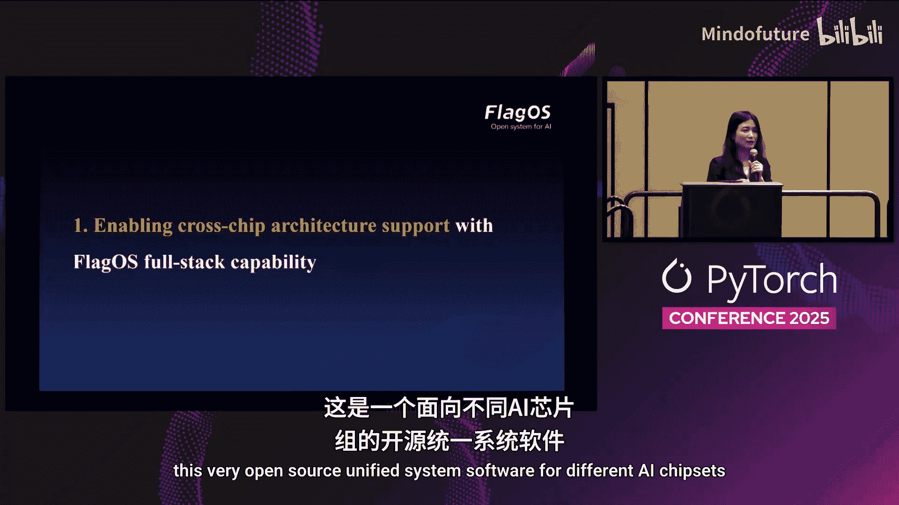
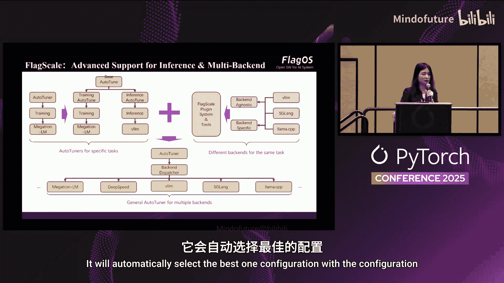
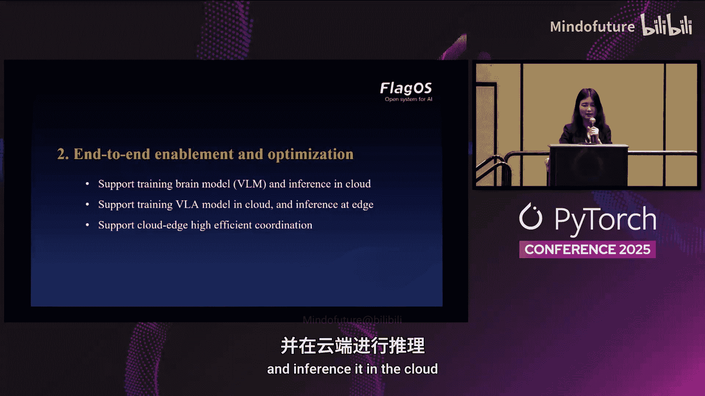
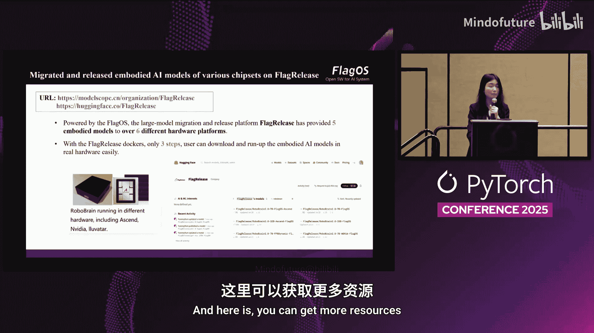
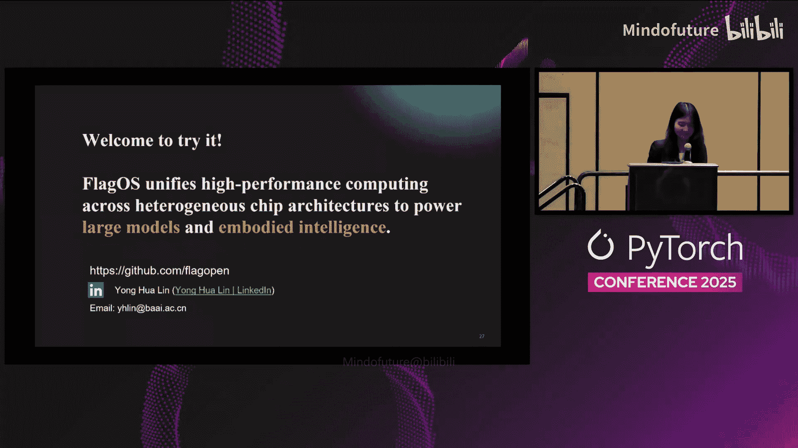

# 029：突破异构壁垒——面向统一云到机器人AI的系统软件栈

在本节课中，我们将要学习如何构建一个支持从云端到机器人边缘设备、跨越不同硬件架构的统一AI系统软件栈。我们将聚焦于具身人工智能，探讨其核心模型构成、面临的异构计算挑战，以及如何利用开源软件栈FlaxO来解决这些问题。

## 概述：具身人工智能与系统挑战

随着大模型的发展，**具身人工智能**将成为驱动系统基础设施和软件需求的重要趋势。本次分享将基于北京智源人工智能研究院在大型模型和机器人模型方面的实践经验，探讨如何支持具身AI，并重点解决跨越不同AI芯片架构的难题。

---

## 核心模型分解：大脑模型与执行模型

当前阶段的机器人端到端系统通常被分解为两个主要模型，类似于人类的大脑和小脑分工。

### 大脑模型：负责高级认知

上一节我们介绍了具身AI的整体概念，本节中我们来看看其核心组件之一——大脑模型。该模型类似于人类大脑，负责**思考、语言、学习、推理**等高级任务。它需要理解物理世界、与人类意图交互、进行影响评估和任务规划。

*   **输入**：人类语言指令、结构化场景数据、图像或视频等视觉信息。
*   **输出**：经过推理后生成的文本形式任务规划。
*   **部署**：通常作为视觉语言模型部署在云端。
*   **示例**：智源研究院发布的 `VLM` 模型（如 `Twice-2`）。

### 执行模型：负责动作控制

与负责思考的大脑模型相对应，执行模型则负责具体的**动作控制与身体协调**。它通常是一个较小的模型，接收高级任务并将其分解为具体的动作指令。

*   **结构**：`VLM` + **动作专家模块**。
*   **输入**：多模态指令、视频输入、来自硬件的状态输入（如关节角度、末端效应器状态）。
*   **输出**：在特定时间片控制硬件关节运动或末端效应器状态的动作序列。
*   **部署**：需要与机器人硬件一同部署在边缘设备。
*   **示例**：智源研究院发布的 `X0` 模型，或 `Pi0`、`G3` 等模型。

---

## 具身AI全流程与关键计算需求

从上游到下游，具身AI的开发与应用涉及多个环节，每个环节都对计算有特定要求。

以下是主要步骤：
1.  **数据收集与处理**：包括数据过滤、标注和仿真。
2.  **模型训练**：包括大脑模型和执行模型的预训练与后训练（如指令微调）。
3.  **仿真与对齐**：例如通过强化学习进行策略对齐。
4.  **模型推理与部署**：在云端或边缘设备运行模型。
5.  **动作控制**：靠近硬件的实时低层控制。
6.  **评估**：通常在真实硬件上进行最终评估。

在这些环节中，尤其是训练、对齐、推理和评估阶段，计算与PyTorch紧密相关。我们总结了三个关键的系统需求：

1.  **跨芯片支持**：训练和推理可能发生在不同类型的芯片上。
2.  **低延迟控制**：机器人需要实时响应。
3.  **可信与安全计算**：确保机器人在物理世界中的行为安全。

本节课我们将重点讨论前两个需求。

---

## 挑战一：如何实现跨芯片架构支持

当前，机器人边缘侧的硬件架构正呈现出越来越大的多样性。

### 异构硬件的现状与挑战

我们预见，未来机器人将拥有更多的硬件选择。同时，一个常见的场景是：在云端使用一种芯片（如AMD或华为昇腾）训练模型，然后在边缘设备上使用另一种芯片（如NVIDIA）进行部署。然而，当前的障碍在于：

*   **软件生态碎片化**：不同的AI芯片拥有各自不同的硬件架构、指令集、编译器和算子库版本。
*   **迁移成本高**：这使得用户很难将其代码从一种芯片平台迁移到另一种。

### 解决方案：FlaxO统一软件栈

为了解决上述问题，我们依赖于 **FlaxO**——一个开源的、支持不同AI芯片的统一系统软件栈。它由全球近20个团队共同开发，是目前世界上支持AI芯片范围最广的软件栈之一，并已集成到PyTorch生态中。

FlaxO包含四个核心开源库，以下是其关键组件与功能：

*   **FlaxJams**：统一的AI算子库。它是最大的Triton算子库之一，拥有超过200个算子，支持多种模型。其算子使用Triton语言编写，在许多情况下性能可媲美甚至超越CUDA在同等硬件上的实现。
    *   `# 示例：使用FlaxJams中的算子`
    *   `import flaxjams`
    *   `output = flaxjams.ops.custom_op(input)`
*   **FlaxScale**：统一的AI编译器框架。它对Triton语言进行了增强，通过引入提示来表征硬件特性，从而生成比原始编译器更优的性能。它在运行时也进行了大量优化。
*   **FlaxComm**：统一的通信库。为不同芯片提供了统一的通信抽象。
*   **支持环境**：可同时支持数据中心和边缘环境。

基于FlaxO，我们可以轻松实现跨平台支持。例如，对于`Qwen`模型，我们100%使用FlaxJams库替换了原有实现，并将底层编译器切换为FlaxScale，获得了接近最佳性能的表现。

---

## 挑战二：端到端的启用与优化

基于FlaxO软件栈，我们可以支持从云端训练到边缘部署的完整流程。

### 1. 云端大脑模型的训练与推理

**训练挑战**：使用原生PyTorch数据加载器处理多模态数据时CPU开销高；内存瓶颈。
**FlaxScale解决方案**：通过优化数据流水线、内存管理等，相比默认设置（如`LLaMA-Factory`），可获得**超过2倍的训练加速**。

**推理挑战**：硬件生态碎片化；多种后端推理引擎选择（如`vLLM`, `HuggingFace TGI`, `llama.cpp`）。
**FlaxScale解决方案**：自动选择最佳后端引擎和配置，并提供混合量化等优化技术。例如，在接近边缘的`NVIDIA 4090` GPU上部署时，能显著提升推理速度。

### 2. 边缘执行模型的训练与部署

**训练挑战**：执行模型的训练通常分为**预训练**和**微调**两个阶段，两者数据格式和训练目标差异大。
*   **预训练数据**：网络多模态数据（图像-文本对，视频-字幕对）。
*   **微调数据**：机器人多模态数据（文本指令、多摄像头视频、硬件关节状态等结构化数据）。
**FlaxScale解决方案**：提供多阶段数据流水线，高效处理不同类型的数据集，并实现计算优化。

**推理挑战**：需要算法与系统紧密协同优化；量化需格外谨慎以保证控制精度。
**FlaxScale解决方案**：支持云边高效协同框架，通过机器人状态注册等技术减少传输令牌数，降低延迟。提供五步简易启动框架，支持`Pi0`、`RoboCat`、`RobotBrain`等多种具身AI模型。

与HuggingFace的`Roboflow`等框架相比，FlaxScale的优势在于同时支持训练和推理、多芯片支持、提供一站式Docker镜像，并全面支持最新的VLM和VLA模型。

---

## 总结与展望

本节课中，我们一起学习了构建统一云到机器人AI系统软件栈的核心思路。

1.  **核心模型**：具身AI可分解为云端**大脑模型**和边缘**执行模型**。
2.  **核心挑战**：**跨芯片支持**和**低延迟控制**是主要系统挑战。
3.  **解决方案**：**FlaxO**统一软件栈通过其算子库、编译器和框架，有效解决了异构硬件生态碎片化问题。
4.  **端到端支持**：基于FlaxScale，可以实现从云端多模态模型训练、边缘模型微调到高效云边协同推理的完整流程优化。

展望未来，为了在控制延迟的同时更好地支持新兴硬件架构，我们可以：
*   利用**FlaxScale AI编译器**快速适配新芯片。
*   通过**FlaxJams算子库**不断丰富对具身AI新算子的支持。
*   开发者无需进行繁琐的迁移工作，即可通过FlaxO生态直接获取和部署所需的具身AI模型。

通过本节课的学习，希望你能够理解具身AI系统软件栈的关键组成部分，以及如何利用开源工具来应对异构计算带来的挑战。