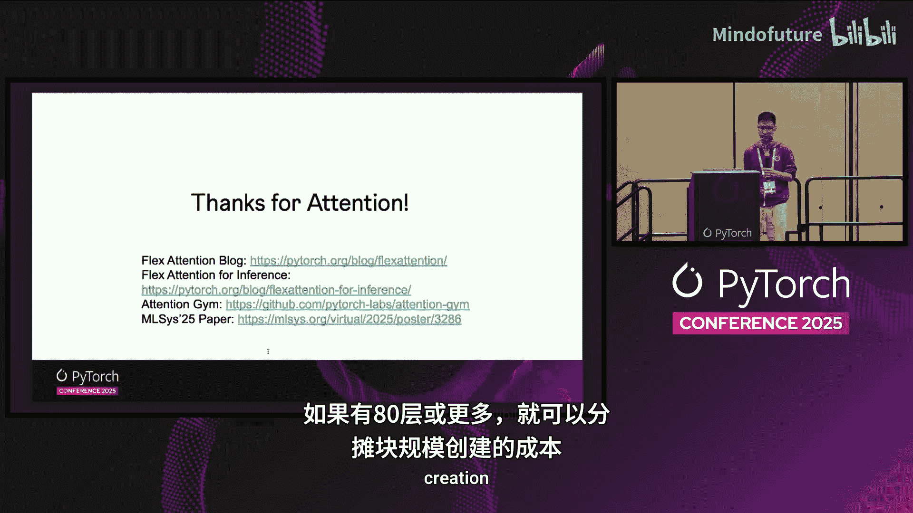

# 030：推理优化与页面注意力集成 🚀

## 概述


在本教程中，我们将学习 PyTorch Flex Attention 在推理场景下的优化技术，特别是其如何与 Page Attention 结合以支持更大的批处理规模。我们将从 Flex Attention 的基本概念开始，逐步深入到推理特有的优化模式，最后探讨其与 Page Attention 的无缝集成方案。

---

## 章节 1：Flex Attention 简介 🧠

上一节我们概述了本课程内容，本节中我们来看看 Flex Attention 的核心概念。

注意力机制是 Transformer 模型的核心。其标准计算过程如下：

**公式：**
`Attention(Q, K, V) = softmax((Q * K^T) / sqrt(d_k)) * V`

其中 `Q` 是查询矩阵，`K` 是键矩阵，`V` 是值矩阵。

Flash Attention 是对标准注意力计算的重要优化，使其运行速度大幅提升。然而，随着研究的深入，出现了许多注意力机制的变体，例如相对位置编码、文档注意力、滑动窗口注意力等。为每一种变体都编写一个高效的计算内核非常困难。

这就是 Flex Attention 的用武之地。Flex Attention 的核心思想是允许对注意力分数矩阵进行灵活的修改。

**代码概念：**
```python
# Flex Attention 允许定义一个“分数修改函数”
def score_modification(score_matrix):
    # 用户可以在此按需修改分数矩阵
    # 例如，应用相对位置偏置、掩码等
    modified_score = user_defined_mod(score_matrix)
    return modified_score
```

它主要通过两种方式提供灵活性：
1.  **分数修改**：允许修改分数矩阵中任意位置的数值。
2.  **掩码修改**：允许跳过某些位置的计算。

大多数注意力变体都可以通过这种方式简洁地表达。Flex Attention 支持前向和反向传播，因此可以用于模型训练。

---

## 章节 2：推理场景的挑战与优化 ⚡

上一节我们介绍了 Flex Attention 的基本原理，本节中我们来看看它在推理场景下的独特挑战和优化。

推理场景与训练场景有一个显著不同：查询序列通常非常短（例如，生成下一个词），但需要关注一个非常长的键值缓存（KV Cache）。这导致上下文长度可能极长。

由于查询序列长度短，很难在序列长度这个维度上进行并行计算以提升速度。为了解决这个问题，我们引入了 **Split-K 优化**（灵感来自 Flash Decoding 工作）。

以下是 Split-K 优化的步骤：

1.  **分割**：将长的键（K）维度分割成多个较小的块（例如，5个分块）。
2.  **并行计算**：为每一个分块独立计算一个部分的注意力输出。
3.  **归约**：最后通过一个归约步骤，将所有分块的输出合并成最终的注意力结果。

Flex Attention 同样集成了这种 Split-K 优化，我们称之为 **Flex Decoding**。它在保持 Flex Attention 灵活性的同时（例如，仍可在每个分块上应用分数修改函数），显著提升了推理速度。

Flex Decoding 与 Flex Attention 共享相同的应用程序接口（API）。系统可以根据上下文长度等条件自动判断，在合适的时候切换到 Flex Decoding 模式以获得最佳性能。

---

## 章节 3：与 Page Attention 的集成 📄

上一节我们探讨了推理优化，本节中我们来看看 Flex Attention 如何与另一个重要的推理优化技术——Page Attention 协同工作。

在推理中，为了支持更大的批处理规模，人们通常会使用 Page Attention。那么，Flex Attention 能否与 Page Attention 一起工作？是否需要为此编写新的内核？

答案是：**不需要新内核**。我们可以通过 **块掩码转换** 技术让它们协同工作。

首先，了解 Page Attention 的背景：
*   **逻辑 KV 缓存**：传统的 KV 缓存形状为 `[批大小, 最大序列长度, ...]`，这会导致大量未使用的内存浪费。
*   **物理 KV 缓存**：Page Attention 使用一个连续的物理数组来存储所有请求的 KV 缓存，消除了浪费，从而支持更大的批处理大小。
*   **页表**：需要一个页表来映射每个请求的逻辑缓存块到物理缓存中的实际位置。

Flex Attention 与 Page Attention 集成的关键在于转换“块掩码”。

**逻辑块掩码**：对于每个查询，它指示应该计算哪些逻辑 KV 缓存块。
**物理块掩码**：我们需要将其转换为指示应该计算哪些物理 KV 缓存块。

我们提供了一个工具函数 `convert_logical_block_mask` 来完成这个转换。

同样，用户定义的**掩码修改函数**和**分数修改函数**也需要进行类似的转换，从基于逻辑索引的操作转换为基于物理索引的操作。转换后的函数可以无缝地用于物理 KV 缓存的计算中。

**总结**：通过块掩码和修改函数的转换，Flex Attention 可以直接与 Page Attention 配合使用，无需开发新的计算内核。性能测试表明，带 Page Attention 的 Flex Attention 版本与不带 Page Attention 的版本性能基本持平，仅有极小的延迟开销，同时却能支持显著更大的批处理规模。

---

## 章节 4：实际应用与性能 🚀

上一节我们介绍了技术集成方案，本节中我们来看看实际的应用案例和性能表现。

在模型层面的基准测试中，Flex Attention（Flex Decoding 模式）与专门的 Flash Decoding 优化性能相当，并且比标准的 PyTorch SDPA（缩放点积注意力）在推理设置下要快得多。

Flex Attention 的灵活性也促进了它的广泛采用：
*   它已被集成到 **vLLM** 推理引擎中。
*   开源用户用它来构建小型的推理引擎（如 Flex Nano）。
*   越来越多的开源项目在训练和推理中采用 Flex Attention，例如 NanoGPT 训练加速、Hugging Face 相关集成等。

对于开发者，建议使用 `torch.compile` 来包装块掩码生成函数，这可以带来更好的性能。同时，如果用户有特殊的、已知结构的掩码模式，也可以编写自定义的高效生成函数。

一个重要的优化提示是：在 Transformer 模型中，同一注意力模式会在多个层中重复使用。因此，**块掩码只需要生成一次**，便可以在所有层中复用，这可以分摊掉掩码创建的成本。

---

## 总结

在本节课中，我们一起学习了 PyTorch Flex Attention 在推理场景下的完整技术栈：
1.  **Flex Attention 核心**：通过可插拔的分数修改和掩码修改函数，为各种注意力变体提供了统一的灵活接口。
2.  **推理优化**：针对推理时“短查询-长上下文”的特点，引入了 Split-K 优化（Flex Decoding），显著提升了计算速度。
3.  **内存优化集成**：通过“块掩码转换”技术，实现了与 Page Attention 的无缝集成，在保持高性能的同时支持了更大的批处理规模。
4.  **实际效能**：Flex Attention 在推理基准测试中表现出色，并且其灵活性和高性能正在被越来越多的开源项目和工业级系统所采纳。



通过结合灵活性和高性能，Flex Attention 为构建高效、可定制的现代注意力计算提供了强大的基础。