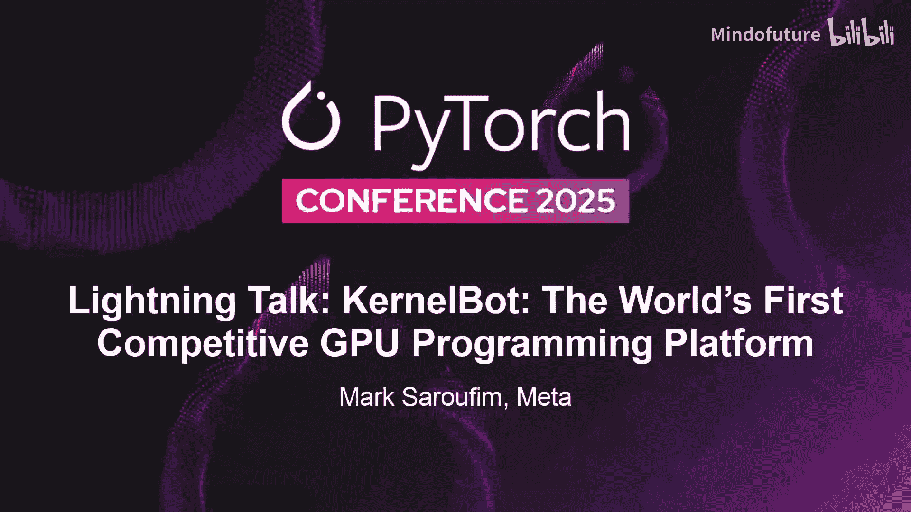
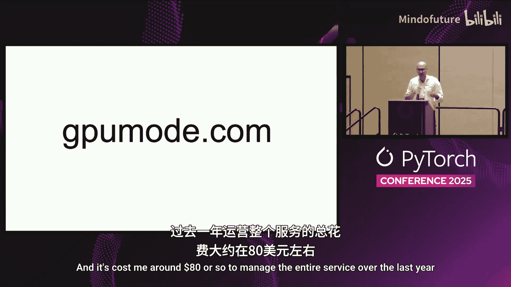
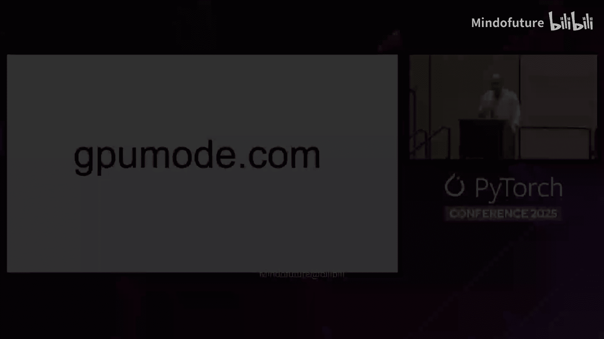

# 031：KernelBot——全球首个竞技式GPU编程平台



## 概述

在本节中，我们将介绍KernelBot，这是一个用于编写快速GPU代码的竞技平台。我们将探讨其核心动机、平台设计、技术挑战以及如何通过社区竞赛来生成高质量的GPU内核代码。

---

## 核心动机：为何需要竞技式GPU编程平台？

上一节我们介绍了KernelBot的基本概念，本节中我们来看看其背后的核心动机。

我们注意到，GitHub上几乎没有有趣的内核数据。有趣的数据要么受许可证限制无法用于训练模型，要么即使许可证宽松，代码质量也参差不齐。因此，我们希望通过一个平台，在互联网上“淹没”更多高质量的GPU内核，并帮助大型语言模型更好地解决此类问题。

**核心目标公式**：
```
高质量GPU内核数据 = 社区贡献 + 竞技激励
```

---

## 社区基础与平台互动设计

基于上述动机，我们利用了GPU模式社区。这是一个拥有超过20,000名成员的活跃Discord社区，成员们热衷于讨论GPU编程的各个方面。

我们希望说服社区中更多聪明人为我们免费贡献数据。正确的方法是提供奖金激励，以换取他们的专业知识，这是一种公平的交换。

然而，问题在于如何为20,000人提供GPU资源。我们的解决方案是建立一个“分时共享”的GPU池。用户提交任务时，可以获得GPU访问权限，运行内核并获得结果。与传统方案相比，我们优化了工作流程，将任务排队时间从数分钟缩短至约15秒，使其像优秀电子游戏一样快速、互动。

以下是平台提供的几种交互方式：

*   **Discord直接提交**：初期方式，用户可直接在Discord中附加文件提交内核。
*   **CLI工具**：由Mattet构建的命令行工具，用户可通过`popcorn-cli submit`命令提交内核，提升效率。
*   **网站平台**：由Elaine构建的网站，用户可查看排行榜、提交解决方案，这是长期的主要体验方式。

---

## 平台设计与经验教训

在构建平台的过程中，我们积累了一些关键的经验教训。

**设计有挑战性的问题很困难**。问题必须有趣且有意义，输入形状不能太小，否则测量的只是系统开销。数据分布也需要精心设计，避免被“钻空子”。

**安全性至关重要**。我们向外界分发有价值的计算资产，用户可能提交包含恶意代码的Python文件。我们必须做大量工作来防范恶意提交，包括修补评估套件中的漏洞。

**技术架构的权衡**。我们早期使用GitHub Actions作为调度机制，这替代了Kubernetes或SLURM，虽然可行，但并非最理想的设计。

**性能优化**。为了实现交互式体验，我们解决了几个性能瓶颈：
1.  使用Modal等服务将任务启动时间优化至10秒以内。
2.  对于使用原生代码（如PyTorch的`load_inline`）的情况，默认编译开销巨大。我们通过避免默认行为，将编译时间从90秒降至5秒。
3.  更多地利用**NVRTC**。这是一个更快速但限制稍多的运行时编译库，能将编译时间降至0.1甚至0.01秒，效果极佳。

**代码示例：编译优化对比**
```python
# 传统方式（慢）
torch.load_inline(cpp_sources, ...) # 可能读取数千文件

# 优化方式（快）
# 使用定制化的编译流程，避免不必要的文件加载
# 并集成NVRTC进行即时编译
```

---

## 竞赛运营与社区成果

那么，我们如何说服人们参与呢？一个主要方式是与公司合作，优化他们的实际问题。

我们与AMD合作举办了两场奖金10万美元的内核竞赛，从DeepSeek风格的内核到更复杂的计算内核。同时，我们也很高兴即将与NVIDIA启动另一场竞赛，重点聚焦在GEMM和Tensor Core内核等技术上。

**竞赛设计流程**：
1.  设定一个PyTorch参考实现作为正确性基准。
2.  通过分析真实模型选取相关的输入形状。
3.  设计排名公式（如算术平均或几何平均）。
4.  提供奖金激励。这比以百万年薪雇佣一名内核黑客要经济得多。

我们也举办过一些小型竞赛。例如，Alex设计了一个名为“Tri-MLP”的棘手问题，许多编译器在此问题上表现不佳，但社区成员找到了通过改变内存布局的巧妙解决方案。

目前，我们已经聚集了一个对GPU编程感兴趣的社区，提供了目标明确的问题。平台已相当流行，我们从约600名用户那里收集了超过60,000个高质量内核。默认情况下，所有提交的内核都是开源的，这意味着提交者保留所有权，任何人都可以用于训练模型或研究。

---

## 快速入门指南

如果您有兴趣，可以按照以下步骤开始：

1.  安装Popcorn CLI工具。
    ```bash
    curl -sSL https://gpumode.com/install.sh | bash
    ```
2.  通过GitHub或Discord注册并认证。
3.  选择一个问题和一个GPU，即可提交您的内核。建议从“Grayscale”这个最受欢迎的入门问题开始尝试。

---

## 总结





本节课中，我们一起学习了KernelBot竞技式GPU编程平台。我们从其填补高质量GPU内核数据空白的动机出发，了解了它如何利用活跃社区和分时GPU池来运作。我们探讨了平台在问题设计、安全性、架构选择和性能优化方面遇到的挑战与解决方案。最后，我们看到了平台如何通过与行业巨头合作举办竞赛来激励贡献，并成功积累了大量的开源高质量内核。如果您想了解更多，请访问GPUMode.com。