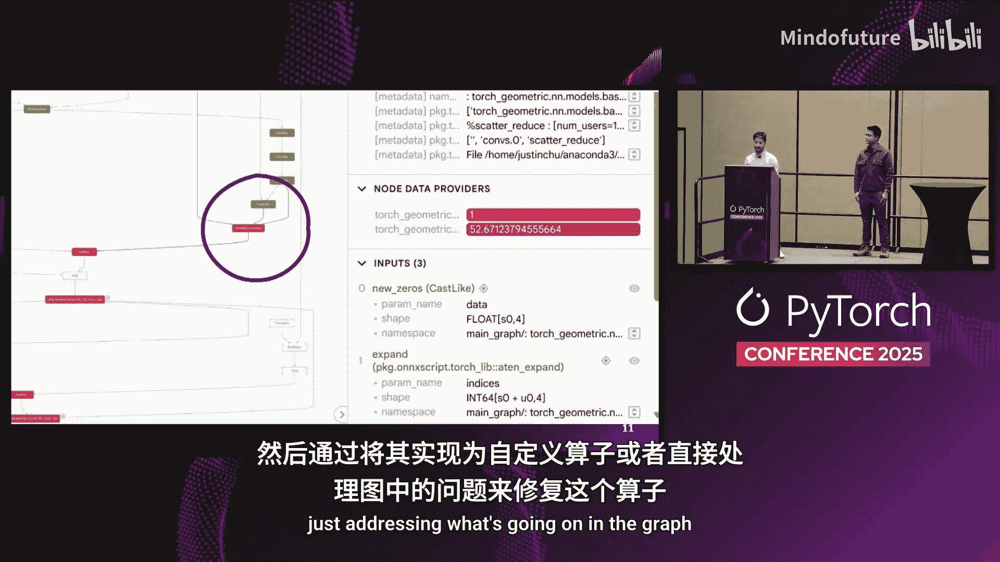
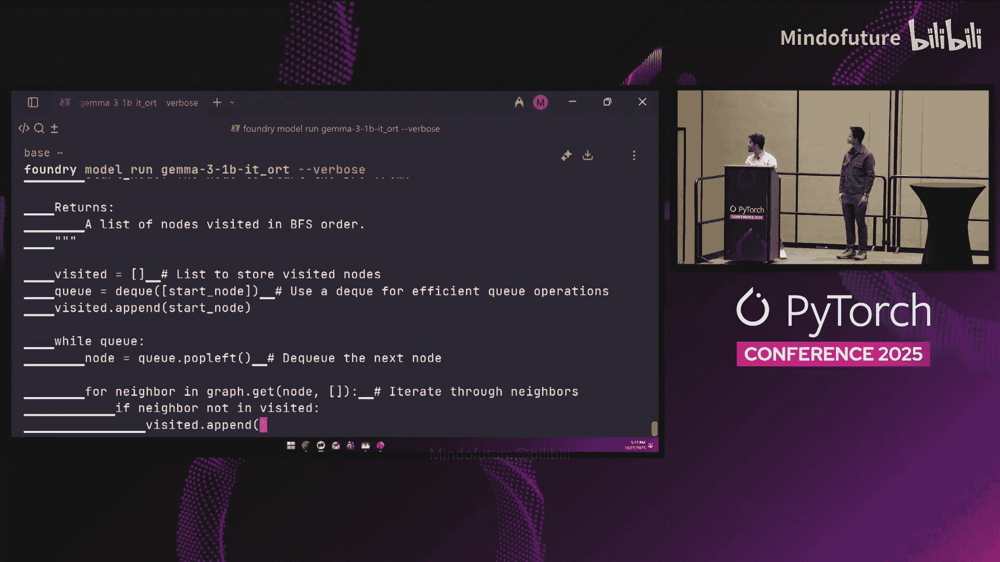
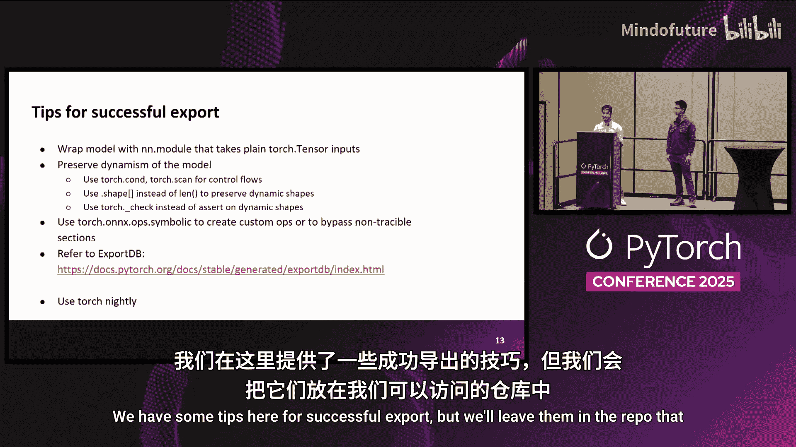

# 032：Torch.onnx 新特性解读 🚀

在本教程中，我们将学习 PyTorch 2.x 中 `torch.onnx` 模块的重大更新。这些新特性旨在简化模型导出流程，更好地支持动态形状和大语言模型，并提升导出模型的性能和兼容性。

## 什么是 ONNX 和 Torch.onnx？💎

ONNX 是开放神经网络交换格式。它是一个用于表示 AI 模型的开放标准。`torch.onnx` 是 PyTorch 中的一个模块，负责将 PyTorch 模型转换为 ONNX 格式，以便在各种生产环境中高效运行。近年来，团队特别关注支持生成式 AI 和大语言模型的工作流。

## 新架构与核心特性 🆕

上一节我们介绍了 ONNX 的基本概念，本节中我们来看看 `torch.onnx` 导出的全新架构。

**全新导出器架构**：新的导出器构建在 `torch.export` 和 `ExportedProgram` 之上。它利用 `torch.export` 和 Torch FX 作为图捕获机制，取代了之前的 TorchScript，提供了一个清晰、功能化的 FX 图用于转换。

**全新的转换逻辑库**：为确保转换正确高效，团队基于 ONNX Script 实现了一个全新的转换逻辑库，名为 `torchlib`。它全面支持动态形状以及 ONNX 18 至 24 的最新操作符。

**新增 ONNX 操作符支持**：从 ONNX 23 开始，引入了注意力、旋转位置编码和 RMS 归一化等操作符。这有助于在导出大语言模型时获得非常清晰的计算图。

**ONNX IR 内存对象**：转换后的计算图被表示为一个 `onnx.IR` 模型对象。ONNX IR 是一个用于内存中表示和操作 ONNX 模型的库。利用此表示，你可以在转换后的 ONNX 模型上执行进一步的图变换。

## 如何使用新导出器？🛠️

了解了新架构后，我们来看看如何使用它。

**迁移与 API**：为帮助用户迁移，新导出器的 API 基本保持不变。启用新路径的关键选项是 `dynamo=True`。从 PyTorch 2.9 开始，此选项默认启用。

**动态形状指定**：动态形状的指定方式有所变化。你可以按照 `torch.export` 的方式提供动态形状，或者在过渡期内仍使用 `dynamic_axes` 参数，导出器会尽力转换，但这不保证成功。建议尽快迁移到新的动态形状指定方式。

## 支持 PyTorch 2.x 的新特性 ⚡

迁移到 `torch.export` 带来了对 PyTorch 2.x 新特性的支持。

**控制流导出**：在 TorchScript 时代，你需要使用 `@torch.jit.script` 装饰器来捕获控制流。PyTorch 2 引入了高阶操作符，如 `torch.cond` 和 `torch.while_loop` 来表示条件逻辑。`torch.onnx` 导出器完全支持这些操作符。当需要表示依赖于张量数据的控制流逻辑时，应使用 `torch.cond`。

**原生 ONNX 操作符**：为了帮助创建更简洁的 ONNX 图，团队引入了“原生 ONNX 操作符”。这些操作符使用 PyTorch 的 `aten` 操作实现，在模型的前向函数中可以像普通 `aten` 操作一样直接使用。由于 `torch.onnx` 导出器能识别这些操作，它们会在转换时直接映射到对应的单个 ONNX 操作符。这省去了后续运行融合优化的麻烦。目前主要为注意力、旋转位置编码等较大的 ONNX 操作符实现了此功能，在 PyTorch 2.9 中可用。

## 自定义操作符与 ONNX 程序对象 🔧

现在，你可能会想，如果我想使用一个尚未实现的自定义操作符怎么办？这是一个很好的问题。

**自定义符号函数**：你可以首先使用 `torch.onnx.is_in_onnx_export()` API 来检测是否处于 ONNX 导出上下文中。然后，使用 `torch.onnx.register_custom_op_symbolic()` API 在 ONNX 图中创建任何你需要的操作符。这有助于你将 ONNX 兼容的模型逻辑与正常的前向逻辑放在一起，并且这些部分可以与正常的 `aten` 操作符交错使用，从而创建非常模块化且兼容 ONNX 的代码。

**ONNX 程序对象**：接下来，我们谈谈 `torch.onnx.export` 调用的返回值——`ONNXProgram` 对象。首先，该对象与现有的 PyTorch 状态共享张量数据，内存效率高。其次，它经过优化，运行了基于模式的融合、常量传播等优化，提供了一个非常简洁且预优化的计算图。它可以直接在 PyTorch 张量上运行，便于使用现有的 PyTorch 模块验证模型。如果你想进行图操作，可以通过 `onnx_program.model_proto` 访问模型并进行操作。完成后，只需调用 `onnx_program.save()` 即可高效序列化模型，并自动处理最佳实践，如对齐张量数据以便推理时进行内存映射。

## 验证工具与演示 🧪

我们努力让模型成功导出，但有时导出的模型输出可能不符合预期。这时就需要验证工具。

**验证与诊断**：`torch.onnx.verification` 可以在模型上运行，诊断模型是否被准确导出。此外，团队还构建了一个用于 Model Exper 的插件，可以精确定位数值差异。通过图表中的颜色标记，可以快速发现存在问题的操作符，进而通过实现自定义操作符或调整计算图来修复问题。

**演示：导出并运行模型**：基于上述新特性，团队成功导出了多个模型。以下是一个在本地设备上运行导出模型的演示示例。该演示使用了一个未量化、精度为 FP32 的模型，在一个较旧的第 11 代 Intel CPU 上运行，展示了良好的 tokens/秒 生成速度。这证明了我们可以从基础的 PyTorch 模型导出 ONNX 模型，并获得一个可以产品化部署的运行模型。

## 总结 📚

本节课中我们一起学习了 PyTorch `torch.onnx` 模块的一系列重要更新。我们了解了其基于 `torch.export` 的全新架构，学习了如何指定动态形状、导出控制流、使用原生 ONNX 操作符以及注册自定义操作符。我们还认识了新的 `ONNXProgram` 对象及其优势，并了解了用于确保导出正确的验证工具。这些改进共同使得将 PyTorch 模型，特别是复杂的大语言模型，转换并部署到生产环境变得更加高效和可靠。