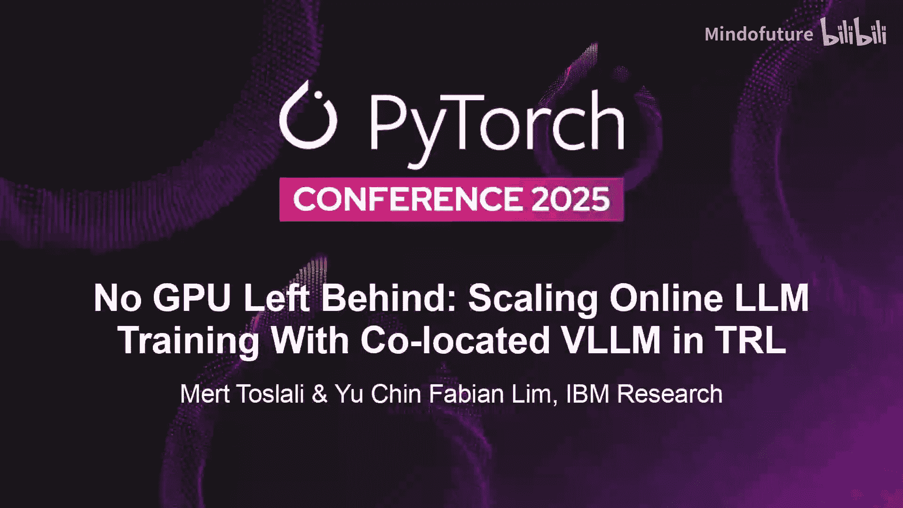
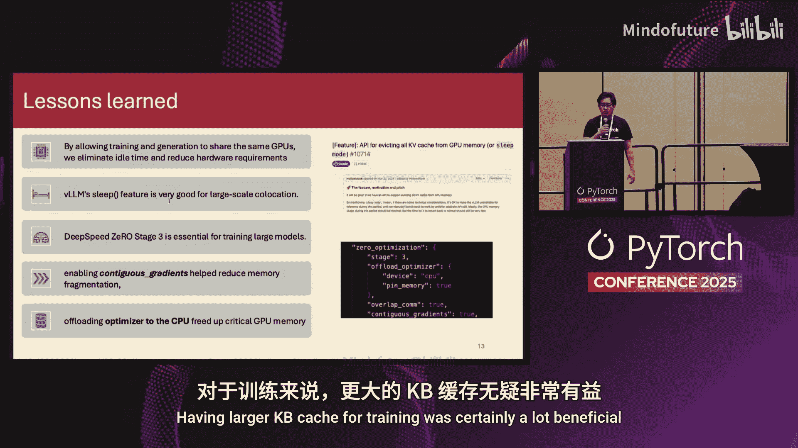
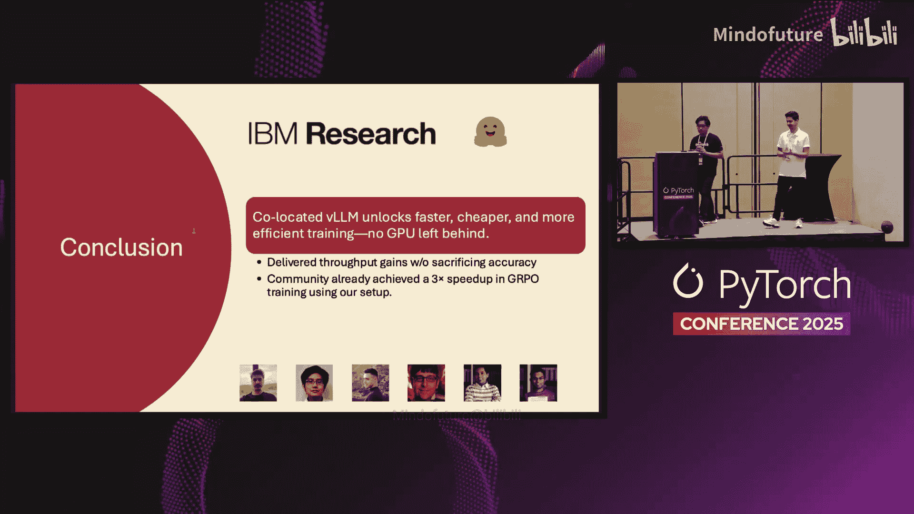

# 033：不放弃任何GPU——基于同机部署的在线LLM训练扩展

在本教程中，我们将学习如何通过将训练和推理过程部署在同一GPU上，来显著提升GRPO（Group Relative Policy Optimization）的训练效率。我们将介绍这一方法的核心原理、实现步骤、带来的性能提升以及实际应用中的关键配置。

## 概述：GRPO训练与推理的挑战

上一节我们介绍了本次分享的主题。本节中，我们来看看GRPO的基本流程及其面临的主要瓶颈。

GRPO包含两个主要阶段：推理和训练。

*   **推理阶段**：采样一批提示词，使用当前模型生成补全内容。这些补全内容被送入奖励模型（可视为简单的Python函数，例如，补全内容越长，奖励越高）进行评分，生成的优势信号用于衡量不同补全内容之间的相对优劣。
*   **训练阶段**：利用这些优势信号计算损失，并像典型的训练设置一样更新模型权重。

Hugging Face的TRL库是一个流行的、PyTorch原生的开源库，用于进行GRPO训练。然而，用户普遍反馈推理阶段是主要瓶颈，其耗时可达训练步骤的五倍之久。

## 传统方案：服务器模式下的效率损失

上一节我们了解了GRPO的流程，本节中我们来看看传统解决方案的局限性。

为了加速推理，TRL集成了VLLM，但采用的是服务器模式。这意味着需要将VLLM服务器部署在独立的、隔离的GPU上。训练和推理过程在不同的GPU上进行，通过远程调用通信。

这导致了一个“乒乓游戏”：
1.  VLLM生成内容时，训练GPU空闲等待。
2.  训练过程进行时，VLLM GPU空闲等待。

这种模式不仅造成了GPU时间的浪费，还需要额外的GPU专用于VLLM服务器，从而降低了整体吞吐量并增加了成本。

## 解决方案：训练与推理同机部署

上一节我们指出了传统模式的低效，本节中我们来看看如何通过同机部署来解决这个问题。

核心思路是结束“乒乓游戏”，将训练和推理进程**协同定位**在同一组GPU上。这不仅能最大化GPU内存利用率，甚至使得在单GPU上进行GRPO训练成为可能。

现在，通过基于VLLM的“外部启动器”功能，我们可以在TRL库中启用此功能。训练进程使用外部启动器，遵循SPMD（单程序多数据）模式，在进程内启动VLLM。这尊重了PyTorch分布式进程组和排名结构，且VLLM与训练进程通过原生PyTorch通信，无需依赖REST API。

启用方法非常简单，只需在GRPO配置中将`vllm_mode`设置为`colocate`。实际上，该模式现已成为TRL的默认选项。

**关键配置提示**：由于GPU内存现在需要同时服务于训练和VLLM进程，必须手动设置`gpu_memory_utilization`参数，而非使用默认值。为此，我们提供了一个自动化工具：输入模型配置、训练批次大小和硬件信息，即可获得推荐的`gpu_memory_utilization`值。

## 实现原理：纯PyTorch原生的并行化

上一节我们介绍了如何启用同机部署，本节中我们深入了解一下其背后的实现原理。

这是一个纯PyTorch原生的方法，用于在多个GPU间分配工作负载。

以下是其并行化工作原理：

*   **数据并行**：多个VLLM实例通过`torchrun`并行运行。训练批次在所有GPU上并行处理，所有VLLM实例并行工作以更快地完成生成任务。奖励计算同样通过`torchrun`并行进行。
*   **张量并行支持**：对于无法放入单个GPU的大模型（例如720亿参数），我们支持张量并行。VLLM的多个张量并行实例可以跨数据并行组运行。例如，使用32个GPU时，可以运行8路张量并行和4路数据并行。
*   **框架集成**：TRL目前支持FSDP和DeepSpeed训练器，配置方式与标准强化学习设置类似。
*   **VLLM睡眠模式**：这对于协同定位至关重要。睡眠模式允许在训练和推理之间刷新GPU内存（例如，刷新推理的KV缓存，加载训练权重），从而支持更大的训练批次并提高吞吐量。对于GRPO，由于每一步都会更新权重，不需要保存KV缓存，因此睡眠模式级别1通常就足够了。

## 优势总结与实验效果

上一节我们探讨了技术实现，本节中我们总结一下该方法带来的优势并查看实验结果。

这种同机部署方法带来了以下关键优势：
1.  **跳过HTTP通信**：训练和推理模型位于同一机器，消除了服务器间的网络开销。
2.  **支持DP与TP**：通过SPMD执行模式，支持数据并行和张量并行，提高了吞吐量并支持大模型。
3.  **简化部署**：完全由`torchrun`启用，无需额外软件包。
4.  **更高的鲁棒性**：系统组件更少，移动部件更少，因此更加稳健。

以下是实验结果的要点：

*   **吞吐量提升**：对于15亿参数模型，随着批次大小增加，吞吐量提升从1.2倍最高可达1.3倍。对于720亿参数的大模型，吞吐量提升最高可达**1.7倍**。
*   **算法等效性**：与独立的服务器模式相比，同机部署模式在训练损失曲线、奖励曲线和评估分数（如MMLU）上均表现一致，证明了其在算法上的等效性。
*   **社区反馈**：有用户反馈，在切换到同机部署模式后，其320亿参数模型的工作负载获得了**3倍的提速**。

## 关键要点与最佳实践

上一节我们看到了显著的性能提升，本节中我们来总结关键要点和配置建议。

以下是本次分享的核心收获：

1.  **在同GPU上训练和生成**：可以减少空闲时间，提高资源利用率，降低硬件需求。
2.  **睡眠模式至关重要**：它使得在训练和推理之间切换时能够刷新权重，从而使用更大的批次进行训练和更大的KV缓存进行推理。
3.  **DeepSpeed优化**：当使用DeepSpeed Stage 3时，激活`contiguous_gradients`可以减少内存碎片，这在配合睡眠模式刷新权重时非常有益，允许使用更大的批次大小。将权重和优化器卸载到CPU，在推理耗时较长的训练阶段也大有帮助。

## 总结

本节课中我们一起学习了如何通过将GRPO的训练和推理进程协同定位在同一GPU上，来克服传统服务器模式下的效率瓶颈。我们介绍了这一方法的配置方式、纯PyTorch原生的并行化原理，以及它带来的显著性能提升（最高可达3倍训练加速）和资源利用率优化。现在，您可以在TRL库中默认使用这一强大功能，更高效地开展大语言模型的在线强化学习训练。

