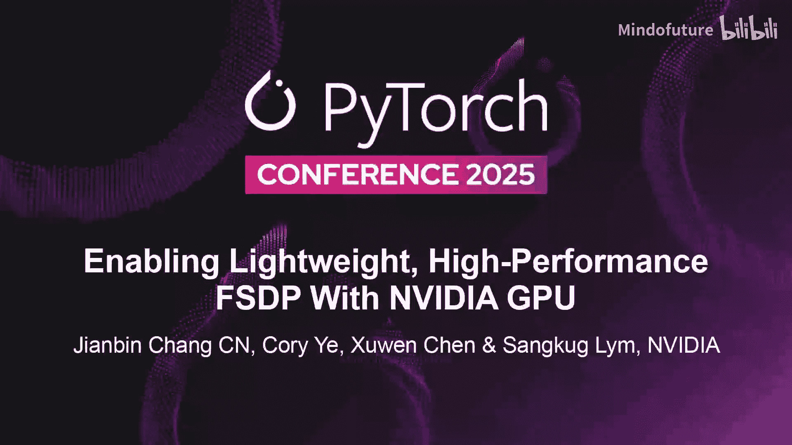
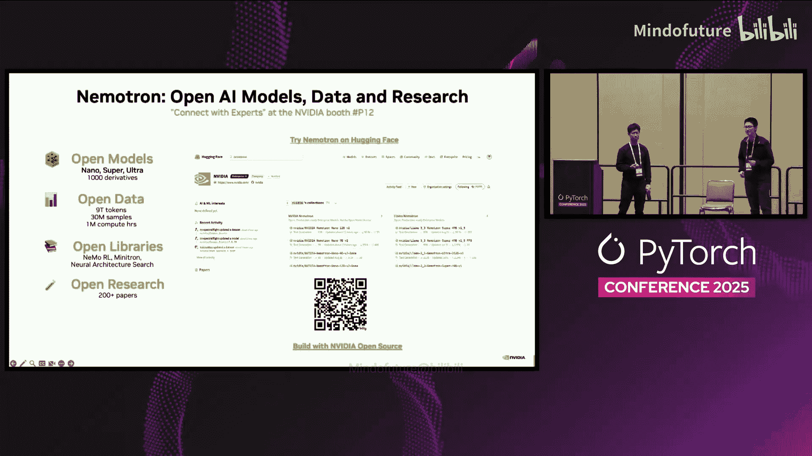

# 034：基于NVIDIA GPU实现轻量高性能FSDP



## 概述
在本节课中，我们将学习Megatron FSDP，这是一种针对大规模语言模型训练优化的完全分片数据并行技术。我们将回顾FSDP的基本原理，深入探讨Megatron FSDP为提升性能所做的多项关键优化，并了解其API的使用方法。

## FSDP回顾
上一节我们概述了课程内容，本节中我们来看看FSDP的基本概念。FSDP的核心思想是将模型状态（包括参数、梯度和优化器状态）分片存储在不同的GPU上。与基线数据并行训练在所有GPU上复制所有模型状态不同，FSDP在每个GPU上只保留一份唯一的副本，从而显著降低了单GPU的内存使用量。这对于训练像Llama 3 450B这样的超大规模模型至关重要。

其工作流程如下：
*   训练开始时，进行模型状态分片。
*   在前向和后向计算前，需要将分片的参数进行“全收集”。
*   在后向计算后，计算出的梯度需要被“规约-分散”以保持低内存使用。
*   性能关键点在于，所有这些通信操作都应与计算重叠进行，通常通过使用不同的CUDA流来实现。

FSDP相比复杂的3D并行（张量并行、流水线并行等）更简单，兼容性更好，无需担心不同Transformer层或嵌入层之间的负载平衡问题。但核心问题是：它的性能足够好吗？

## Megatron FSDP概览
上一节我们回顾了FSDP的基础，本节中我们来看看Megatron FSDP的优化概览。我们的目标是将性能提升至最佳。例如，在64张NVIDIA GB200 GPU上训练Llama 3 450B模型时，基于TorchTitan和`torch.compile`的基线FSDP性能约为1340 TFLOPs/GPU，比使用3D并行的NeMo框架慢约20%。经过优化后，Megatron FSDP达到了2020 TFLOPs/GPU。

Megatron FSDP的所有优化可归纳为三类：
1.  提升集合通信性能。
2.  实现更轻量级的通信与计算重叠管理。
3.  提高内存使用效率。

本教程主要基于Llama 3家族模型（特别是450B参数版本）在NVIDIA B200和GB200 GPU上的评估结果，并使用FP8精度以提升效率。

## 优化技术详解

### 分片结构优化
首先，我们比较FSDP2与Megatron FSDP的分片结构。两者都以模块（如Transformer层）为粒度进行通信以提高带宽利用率，但分片方式不同。

FSDP2采用**均匀的逐参数分片**。例如，三个参数被均匀地分片到两个GPU上。
```python
# FSDP2 风格分片 (概念示意)
parameter1_shard = [p1_part1, p1_part2]  # 在GPU0和GPU1上
parameter2_shard = [p2_part1, p2_part2]  # 在GPU0和GPU1上
parameter3_shard = [p3_part1, p3_part2]  # 在GPU0和GPU1上
```

Megatron FSDP采用**模块内非均匀扁平化分片**。我们将一个模块内的所有参数扁平化成一个连续的内存块，然后进行分片。
```python
# Megatron FSDP 风格分片 (概念示意)
flattened_parameters = flatten([param1, param2, param3])
shard_of_module = split(flattened_parameters, num_gpus)  # 非均匀分片
```
我们选择后一种方式是因为它更高效。如果通信缓冲区的布局与计算中使用的布局不一致，则需要在计算和通信缓冲区之间进行额外的数据拷贝和重排，这会带来约10%的开销。我们的方法消除了这一开销。

### 持久化通信缓冲区
接下来，我们分析通信中重复创建缓冲区的问题。在FSDP例程中，每次调用集合通信操作（如全收集、规约-分散）时，都需要临时的缓冲区来存放数据。基线实现使用`torch.empty()`和缓存分配器。当剩余内存充裕时，这不是问题；但当内存紧张时，系统需要释放一些小张量来创建大缓冲区，这会引入开销。

我们的解决方案是在训练开始时，预先分配**持久化的缓冲区**并重复使用。我们使用两个缓冲区，在通信调用中交替复用它们，从而完全消除了训练中因此产生的开销。对于Llama 3 70B模型，这带来了约1.5%的速度提升。在内存更紧张的情况下，性能提升会更显著。

### 集合通信性能优化
基线NCCL通信操作（如全收集、规约-分散）存在几个问题：
1.  它们会占用8到32个流多处理器，导致与它们重叠的计算内核变慢。
2.  存在在设备内存和用户内存之间拷贝数据的额外延迟。
3.  基线内核使用较慢的环算法，在网络延迟成为瓶颈时（小消息或大规模训练）性能受限。

我们采用了**NCCL用户缓冲区注册**。利用NCCL的能力注册用户定义的CUDA内存，避免了任何额外的数据拷贝，使操作自包含。这实现了零拷贝，并允许利用NVLink和InfiniBand的更多特性，如多播（仅需1对4次发送，而非8对32次）和Sharp操作（将规约操作卸载到网络交换机）。

性能提升如图所示。在64张B200（NVLink域为8）和64张GB200（72张GPU通过NVLink全连接）上，我们分别获得了5%和8%的速度提升。

### 消除梯度拷贝
如前所述，FSDP2由于布局不同需要额外的数据重排和拷贝。Megatron FSDP虽然不需要重排，但基线实现仍进行了梯度拷贝。

在后向传播中，对于FSDP模块的每个参数，计算梯度后，输出梯度被暂存，然后被重排并拷贝到规约缓冲区。我们通过**直接将规约缓冲区的指针提供给计算内核**，移除了这一拷贝步骤，使得计算结果可直接写入规约缓冲区。这带来了额外的2%性能收益。在Megatron FSDP中，我们在训练期间不进行任何额外的内存管理。

### 激活卸载至CPU内存
FSDP的理想模型是将所有通信隐藏在计算之下，但这并非总能实现。如果计算量不足（与激活大小、序列长度、微批次大小有关），通信就会暴露出来。为了隐藏通信，通常需要增加每GPU的微批次大小或减少张量并行规模，但这需要更多GPU内存。

我们探索了将**激活存储卸载到主机（CPU）内存**，并在需要时预取回GPU。这不是一个新想法，但由于过去CPU和GPU之间通过PCIe连接速度较慢，并不流行。如今，借助支持高达900 GB/s双向带宽的Grace-NVLink GPU系统，这变得可行。

在训练Llama 3 450B时，我们能够将76%的激活卸载到CPU，并在计算时将其预取回GPU。所有这些上传和预取操作都可以隐藏在计算之下，对计算与通信的重叠没有影响，从而避免了不必要的重计算，带来了约25%的额外速度提升。

### 混合FSDP内存效率优化
混合FSDP通过在部分GPU域内分片，以换取额外的内存使用来降低通信成本。基线FSDP在所有GPU上分片所有模型状态。混合FSDP在部分GPU域内分片，其余GPU域内复制。由于分片域更小，通信（如全收集、规约-分散）更快，尤其是在分片域被限制在快速的节点内网络时。

但问题在于需要权衡内存使用。我们优化了混合FSDP，对**优化器状态进行全GPU分片**。对于计算参数和梯度，我们进行混合分片；但对于优化器状态，我们进行全分片。这可以将全分片应用于70%甚至更多的模型状态，从而在更大规模训练中实现更可扩展的内存节省，且没有性能损失。

其工作原理如下：在混合FSDP中，规约-分散首先在更小的分片域内进行，速度更快。规约后，消息尺寸变小，然后需要在剩余的复制域（实际上是全分片的剩余部分）进行第二次规约。由于两次规约不重叠网络资源，第二次规约可以与NVLink域内的参数全收集操作重叠。这样既加快了基线通信，又将额外通信完全隐藏，实现了加速和内存节省。

## 性能总结
本节课我们一起学习了Megatron FSDP的各项优化技术。通过应用所有这些技术，我们最终在Llama 3 450B训练上实现了2020 TFLOPs/GPU的性能。这比最佳的3D并行映射快了约70%，比我们的基线FSDP快了约50%。

## API详解
上一节我们深入探讨了性能优化，本节中我们来看看如何使用Megatron FSDP的API。

### 基本使用
Megatron LM训练框架已原生支持Megatron FSDP。同时，我们也提供了通用接口，用于在Megatron LM之外使用模型。您需要做的就是完全分片您的模型和优化器（可以一起或分开分片），Megatron FSDP将在后台调度模型状态。

API明确要求提供一些参数，如设备网格。特别重要的是如何设置FSDP和HSDP分片策略。

### 分片策略配置
以下是配置分片策略的关键参数：
*   `zero_optimization_stage`: 枚举值0-3，用于配置优化器状态、梯度或参数的分片策略，包括内部分片域和外部分片域。
*   `outer_sharding_domain`: 外部分片域可以是优化器状态的全分片域，也可以是经典HSDP中的复制域。
*   `unit_module_classes`: 此参数非常重要，用于配置您希望作为一个同步组进行分片和通信的模块类。我们称之为“单元模块”。

选择单元模块涉及许多细微的权衡。目标是最大化内存利用率，同时最小化NCCL调用次数。更大的通信组可以减少NCCL调用，但也会增加逐层分配内存时的内存占用。您必须考虑单元模块大小如何在内存和NCCL调用之间权衡，这进一步影响计算与集合通信的重叠，以及GPU上可以容纳的微批次大小。

### 性能开关与设备网格
在性能方面，我们提供了多种开关：
*   配置NCCL用户缓冲区。
*   选择是每个训练步都同步梯度规约或外部数据并行通信，还是仅在优化器步进行。
*   BF16和FP32混合精度选项。

**设备网格**：Megatron FSDP的设备网格完整描述了其分布式环境，包括数据并行、上下文并行和张量并行的内外分片维度。我们还通过辅助的专家数据并行设备网格支持专家并行，以支持MOE模型。我们选择设备网格是因为它提供了直观的用户界面来管理并行，并且是用户将其自定义分布式环境无缝集成到Megatron FSDP中的载体。通过设备网格提供的框架，我们同时支持Megatron和基于DTensor的并行。

### 检查点与安装
检查点支持：支持模型和优化器检查点。我们使用`torch.distributed.checkpoint`进行保存。您还可以将分布式检查点转换为未分片的`torch.save`格式，甚至进一步转换为Hugging Face `safetensors`格式以便分享。您可以在完全分片前加载`torch.save`检查点，或在完全分片后加载`torch.distributed.checkpoint`检查点，在管理预训练状态时具有很大的灵活性。

安装非常简单，只需通过pip安装`megatron-fsdp`。如果您已经在使用Megatron LM，则无需额外操作，因为FSDP已经是Megatron Core的一个子模块。

### 生态系统集成与开源
Megatron FSDP深度集成到PyTorch和NVIDIA生态系统中。我们支持BF16计算，以及Transformer Engine的缩放延迟缩放FP8。对MxFP8和FP8权重的支持将在2026年初进行测试和提供。

Megatron FSDP在Megatron LM、Megatron Bridge、NeMo AutoModel和BioNeMo配方中提供首日支持。它也与TorchTitan、Hugging Face生态系统、Lightning和原生PyTorch基本兼容。

我们鼓励开源贡献。如果您发现任何错误或想提供反馈，请在Megatron LM仓库中提交Issue或PR。请注意，Megatron FSDP仍处于Alpha和Beta阶段，可能会存在一些错误或使用上的摩擦。



## 总结
在本节课中，我们一起学习了Megatron FSDP如何通过优化分片结构、使用持久化缓冲区、提升NCCL通信性能、消除冗余拷贝、利用CPU内存卸载激活以及优化混合FSDP内存使用，显著提升了大规模语言模型训练的效率和性能。我们还了解了其API的使用方法、配置选项以及生态系统集成情况。这些优化使得Megatron FSDP成为一个高性能、内存高效的训练选择。