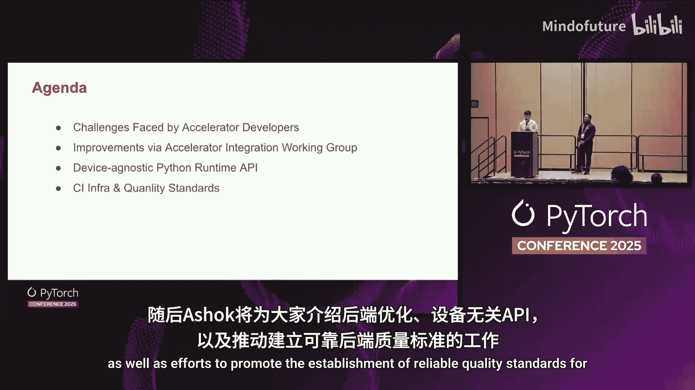
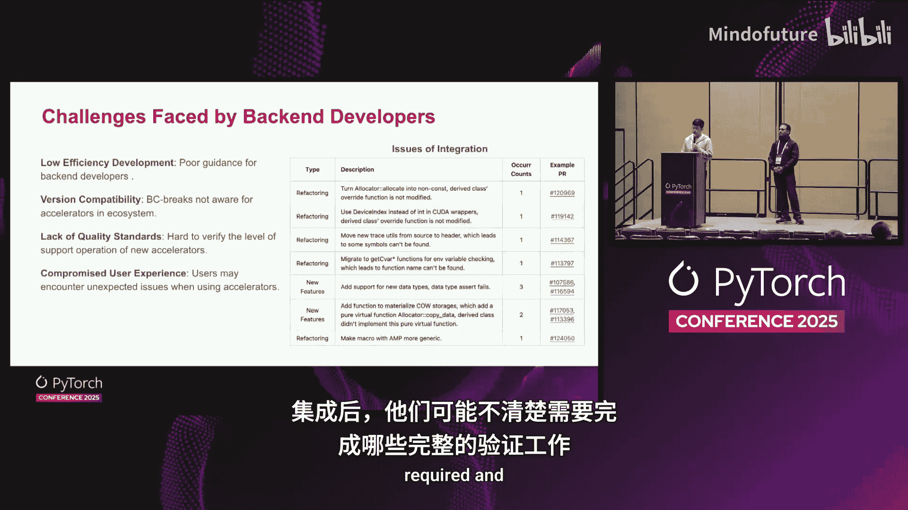
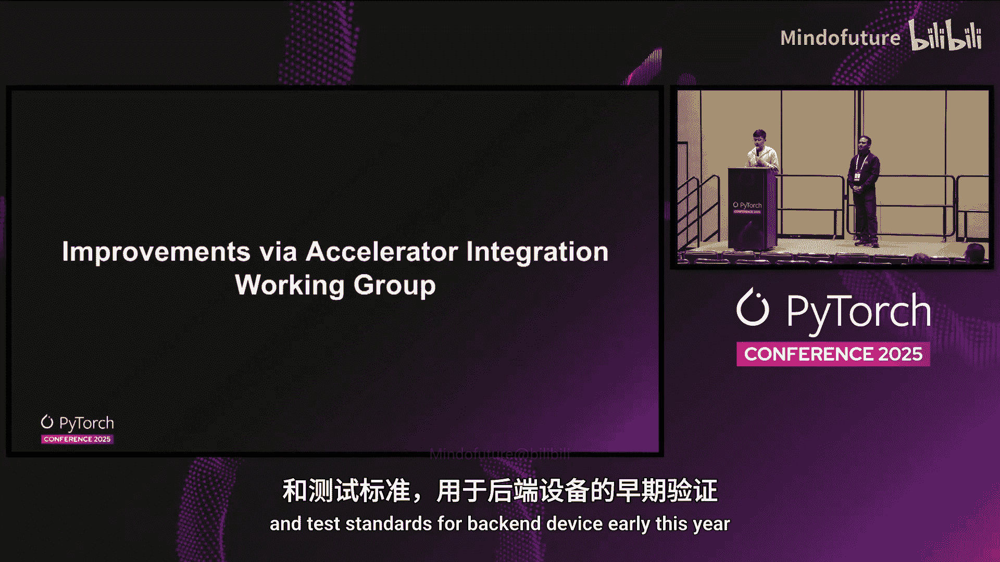
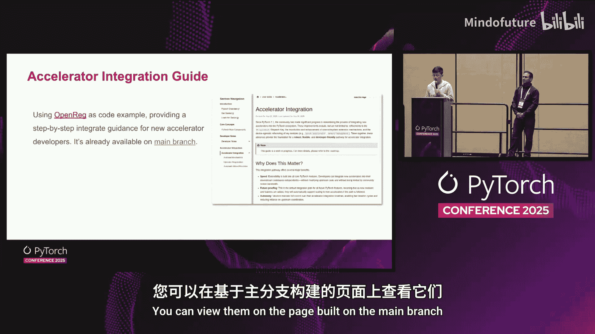
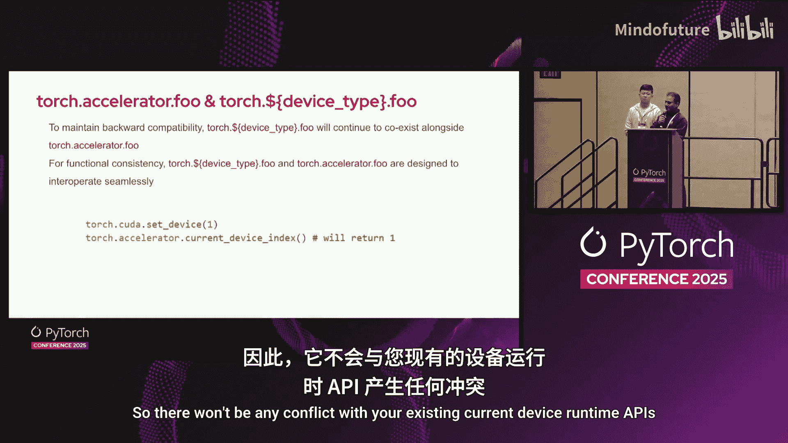
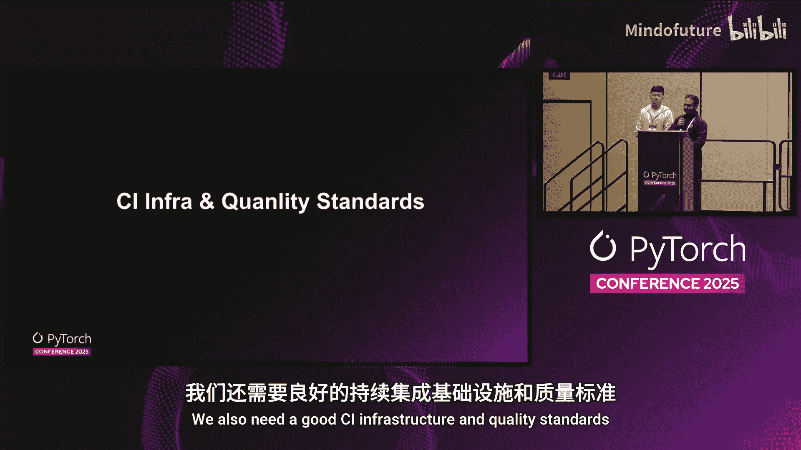
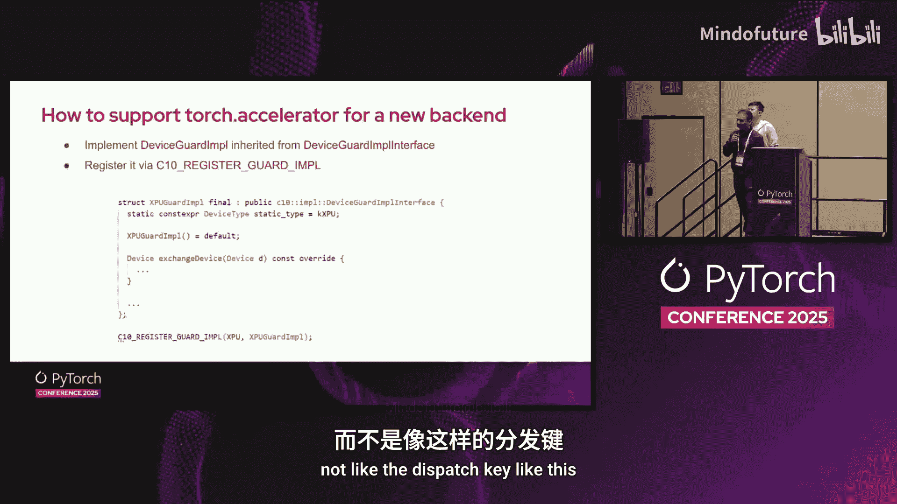

# 035：加速器集成与质量保证 🚀




在本节课中，我们将学习PyTorch生态系统中加速器（如NPU、GPU等硬件后端）集成所面临的挑战，以及社区为解决这些问题提出的标准化方案。我们将了解新的设备无关API、统一的集成测试框架以及旨在提升后端质量的标准。


## 问题与挑战 🤔

上一节我们介绍了课程概述，本节中我们来看看PyTorch在支持多样化硬件生态时遇到的具体问题。

AI框架（如PyTorch）早期通常将设备相关代码集成在主仓库中，以快速支持新硬件。PyTorch采用分发器机制，为每个后端分配唯一键。然而，可用键的总数有限，集成新后端需要修改多个模块的代码，这增加了核心逻辑的开发和测试工作量。因此，PyTorch现在使用 `PRIVATEUSE1` 作为基于插件式加速器的通用分发键。同时，像Vendor Runtime这样的项目也重构了其后端逻辑，推出了V架构，使更多设备能通过插件系统连接。这表明插件式访问已成为AI框架扩展硬件生态的实用方式。

但这也引入了一些挑战：
*   对于新后端开发者，缺乏明确的指引，不清楚应从何处着手。
*   上游社区对下游版本缺乏可见性，上游功能的开发或重构经常导致集成后出现不兼容的变更。
*   上游社区可能不清楚需要进行的完整验证范围，也不清楚其集成工作具体属于哪个规范级别。
*   对于用户，没有明确的指引来确保在一台设备上运行顺畅的代码在另一台设备上也能工作。



## 解决方案与社区努力 🛠️



上一节我们探讨了集成加速器时遇到的挑战，本节中我们来看看社区为解决这些问题提出的方案和努力。

为弥补上述差距，我们向社区提议为后端设备建立统一的集成与测试标准。今年一月，社区成立了一个探索小组负责此议题。六月，我们完成了针对Torch NPU和Intel Gaudi的CI测试基础设施改进，并成立了一个正式的工作组。目前，FlagAI和Gemma等项目也已加入以构建测试流程，TorchTitan等上层应用也集成了端到端测试。

目前，工作组的工作主要聚焦于两个方面：
1.  降低后端接入的复杂性，包括提供更多设备无关的API。
2.  通过CI确保加速器集成的质量，提供官方的分步集成指南，并在PyTorch系统中孵化加速器的质量标准。

## 集成机制与质量保证 ✅

上一节我们介绍了社区的整体努力方向，本节中我们来深入了解具体的集成机制和质量保证措施。

基于 `PRIVATEUSE1` 分发键的集成机制，我们已经为AMP、Autograd和分布式等多模态功能实现了全面的能力提升。现在，新加速器完成接入工作后，基本上可以获得与其他成熟后端类似的功能特性支持。然而，之后用户仍需在代码中显式导入后端加速器，例如 `import torch_npu`。但有些用户不希望这样做。因此，我们实现了一个自动加载功能：当用户导入 `torch` 时，系统会自动识别对应的后端。此功能已在PyTorch 2.5中发布。



在质量方面，我们将工作分为两部分：一部分是合并到社区核心仓库的单元测试，另一部分是在独立仓库中进行的端到端集成测试。我们开发了基于CPU后端的模拟器OpenRack，并实现了一些后端加速器单元测试的强制性约束，这些测试会随着PR检查一起运行。每当有PR提交时，测试会自动运行，以防止破坏性的接口变更。我们还使用OpenRack作为代码示例，为开发者提供全面的集成指导，标准化PyTorch后端接入方法和使用的API。部分章节已经发布，您可以在主分支构建的页面上查看。


## 设备无关API介绍 🔌

上一节我们讨论了如何保证集成质量，本节中我们来看看一个关键工具——新的设备无关API。

众所周知，PyTorch设备运行时API非常设备特定。如果您尝试编写支持多种硬件后端的代码，脚本很快就会充满针对CUDA或XPU的硬编码if-else块。这段代码难以维护，而且如果有新的加速器后端，您需要移植它，维护这些现有API非常棘手。

因此，从2.6版本开始，引入了一套新的通用加速器API。如下表所示，其目标是为一组常见的运行时操作提供单一的API集合。其理念是消除那些if-else块。例如，您不再调用 `torch.xpu.set_device()`，而可以简单地调用 `torch.accelerator.set_device()`。同样，`cuda.synchronize()` 可以替换为 `accelerator.synchronize()`。如您所见，函数名和参数与其旧的设备特定API相匹配，因此移植现有代码更容易，而且使用此加速器API后代码也更简洁。

这不仅仅是Python层面的补丁，在 `torch.accelerator` 命名空间下也有对应的C++ API。在底层，整个系统构建在 `DeviceGuardImpl` 接口之上，这为第三方设备提供了一个清晰的注册机制。这使得新的硬件供应商能够轻松、清晰地将其后端接入这个新的统一系统。

其核心设计理念基于三条简单规则：
1.  适用于所有设备（包括CPU）的设备无关API（如 `torch.empty`，它接受一个设备参数）将保留在 `torch` 命名空间中。
2.  仅适用于加速器的设备无关API将位于 `torch.accelerator` 命名空间下。这些API不接收设备类型参数，它们自动使用当前活动的加速器。
3.  所有设备特定的API当然会保留在它们自己的模块中。

以下是如何启用“自带加速器”的示例：
```python
# 实现 DeviceGuardImpl 接口
class MyDeviceGuardImpl(torch._C._DeviceGuardImplInterface):
    # ... 实现必要的方法 ...



# 注册您的后端
torch._C._register_device_guard_impl("my_device", MyDeviceGuardImpl())
```
一旦实现，您的加速器API就应该可用了。最后一点，这些加速器API是向后兼容的，因此不会与您现有的设备运行时API产生冲突。



## CI基础设施与质量标准 📊

上一节我们介绍了新的设备无关API，本节中我们来看看支持这些集成的持续集成基础设施和质量标准。

仅有集成是不够的，我们还需要良好的CI基础设施和质量标准。我们处理的核心问题是这些第三方设备，这意味着代码库不在PyTorch的GitHub上，而是在它们自己的GitHub仓库中。这导致几个问题：如果您进行更改，可能会引发版本冲突、测试不一致和令人沮丧的用户体验。

我们正在构建一个新的CI基础设施，提供适当的集成测试和端到端模型验证。这是我们新加速器质量标准的基础，可以避免版本冲突、测试不一致和糟糕的用户体验。

左侧是一个简单的GitHub Actions工作流示例：开发者在PyTorch GitHub上打开一个新的拉取请求。这将自动触发一个仓库分发事件，从而在插件或加速器仓库中启动一个独立的工作流。然后，这个CI系统会构建PyTorch和所有参与的第三方后端（如Torch NPU和Intel Gaudi）。它运行标准测试，包括编译、单元测试，以及最重要的端到端模型验证，以确保没有功能被破坏或性能保持一致。此设计最关键的部份是它不会阻塞主要的PyTorch CI，这对于第三方后端非常重要。

这个新的CI系统是我们新质量标准的技术基础。我们创建了一个新的计算平台质量标准提案，正在加速器工作组中进行跟踪。这使我们能够创建一个评分机制，对加速器支持的不同级别进行分类，让用户更清楚地了解可以从给定后端期望什么。

## 总结与展望 🎯

本节课中我们一起学习了PyTorch生态中加速器集成面临的挑战与社区解决方案。

我们回顾了从早期硬编码集成到现代插件式架构的演变，以及随之而来的开发者指引、版本管理和用户体验挑战。社区通过成立工作组，致力于降低接入复杂性（如引入设备无关API）和建立质量标准。新的 `torch.accelerator` API消除了设备特定的if-else块，使代码更简洁、更易移植。同时，新的CI测试基础设施和OpenRack参考后端为硬件供应商提供了明确的集成路径和验证标准。



展望未来，社区将继续完善质量标准、增强CI工作流，并完成全面的加速器集成指南。这是一项需要整个社区共同努力的工作。如果您是硬件供应商，或只是对让PyTorch在更多设备上运行感兴趣，请加入我们。参与的最佳地点是PyTorch Slack中的“accelerator-integration-wg”工作组频道。