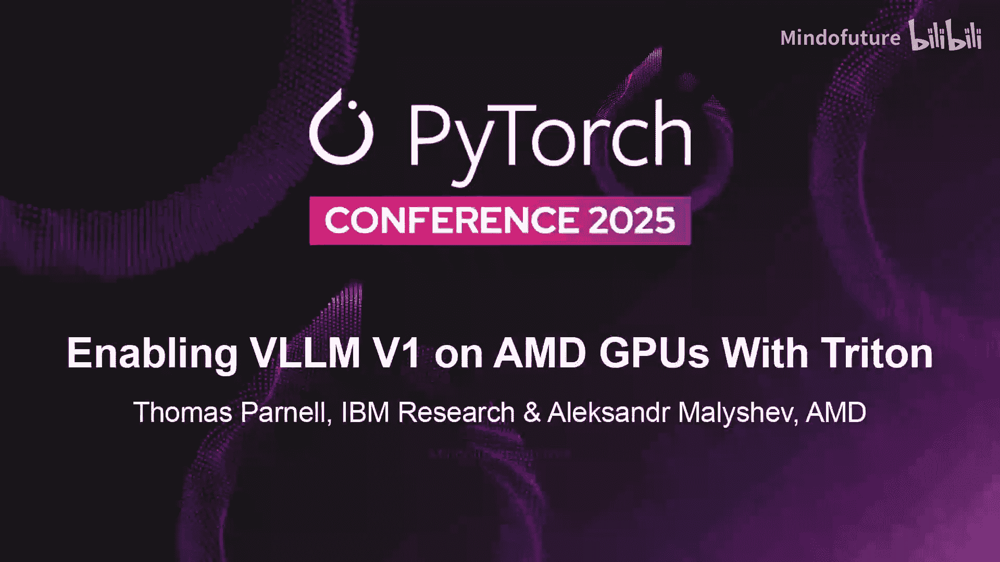
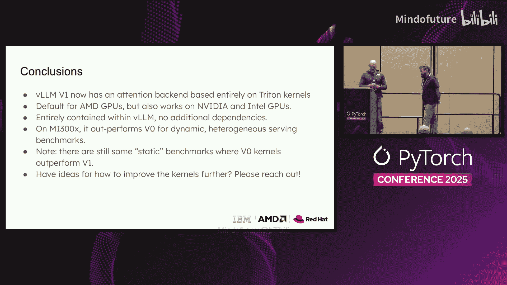

# 036：在 AMD GPU 上通过 Triton 启用 vLLM V1 🚀

在本教程中，我们将学习如何为 vLLM V1 构建一个适用于 AMD GPU 的注意力计算后端。我们将从理解 vLLM V1 的架构变化开始，探讨为何需要新的内核，并详细介绍我们如何使用 Triton 框架来开发高性能的注意力计算内核。

---

## 概述

vLLM V1 是 vLLM 项目的一次重大内部架构重构，旨在提升代码简洁性、可扩展性和性能。然而，其初始版本仅支持基于 CUDA 的 Flash Attention 后端，限制了其在 NVIDIA GPU 以外的平台（如 AMD GPU）上的使用。本教程将阐述我们如何利用 Triton 框架，为 vLLM V1 开发一个可在 AMD GPU 上运行的高性能注意力后端。

---

## 什么是 vLLM V1？🤔

vLLM V1 于 2024 年 1 月发布，是对 vLLM 内部架构的完全重新设计。对于用户而言，其外部接口保持不变，但内部实现发生了巨大变化。

V1 的设计目标主要有三个：
1.  使 vLLM 代码更加简洁。
2.  使 vLLM 更易于扩展和集成自定义功能。
3.  最重要的是，提升 vLLM 的性能。

在 V0 版本中，存在许多独立的优化，如分块预填充（Chunked Prefill）、推测解码（Speculative Decode）等，但这些优化往往无法协同工作。V1 的目标是让这些优化无缝协作并默认启用。自发布以来，V1 还增加了更多性能相关特性，例如零开销自动前缀缓存、与 Torch Compile 的集成等。

---

## 为何不能直接使用 V0 的内核？🔍

将 V0 的注意力内核直接用于 V1 存在几个关键障碍。

首先，V1 要求注意力内核必须支持所有新的优化特性，如分块预填充、前缀缓存和推测解码。

其次，更重要的是，V1 改变了请求批处理的方式。在 V0 中，批次被严格区分为预填充批次和解码批次。而在 V1 中，一个批次可以包含处于不同状态（预填充、解码等）的异构请求，并且批次内的请求顺序没有强制规定。

---

## 为何选择 Triton？⚙️

当 V1 在 1 月份首次发布 Alpha 版本时，唯一能完全支持上述所有用例的注意力后端是基于 CUDA 的 Flash Attention，这意味着 V1 最初仅支持 NVIDIA GPU。

为了在 AMD GPU 上启用 V1，IBM、AMD 和 Red Hat 的团队决定尝试使用 Triton 框架为 V1 构建一个注意力后端。选择 Triton 的原因如下：
*   **开发效率高**：可以快速编写、原型化和测试内核。
*   **灵活性强**：易于针对新模型进行适配。
*   **可移植性好**：Triton 内核可以在不同硬件平台上运行。

---

## 核心概念与术语 📖

在深入内核细节之前，我们需要理解三个关键概念：上下文长度、查询长度和序列长度。

*   **上下文长度**：指已计算并存储在 KV 缓存中的旧令牌数量。
*   **查询长度**：指当前前向传播中需要计算 KV 值并关注旧令牌的新令牌数量。
*   **序列长度**：是上下文长度与查询长度之和，即 `序列长度 = 上下文长度 + 查询长度`。

理解这些概念有助于我们分析不同的计算场景：
*   **标准预填充**：上下文长度为 0，查询长度很大。
*   **分块预填充/前缀缓存**：上下文长度非零，查询长度也较大（如 1k, 2k）。
*   **解码**：查询长度为 1，上下文长度很大。
*   **推测解码**：类似于解码，但查询长度大于 1（如 3 或 4）。

---

## 性能基线：从 Prefix-Prefill 内核开始 📈

为了尽快在 AMD GPU 上运行 vLLM V1，我们从一个名为 **Prefix-Prefill** 的现有 Triton 内核（源自 LightLLM 项目）开始。这个内核支持上述所有计算场景，是一个很好的起点。

然而，我们发现其性能非常不理想，比 V0 慢了约 6 倍，这违背了 V1 提升性能的初衷。因此，我们必须对其进行优化。

---

## 问题诊断与优化策略 🛠️

上一节我们介绍了性能基线，本节中我们来看看导致性能不佳的根本原因。

Prefix-Prefill 内核使用一个三维网格启动：`[batch_size, num_query_heads, query_length / block_M]`。每个程序独立工作，在序列长度维度上以分块方式执行在线 Softmax 算法。

问题在于其固定的分块大小：`block_M = 128`（查询长度维度），`block_N = 64`（序列长度维度）。对于解码请求（查询长度=1），每个程序实际做了 128 倍的多余工作。如果简单地将 `block_M` 调小以优化解码，又会严重损害预填充请求的性能。

---

## 解决方案：内核分离与专用解码内核 🎯

针对异构批次中解码和预填充请求对计算资源需求不同的问题，我们采用了“内核分离”的策略。

我们让 Prefix-Prefill 内核处理查询长度大于 1 的请求（如预填充、分块预填充）。对于查询长度等于 1 的解码请求，我们则启动一个全新的、专门优化的**解码内核**。

以下是解码内核的关键优化点：

1.  **启动网格优化**：由于查询长度固定为 1，我们将启动网格从 3D 简化为 2D：`[batch_size, num_kv_heads]`。每个程序负责处理一个 KV 头及其关联的所有查询头。
2.  **分块大小调整**：在上下文长度维度，分块大小设置为 16，与 vLLM 默认的注意力块大小对齐。
3.  **支持分组查询注意力**：对于使用 GQA 的模型，我们调整了网格，使每个程序处理一个 KV 头对应的所有查询头数据。这减少了数据移动，并允许我们将查询头维度的分块大小填充到 16，从而触发 Triton 使用 GPU 的矩阵核心，带来显著的性能提升。

通过这些优化，解码内核相比基线 Prefix-Prefill 内核实现了 **4.7 倍** 的加速。

---

## AMD 侧的并行优化工作 ⚡

在 IBM 团队优化内核算法的同时，AMD 团队也从底层硬件和编译角度对原始的 Prefix-Prefill 内核进行了深度调优。

以下是他们采取的关键步骤：

1.  **减少 Wave 数量**：将每个计算单元的 Wave 数量从 8 减少到 4，使每个 Wave 能使用全部 512 个向量寄存器，显著降低了寄存器溢出，带来了 2-3 倍的初始性能提升。
2.  **优化内存占用**：减少 Wave 数量后，通过重构内核以减少每个实例所需的内存，提高了 Wave 占用率。
3.  **实现向量化内存访问**：通过确保内存访问模式清晰、使用编译时常量，引导 Triton 编译器生成向量化加载指令，极大提升了内存访问效率。
4.  **循环展开与计算简化**：重构内核以对齐 vLLM 的 KV 缓存块结构，使得循环可以展开。同时，简化了在线 Softmax 算法中的部分计算，减少了寄存器压力和计算量。
5.  **移除边界检查**：在循环的热路径中移除非必要的边界条件检查，进一步提升性能。

此外，AMD 团队还将 V0 中高度优化的、基于 Flash-Decode 注意力算法的解码内核移植到了 V1 的代码库中，用于处理批次中的纯解码序列，这进一步提升了整体性能。

---

## 迈向统一内核与性能对比 📊

尽管专用内核策略取得了成功，但维护多个内核（如用于解码的 HIP 内核和用于预填充的 Triton 内核）增加了复杂性和移植难度。

因此，IBM 和 AMD 正在合作开发**统一的注意力内核**。目前已有 2D 和 3D 两个版本：
*   **2D 内核**：主要用于预填充密集型场景。
*   **3D 内核**：主要用于解码密集型场景。
它们根据不同的使用场景集成了相应的优化，例如共享内存缓存优化主要应用于预填充内核。

最后，我们对比了 V1（使用我们优化的 Triton 后端）与 V0 在 AMD MI300X GPU 上的性能。在 Llama2 70B 模型中，V1 实现了约 **10%** 的性能提升，体现在：
*   更快的首令牌生成时间。
*   更快的令牌间生成时间。
*   更高的整体吞吐量。

更重要的是，V1 使 vLLM 能够充分利用 PyTorch 生态系统的优势，如 Torch Compile、CUDA Graph 支持等，这些都将带来持续的性能收益和功能增强。

---

## 总结

在本教程中，我们一起学习了如何为 vLLM V1 在 AMD GPU 上构建高性能的 Triton 注意力后端。我们从理解 V1 的架构变化和挑战开始，逐步探讨了：
1.  性能基线诊断与问题分析。
2.  通过内核分离策略优化解码性能。
3.  AMD 团队在编译器与硬件层面的深度优化。
4.  开发统一内核的努力方向。
5.  最终实现的性能提升与未来潜力。

这项工作展示了使用像 Triton 这样的高级编程模型，结合深入的硬件知识，可以有效解决跨平台 AI 推理的挑战，并为更广泛的生态系统兼容性铺平了道路。