# 037：PyTorch生态中的模型定义标准化

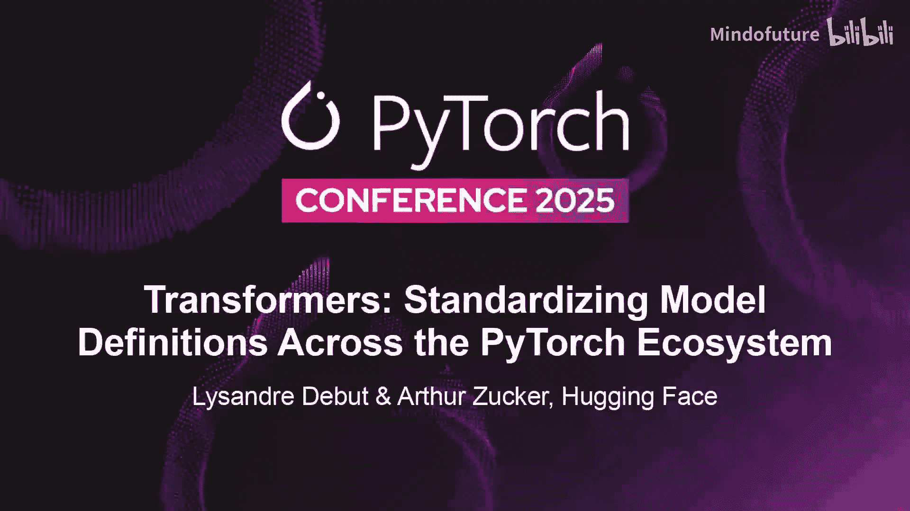

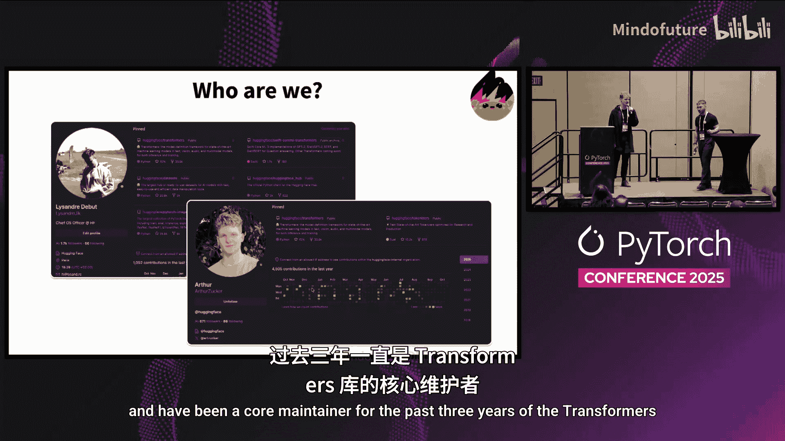

在本教程中，我们将学习Transformers库的发展历程、核心设计原则，并重点了解其即将发布的V5版本的主要目标与变革。我们将探讨该库如何致力于在机器学习生态系统中建立模型定义的标准。

## Transformers库的现状

首先，我们来看看Transformers库目前的发展状况。了解其历史版本和当前规模有助于我们理解V5版本的必要性。

回顾过去几年，从V1到V4的迭代发生得非常迅速，大约在一年内完成。每个主要版本都由当时的具体事件推动。

*   **V1**：库开始引入更多模型，此前仅支持BERT，因此库名从`pytorch-pretrained-bert`改为`pytorch-transformers`。
*   **V2**：引入了TensorFlow和JAX支持，库名从`pytorch-transformers`变为`transformers`。
*   **V3**：引入了新的API，这些API相比之前版本需要一些破坏性更改，因此促成了主版本更新。
*   **V4**：引入了基于Rust的tokenizer，并将其设为默认选项。

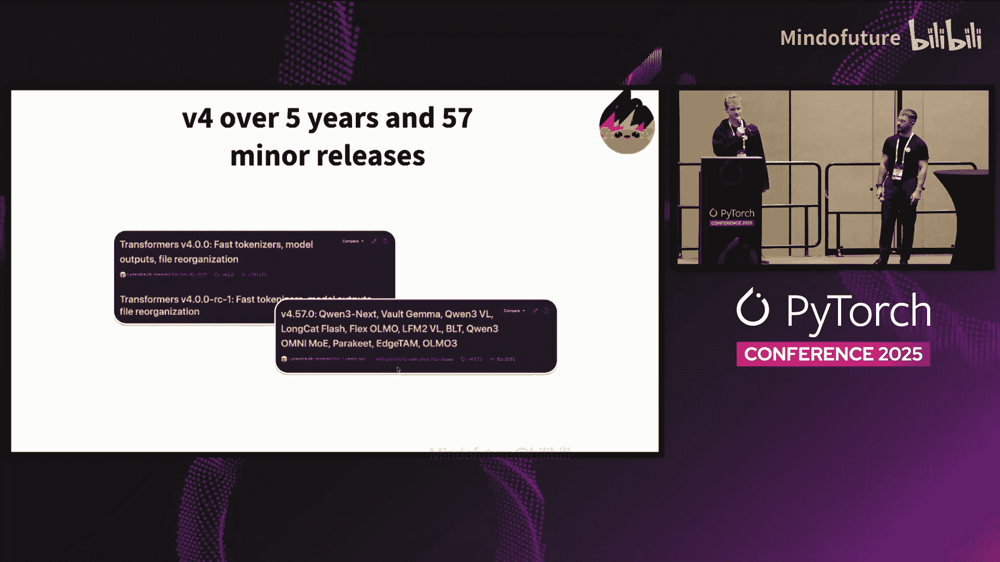

目前，Transformers库支持的模型架构数量已从大约20个增长到357个左右，当前版本为4.57。

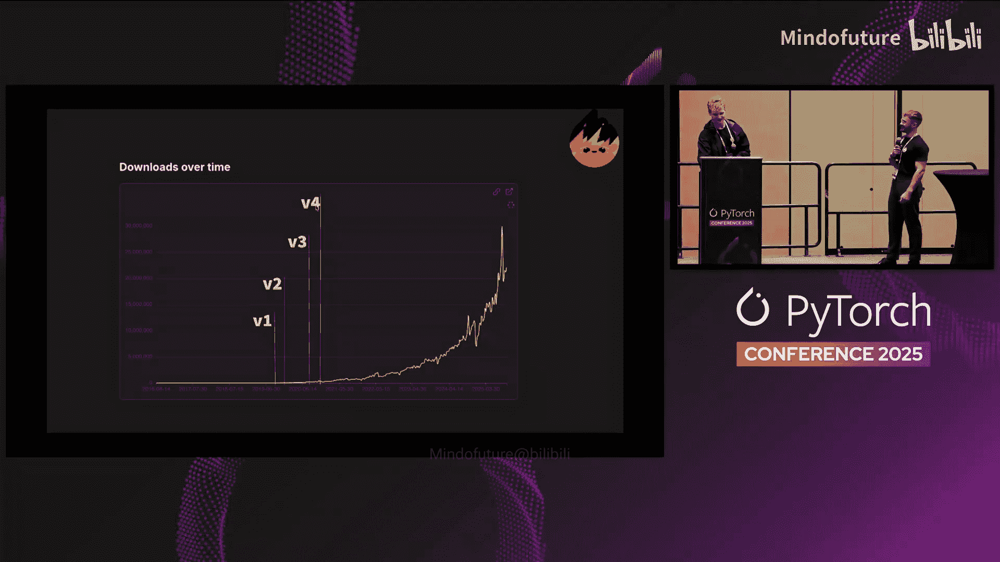

从下载量来看，最初四个版本密集发布在一年内，之后库的使用量才开始显著增长。虽然`pip`安装量不是衡量使用情况最精确的指标，但它仍能反映生态系统的采用程度。

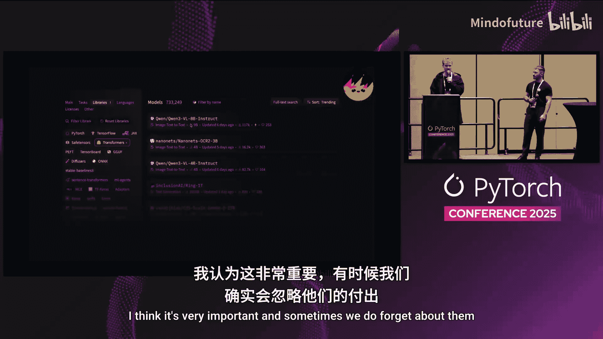

Transformers库拥有一个庞大的生态系统，目前Hugging Face Hub上约有70万个与其兼容的模型。这离不开众多模型提供者和社区成员的贡献。

## Transformers库的设计支柱

上一节我们回顾了现状，本节我们将深入探讨Transformers库成功背后的设计支柱。理解这些原则是理解V5版本方向的关键。

最初，Transformers库仅包含BERT、GPT-2、XLM等早期模型。我们意识到，新的架构会出现在不同的代码仓库中，拥有各自的API和环境。用户若想切换模型，过程非常不便。

因此，我们确立了第一个支柱：**建模工具包**。其目标是在所有模型架构之上提供一个统一的API，使用户能够轻松在不同模型间切换，并快速将新架构整合到库中。

随着模型数量增加，维护者面临一个选择：是采用抽象的编写方式（如继承），还是允许代码重复。Transformers是一个有主见的库，我们选择了**单一模型对应单一文件**的策略。

这样做的原因如下：
*   确保研究人员能够直接复制粘贴全部代码并使用，无需理解库中的抽象概念。
*   确保人们能够轻松为库做贡献。添加新模型只需创建一个新文件夹并放入代码，然后等待审核即可。
*   确保代码本身易于研究人员阅读和理解。

这引出了Transformers库的一个核心原则：**代码即产品**。代码需要易于理解、简单且可读。

在2019-2020年，发布的模型参数量大约在1亿到4亿之间。虽然现在看来很小，但当时训练或微调这样的模型仍有一定难度，预训练更是大型实验室的专属。

考虑到基础模型被发布，但并非所有微调版本都会提供，我们决定提供一些训练原语来支持在Transformers之上进行模型训练。这催生了`Trainer` API和`accelerate`库。

如今，基于这些工具（例如`Trainer` API）之上，诞生了像URLL和Axolotl这样优秀的工具包。这构成了我们的第三个支柱：**训练原语**，提供在我们模型之上进行微调的能力。

最后，随着合并的模型越来越多（目前约有350-360种不同架构），我们看到了对模型无关工具的需求。

这方面的最佳例子可能是`from_pretrained`和`save_pretrained`方法，它们允许将模型序列化到磁盘。此外，还有不同层级的API，例如针对特定模态所有模型的`pipeline` API，或最近的`transformers-serve`服务选项。

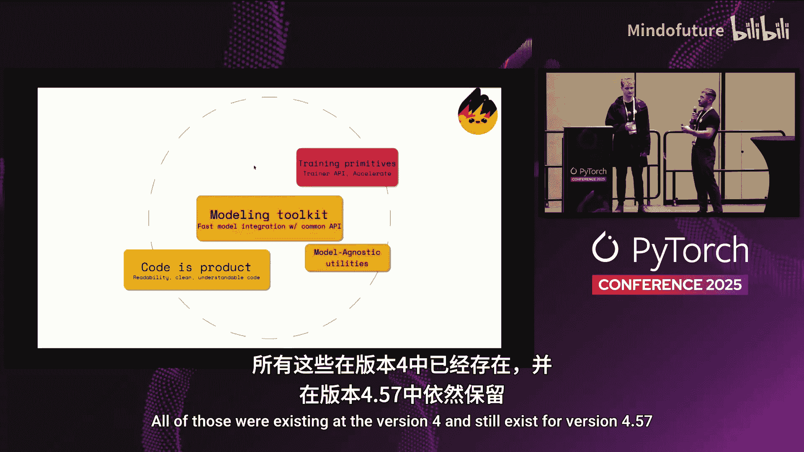

即使在更底层，我们也有`attention`接口来连接所有解码器模型，以实现不同注意力机制的切换，或者用于在不同模型间管理键值对或缓存机制的`cache`机制。

这形成了第四个支柱：**模型无关的工具**。这四个支柱共同为V4版本奠定了基础，并且在当前的4.57版本中依然存在。

## 迈向Transformers V5

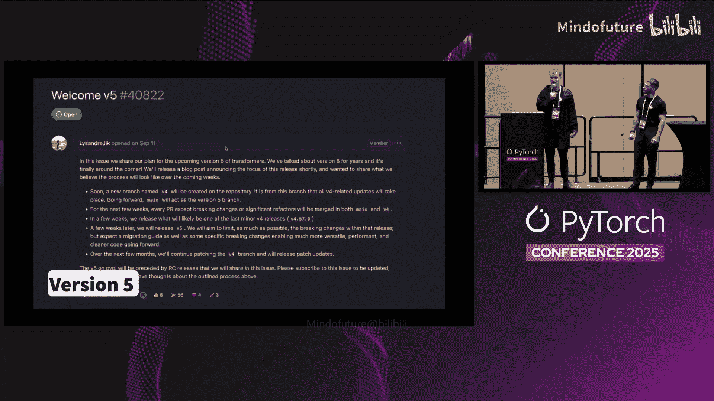

前面我们介绍了V4的稳定设计，本节我们将聚焦于未来的变革。由于AI生态系统飞速发展，社区对我们提出了许多新要求，这些要求无法在不进行破坏性更新的情况下实现，因此我们决定迈向V5。

我们宣布正在向Transformers V5迈进。这对我们来说是一个重要的里程碑，因为V4已经稳定了四年多。虽然进行一些更改存在风险，但AI生态系统的快速发展让我们别无选择。

V5的首要焦点是**简化**。我们一直希望建模文件易于理解，便于用户检查其设计。但我们在其他组件上遇到了一些问题。

例如，我们过去为每个模型单独维护PyTorch、TensorFlow和JAX的实现。这在原则上是个好主意，但使得维护和贡献变得非常困难。从V4.45开始，我们已开始弃用TensorFlow和JAX模型，并在V5中将其完全从工具包中移除。

同样，在分词器方面，历史上我们有“慢速”和“快速”两个版本。我们正逐步摆脱这种定义，转向使用`tokenizers`库作为基础分词器后端，就像使用PyTorch作为基础模型一样。默认使用Rust后端，但任何用户只要遵守我们为分词器制定的API契约，都可以注册自定义后端。

仅使用基于PyTorch的模型还有一个优势，即我们可以更深入地依赖PyTorch本身。最好的例子是处理器（`processors`）。以前，为了兼容JAX、TensorFlow和PyTorch，它们基本基于NumPy。现在，由于只使用PyTorch，我们可以改用`torchvision`，这在当前用例中速度要快得多。

以上只是我们为推动简化而提出的几个示例，还有更多改进。这强化了“代码即产品”的支柱，使简化成为V5的重点。

考虑到我之前提到的添加新模型和代码重复问题，去年我在PyTorch大会上做了一个关于Transformers模块化的演讲。这确实是我们已经实现并集成到库中的重大更新。

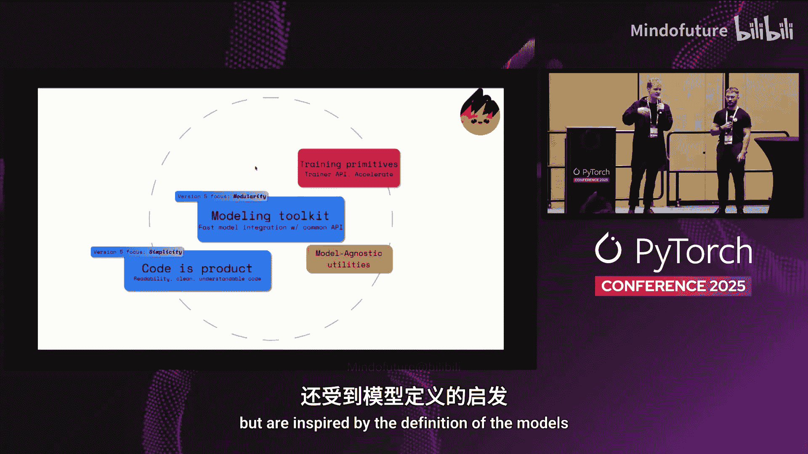

我们大幅减少了理解和贡献新模型所需的代码行数。从图表可以看出，自采用模块化方法后，代码行数显著下降。

这是“建模工具包”理念的一部分，我们希望确保贡献模型的人，以及基于Transformers作为建模工具包进行开发的人，都能更容易地找出新模型（例如Qwen）与Llama之间的差异。只需浏览新的建模文件，就能快速发现不同之处，例如是否存在查询层归一化等。这对我们非常重要，因为我们知道很多人不仅使用Python代码，还从模型定义中获取灵感。

一个我们此前从未重点关注的新主题是**性能导向**。我们致力于提供不仅易于使用和理解，还能为更好性能铺平道路的模型定义。

为此，我们最近引入了`kernels`库。它允许在Transformers工具包内直接使用针对特定硬件和软件版本预编译的内核。

这些内核被预编译并上传到Hugging Face Hub，可以按右侧快速入门所示直接使用。这使得在特定硬件（如AMD GPU、NVIDIA GPU、Intel XPU）上使用预编译内核能获得比单纯使用PyTorch eager模式更好的性能。

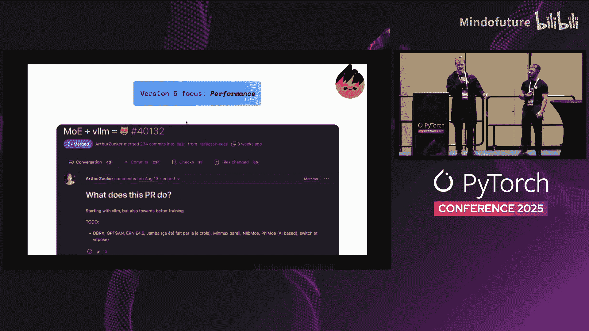

对于在安装`flash-attention2`时遇到问题的人（Twitter上有很多相关梗图），这解决了问题，因为它直接下载准备好的内容。如果你没有安装`flash-attention`但想在Transformers中使用它，我们会默认启用此功能。

对于那些关注混合专家模型（MoE）的人，社区对我们之前的实现提出了很多批评。我们别无选择，必须按照社区的要求进行改进。

我们已经重构了Transformers中所有MoE的实现，以确保它们能完全支持这些高效内核。

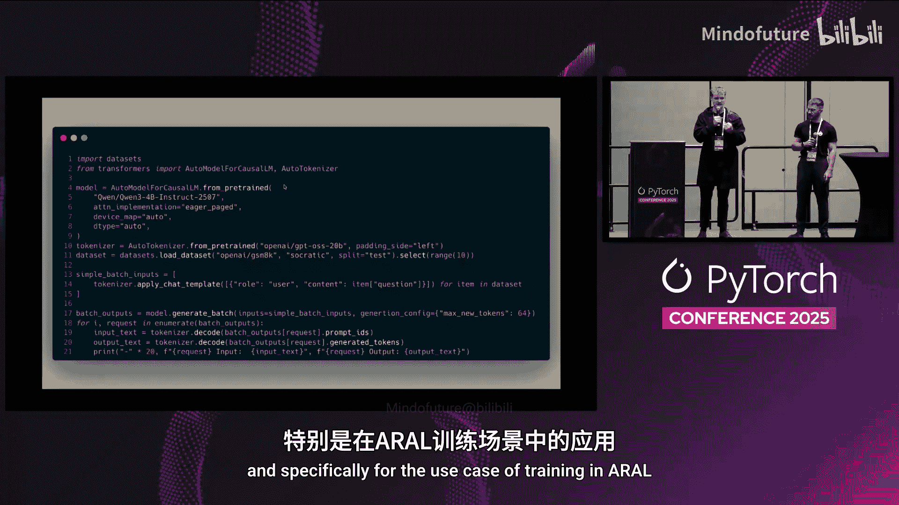

最后，我们还与vLLM团队合作，确保MoE和Transformers模型可以通过Transformers后端使用，并且也能在vLLM中使用。

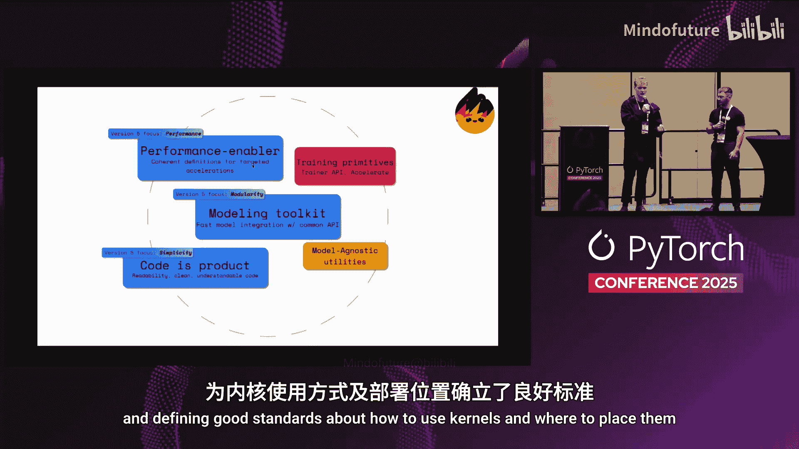

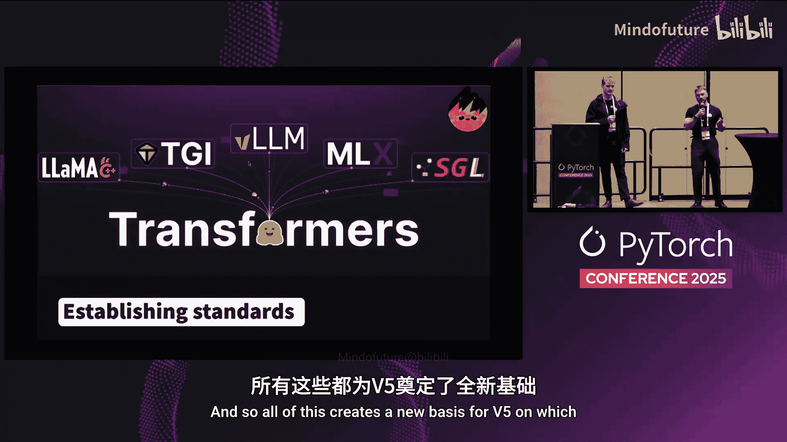

最后，很多人听说过在使用TRL等技术进行训练时遇到的问题，尤其是在强化学习和DPO技术中。你既要训练模型，又要进行大量生成，而大部分计算时间都花在了生成阶段。

已有许多技术试图解决这个问题，例如使用两个模型：一个用于训练，一个用于推理，并将权重更新发送给进行推理的模型。我们知道这是个问题，并且在某种程度上我们曾是问题的一部分。

因此，我们决定实现高效的**连续批处理**。这个想法是为了跟上行业标准。这对某些人来说可能并不新鲜，但对Transformers来说是新的，现在已在Transformers中可用，特别是在URLL的训练用例中。

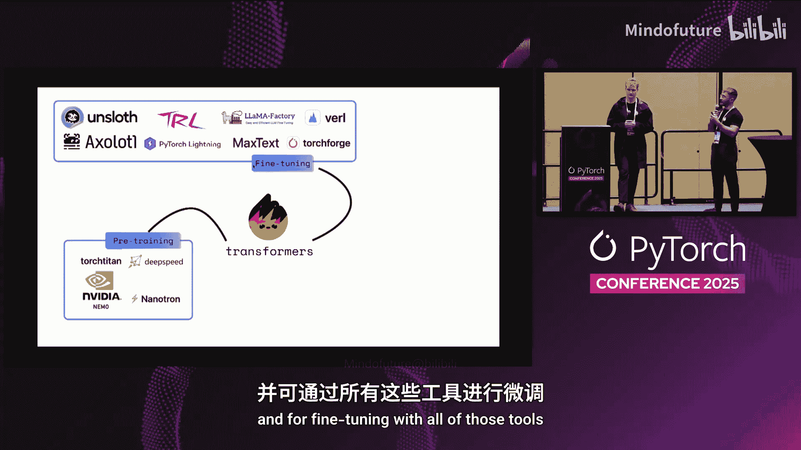

这催生了Transformers的一个新支柱，对我们和社区都非常重要：**性能赋能器**，并定义了关于如何使用内核以及将其置于何处的良好标准。

所有这些为V5奠定了新的基础。我们旨在以此为基础，建立新的标准或强化现有标准，以便生态系统中的其他部分能够依赖我们的模型定义。

## Transformers：模型定义框架

上一节我们探讨了V5的新基础，本节我们将看到这些努力如何汇聚成一个清晰的定位：Transformers作为先进的机器学习模型的**模型定义框架**。

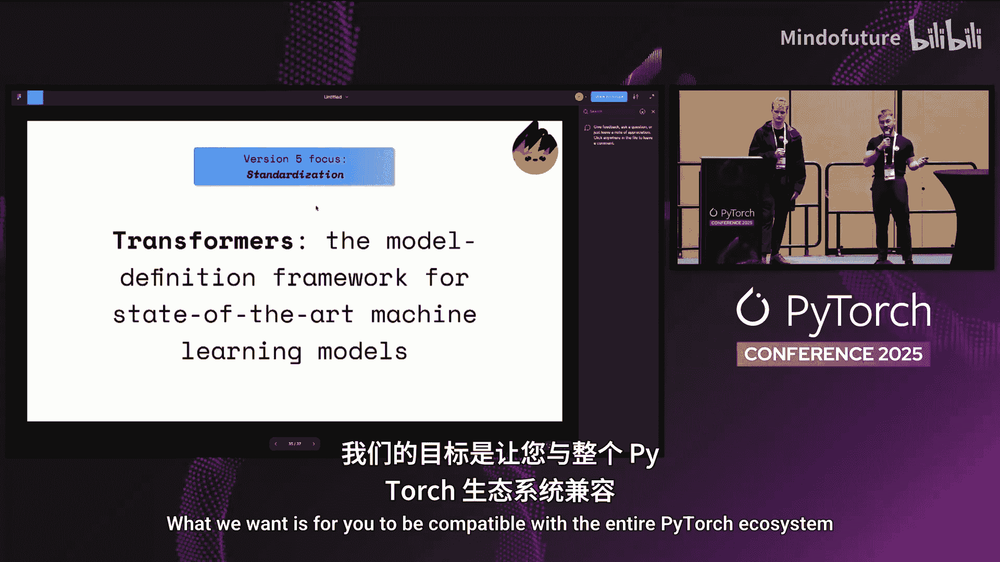

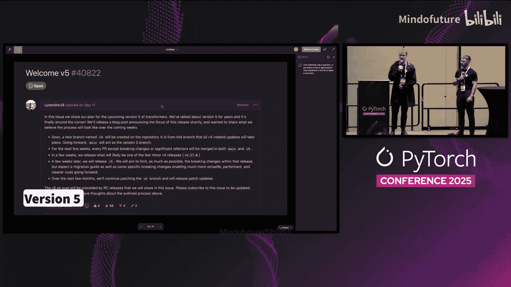

这是我们当前在GitHub上的标语：Transformers——先进机器学习模型的模型定义框架。

我们过去一年一直在发展的理念是：你从用Transformers定义的一个模型开始。

如果你想进行大规模预训练，可以取出用Transformers定义的建模代码，并将其带入你喜欢的预训练框架，例如流行的PyTorch Titan、DeepSpeed、NVIDIA的NeMo或Nattron。我们已与这些团队合作，确保用Transformers定义的模型与他们的API兼容，以便你能进行大规模训练。

只要你遵守“与Transformers兼容”的契约，那么你的模型将直接兼容所有微调库以及PyTorch生态系统，例如Axolotl、TRL、factory或最近发布的TorchForge。你刚刚预训练好的、以Transformers实现序列化到磁盘的模型，可以直接用于所有这些工具进行微调。

微调模型后，你对其效果感到满意，拥有良好的评估指标，它可能达到了先进水平。此时，你可能希望将其投入推理。

你可以选择最喜欢的推理提供商。例如，我们与vLLM团队进行了大量合作，也与SGLang合作，以确保同一个模型同样可用，并能投入生产。

我们相信，这解决了一个问题：即训练、预训练、微调和推理之间总是存在差异。现在，你只需一个契约、一个Transformers模型，就能以极大的简便性从训练走向生产。

最后，如果你不希望大规模部署，而是想在本地部署，也有许多替代方案可用。

其中之一当然是ExecuTorch。我们与该团队紧密合作，确保通过ExecuTorch对我们的模型有良好的支持。祝贺他们昨天发布了1.0版本。

但如果你希望在不同的优化环境中部署，如llama.cpp、MLX，甚至Candle和Rust，我们也与这些工具的维护者进行了大量合作，确保如果模型以Transformers模型序列化，就能极其容易地导出并与这些库一起使用。

回到最初的故事：先进机器学习模型的模型定义框架。如果你与Transformers兼容，我们希望你与整个PyTorch生态系统兼容。

在此，我们发出行动号召。由于我们正处于发布V5的过程中，我们非常乐意听取你的反馈和社区的意见。如果你对Transformers库中某些感到非常困扰并认为值得改变的地方，非常欢迎在此评论，我们会查看每一条留言。

## 总结

在本教程中，我们一起学习了Transformers库的发展脉络、其核心的四大设计支柱（建模工具包、代码即产品、训练原语、模型无关工具），并深入了解了其V5版本的演进方向。V5版本聚焦于简化、模块化、性能导向，并致力于确立Transformers作为PyTorch生态系统中模型定义框架的标准地位，实现从预训练、微调到推理的无缝工作流。