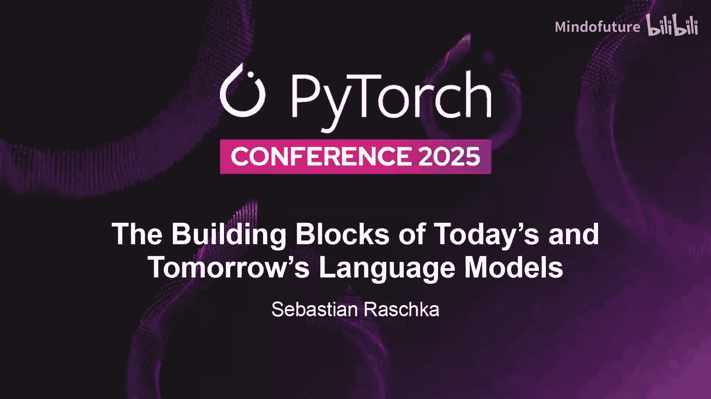
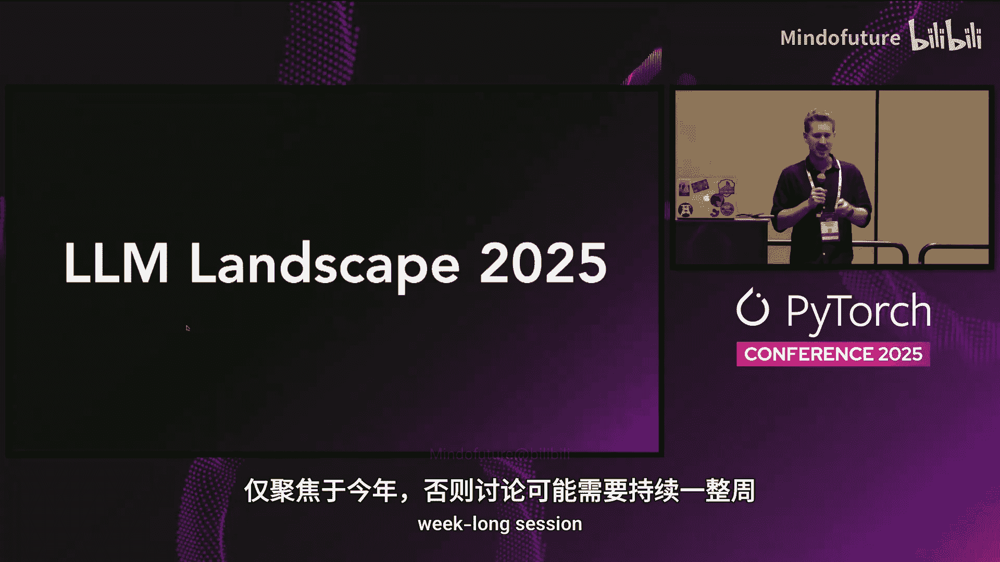
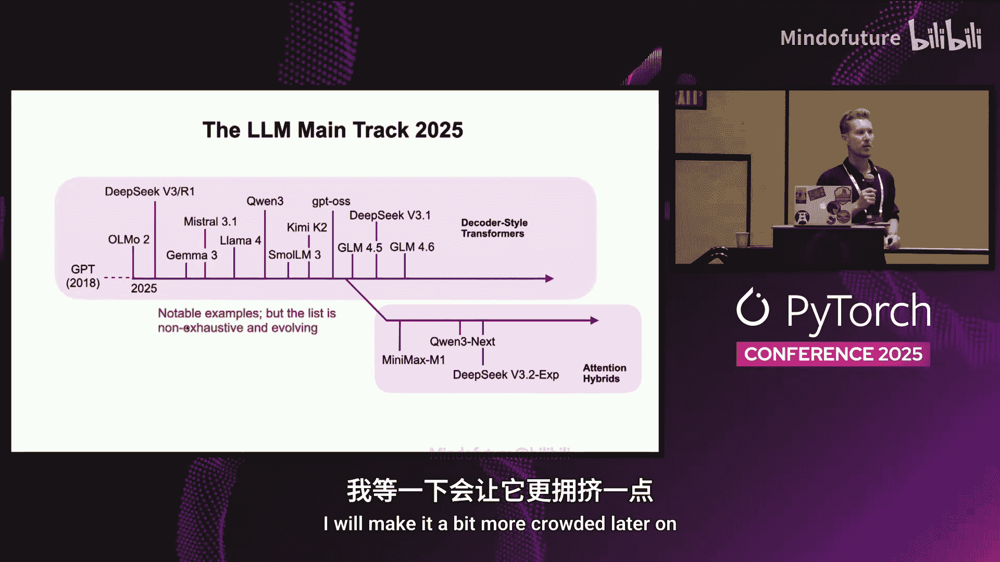
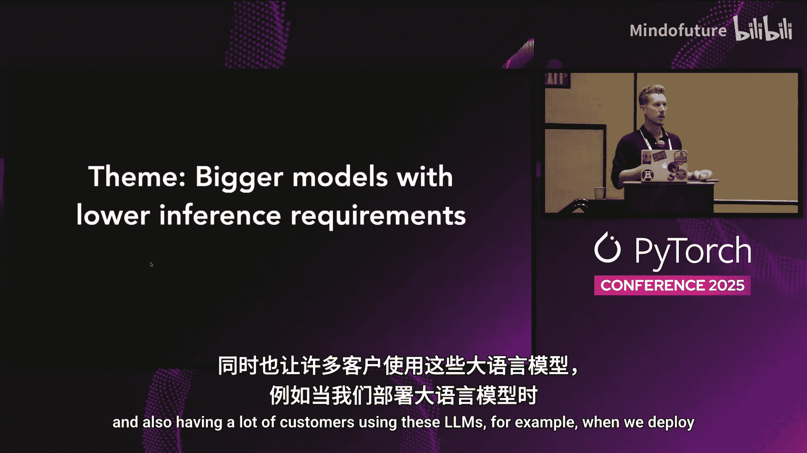
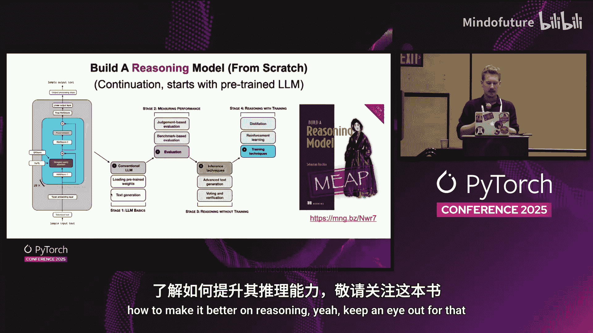
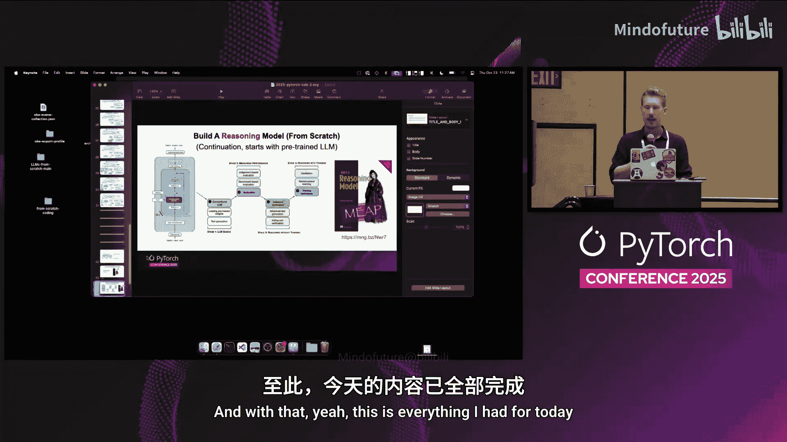

# 038：当下与未来语言模型的构建基石

在本节课中，我们将学习2025年大语言模型（LLM）领域的主要架构演进和核心构建模块。我们将重点关注那些旨在提升模型性能、同时降低推理成本的关键技术。

## 2025年LLM概览

首先，我们来看看2025年主流的开源大语言模型。为了聚焦于近一年的发展，我们主要关注自2024年底至今发布的模型。

以下是2025年最受关注、使用最广泛的开源大语言模型：
*   DeepSeek-V3
*   Qwen2.5
*   Llama 3.1
*   Gemma 3
*   GLM-4.6

这些模型构成了当前LLM应用的基础。接下来，我们将深入探讨它们背后的一些核心效率优化技术。

## 核心构建模块：提升推理效率

当前LLM发展的一个主要趋势是：在增大模型规模（参数数量）的同时，如何使其推理更加高效、成本更低。本节中，我们来看看几种关键的注意力机制优化技术。

### 分组查询注意力

分组查询注意力（Grouped Query Attention, GQA）并非新技术，它于2023年提出，并被Llama 2等模型采用。它作为理解后续更复杂技术的基础引入。

GQA是标准多头注意力（MHA）的一种高效替代方案。其核心思想是减少需要存储的键（Key）和值（Value）向量的数量。

在标准MHA中，每个查询（Query）都对应独立的键和值。在推理时，为了加速自回归生成过程，模型会使用KV缓存来存储历史 tokens 的键和值。随着生成长度的增加，KV缓存会变得非常庞大。

GQA通过让多个查询共享同一组键和值来减少KV缓存的大小。例如，可以让每两个查询共享一组键和值。极端情况下，所有查询共享同一组键和值，即多查询注意力（MQA），但这通常会导致模型性能下降。GQA在计算资源与模型性能之间找到了一个平衡点。

以下公式对比了标准注意力与GQA的键值对数量：
*   **标准MHA**：`num_kv_heads = num_query_heads`
*   **GQA**：`num_kv_heads = num_query_heads / group_size` （其中 `group_size` 是分组大小）

通过减少 `num_kv_heads`，可以显著降低KV缓存的内存占用，从而节省推理成本。

### 多头潜在注意力

多头潜在注意力（Multi-head Latent Attention, MLA）是DeepSeek-V2模型引入的一种替代GQA的技术，Qwen2.5等模型也采用了它。

MLA的目标同样是减少KV缓存大小，但采用了不同的方法。它在标准查询、键、值变换矩阵之外，引入了额外的两个权重矩阵。

MLA的核心步骤是：
1.  将标准的键和值投影到一个更低维的“潜在表示”空间。
2.  在KV缓存中只存储这个压缩后的潜在表示。
3.  在需要计算注意力时，再利用额外的权重矩阵将潜在表示上投影（重建）回原始的键和值维度。

这类似于LoRA等技术的思想：先将信息投影到低维空间，再重建回来。虽然增加了两个权重矩阵的计算，但存储的KV缓存体积大大减小。根据DeepSeek-V3论文，在达到相近的缓存节省效果时，MLA能提供比GQA更好的模型性能，但需要调整推理流水线以处理潜在状态。

### 滑动窗口注意力

滑动窗口注意力（Sliding Window Attention）是另一种节省成本的技术，旨在限制模型在生成时能够回顾的历史上下文长度。

在标准的因果自回归注意力中，当前 token 可以关注到序列中所有之前的 tokens。滑动窗口注意力则施加一个限制：当前 token 只能关注到其前面固定数量（窗口大小）的 tokens。

例如，设置窗口大小为3，意味着模型在生成当前词时，只能“看到”它前面的3个词，而不是整个历史。这自然减少了需要参与计算的键值对数量，从而降低了计算和缓存开销。

在实际应用中，模型通常不会在所有层都使用滑动窗口注意力。例如，Gemma 3的架构中，每5个滑动窗口注意力层之后会插入一个标准的全局注意力层，以确保模型在某些层仍能捕获完整的上下文信息。消融实验表明，这种设计能在几乎不损失模型精度的情况下，显著提升效率。

## 混合专家模型：增大容量，控制成本

如果说前面的技术是“节流”，那么混合专家模型（Mixture of Experts, MoE）则是“开源”与“节流”的结合。这是2025年几乎所有主流大模型都采用的核心技术。

MoE的核心思想是：用多个专家网络（通常是前馈神经网络）替换Transformer块中单一的前馈网络层。

以DeepSeek-V3为例，它将一个前馈模块替换为256个不同的专家前馈模块，使得模型总参数量达到6710亿。然而，在每次前向传播（推理）时，对于一个给定的输入 token，一个路由网络（Router）只会选择激活其中少数几个专家（例如9个）。其中一个专家通常是“共享专家”，始终被激活，用于学习通用知识，避免冗余；其他专家则可以各自专注于不同的领域（如代码、数学、特定语言等）。

这样做的结果是：
*   **训练时**：模型拥有巨大的容量来吸收训练数据中的知识。
*   **推理时**：每次只激活一小部分参数（如DeepSeek-V3每次仅激活370亿参数），保持了与稠密模型相近的计算开销。

MoE实现了在总参数量大幅增加的情况下，有效控制单次推理的活跃参数量，是当前扩展模型能力的主流方法。

## 其他有趣的架构探索

以上我们介绍的都是基于传统Decoder-only Transformer的主流变体。它们经过了充分测试，性能可靠，是构建实际应用的首选。然而，研究社区也在积极探索一些非常有趣的替代架构。

以下是几个值得关注的方向：
*   **注意力机制变体**：如Qwen2.5-Next使用的Gated DeltaNet，以及DeepSeek-V3.2-Experimental使用的稀疏注意力。它们在保持Transformer核心的同时，通过更高效的近似来进一步优化。
*   **分层推理模型**：如Tiny Reasoning Model，在ARC等推理基准上表现出色。这类模型目前更偏向解决特定类型的谜题，未来可能作为“工具”被大模型调用。
*   **世界模型**：例如Meta的Code World Model，不仅预测下一个token，还学习代码执行过程中的中间状态轨迹，有望提升代码相关任务的性能。
*   **文本扩散模型**：一种并行生成文本的替代方案，不同于自回归模型逐个token生成。它通过多步去噪（类似图像扩散）或迭代掩码预测（类似BERT）来同时生成所有token，可能提升生成速度，但在利用思维链等序列推理能力上面临挑战。
*   **状态空间模型及其他**：如基于偏微分方程的模型、Transformer-RNN混合模型（如RWKV）、以及不断演进的状态空间模型（如xLSTM）。这些模型在特定场景（如边缘设备）下提供了高效的替代方案。

对于大多数应用，从主流的Decoder-only Transformer模型开始仍然是稳妥的选择。但这些新兴的架构为我们提供了未来优化模型效率与能力的新思路。

## 总结与资源

本节课中我们一起学习了2025年大语言模型的核心构建模块。我们首先回顾了主流的LLM，然后深入探讨了提升推理效率的关键技术：分组查询注意力、多头潜在注意力和滑动窗口注意力。接着，我们分析了当前扩展模型能力的核心技术——混合专家模型的工作原理。最后，我们概览了除主流Transformer之外的一些前沿架构探索。

这些技术的发展体现了LLM领域从纯粹追求性能，到兼顾性能与部署成本的重要转变。理解这些基石，有助于我们更好地选择、使用乃至设计适应未来需求的语言模型。

如果你想深入了解这些架构设计的更多细节、消融实验和具体数据，可以参考相关的技术博客与论文。持续关注这些基础组件的演进，是把握LLM发展脉搏的关键。

---
*注：本教程根据Sebastian Raschka在PyTorch Conference 2025上的演讲内容整理，聚焦于技术原理的阐述，省略了演讲中的问答及互动环节。*