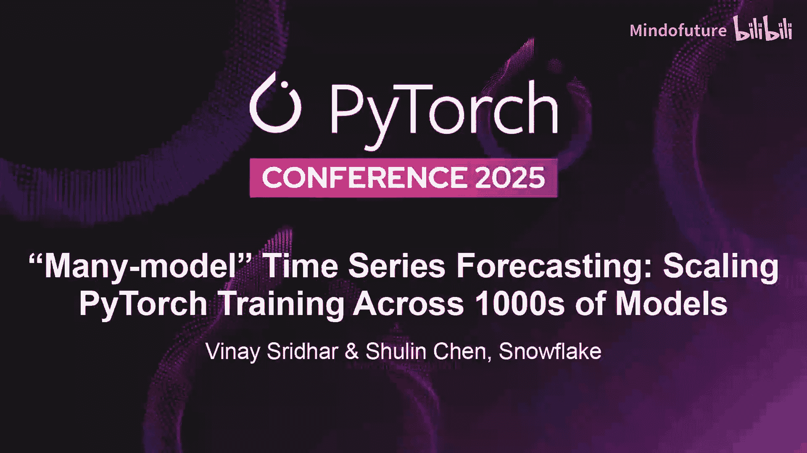
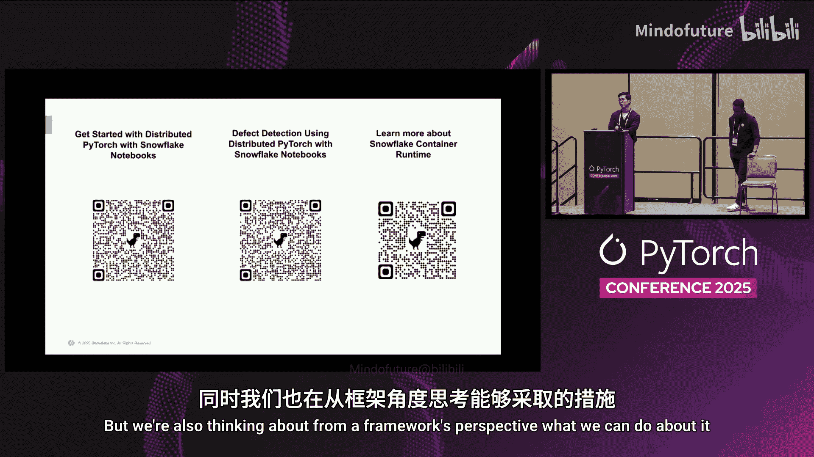

# 039：“多模型”框架——在数千个分区上扩展训练



## 概述

在本教程中，我们将学习如何使用 Snowflake 提出的“多模型”框架，来高效地训练和管理成千上万个独立的时间序列预测模型。我们将通过一个零售业销售预测的示例，了解该框架如何简化复杂模型的分布式训练、部署和推理流程。

---

## 1：时间序列预测的现代挑战

上一节我们概述了本课程的目标，本节中我们来看看现代企业面临的时间序列预测挑战。

如今，预测问题变得异常复杂。以零售商为例，预测产品销量时，需要整合来自各方的信号：客户反馈、评论情绪、甚至多模态数据（如图片和视频），所有这些都影响着产品线的成功预测。

将这个问题置于时间序列中，情况更为棘手。序列可能是非线性的，包含趋势性、季节性（甚至多重季节性），以及像长周末、万圣节等特殊时间窗口。这些复杂的模式都需要在特征集中被准确捕捉。

此外，外部因素也不可忽视。市场信号、竞争对手动态、地缘政治局势等，都会影响预测的准确性。

这种复杂性同样存在于其他场景，例如金融服务公司的股票预测。目前，大多数此类用例都在使用 LSTM 或 Transformer 模型，其中 Transformer 正变得越来越普遍。

然而，真正的挑战在于将这些复杂模型应用到微观细分层面。想象一下，一个零售商拥有 **100** 条产品线、**500** 家门店和多个地理位置，需要为每一个“门店-产品-地区”组合（即一个分区）进行如此详细的预测。

这意味着技术实施者需要：
*   为每个分区训练复杂模型。
*   频繁更新模型（每周、每两周甚至每天），以反映最新模式。
*   每次训练成千上万个模型。

这带来了巨大的基础设施扩展挑战：训练需要健壮可靠，检查点、可观测性、自动化部署都必须到位。

---

## 2：“多模型”框架解决方案

上一节我们探讨了大规模微观预测的挑战，本节中我们来看看 Snowflake 的“多模型”框架如何解决这些问题。

该框架的核心思想是抽象化基础设施和编排的复杂性。用户只需提供三样东西：
1.  **分区数据集**：你的数据，并指定一个分区键（例如 `store_id, product_id` 的组合）。
2.  **训练函数**：你的 PyTorch 模型定义、优化器、层结构等（就像为单个序列编写的一样）。
3.  **指向数据的路径**。

框架将自动处理其余工作：抽象基础设施、编排任务、确保健壮性，最终提供一个端到端的工作流水线。它不仅能并发训练数万个模型，还会将训练好的模型记录到注册表中，以便后续使用相同的分区逻辑进行推理。

该框架的底层架构利用了 **Ray** 进行编排和调度。Ray 擅长异构计算和资源优化，能实现很高的 GPU 利用率。同时，它紧密集成了 Snowflake 数据平台，确保海量数据能被高效地流式传输到 Ray 执行器中。

除了核心的“多模型训练”（分区训练），该框架还包含其他基于 Ray 的分布式组件，例如：
*   分布式数据连接器
*   分布式机器学习训练
*   超参数调优 API

---

## 3：框架工作原理与演示准备

上一节我们介绍了框架的顶层设计，本节中我们深入其内部工作原理，并开始演示的准备工作。

在底层，框架的工作流程如下：
1.  用户提供一个定义了分区键的 Snowflake 表。
2.  框架自动执行查询，将每个分区提取到独立的 DataFrame 中。
3.  这些 DataFrame 被转换为 **Ray Dataset**。
4.  每个 Ray Dataset 被映射到一个 **Ray Actor**。
5.  每个 Actor 接收其对应的数据集以及用户定义的训练函数，然后开始训练。
6.  所有 Actor 并行启动。计算集群按需动态附加到活跃的 Actor 上，实现渐进式扩展和收缩。

你可以使用 GPU 集群、CPU 集群，甚至是多 GPU 节点（用于在多个 GPU 上训练单个 PyTorch 模型），所有这些组合都可通过该框架实现。

现在，让我们通过一个演示来看看代码实现有多么简单。演示目标是展示接口的简洁性和底层功能的强大。

以下是演示的准备工作，我们将使用一个合成的零售数据集：
*   **目标**：为每家门店并行训练一个 LSTM 模型，根据历史数据预测日销售额。
*   **步骤**：
    1.  扩展集群以加速训练。
    2.  将所有训练好的模型部署到模型注册表，以备推理。

请注意，演示侧重于建模流程本身，数据是合成的，模型较小，核心是展示“多模型训练”框架如何轻松管理、训练和扩展大量模型。

首先，进行基本设置：

```python
# 1. 创建 Snowflake 会话对象，用于连接数据
session = create_snowflake_session()

# 2. 设置 Snowflake stage，用于持久化存储训练相关的工件（artifacts）
setup_persistent_stage()
```

我们的合成数据包含多个行，每行代表一个产品的日销售额，以及价格、促销、竞争对手定价等特征。数据集总计 15 万条记录，覆盖 10 家门店，每家门店有 500 个独特产品。

为了供模型使用，我们需要进行简单的特征工程：创建一个 **14** 天的滑动窗口特征序列，并将每个序列与第二天的销售额配对。这样，模型学习根据过去两周的活动预测下一天的销售额。最终训练张量的形状为 `(样本数, 14, 3)`，其中 **14** 是过去的天数，**3** 是特征数量。

---

## 4：定义训练函数与扩展集群

上一节我们准备好了数据和环境，本节中我们开始定义核心的训练函数，并学习如何扩展计算集群。

使用“多模型”框架主要涉及三个部分：
1.  定义训练函数。
2.  相应扩展集群。
3.  调用 API 在所有训练工作节点上运行该函数，并监控过程。

首先，我们定义一个简单的 LSTM 模型和用户训练函数：

```python
import torch
import torch.nn as nn

# 定义简单的 LSTM 模型
class SimpleLSTM(nn.Module):
    def __init__(self, input_size=3, hidden_size=50, output_size=1):
        super().__init__()
        self.lstm = nn.LSTM(input_size, hidden_size, batch_first=True)
        self.linear = nn.Linear(hidden_size, output_size)

    def forward(self, x):
        lstm_out, _ = self.lstm(x)
        return self.linear(lstm_out[:, -1, :])

# 用户训练函数
def user_training_function(data_connector, context):
    """
    data_connector: 框架传入的连接器，提供当前分区的数据。
    context: 上下文对象，包含当前分区的ID等信息。
    """
    # 示例：故意让分区5的训练失败，以展示错误处理
    if context.partition_id == 5:
        raise RuntimeError("Intentional failure for partition 5 for demonstration.")

    # 获取当前分区的数据并转换为Pandas DataFrame
    df = data_connector.to_pandas()

    # 特征工程：创建14天滑动窗口
    # ... (具体窗口创建代码)

    # 转换为PyTorch DataLoader
    dataset = CustomDataset(features, labels)
    dataloader = torch.utils.data.DataLoader(dataset, batch_size=32)

    # 初始化模型、损失函数、优化器
    model = SimpleLSTM()
    criterion = nn.MSELoss()
    optimizer = torch.optim.Adam(model.parameters())

    # 训练循环
    for epoch in range(5):
        for batch_features, batch_labels in dataloader:
            optimizer.zero_grad()
            predictions = model(batch_features)
            loss = criterion(predictions, batch_labels)
            loss.backward()
            optimizer.step()
        print(f"Partition {context.partition_id}, Epoch {epoch}, Loss: {loss.item()}")

    return model  # 返回训练好的模型
```

接下来，在调用训练之前，我们可以用一条简单的命令扩展集群：

```python
scale_cluster(num_nodes=2)  # 扩展到2个节点
```

扩展的一个优点是它是**异步**的。你不需要等待所有节点都启动完毕再开始训练。训练任务可以立即开始，随着更多节点上线，它们会自动加入工作池，分担更多的训练任务。

---

## 5：运行训练、监控与错误处理

上一节我们定义了训练函数并扩展了集群，本节中我们启动训练，并观察其监控与强大的错误处理机制。

现在，我们调用“多模型训练”API：

```python
run_id = "demo_run_001"
results = run_many_model_training(
    training_function=user_training_function,
    stage_name="my_training_stage",
    run_id=run_id
)
```

运行后，框架会提供实时进度显示，将数据摄取和训练过程分开。一旦某个分区的数据准备就绪，空闲的工作节点就会立即拾取并开始训练。

在后台，框架提供了与 **Ray Dashboard** 的直接链接，高级用户可以通过它深入查看底层的 Ray 任务、执行器资源使用情况、日志和集群状态。

训练完成后，我们检查进度：

```python
progress = get_progress(run_id)
print(progress.summary)  # 输出：9个分区成功，1个失败
```

我们可以轻松查看成功分区的日志和模型权重：

```python
# 获取第一个成功分区的模型
successful_model = get_model(run_id, partition_id=0)
print(successful_model.state_dict())

# 查看该分区的训练日志
logs = get_logs(run_id, partition_id=0)
print(logs)
```

更重要的是调试失败的分区。在我们的示例中，分区5故意失败了：

```python
failure_logs = get_logs(run_id, partition_id=5)
print(failure_logs)  # 将显示我们抛出的运行时错误信息
```

框架内置了**内存溢出检测系统**。当某个分区的训练任务即将耗尽内存时，系统会主动终止该任务，并优雅地将错误信息反馈给用户。**即使部分分区失败，整个“多模型训练”作业也不会完全失败**。

这对于大规模训练至关重要。用户可以只针对失败的分区诊断问题并重新运行流水线，而无需重跑所有分区，从而节省大量时间和成本。

---

## 6：模型注册与推理

上一节我们完成了模型的训练和调试，本节中我们将训练好的模型注册到模型仓库，并演示如何进行推理。

首先，我们将所有训练好的子模型封装成一个“分区模型”，并记录到模型注册表：

```python
from snowflake.ml.registry import model_registry

# 从框架获取所有训练好的子模型（字典：分区ID -> 模型）
all_trained_models = get_all_models(run_id)

# 创建分区模型
partitioned_model = PartitionedModel(submodels=all_trained_models)

# 记录到模型注册表
model_version = model_registry.log_model(
    model=partitioned_model,
    name="store_sales_predictor",
    version_name="v2"
)
```

在 Snowflake 的 UI 中，你可以看到名为 `store_sales_predictor` 的模型，版本为 `v2`。你可以查看模型的输入/输出模式，并深入查看每个分区（如 `store_id=9`）对应的具体模型文件，以便调试。

现在，我们使用注册的模型进行推理。准备测试数据（过去14天的特征）：

```python
test_data = prepare_test_data(past_days=14)  # 形状: (样本数, 14, 3)
```

运行推理时，框架会自动将每条记录路由到对应的门店模型：

```python
predictions = partitioned_model.predict(test_data)
print(predictions.head())
```

输出示例：
```
   store_id  product_id  predicted_sales
0         9           0        30.451234
```
这意味着，对于门店9、产品0，根据过去14天的特征，预测下一天的销售额约为30.45。

---

## 7：性能与总结

上一节我们完成了从训练到推理的完整流程，本节中我们简要了解框架的性能表现，并对本课程进行总结。

性能基准测试表明：
*   即使**在单节点上**运行“多模型训练”，随着分区数量增加，其性能也远超串行训练方式。
*   当将集群从单节点扩展到多节点时，总运行时间与节点数量呈**线性相关**，证明了框架出色的横向扩展能力。

框架的优势总结：
1.  **高扩展性**：可线性扩展至多个节点，高效处理成千上万个模型。
2.  **强健壮性**：内置错误处理、自动重试和内存溢出保护。
3.  **易调试性**：提供清晰的接口和日志，支持仅对失败分区进行重试。
4.  **操作简便**：抽象了底层基础设施和编排的复杂性。
5.  **端到端集成**：无缝衔接数据准备、分布式训练、模型注册和分区感知推理。

## 总结



在本节课中，我们一起学习了如何使用 Snowflake 的“多模型”框架来解决大规模时间序列预测的挑战。我们从现代预测问题的复杂性入手，逐步了解了该框架的设计理念、工作原理，并通过一个完整的代码演示，实践了如何定义训练函数、扩展集群、监控训练过程、处理错误、注册模型以及进行分区感知的推理。该框架通过抽象底层复杂度，让数据科学家和工程师能够更专注于模型本身，从而高效地在数千个微观分区上扩展 PyTorch 训练任务。