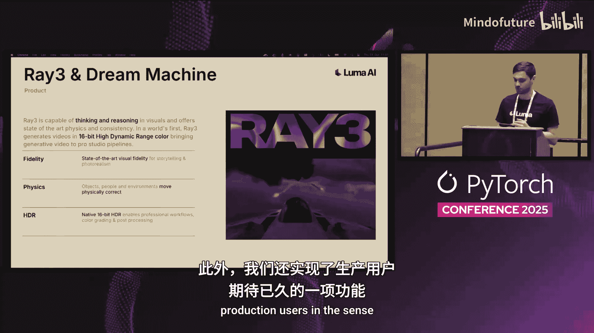
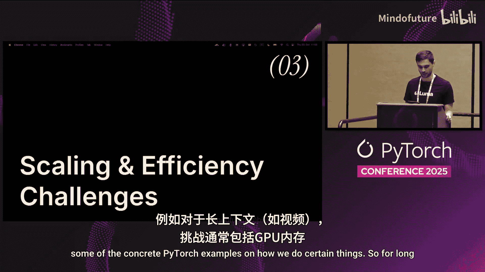
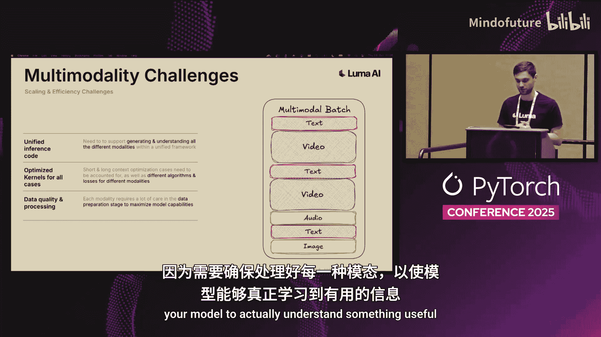
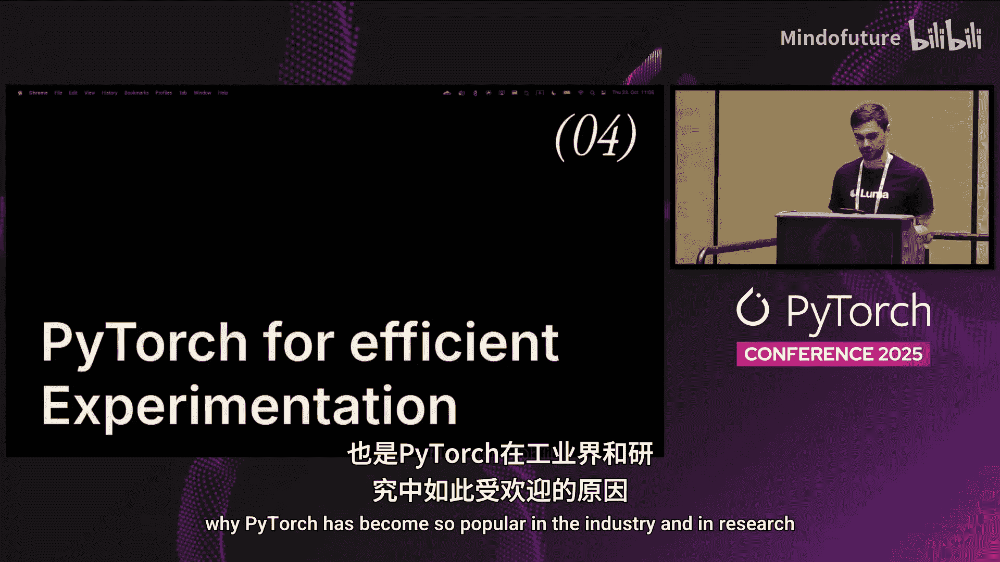
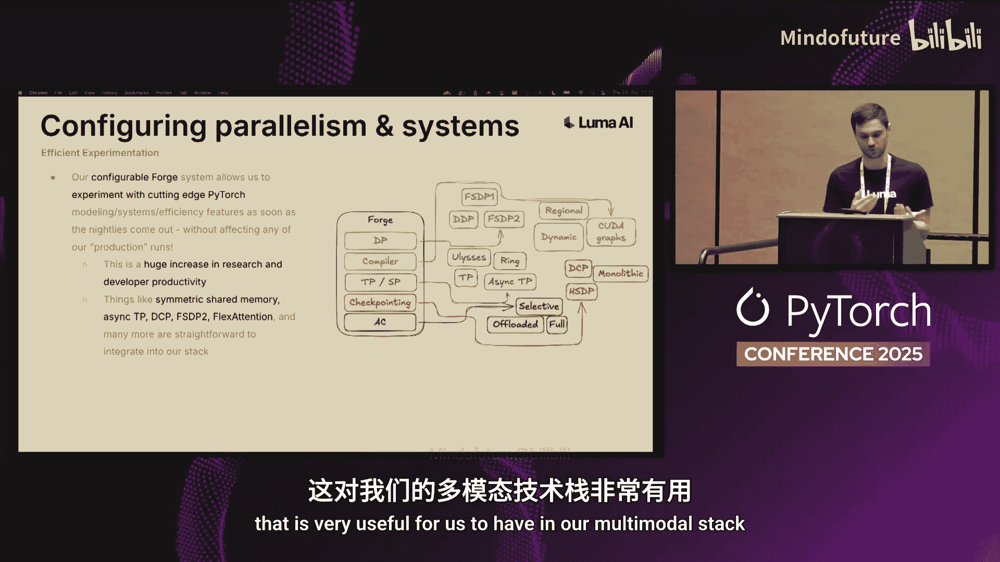
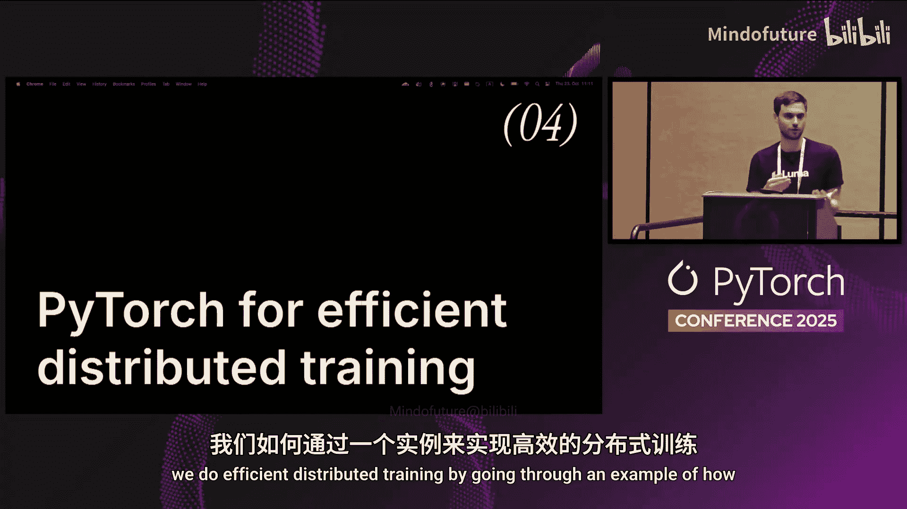
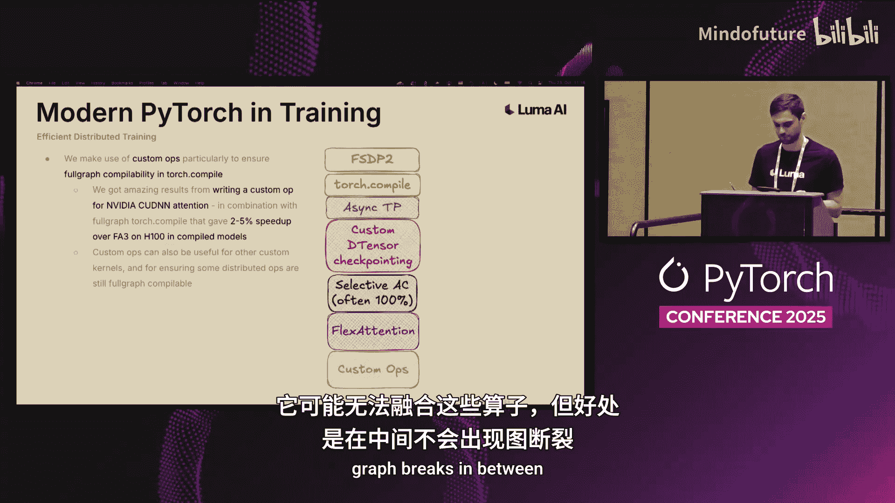
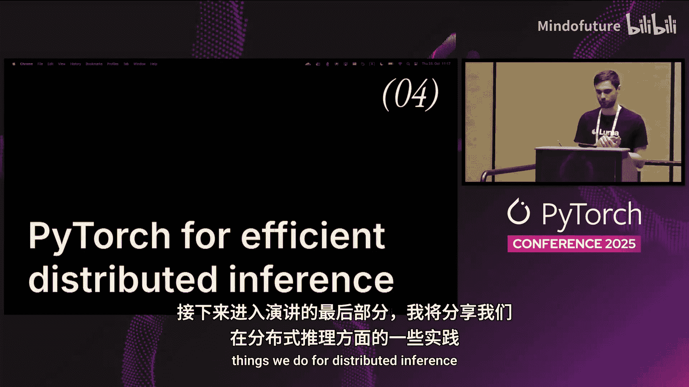
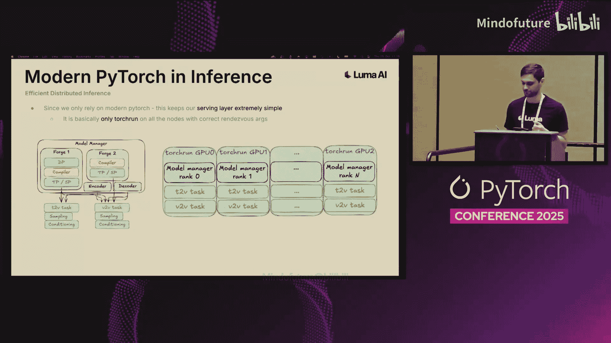

# 040：现代PyTorch如何助力Luma AI实现多模态训练与推理升级

在本教程中，我们将学习Luma AI如何利用现代PyTorch技术栈来高效地进行多模态模型的训练与推理。我们将探讨多模态任务面临的独特挑战，并详细介绍Luma AI内部用于实验配置、分布式训练和高效推理的核心系统与最佳实践。

## 概述与背景

首先，我将简要介绍Luma AI的工作内容，以便您了解我们所面临的挑战。接着，我会概述多模态任务在扩展性和效率方面的特定挑战。最后，我将通过具体示例，展示我们如何利用PyTorch高效地进行实验、运行分布式训练以及执行分布式推理。

Luma AI的使命是构建能够理解、生成并在物理世界中运作的多模态通用智能，旨在成为一个全新的智能创意伙伴。我们专注于多模态，因为我们认为这最有可能解锁新的创意模型。大约一个月前，我们发布了Ray3，这是我们最先进的视频生成模型，并将其集成到了我们的产品Dream Machine中。Ray3之所以有趣，是因为它是我们首个能够在视觉上进行思考和推理的模型，并提供了最先进的一致性。此外，我们还为生产用户实现了制作16位HDR内容的能力，在保真度、物理效果和HDR方面都取得了进展。

## 什么是多模态？🎬

当我谈论多模态时，以下是一些例子：视频、图像、文本、音频，甚至更多不同的模态。所有这些都为模型的学习和理解带来了不同的信息。

*   **视频**：通常具有很长的上下文，为环境、物体等提供了重要的时空线索。
*   **图像**：上下文长度中等或较短（取决于分辨率），捕捉构图、美学和场景理解等信息。
*   **文本**：通常上下文非常短，在大型语言模型领域广为人知。文本对于抽象推理以及连接不同模态和任务至关重要。例如，文本可以为我们提供关于主体、主体外观和位置的重要线索，从而很好地与其他模态联系起来。
*   **音频**：与视频和图像相比，通常上下文也较短，但可以为我们提供物理环境、空间距离以及说话者个性等线索。

## 多模态的挑战 ⚙️

在深入探讨具体的PyTorch示例和我们如何做事之前，我想简要概述我们在所有这些不同模态中，在扩展和效率方面面临的挑战。

对于像视频这样的**长上下文**模态，挑战通常包括GPU内存、注意力机制的二次方计算开销，并且任务通常非常受计算能力限制。在某个临界点之后，如果使用完全自注意力，注意力计算将主导所有计算。因此，对于这类长上下文任务，最重要的是拥有高效的注意力内核来处理这种巨大的计算量。

对于像文本这样的**短上下文**模态，这同样适用于LLM和自回归或下一个令牌预测模型。如果你有一个因果模型（这在文本中很常见），你需要使用KV缓存等技术来避免昂贵的重复计算。此外，你需要关注计算与通信的重叠，因为对于短上下文任务，计算本身很短，如果在计算之间进行通信，可能会导致计算停滞，在流水线中产生大量气泡，从而降低GPU利用率。在这种情况下，任务通常非常受延迟或内存限制，这与长上下文情况下的优化策略非常不同。

现在，如果我们将所有这些**组合成多模态**，例如一个批次中可能包含文本、视频、音频、图像等，事情就会变得相当棘手。我们需要一个统一的推理和训练代码来理解所有这些不同的模态；需要理解这些不同模态并可能针对特定情况进行优化的内核；同时，大规模的数据处理和质量控制也非常棘手，因为你需要确保处理好每一种不同的模态，以便模型能够真正理解有用的信息。

## 高效的实验配置 🧪

了解了这些背景知识后，让我们来聊聊我们如何使用PyTorch进行高效实验，这是PyTorch在工业界和研究中如此受欢迎的核心优势之一。

在Luma，一个实验的生命周期大致如下：我们使用Python数据类来完成所有实验、类或模块的配置和定义，这些数据类有一个`setup`方法。例如，我们可能有一个可配置的类，其中包含一个我们通常称为`config`的内联类，它是一个数据类，可以设置一些参数（如整数、字符串甚至可调用对象）。当我们在这个配置对象上调用`do_setup`时，它会返回父类（即可配置的对象本身）。这种通常只需几行代码就能实现的模式非常强大。

我们可以利用强类型（与基于文本的配置相比），可以对所有内容进行版本控制，甚至可以以类似元编程的风格修改配置文件（例如，在配置上运行循环，动态更改配置）。这种配置系统贯穿于我们所做的所有事情，使我们能够以相当高效的方式进行实验。

在Luma，我们几乎所有的东西都遵循这种设计模式，包括模型架构定义。例如，我们有一个用于神经网络的类，其中可以包含这个嵌套的配置数据类。我们可以定义神经网络的隐藏通道数，然后在配置上调用`setup`时，在`__init__`方法中使用这些隐藏通道来定义我们的神经网络。除此之外，它就是一个常规的`nn.Module`，有前向函数，可以进行编译等操作。这种嵌套配置使其配置起来非常方便。

同样，我们也使用这种配置系统来配置并行策略、系统、检查点、编译、初始化等。我们有一个内部系统，称为`forge`（这个名字现在可能有点被过度使用了）。通过这种系统，我们可以定义并行和编译策略，这很大程度上受到了`torchtitan`的启发，它也有这种可插拔的应用系统来应用这些不同的组件。

例如，我们可以将优化器、初始化器（在其中使用元设备）、数据并行（可以是FSDP或HSDP）、编译器、检查点、EMA等构建块合并到一个`forge`实例中。这包括对称共享内存、异步TP、分布式检查点、FSDP2、灵活注意力等所有对我们多模态堆栈非常有用的现代PyTorch功能。

我们的可配置`forge`系统使我们能够在建模、系统效率方面，一旦有新的夜间版本发布，就能立即尝试最前沿的PyTorch功能。我们经常这样做：哦，夜间版本有一个很酷的新功能，也许有一个新的模块化编译器API，我们可以在`forge`中构建一些东西来应用它，但不会触及代码库的其他任何部分。这意味着它不会破坏任何生产训练运行，不会破坏任何推理，基本上是完全隔离的。这极大地提高了研究和开发人员的生产力。

## 高效的分布式训练 🚀

现在，在了解了配置系统之后，我想通过一个示例来谈谈我们如何进行高效的分布式训练，即如何配置这样的`forge`以及这对我们的训练运行意味着什么。

通常，对于训练案例（考虑到我们通常依赖高速互连），我们在分片和效率方面的第一道防线是强烈建议从**FSDP2**开始。实际上，这可以很好地工作很长时间，你可以将模型扩展到数千亿参数，只要确保调整好批次大小、张量并行大小等。这是处理权重和优化器状态最简单的方法，而且你只需要进行一次PyTorch性能分析，就能检查是否完全重叠。

接下来，我们在训练中大量依赖**`torch.compile`**，无论是动态情况还是静态情况。对于像视频这样的任务，有不同的宽高比、分辨率、帧数，这是一个非常动态的情况。对于其中一些，我们依赖`torch.compile`动态编译；对于另一些，我们编译多个静态图。关键是，我们依赖`torch.compile`为我们做很多融合优化，这对我们来说效果很好。我们使用Redis缓存来存储编译后的工件，这也是一段时间前引入的功能。我们还利用区域编译来加快编译速度，例如，在Transformer中编译每个块，而不是编译整个模型，这几乎总能给我们带来基本相同的性能，但编译速度更快。

然后，我们编译辅助部分，如损失函数、训练期间的EMA更新，当然还有像灵活注意力掩码函数这样的东西，以确保其高效运行且不会耗尽内存。根据任务不同，我们使用动态编译或将某些维度标记为动态。

对于某些特定任务，我们有时会使用**TP和异步TP**。特别是`torch`的异步张量并行API非常好用。如果你有能从张量并行中受益的用例，我强烈建议你启用异步TP。在某些情况下，仅启用异步TP我们就看到了10%到20%的效率提升。如果你也编译模型（异步TP也依赖于此），这通常是“免费的午餐”。

接下来，我们的堆栈支持**分布式检查点**和从单体检查点加载。实际上，我们有一个自定义的去张量化检查点功能，专门针对我们频繁使用FSDP2的情况进行了定制。在FSDP中，当模型被分片时，你有这些分布在分片维度上的去张量。实际上，你可以通过`torch.save`在每个你想保存的rank上保存这些去张量，稍后再加载它们。虽然需要一些元数据操作，但它是有效的，并且是一种非常高效的保存和加载检查点的方式，因为保存基本上就是每个rank的`torch.save`，加载也是同样。当然，重新分片可能更复杂，这时我推荐使用DCP或其他解决方案。但对我们来说，如果我们不需要经常重新分片，这实际上是一个非常方便的解决方案。

然后，在训练中，特别是在长上下文情况下，我们经常使用**激活检查点**。我们支持选择性激活检查点，但通常将其设置为100%，因为即使只有一个块没有进行激活检查点，也常常会耗尽内存，而速度提升却微乎其微。因此，我们通常保持开启，以确保通过这种方式将内容装入内存。我们还可以支持带有激活检查点的异步CPU卸载。我认为这是`torchtitan`中已经或正在实现的功能，但尚未进入`torch`主线。本质上，如果你知道接下来要加载哪个块，你也可以确保存储在激活检查点中的检查点被卸载到CPU。

根据实验用例，我们大量使用**灵活注意力**，特别是对于复杂的多模态注意力方案。这使我们的研究人员和工程师能够完全独立地编写自己的掩码和评分函数，而无需编写内核，这再次极大地提高了生产力。当然，灵活注意力的性能上限最多与Flash Attention 2一样好（取决于稀疏度）。如果在实验中显示出有希望的结果，我们可以在后期制作自定义内核或操作，这是我们经常利用的另一点。

制作**自定义操作**在严重依赖`torch.compile`的情况下非常有用。例如，我们在H100上为NVIDIA的注意力机制编写自定义操作获得了惊人的结果，使其可进行全图编译，结合全图`torch.compile`，有时比Flash Attention 3带来了2%到5%的速度提升，考虑到Flash Attention 3是最先进的技术，这已经相当不错了。自定义操作对于其他自定义内核以及确保`torch.compile`可进行全图编译也非常有用，它可能无法融合这些操作，但确保中间没有图中断仍然很好。

在我们的训练循环中，我们还与**`torch`性能分析器**紧密集成。只需传递一个参数，我们就可以在给定的rank上自动捕获`torch`性能分析和内存分析，并直接上传到Perfetto，附带一些深层链接，以便轻松调查和分析训练性能，查看是否存在内核启动问题、气泡、同步问题等。

最后，我想提一下，`torchtitan`也这样做，我相信你们很多人都熟悉：请确保定期手动调用Python垃圾回收器。如果不这样做，最终会导致步长时间出现非常奇怪和不稳定的差异，这是我们花了很长时间才弄明白的，后来我们看到`torchtitan`也这样做。所以，如果你没有这样做，并且看到步长时间有奇怪的差异，那可能就是原因。

## 分布式推理 ⚡

现在进入演讲的最后一部分，我将谈谈我们在分布式推理方面所做的一些事情。

在Luma，我们需要确保在不同硬件供应商（如AMD和NVIDIA）以及不同代芯片上都能进行高效的推理。同时，作为一个研究实验室，我们不断进行实验，因此需要能够将研究想法快速部署到生产环境。

在这里，我们也主要依赖`torch.compile`和一些专门的操作和内核来处理。例如，一个Transformer块被编译，其中可能有一个注意力操作是自定义操作，在CUDA和ROCm上有所不同。

我们在训练和推理之间共享范式和模式。我们使用之前展示的相同系统`forge`来定义推理并行性、编译，并声明如何加载检查点。因此，我们可以进行序列并行或张量并行，可以编译东西，并且在训练和推理之间使用完全相同的接口，从而轻松地在不同功能或任务之间共享权重。对于推理，我们有一个称为轻量级模型管理器的东西，它本质上只是在内存中保存一批模型。然后，如果我们有文本到视频与视频到视频的任务，它们可以独立获取模型，这样我们就可以在不同任务之间重用权重，既使我们的流水线良好解耦，又确保不会因在内存中保存模型副本而浪费内存。

由于我们只依赖现代PyTorch，这使得我们的服务层目前也极其简单。基本上，它只是在所有不同节点上生成一堆`torchrun`工作进程，确保集合点正常工作，然后其他所有事情都只是运行我们配置好的、经过`torch.compile`编译的模型以及我们配置的任何任务。

## 总结 🎯

在本教程中，我们一起探讨了Luma AI如何利用现代PyTorch构建高效的多模态训练与推理流水线。我们首先了解了多模态任务（视频、图像、文本、音频）的独特价值与挑战，特别是长上下文与短上下文任务在计算、内存和优化策略上的差异。

接着，我们深入学习了Luma AI内部用于高效实验的核心系统——基于Python数据类的可配置`forge`系统。该系统通过强类型、版本控制和模块化设计，极大地提升了研究和开发效率，并能无缝集成FSDP2、`torch.compile`、灵活注意力等前沿PyTorch特性。

在分布式训练部分，我们回顾了从FSDP2、`torch.compile`、异步张量并行到自定义检查点、激活检查点和自定义操作等一系列最佳实践，以及如何利用`torch`性能分析器和手动垃圾回收来确保训练稳定高效。

最后，我们探讨了如何将训练中的配置与并行策略复用于分布式推理，通过`torch.compile`和硬件特定的内核实现跨平台高效推理，并利用轻量级模型管理器实现权重共享，保持服务层的简洁与高效。

通过结合这些现代PyTorch工具与内部系统，Luma AI能够快速迭代多模态研究，并将成果高效部署到生产环境。希望这些实践经验能为你在构建自己的大规模AI系统时提供有价值的参考。