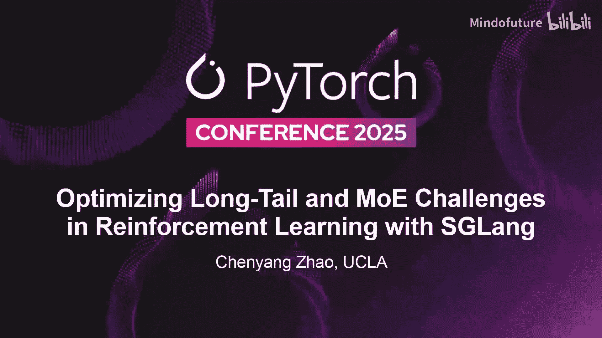
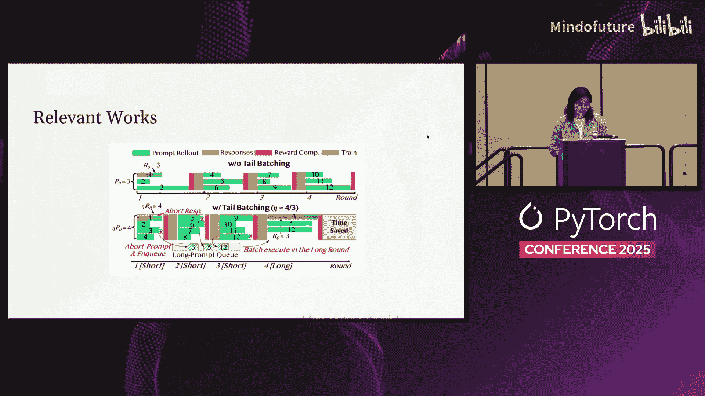

# 041：基于SGLang优化大规模RL中的长尾与混合专家难题



在本教程中，我们将学习如何在大规模强化学习训练中，利用SGLang等系统优化技术来解决长尾请求和混合专家模型带来的挑战。我们将深入探讨RL的生命周期、常见的性能瓶颈以及几种关键的优化策略。

## RL系统概述：RL的生命周期与核心挑战

上一节我们介绍了本教程的主题，本节中我们来看看一个典型RL系统的生命周期和它面临的核心挑战。

一个传统的强化学习训练流程通常包含五个核心概念：

1.  **Rolling Out / 采样**：这类似于模型推理。智能体根据当前策略模型与环境交互，生成行动序列。在大规模场景下，例如一个AI代理生成一份PPT，单次请求可能涉及数十甚至数百次工具调用，形成一个复杂且耗时的深度序列。
2.  **评估**：计算生成序列的奖励、价值、优势等指标，这些是后续训练更新规则的关键输入。
3.  **存储**：由于复杂的采样过程可能被中途暂停或需要复用，一个存储层用于管理未完成或已完成的轨迹数据，便于调试和重用。
4.  **训练**：使用采集到的数据和评估指标，在训练后端更新策略模型的参数。
5.  **Refit / 权重同步**：在在线策略训练中，需要将训练后端更新后的模型权重同步回采样引擎，以确保后续采样使用的是最新策略。

这五个部分循环往复，构成了RL的训练生命周期。在大规模场景下，这个流程面临诸多挑战：采样效率低下、训练与推理的计算图不匹配、资源调度开销巨大等。

## 为什么选择Astrona？：面向RL生命周期管理的库

上一节我们了解了RL的生命周期，本节中我们来看看为什么Astrona库适合管理这个复杂的流程。

Astrona的设计理念是成为一个**库**而非**框架**，它为用户提供构建RL流程的组件，而不是强制规定一套僵化的流程。这为用户提供了高度的灵活性和可定制性。其核心优势包括：

以下是Astrona为RL生命周期管理提供的关键特性：

*   **开放的Refit功能**：提供了多种将训练后权重同步回推理引擎的方法。
*   **便捷的生成暂停**：提供API，允许在采样过程中的任意点暂停生成，以应对长尾请求。
*   **计算图感知的唤醒**：通过技术手段优化模型在推理和训练模式间切换的效率，减少开销。
*   **训练与推理的对齐**：促进公司内部训练和在线服务使用统一的技术栈，减少系统差异。
*   **统一的路由器**：为复杂的、涉及多工具调用的采样过程提供单一入口，简化请求分发逻辑。

## 优化策略一：部分采样与长尾请求处理

上一节我们介绍了Astrona库的优势，本节中我们来看看如何优化RL中最常见的性能瓶颈之一——长尾请求。

在智能体任务中，不同工具调用的响应时间差异巨大。数据显示，80%的请求在50%的时间内完成，而剩余20%的请求（长尾）则占据了另一半时间。传统RL需要等待所有请求完成才能进入下一阶段，这造成了严重的资源闲置。

**核心优化思想：超额采样与部分采样**
我们不再等待所有请求完成。基本思路是：如果我们预期需要N个样本，我们可以先采样 `M > N` 个。当足够数量（例如N个）的请求返回后，我们就暂停或丢弃未完成的请求，用已返回的样本进行训练。

一个更精细的策略是：将未完成的请求及其状态存入缓存。在下一轮采样开始时，优先从缓存中取出这些“半成品”继续执行，而不是全部重新开始。

**公式描述**：
假设总采样预算为 `N`，我们实施超额采样，实际采样数为 `M` (M > N)。定义一个完成阈值 `K` (K ≤ N)。当完成的样本数达到 `K` 时，暂停所有未完成采样，使用已完成的样本进行训练。

这种方法显著提高了硬件利用率，避免了因少数慢请求阻塞整个训练批次的情况。

## 优化策略二：解决训练-推理不匹配问题

上一节我们通过部分采样优化了效率，本节中我们来看看另一个棘手的问题——训练与推理的不匹配。

**训练-推理不匹配** 是指，相同的模型参数和输入提示，在推理引擎和训练引擎中计算出的对数概率或采样结果不一致。这对于依赖精确概率计算的RL算法是致命的。

**问题根源**：
1.  **非结合性浮点运算**：在分布式训练中，`All-Reduce` 等操作在不同硬件或不同执行顺序下会产生细微的数值差异。这些差异逐层累积，可能导致最终输出的显著偏差。
2.  **混合专家模型的路由差异**：对于MoE模型，每一层的专家选择门控网络对数值误差极其敏感。训练和推理时细微的数值差异可能导致选择不同的专家子网络，从而彻底改变模型行为。

**解决方案：重要性采样**
与其试图在系统层面强制实现完全一致的数值计算（这非常困难且可能损害性能），不如在算法层面进行修正。**重要性采样** 是一种统计方法，用于修正从不同分布中采样带来的偏差。

**核心思想**：在训练时，我们使用来自推理引擎的样本，但同时记录该样本在推理引擎中的采样概率。在计算训练梯度时，我们通过一个重要性权重来修正这种概率分布的差异。

**代码描述**：
```python
# 假设推理引擎采样概率为 p_infer， 训练引擎中对应概率为 p_train
# 采集到的样本数据为 data， 其奖励为 reward
importance_weight = p_train / (p_infer + epsilon) # 计算重要性权重
# 使用重要性权重修正后的损失函数进行训练
loss = compute_loss(data, reward) * importance_weight
```
这种方法优雅地将一个复杂的系统问题转化为算法问题，通常只需少量代码即可集成，并能有效稳定训练。

## 优化策略三：计算图感知的模型切换

上一节我们通过算法解决了数值不一致问题，本节中我们来看看如何优化资源调度中的性能开销。

在实际部署中，我们通常没有无限的GPU。推理需要大容量KV缓存来提升速度，而训练需要大量显存进行模型状态和梯度计算。因此，我们不得不在同一批GPU上交替执行推理和训练任务。简单的“停止推理，启动训练，再停止训练，重启推理”会带来巨大的开销，主要源于每次都需要重建计算图。

**关键技术：Torch Memory Receiver**
PyTorch的计算图依赖于张量的虚拟内存地址。如果张量的物理内存被释放后重新分配，即使数据相同，其虚拟地址也可能改变，导致计算图失效需要重建。

`Torch Memory Receiver` 的核心作用是**保护张量的虚拟内存地址**。它创建一个内存区域，当张量的物理内存被释放时，保留其虚拟地址。当需要重新创建该张量时，系统会尝试在相同的虚拟地址上分配新的物理内存。只要虚拟地址不变，PyTorch的计算图就能保持有效。

**优化流程**：
1.  **分离式唤醒**：首先，仅加载推理模型参数并进行权重同步。此时，KV缓存保持离线状态。
2.  **执行训练**：卸载推理模型，加载训练模型进行训练。训练完成后卸载。
3.  **加载KV缓存**：最后，将KV缓存加载到**完整的、未被训练模型占用的显存**中。由于缓存大小固定，其虚拟地址得以保持，计算图无需重建。

通过这种将模型参数和KV缓存分离唤醒的策略，我们既保证了训练时能使用全部显存，又保证了推理时计算图的高速有效，实现了资源利用和性能的最佳平衡。

## 总结与问答拾遗

本节课中我们一起学习了优化大规模强化学习系统的三种核心策略：通过**部分采样**处理长尾请求以提升效率；利用**重要性采样**在算法层面修正训练-推理不匹配；以及采用**计算图感知的模型切换**来最小化资源调度开销。这些基于SGLang和Astrona库思想的优化，能够显著提升RL训练的速度和稳定性。



**问答拾遗**：
*   **关于长尾请求的价值**：如果长尾请求总能产生高奖励，直接丢弃可能影响探索。更高级的策略如“Rollout Packer”可以将多个长尾请求暂存，在特定时刻集中进行批量采样，从而平衡效率和探索。
*   **关于训练规模**：大规模工业级RL训练可能涉及数千个GPU，运行数千个训练步，智能体交互可达数百轮，整个训练周期可能长达数周。