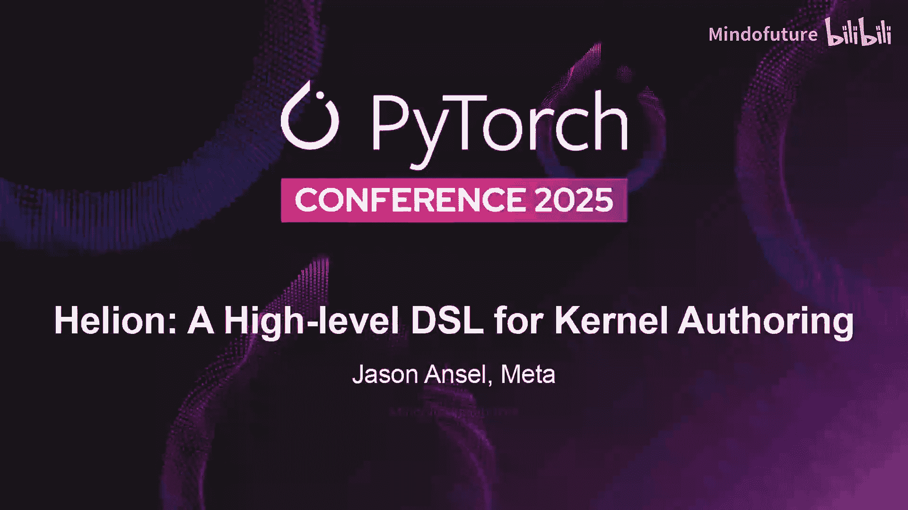
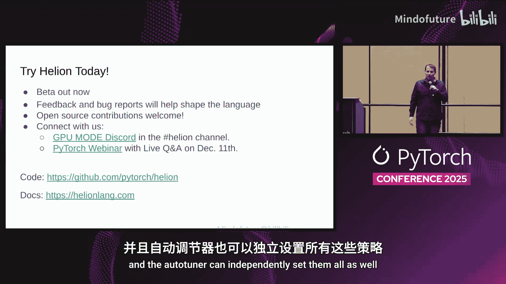

# 042：面向内核开发的高级领域特定语言



在本教程中，我们将学习 Helion，这是一种用于编写 GPU 内核的新型高级领域特定语言。我们将了解它的设计动机、核心概念、自动调优机制、性能表现以及内部工作原理。

## 概述：什么是 Helion？ 🤔

Helion 是一种新的领域特定语言，其抽象层级介于 PyTorch 和 Triton 之间。它比 PyTorch 更底层，但比 Triton 更高级。设计 Helion 的主要动机是，许多用户在使用 PyTorch 和 `torch.compile` 时，希望获得更多控制权，能够精确指定哪些操作被融合到特定内核中。为此，他们常常转向使用内核编写 DSL，但又不想深入到 Triton 或 CUDA 那样低的层级。你可以将 Helion 理解为“带分块的 PyTorch”，它是一种更接近 PyTorch 抽象层级的、更原生的内核编写方式。

从 Triton 的角度看，Helion 自动化了许多在 Triton 中需要手动完成的工作。因此，一个 Helion 内核的代码量应该少于等价的 Triton 内核。Helion 内置了自动调优器，其语言设计与自动调优器的设计紧密耦合。我们借鉴了 Halide 等语言的思想，将调度语言和语义语言分离。Helion DSL 可以被视为语义语言，它试图将所有硬件细节排除在语言之外；而自动调优配置则指定了所有硬件细节以及如何将计算映射到实际硬件。我们使用自动调优器来生成这些配置，这可以将大量优化内核的工作从用户转移到机器上，用自动调优时间替代人力。

## 核心概念：`hl.do_tile` 循环 🧩

Helion 中最关键的语言结构是 `hl.do_tile` 循环。它接收一个多维尺寸参数，并将迭代空间划分为多个“块”。划分迭代空间的具体方式由自动调优器决定。在不同的设备上，为了获得最佳性能，通常需要以不同的方式划分迭代空间。通过将这些分块细节交给自动调优器处理，诸如块大小、迭代顺序甚至循环扁平化等都可以被自动调优。

以下是一个在 Helion 中实现矩阵乘法的示例：

```python
import torch
import helion as hl

def matmul(A, B):
    M, K = A.shape
    K, N = B.shape
    C = torch.empty((M, N), device=A.device, dtype=A.dtype)

    # 外层是运行在主机上的常规 PyTorch 代码
    # 用于分配输出张量、计算尺寸等

    # 内层是 `hl.do_tile` 循环，它被映射到设备上执行
    for i, j in hl.do_tile((M, N), tile=(TM, TN)):
        # 在循环内部，可以使用标准的 PyTorch 操作
        # 它们会被自动映射到单个输出的 Triton 内核中
        tile_C = torch.zeros((TM, TN), device=A.device, dtype=A.dtype)
        for k in range(K):
            tile_A = A[i: i+TM, k]  # 加载一个块
            tile_B = B[k, j: j+TN]  # 加载一个块
            tile_C += tile_A @ tile_B
        C[i: i+TM, j: j+TN] = tile_C  # 存储结果

    return C
```

在这个内核中，有两个主要部分：
1.  **外层部分**：这是运行在主机上的常规 PyTorch 代码，允许你分配输出张量、进行尺寸计算等。
2.  **内层部分**：由 `hl.do_tile` 循环界定，这部分被映射到设备上执行。在最内层，你可以使用标准的 PyTorch 操作，它们会被自动映射到单个输出的 Triton 内核。最外层的 `hl.do_tile` 循环成为内核的启动网格，而内层循环则成为代码中的设备循环。

## 自动调优的配置空间 ⚙️

自动调优器会在一个庞大的配置空间中搜索最佳性能。理解这个空间有助于你了解 Helion 在幕后做了什么，特别是如果你熟悉 PyTorch 和 Triton。

以下是自动调优器迭代选择的主要配置类型：

### 1. 迭代与索引选择
在 Triton 中，有三种指定索引的方式：指针运算、块指针或更结构化的张量描述符。在 Helion 中，索引以 PyTorch 风格完成：你获取张量，并用标量值或从 `hl.do_tile` 循环中获得的“块”对象对其进行索引。当你用“块”索引张量时，会从底层张量加载整个块。我们发现，最佳的索引类型通常取决于数据大小：张量描述符通常更适合较大尺寸，而指针索引更适合较小尺寸。在 Triton 中切换这些方式相当繁琐，但 Helion 的自动调优器可以自动完成。

### 2. 隐式块大小管理
在 Triton 等低级语言中，你需要手动管理块大小信息。这包括将其提升为参数、进行网格计算以确定启动网格等大量工作。在 Helion 中，这一切都是自动化的。你只需声明 `hl.do_tile`，语言就会替你管理块大小。

让语言管理块大小的一个主要优势是我们可以执行诸如**循环扁平化**等操作。通过一个配置，我们可以将相同的输入源代码，从映射到两个块大小（方形块）变为将迭代空间扁平化为一维，只使用一维块。这为自动调优器提供了更多选择，而这些选择在低级语言中可能需要程序重写。

### 3. 归约循环展开
如果你有一个对二维张量行求和的归约操作，在 Triton 这样的低级语言中，实际上有两种不同的实现方式：一种是常规的加载方式；另一种是创建累加器并循环遍历数据。如果行大小超过 SM 的舒适容量，第一种方式可能导致溢出或编译失败。Helion 自动化了这种转换，并可以在两种选择之间自动调优。

### 4. 程序ID类型
在启动 CUDA 内核时，你可以使用依赖于数据的启动网格大小，也可以使用固定大小的启动网格（例如每个 SM 启动一个程序），然后遍历虚拟程序 ID。这些不同的方式通常需要对内核进行重大重写，但为了获得最佳性能，有时需要这种，有时需要那种。因此，这是一个非常适合自动调优的维度。

### 5. 迭代顺序与循环重排
我们可以通过指定循环顺序来重排循环，基本上就是交换迭代空间的维度。还可以指定更复杂的优化，如 **L2 分组**，即在迭代空间中引入子分块以提高缓存利用率，这是一个我们可以自动化的优化。

### 6. Triton 内部可调参数
Triton 在底层暴露了许多旋钮，但大多数人不会手动调整或优化它们。通过将它们暴露给自动调优器，我们可以自动搜索大量可用的程序空间。

### 7. 自动掩码处理
掩码处理很微妙，很难做到正确，尤其是在测试非 2 的幂次方输入时。我们通过自动化掩码选择，使掩码处理变得更加容易。

## 自动调优器与部署策略 🚀

自动调优器是 Helion 语言的核心部分。目前，我们内置了一些相对简单的自动调优算法，如模式搜索（一种最近邻类型搜索）和差分进化（一种进化算法）。未来，我们非常期待探索机器学习驱动的搜索方法，例如使用 LLM 引导搜索或强化学习。

### 自动调优过程
典型的自动调优过程大约需要 20 分钟来搜索 1200 个候选 Triton 内核。我们称之为“模式搜索”的基础算法工作流程如下：
1.  从 100 个随机配置的初始种群开始（在搜索空间中均匀随机抽取）。
2.  选择其中 5 个最快的配置。
3.  通过查看这 5 个点各自局部最小值的最近邻来进行爬山优化。
4.  选择最快的一个。
这是一个相当好的基线算法，速度相对较快，并且迄今为止显示出良好的效果。

### 部署挑战与策略
任何使用自动调优的语言都面临部署挑战，因为自动调优需要很长时间。你肯定不希望在生产集群中运行自动调优器。

部署 Helion 程序的方法是**提前进行自动调优**：
1.  在开发或预演环境中，使用代表性输入和代表性硬件运行一次自动调优器。
2.  将得到的自动调优配置部署到你的集群。

对于更复杂的设置，你可能关心多种输入形状。例如，你可以针对小形状和大形状分别运行两次调优器，将配置保存到磁盘，然后在 Helion 内核的装饰器中添加这两个配置。当指定明确的配置列表时，每遇到一个独特的输入形状，我们会尝试所有配置并选择最快的一个。这是一个成本很低的算法，因为你只需要编译和运行两次，但可以在不同尺寸下都获得良好性能。

对于更高级的用户，可以进行**手动路由**。例如，你可以编写自己的自定义路由函数，根据输入大小决定使用哪个预编译的内核，从而完全跳过运行时的调优步骤。

### 用户自定义可调参数
除了语言隐式提供的可调参数外，有时算法的选择本身也是可调的（例如，是否使用 split-K）。对于这类情况，你可以注册一个自定义的可调参数，描述其类型（枚举、整数等），然后自动调优器将同时调优这些用户定义的参数和语言隐式提供的参数。

## 性能表现 📊

接下来，我们通过三个案例研究和更广泛的基准测试来了解 Helion 的性能表现。

### 案例研究 1：注意力机制
在降频至 700 瓦的 NVIDIA B200 上比较注意力性能。我们将 Helion（结合 stock Triton、Facebook 实验分支的 Triton 以及高级编译器配置）与 PyTorch Eager 模式、多个 Triton 版本（Flex Attention、教程版本）、Cutlass 和 CUDNN 进行对比。结果显示，Helion 的性能与 Cutlass 大致相似，但与 CUDNN 相比仍有小幅差距。

### 案例研究 2：与 Tile Lang 对比
在 Mombatu Chunk Scan 内核上（该内核在其论文中提出）与 Tile Lang 对比。数据显示，Helion 在其比较中选择的所有形状上都优于 Tile Lang。

### 案例研究 3：与 Cute DSL 对比
比较来自 Quack 库（一个用于 RMSNorm 反向传播的 Cute DSL 内核库）的内核。我们与 Eager Triton 和 `torch.compile` 进行对比。结果显示，`torch.compile` 在较小的输入尺寸上表现良好，Quack 在较大的输入尺寸上表现良好，而 Helion 及其生成的等效 Triton 代码在所有尺寸上都提供了稳健的性能。

### 广泛基准测试
当我们查看大量不同内核时，Helion 在大多数基准测试中都优于 `torch.compile` 和手写的 Triton 代码。尽管 Helion 生成的是 Triton 代码，但它仍然能够持续击败手写的 Triton 代码。原因是我们的搜索空间更大。当人类优化手写 Triton 代码时，即使非常坚持，也可能只尝试 10 种不同的写法，而 Helion 会尝试数千种写法。更大的搜索空间意味着 Helion 通常能找到更优的内核编写方式。

在 AMD MI350X 上也观察到了非常相似的趋势，这凸显了 Helion 的性能可移植性。通常，在不同硬件类型之间切换时，你需要修改 Triton 内核以获得最佳性能，但自动调优器能够通过调优自动榨取更多性能。

## 硬件支持与可移植性 🌐

Helion 也支持其他硬件。除了 NVIDIA 和 AMD，Helion 还支持 Intel XPU 和 MTA（Meta 的自定义加速器）。Helion 映射到 Triton 的一个巨大优势是，任何拥有 Triton 后端的硬件都可以开箱即用地与 Helion 良好协作。

然而，为了获得最佳性能，暴露硬件特定的旋钮给自动调优器至关重要。每个硬件都有一些代表其硬件抽象的特定旋钮。因此，虽然让程序运行起来的第一步相对容易，但为了稳健地获得最佳性能，暴露这些旋钮是重要的第二步。

## 内部工作原理 🔧

Helion 是一个嵌入 Python 的 DSL。其编译器工作流程如下：
1.  **解析与类型标注**：从 Python 抽象语法树开始，然后用类型和元数据对其进行标注。
2.  **转换为 FX 图**：将 AST 转换为 FX 图（每个基本块一个图）。创建的 FX 图中的每个节点都标注有相应的 Inductor IR。Torch Inductor 是默认支持 `torch.compile` 的编译器，Helion 重用了 Torch Inductor 的大部分功能，以将 PyTorch 操作映射到输出的 Triton 代码。拥有一个能够处理 2000 多个 PyTorch 算子的稳健基础编译器，使得 Helion 语言能够将大多数 PyTorch 操作包含为合法操作。
3.  **编译器传递**：在 IR 上执行一系列编译器传递。
4.  **代码生成**：最后进行代码生成。代码生成环节会结合配置信息。因此，只有代码生成右边的部分需要针对每个自动调优实例运行一次，而左边的所有步骤都可以被缓存，只需运行一次。
5.  **主机代码处理**：对于主机代码（即标准的 PyTorch 代码），我们只进行 AST 重写：将 Helion 内核中的循环替换为函数调用，然后生成输出。

## 总结与展望 🎯

本节课我们一起学习了 Helion，一种用于内核开发的新型高级 DSL。我们了解了它的设计动机、核心的 `hl.do_tile` 结构、强大的自动调优机制及其部署策略。通过案例和基准测试，我们看到了 Helion 在性能和可移植性方面的优势。最后，我们简要探讨了其内部编译器工作原理。



Helion 目前处于测试阶段，我们鼓励大家尝试并提供反馈。它代表了将内核优化工作从开发者转移到自动化系统的重要一步，为高性能计算提供了更易用且强大的工具。未来，更先进的机器学习驱动调优算法有望进一步释放其潜力。