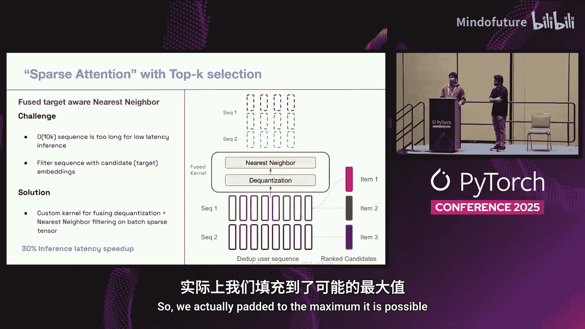
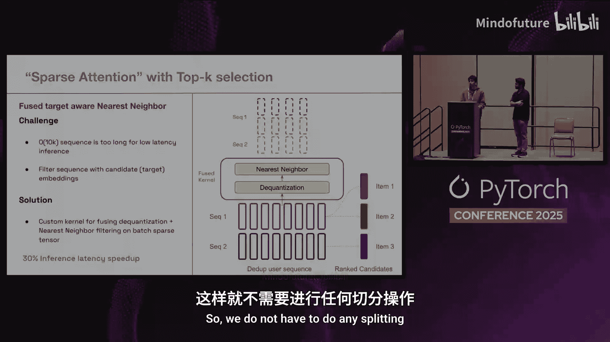

# 043：使用AutoGraph与Triton扩展万级序列推荐模型推理

在本节课中，我们将学习如何为处理超长用户行为序列（例如，长度达10,000）的推荐模型，优化其推理性能。我们将从系统架构和模型内核两个层面，探讨一系列关键技术，以实现极低延迟（P90 < 50毫秒）下的高效推理。

## 概述：问题与挑战

我们面临的核心问题是：如何对处理超长用户行为序列的推荐模型进行低延迟的GPU推理。具体来说，我们需要将用户活动序列的规模扩展近20倍，达到10,000的长度，同时满足每秒处理约千万级物品的推理需求。

问题的数学描述是：预测用户对某个物品（例如一个图钉）采取特定行动（例如点击）的概率。公式可以表示为：
`P(click | item_features, context, user_activity_sequence)`

关键挑战在于，如何在极低延迟下，高效处理这超长的用户活动序列。

## 模型演进与架构

上一节我们介绍了问题的背景，本节中我们来看看模型的演进历程和基本架构。

我们的模型服务于首页信息流推荐，这是一个核心产品界面。模型架构是典型的推荐系统模型。

以下是该模型的主要特征：
*   模型消耗数十万维特征。
*   使用非常大的ID嵌入表。
*   总参数量接近十亿级别。
*   架构中包含处理序列特征的Transformer模块。

用户序列特征并非单一特征，而是一组不同的序列集合，使用稀疏序列张量格式表示，因为用户活动长度是可变的。这些序列包括用户行为的嵌入序列、用户采取的不同动作序列以及时间戳序列。

该模型有两种架构：
1.  **2023年部署的版本**：仅使用约500个事件的实时活动序列。
2.  **去年部署的最新版本**：使用批处理加实时序列，总长度约10,000。

## 推理服务器中的序列处理流程

了解了模型架构后，我们来看看在推理服务器中，处理这些用户序列的具体步骤。这对于理解后续的优化至关重要。

我们的推理服务器是自建的C++服务器，使用TorchScript、CUDA Graphs，并运行在A100或L40S GPU上。

以下是序列处理的五个典型步骤：
1.  **致密化**：将可变长度的用户序列扩展为固定的密集形状，以便打包成小批次进行推理。这类似于LLM中的填充操作。
2.  **广播**：在排名系统中，一个用户请求需要为同一用户对多个物品进行排名。因此，用户的序列或上下文需要被广播到所有待排名的物品上。
3.  **批处理与内存拷贝**：将多个待推理的物品批处理在一起。这些批次通常位于可分页的CPU内存中，然后需要传输到固定内存并最终拷贝到GPU内存。
4.  **序列子选择**：由于延迟要求极低，很难将Transformer处理扩展到近10,000的长度。因此，我们采用一个技巧：每个待排名的候选物品只选择序列中与其高度相关的特定片段用于自身排名。
5.  **Transformer执行**：在GPU上执行Transformer计算。

为了部署这样的系统，模型和基础设施需要协同演进，因为上述每一步都可能成为瓶颈。接下来，我们将重点讨论前三个更偏向系统层面的优化。

## 系统级优化：请求级序列去重与固定内存池

上一节我们介绍了推理流程中的瓶颈，本节中我们来看看针对前三个步骤（致密化、广播、内存拷贝）的两项关键系统优化。

### 挑战分析

首先，在致密化和广播步骤中，主要问题是会产生巨大的内存分配和拷贝操作。以一个序列特征为例：序列长度10,000，嵌入维度32，批次大小256。仅这一个特征，单个推理批次的负载就高达80MB。在低延迟推荐系统中，多个CPU线程并行工作以创建推理批次，这使得问题更加棘手。

其次，在批处理和内存拷贝步骤中，最昂贵的部分是多步拷贝（从可分页内存到固定内存，再到GPU内存）。我们的推理服务器通常运行8个并行的CUDA流。对于此模型，我们发现如果直接用于在线推理，PCIe带宽几乎会被100%饱和（在A100 GPU上达到约16 GB/s的极限），导致数据无法快速送达GPU。

### 优化一：请求级序列去重

这项优化的核心思想是避免重复广播相同的用户序列。

在典型的排名场景中，第一个用户请求需要排名3个物品，第二个用户请求需要排名4个物品。传统方法会为每个物品复制一份用户序列，共7份拷贝。

我们的优化方法是：只保留每个唯一用户序列的一个副本。这样，上面例子中就只需2份拷贝（每个唯一请求一份）。

这带来了类似LLM中前缀共享的好处，避免了重复预处理共享前缀。我们因此可以完全跳过广播步骤，这是一个巨大的内存分配和拷贝操作。

然而，这并不简单，因为模型仍然无法区分哪些物品属于哪个序列。因此，我们必须重构整个训练流水线、数据生成流水线、推理特征格式和推理引擎，使模型能够接受两种输入：
1.  每个唯一的序列。
2.  一个广播偏移量，用于告知模型哪些物品属于哪个请求（例如，前3个物品属于第一个请求，后4个属于第二个）。

这项优化的好处包括：
*   每个序列只被处理一次。
*   每个唯一序列只被批处理和从CPU拷贝到GPU一次，极大减轻了PCIe带宽压力。
*   为引入自定义模型内核创造了条件，因为我们可以精确知道哪些排名物品属于哪个请求，从而无需广播即可高效索引。

### 优化二：固定内存池

这项优化在系统设计中很常见，即预分配一个巨大的连续内存块，然后在不同的推理请求中重绕和重用。

思路很简单：当批处理张量或其他操作需要一片内存时，只需前移指针并返回该片内存。我们在服务器启动时预先分配整个内存池，并根据要运行的批次大小和特征形状自动估算其大小。

结合CUDA Graphs，这意味着在整个端到端的批处理、GPU推理和返回输出的过程中，我们无需动态分配任何CPU/GPU内存，一切都是预分配的。这对于低延迟推理系统是一个非常理想的特性。

此外，我们使用固定CPU内存直接支持此内存池，从而消除了从可分页内存到固定内存的拷贝。固定内存具有到GPU的快速拷贝路径，这与常用的`torch.pin_memory`原理相同。

这项优化的好处是跳过了动态分配和从可分页内存到固定内存的大规模拷贝。

### 优化效果

我们花费大量时间优化系统本身，是因为当推理存在效率瓶颈时，我们首先尝试优化系统而非模型。以下是优化结果：

图表显示，在不同批次大小下，通过叠加这两项优化，**总批次准备和拷贝时间减少了近85%**，端到端的批次P99延迟**降低了75%**。这是一个巨大的提升，是优化系统部分的关键成果。

## 模型级优化：自定义Triton内核

上一节我们解决了系统瓶颈，本节中我们来看看在模型计算层面，如何使用自定义Triton内核进行深度优化。

### 为何需要自定义Triton内核？

原因如下：
1.  **延迟敏感**：推荐系统对延迟极其敏感，任何延迟增加都会导致可衡量的用户参与度下降。将序列长度从500扩展到16,000会引入多个瓶颈，显著增加延迟和成本。基于编译器的简单融合无法利用开发者已知的特定模型模式。
2.  **序列特性**：用户序列遵循幂律分布，少数用户拥有比中位数长得多的序列。此外，用户序列在多个待排名物品间共享，并且我们以量化格式存储它们。因此，我们可以设计更高效的定制稀疏张量格式来存储和处理这些序列，并编写直接在格式上运算、无需致密化的自定义Triton内核。
3.  **AOT编译与集成**：Triton支持提前编译，这对于我们使用C++推理和TorchScript至关重要。工作流程是：用Python编写Triton内核，使用Triton的AOT编译器将其编译为CUDA二进制，然后将其作为自定义操作链接到TorchScript中，最终直接打包到模型里用于推理服务器。

### 案例研究：两种Transformer的优化

我们将通过首页信息流模型中使用的两种Transformer来展示具体优化。

**第一种：精简Transformer**
*   **特点**：使用更长的序列捕捉长期历史，但嵌入维度很小（如32）。通常是基于内容或参与度的预训练嵌入，并以INT8或INT4格式量化存储。
*   **优化（SKUT）**：借鉴Flash Attention的切片思想，但由于权重矩阵非常小，可以全部放入共享内存。我们直接加载输入张量X，动态计算Q、K、V投影，然后直接计算输出块。这使得所有计算在原地完成，相比加载三个大序列张量，现在只需加载一次。对于32维的小嵌入，这带来了显著的延迟提升（相比Flash Attention-2有66%的改进）。
*   **优化（稀疏注意力）**：我们无法为实时推理使用完整的16,000上下文长度。因此，我们实现了使用Top-K选择的稀疏注意力。我们有一个融合内核，可以直接从序列的量化格式解码为FP16，然后计算与目标候选的最近邻，并在内核内隐式处理广播，最终物化出最近的K个序列。实现这个自定义融合内核使推理延迟提升了约30%，且无需物化或致密化已有的稀疏张量格式。

**第二种：宽Transformer**
*   **特点**：嵌入维度更大，捕捉用户的短期兴趣。使用端到端学习的ID嵌入，同样以量化格式存储。
*   **优化（分解注意力）**：这利用了服务器端的序列去重。传统推荐系统中，候选嵌入通常通过拼接或直接相加的方式与用户序列融合。但这会导致批次中每个序列都不同，无法利用一个关键优化：将Transformer分解为自注意力和交叉注意力两步。
    *   **第一步（自注意力）**：对数量远少于候选物品的用户序列计算自注意力，并得到其KV缓存。
    *   **第二步（交叉注意力）**：将此KV缓存广播到整个候选集。由于我们知道哪个候选属于哪个序列，我们可以在内核中进行此广播。然后，计算候选嵌入与此广播后用户序列的交叉注意力，得到最终排名结果。
    *   我们在训练和服务中都采用此方法，显著提高了系统整体吞吐量。

## 总结与要点

本节课中，我们一起学习了如何为超长序列推荐模型优化推理性能。

我们从最初未优化的长上下文模型出发，其延迟极高。通过**内存池和请求级去重**优化，延迟降低了75%。随后，我们叠加了**自定义Triton内核**（稀疏注意力优化30%，SKUT优化进一步30%）。总体实现了约**2.5倍的端到端P99推理延迟降低**以及显著的基础设施成本节约。

以下是本次分享的核心要点：
1.  **模型与服务器协同优化至关重要**：我们的优化同时针对两者，这对于叠加所有收益非常有帮助。
2.  **使用PyTorch Profiler定位瓶颈**：我们使用PyTorch Profiler进行迭代性能分析，以发现模型中的瓶颈。
3.  **利用针对特定问题的优化**：现有实现（如Attention）针对广泛模型，但你的具体问题可能有关键观察点可用于特定优化。
4.  **PyTorch易于扩展**：PyTorch可以轻松集成你的自定义实现或内核。
5.  **Triton大幅提升开发效率**：从CUDA转向Triton后，我们极大地减少了开发时间，并且它能轻松与我们的推理服务器集成，支持AOT编译。

---
*内容基于以下论文：Scaling Sequence Recommendation Models with AutoGraph and Triton Kernels.*