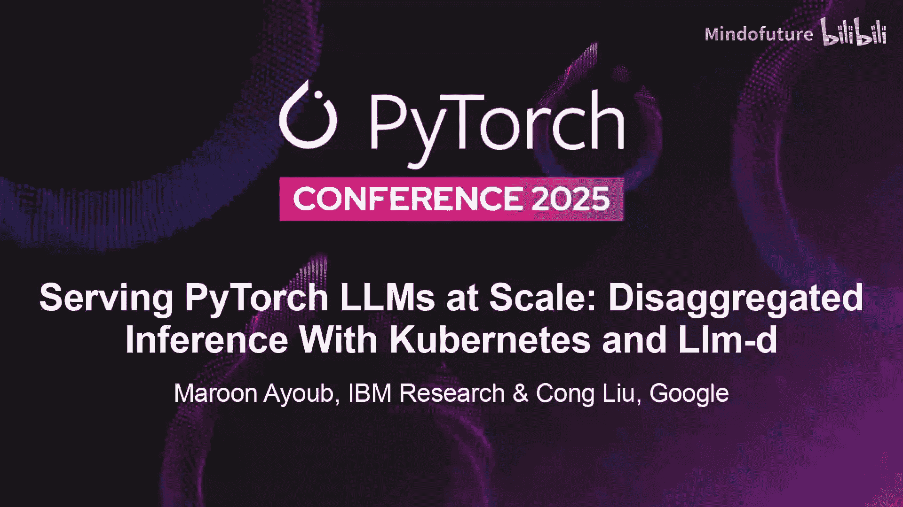
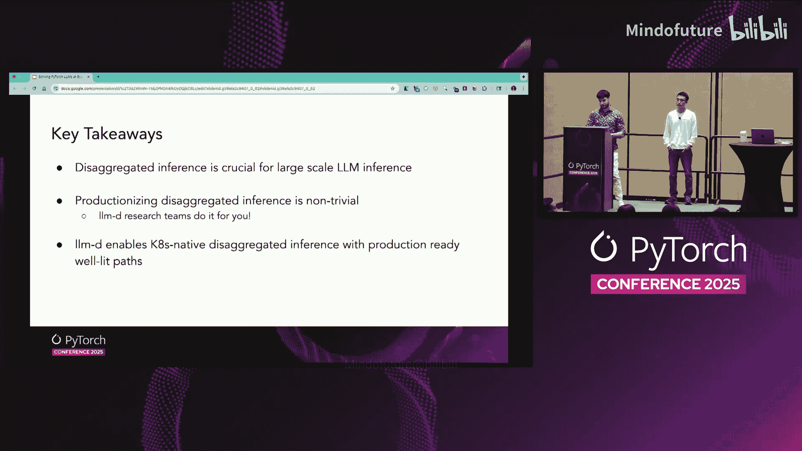
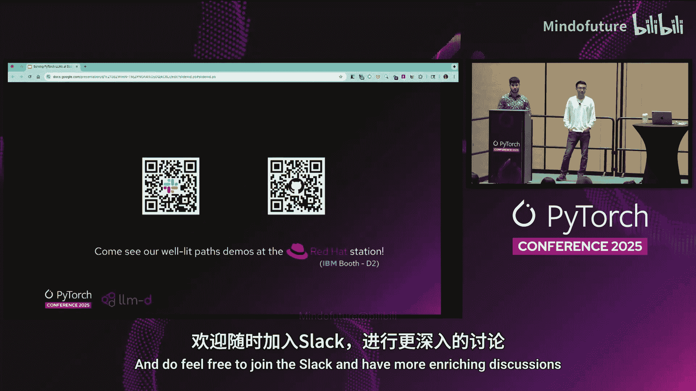
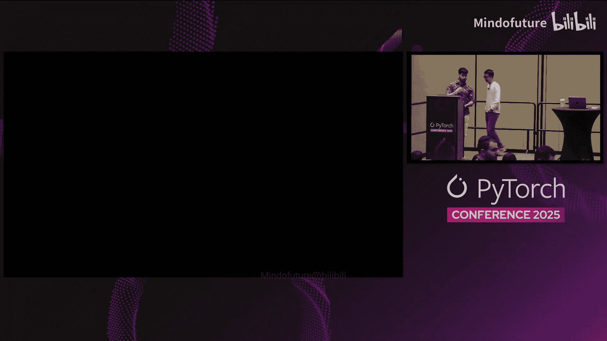

# 044：基于Kubernetes与Llm-d的解耦推理 🚀

## 概述
在本节课中，我们将学习如何利用Kubernetes和Llm-d项目实现大规模语言模型（LLM）的解耦推理服务。我们将重点探讨推理过程中的预填充和解码阶段如何被分离，以及这种分离带来的性能优化和部署灵活性。

---

## 背景：Llm-d项目与PD解耦

上一节我们介绍了课程主题，本节中我们来看看Llm-d项目及其核心思想。

Llm-d是一个开源的、Kubernetes原生的、加速器无关的推理服务栈。它提供了简化的用户指南和可复现的基准测试结果。

下图展示了Llm-d架构的高层视图：

*   顶部是**推理网关**，负责智能推理调度，例如负载感知调度和前缀缓存感知调度。
*   左下角是**推理资源池**，代表用于服务模型的计算机资源池，由vLLM等流行的推理引擎支持。
*   右下角是**工作负载自动扩缩器**，它与推理调度器和推理池无缝协作，接收来自这些组件的信号，并与Kubernetes的水平Pod自动扩缩器配合，以扩缩推理池。

Llm-d并非另一个普通的推理栈。它致力于在生态系统中实现最大程度的开放和标准化。它尽可能重用Kubernetes生态系统中现有的成熟组件，例如Kubernetes Gateway API及其提供商。对于必须构建的新组件，它倡导开放的协议和API。

这意味着您将获得整个技术栈中所有开放组件的最新、最强大的功能，而不会被锁定在特定版本或供应商的实现中。整个技术栈高度可定制，可与您现有的基础设施组合使用。

因此，使用Llm-d，您不仅能在第一天获得简化的部署体验，还能在第二天及以后持续演进、定制和轻松运维。

运行一个生产就绪的推理栈并不容易。Llm-d的“最佳实践指南”旨在提供帮助。这些指南是包含所有最佳实践的简化用户指南和方案。我们通过CI/CD和基准测试定期验证这些指南。

在每个最佳实践指南中，我们会详细记录基础设施的先决条件，例如所需的加速器类型和网络要求，以获得最佳性能。我们提供关于关键参数的高级调优指导。最后，我们提供诸如Helm Chart和YAML清单等方案，您可以在几分钟内完成简化部署。

以下是当前提供的一些最佳实践指南：

*   **智能推理调度**：此指南让您以极少的调优获得负载感知、KV缓存感知和前缀缓存感知调度能力。
*   **精确前缀缓存感知调度**：在此指南中，推理调度器将与vLLM等模型服务器通信，这些服务器会发出KV缓存事件。调度器据此构建缓存的精确索引，并将请求路由到缓存命中率最高的Pod。
*   **PD解耦**：此指南由Maron深入介绍，展示了在H200 GPU上运行Llama 70B模型。它演示了预填充和解码工作负载可以有不同的并行配置，这是解耦带来的好处之一。
*   **专家并行部署**：此指南针对DeepSeek RY模型，展示了如何通过领导者工作集实现多主机推理。

---

## PD解耦的原理与优势

上一节我们了解了Llm-d的概览，本节中我们来深入探讨PD解耦的核心概念。

在LLM推理中，通常有两个阶段。第一阶段称为**预填充**，随后是**解码**阶段。

**预填充**是推理引擎接收提示词、生成第一个令牌，并为每个令牌生成所谓的**KV缓存**的过程。这个阶段直接影响一个关键指标：**首令牌时间**。这是您看到ChatGPT或Gemini的旋转光标并得到第一个输出词所需的时间。

在**解码**阶段，推理引擎会考虑之前所有令牌的KV缓存，逐个生成输出令牌。这直接影响另一个指标：**每输出令牌时间**。

这两个阶段具有非常不同的特征。预填充阶段通常是**计算密集型**的，而解码阶段通常是**内存带宽密集型**的。

**PD解耦**的理念是可以在不同的实例上运行预填充和解码。考虑到它们不同的特征，通过PD解耦，您可以独立地调优、优化和配置预填充与解码。例如，PD解耦允许您在预填充和解码工作负载上运行**异构的加速器**。它还允许您使用**不同的并行配置**，这已在Llm-d的PD解耦最佳实践指南中进行了演示。

---

## Llm-d中PD解耦的实现

上一节我们探讨了PD解耦的原理，本节中我们来看看Llm-d是如何具体实现它的。

这部分内容将更具技术性。所有内容都在Llm-d.ai网站和GitHub上有详细文档。

Llm-d提供了一个支持PD感知的推理调度器。这意味着调度器知晓解耦配置，并据此规划和编排执行。执行由一个与每个解码实例一同部署的**路由边车代理**完成。内部通信或KV缓存的传输通过利用vLLM的NIXEL连接器实现。

以下是推理调度器（PD感知推理调度器）的工作原理：

我们有一个**调度配置文件**的概念，您可以配置调度器如何选择和评估可用的Pod。在此配置中，有三个配置文件：一个是**PD调度编排配置文件**，它负责编排另外两个；另外两个是**预填充配置文件**和**解码配置文件**。

编排器首先协调这两个配置文件。解码配置文件基于负载指标和前缀缓存感知指标选择一个解码Pod。如果需要预填充的新令牌数量超过可配置的阈值，则会激活远程预填充。这是通过激活第二个配置文件（预填充配置文件）并基于负载特征选择一个预填充Pod来实现的。

此编排的执行由解码边车完成。调度器编排选择性的PD解耦，边车执行它。

以下是一个流程示例：如果需要预填充的令牌数量大于阈值，调度器会进行选择，并将请求发送给边车，附带一些头部信息。预填充工作器执行预填充，返回请求，然后解码继续。

在此图中，您可以看到请求到达边车，它将该请求发送给负责预填充的vLLM工作器，并附带一个特殊的头部：`decode_max_tokens`设置为1。一旦预填充完成，它将响应返回给边车。此时，边车继续将请求发送给vLLM解码工作器，同样附带特殊头部：`do_remote_prefill`、`remote_block_ids`（它需要获取的KV块ID）以及用于标识预填充工作器的`engine_id`。

一旦解码工作器开始执行，它在获取KV缓存时不会阻塞。它会继续服务其他请求，同时通过NIXEL连接器以GPU直接访问的方式获取KV缓存。一旦KV缓存获取完毕，它就开始服务该请求，并将响应流式传输回调度器。

关于路由边车：它是Llm-d维护的一个代理，与每个解码Pod一同部署，但不与预填充Pod一起部署。如果不使用PD解耦，它什么都不做，只是一个请求通过的代理。在解耦模式下，它会执行上述描述的功能。

关于KV传输过程：NIXEL连接器是vLLM KV连接器接口的一个实现。NIXEL是NVIDIA的贡献，代表NVIDIA推理交换库，这是一个用于推理栈或框架中加速点对点通信的库。目前它用于PD传输。我们正在努力将其演进为用于点对点缓存共享的通用点对点传输。

---

## 基准测试结果与分析

上一节我们深入了解了实现细节，本节中我们通过基准测试数据来看看PD解耦的实际效果。

总体共识是：调优具有挑战性，并非所有工作负载都适用。

这里展示的是我们在0.2版本中发布的基准测试数据，您可以在Llm-d网站的博客上找到更深入的分析。这是一个在Llama 4部署上的标准帕累托曲线。部署在两个启用InfiniBand RDMA的H200节点上。它比较了标准部署（4个Pod，张量并行度设为4）与解耦部署（4个预填充实例，TP=2；2个解码实例，TP=4）。

该场景涵盖了具有代表性的工作负载，输入输出比分别为10:1和100:1。X轴衡量每用户吞吐量，Y轴是每GPU吞吐量。我们可以看到，在两端，两种部署的性能相似。但在中间部分，PD部署具有明显且显著的优势，因为这些并发配置下，预填充和解码阶段之间的争用会产生显著差异。因此，PD解耦暴露了这些饱和点，并为更好的性能释放了空间。

这些见解对于未来实现更好的自动扩缩、工作负载感知的角色分配至关重要。例如，如果您发现工作负载是预填充密集型的，可以自动扩缩您的预填充工作器或增加其数量，反之亦然。

第二组基准测试数据是在性能较低或更普通的硬件上进行的。在这里，我们没有看到PD解耦带来显著优势，尽管总体表现更好，特别是在低并发点。这里的重点是，获得价值并不简单，调优或找出如何从这些部署中获得价值并不容易。而这正是Llm-d所做的：我们提供这些最佳实践指南，研究这些配置，并提供可用于生产环境的数据、部署方案和见解。

目前我们有两个PD解耦指南：一个是刚才描述的**PD标准指南**，另一个是更高级的**专家并行指南**，涵盖了大型专家混合架构。我们在那里也有很好的数据，未来几个月还会有更多。

---

## 关键要点与最佳实践

基于过去几个月的工作，我们总结了PD解耦的精华和最佳实践。

PD解耦并非适用于所有工作负载的目标。通常应将其用于**大型模型**，例如70B以上，而不是8B或1B。适用于**长输入序列**和长输出序列，例如考虑数千个令牌，而不是数百个。也适用于**稀疏的专家混合架构**。

在专家并行中，情况会变得更复杂。您需要跨数据并行或专家并行秩高效地平衡工作负载。您不希望某些秩在进行解码，而一个秩在进行巨大的预填充，从而阻塞所有其他秩。

此外，还有一些实现细节，例如每个阶段都有专门化和优化的内核。例如，在vLLM中，存在内存占用与CUDA图可用性之间的权衡。您可以选择较小的内存占用但不支持CUDA图，或者较高的内存占用但支持CUDA图。自然地，一种适合预填充，另一种适合解码。因此，在这些部署中，您需要将两者解耦，使它们互不争用，从而实现各自的专门化。

**关键要点**：
1.  解耦推理对于大规模推理至关重要。
2.  将其应用到生产环境并非易事，而这正是Llm-d团队为您所做的：研究团队持续进行研究并提供数据。
3.  Llm-d通过生产就绪的最佳实践指南，实现了Kubernetes原生的解耦推理。

---

## 总结

在本节课中，我们一起学习了如何利用Llm-d和Kubernetes实现LLM推理的预填充与解码阶段解耦。我们了解了Llm-d项目的架构与理念，深入探讨了PD解耦的原理、优势及其在Llm-d中的具体实现方式。通过分析基准测试数据，我们看到了解耦在特定场景下带来的性能提升，也认识到其调优的复杂性和适用的工作负载范围。最后，我们总结了PD解耦的关键实践和要点。Llm-d通过其最佳实践指南，旨在降低大规模、高性能LLM服务部署和运维的复杂性。

感谢聆听。如果您扫描这些二维码，可以加入我们的Slack和GitHub。Llm-d的发展离不开社区贡献，我们邀请您查看我们的GitHub，选择任何“Good First Issue”并加入讨论。我们还会在Red Hat展台进行一些最佳实践指南的演示。

谢谢。

