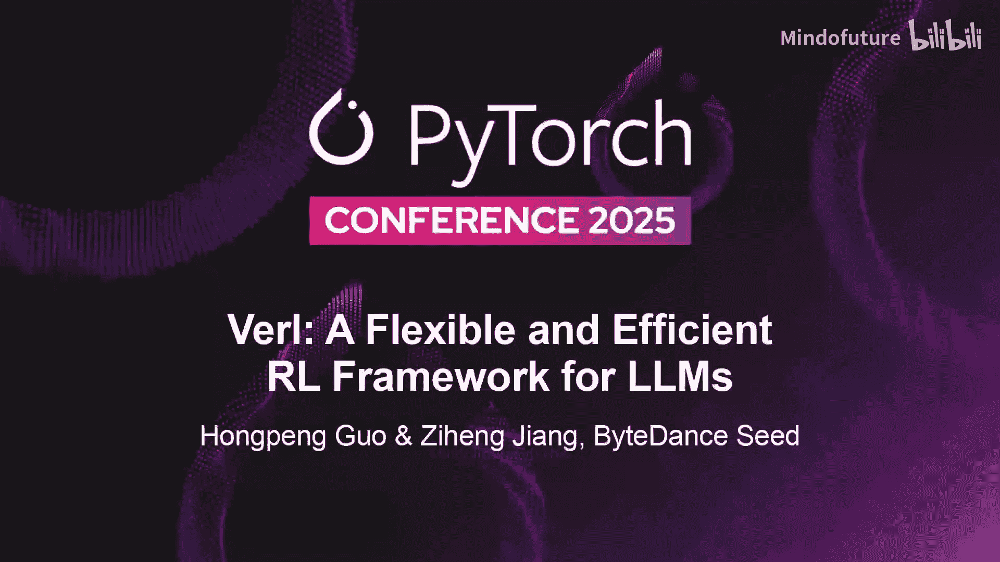
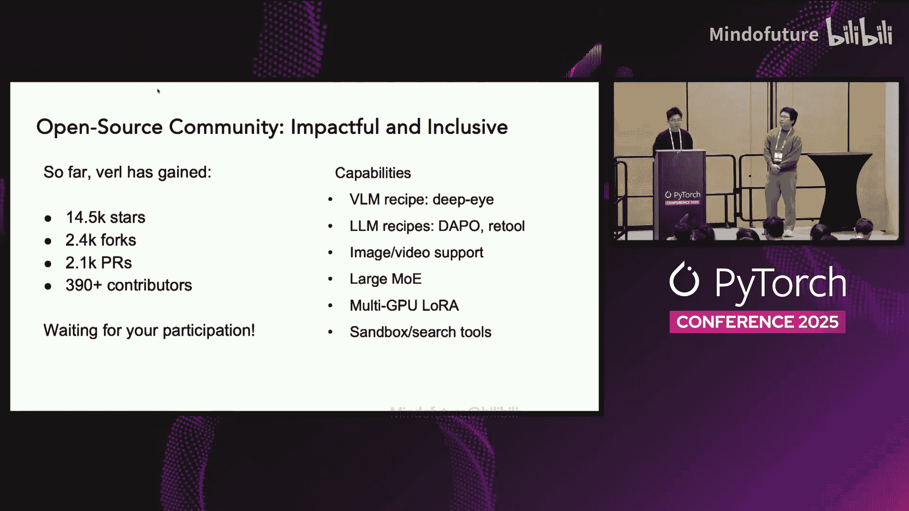
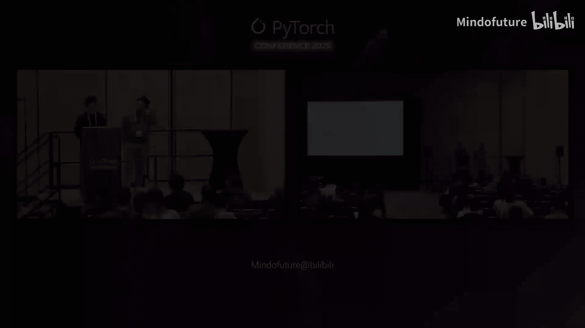

# 045：面向大语言模型的灵活高效强化学习框架



## 概述

在本教程中，我们将学习由字节跳动Seed团队开发的强化学习框架Verl。Verl专为大规模语言模型的强化学习训练而设计，旨在解决传统框架在灵活性、效率和可扩展性方面的挑战。我们将从理解大规模强化学习的重要性开始，逐步探讨Verl的核心设计理念、技术架构、编程模型以及其最新的功能更新和未来路线图。

---

## 章节 1：大规模强化学习的重要性与挑战

上一节我们介绍了本教程的概述，本节中我们来看看为什么大规模强化学习如此重要，以及构建相关系统面临哪些挑战。

大规模强化学习之所以关键，是因为它能显著提升模型的推理能力。例如，在没有强化学习的情况下，像GPT-4这样的模型在数学和逻辑任务上的表现可能平平。但通过大规模强化学习，例如在OpenAI的O1模型中，性能会急剧提升，在数学数据集上的准确率几乎翻倍，接近95%。核心结论是：**大规模强化学习是解锁强大推理能力的关键要素**，在需要大量测试时计算和复杂任务的时代变得越来越重要。

既然我们知道了大规模强化学习的重要性，下一个问题是：为什么为其构建系统如此具有挑战性？

主要原因是强化学习并非单一模型的训练循环，而是一个连接多个模型的复杂数据流。这包括我们正在训练的策略模型、提供反馈的奖励模型、防止策略偏离过远的参考模型，以及估计长期价值的评论家模型。除此之外，我们还有多个工作负载同时发生，例如生成推理、训练和同步，它们紧密耦合。当我们将此扩展到大型语言模型时，像行动者生成或奖励模型推理这样的每个步骤，本身都成为一个巨大的分布式任务。因此，我们实际上是在协调一组大规模分布式工作负载，它们都需要平稳地协同运行。

---

## 章节 2：Verl的设计理念与架构

上一节我们探讨了大规模RL的挑战，本节中我们来看看为什么需要Verl，以及它的核心设计思想。

我们需要Verl来进行大语言模型的强化学习，简短的回答是：因为它既灵活又高效。

在深入Verl的系统设计之前，让我们回顾一些经典的设计选择。

在单控制器系统中，遵循MPMD模型，一个集中式控制器管理所有运行不同程序的工作节点。这种方法非常简单，例如TensorFlow 1.x和Ray就采用了这种设计。另一方面，在多控制器系统中，遵循SPMD模型，每个工作节点都有自己的控制器，并在不同数据上运行相同的程序。这种方式效率更高，你可以在PyTorch和JAX等框架中看到这种设计。然而，这种编程模型使得支持涉及多个模型的复杂异构数据流变得非常困难。

在Verl中，我们提出了一种称为**混合控制器**的新范式。其理念很简单：结合两者的优点。一个中央控制器管理算法逻辑，而多个控制器处理大规模并行执行。这样，我们同时获得了效率和灵活性。

从开发者的角度来看，我们保持了接口的简洁性。它看起来仍然像一个单控制器系统。开发者可以用寥寥几行代码编写完整的强化学习循环，而Verl则在底层处理繁重的分布式计算任务。如下面的代码示例所示，开发者可以简单地在一个进程中编写算法逻辑，复杂的分布式训练被抽象掉了。

```python
# 示例：Verl中的简化RL循环代码
# 开发者只需关注算法逻辑，分布式细节由框架处理
```

除此之外，Verl支持广泛的算法，从PPO、DPO到更前沿的方法如ReMax和DPO。在效率方面，Verl在底层充分利用了多控制器范式。这意味着它支持先进的训练后端，如FSDP、Megatron，以及尖端的生成后端，如vLLM和SGLang。它还集成了现代并行策略，如张量并行、序列并行甚至专家并行，以及优化的内核，如Flash Attention和Triton kernels。这使得Verl既具有可扩展性，又面向未来。

---

## 章节 3：Verl的最新功能更新

上一节我们介绍了Verl的核心架构，本节中我们将了解Verl近期的重要功能更新。

第一个重要的更新是关于**智能体工具调用训练**。近期，社区对于使用强化学习训练LLM使其具备工具调用能力的兴趣日益增长。那么，训练这样的工具调用智能体有何难点呢？

让我们比较一下传统的RLHF风格强化学习（如ChatGPT的训练方式）与智能体工具调用训练之间的差异。

在传统的RLHF风格RL中，策略模型通常只生成文本标记。生成文本后，这些响应会被转发给奖励模型，奖励模型会给出分数。利用这些分数，你可以将所有信息传递给训练器，训练器会更新模型参数，最终得到一个更好的模型。

然而，在智能体工具调用的时代，情况有所不同。策略LLM不仅生成文本标记，还可能生成更多信息。例如，它可以生成上下文、特殊标记，有时还会生成工具调用语法，比如生成代码。对于这样的场景，在代码生成后（假设你正在训练一个代码智能体），所有这些信息都会被转发到一个评估环境中。这可能是一个包含编译器和单元测试的代码沙箱。这个环境会给出反馈，例如你的代码是否正确，或者编译是否成功。当LLM获得这类反馈信号时，它可以决定是否要生成另一次运行。只有在经过几次这样的运行后，最终的轨迹才能被确定，然后所有这些信息才会被转发给奖励模型进行训练。

从图中可以看出，智能体工具调用训练确实相当复杂，尤其是与传统RLHF风格相比。它使LLM变得真正强大和有用，但也为Verl框架带来了新的挑战。那么，我们如何应对这个问题，并从头开始训练真正的工具调用智能体呢？

以下是当我们将所有这些信息纳入训练框架时的一些基本差异。

从前面的描述中，我们可以理解，最大的差异实际上在于**rollout部分**。对于传统的RL生成，rollout接收一批提示，将其输入LLM，LLM会返回一批响应。你只需处理这批响应，等待批次中最慢的一个完成，然后得到一批结果，接着进行奖励计算和训练。

然而，智能体场景与批次版本之间的真正区别在于：在智能体场景中，如果你仍然将一批提示输入LLM并等待一批结果，这将花费太多时间，因为每个样本可能具有非常不同的时间线机制。例如，一个样本可能只与环境交互一次就得到了可运行的代码，而另一个样本可能需要交互很多次。如果你仍然以批次方式处理rollout生成，将会产生大量气泡（空闲等待时间），如上图所示。如果你总是等待最慢的那个样本，自然会浪费大量的GPU和支撑沙箱的CPU资源。

为了在Verl中解决这个问题，我们引入了**异步服务器模式的生成**。在这种模式下，我们可以以逐个样本的方式处理提示，使得每个样本都有自己的时间线。如下图所示，与上半部分相比，许多气泡消失了。这意味着，通过这种编程模型，我们实际上可以减少大量气泡，并为GPU和支撑沙箱的CPU带来更高的硬件利用率。

将这些整合在一起，我们实际上提出了一个采用“token-in, token-out”智能体循环接口的编程框架。基本上，这是一个实现了我们刚才所描述内容的编程模型。

在这个智能体循环中，Verl会处理并创建一个接口，就像LLM与环境之间的桥梁。Verl仍然处理所有逻辑，但它也利用推理引擎（例如vLLM和SGLang）的服务器模式生成API，为接收到的任何单个提示生成响应。此外，在这个智能体循环接口中，你还可以指定任何自定义的智能体工具调用逻辑，例如定义使用哪个硬件沙箱、设置最大交互轮数等。最终，你可以使用这个接口在LLM与环境/沙箱之间建立非常顺畅的桥梁。

还有一点是，在这个编程接口中，我们实际上使用**异步API**来定义许多函数。这样做的好处是，通过这种功能，我们可以支持高并发，从而帮助我们获得更好的GPU和CPU硬件利用率。

第二个我们正在努力的方向是推动Verl支持大型甚至巨型模型的训练，例如拥有3671亿参数的DeepSeek-V3模型。这是一个巨大的MoE模型。目前在我们的代码库中，我们已经有了训练这种巨型MoE模型的有效方案。一个例子是，我们至少可以使用96个H100 GPU来运行它。我们使用微批次训练后端进行训练，并使用跨节点张量并行策略进行推理。我们还有一些验证结果表明损失曲线相当不错，性能非常出色。我们还在进行一些持续的基础设施性能优化，例如低比特量化，以进一步提高整个训练过程的性能。

有了这个方案，我们可以说，使用Verl，你可以将像DeepSeek-V3这样的模型训练成更有趣的推理模型，比如DeepSeek-R1。

除了我提到的前两个方向（智能体工具调用能力和巨型模型支持），实际上我还想提一下在我看来比前两个特性更重要的一点：我们目前正在对Verl库进行一次彻底的重构。这次重构的最终目标是将Verl从一个框架转变为一个越来越易用、标准化的强化学习库。基本上，我们试图将Verl拆分成几个模块，每个模块都有非常清晰和定义良好的API。这样，作为用户，你可以导入其中任何一个模块并自定义它们，以构建你想要的任何强化学习框架和工作流。这是我们让Verl更容易被所有开发者使用的终极目标。

更具体地说，你可以参考这个图表，我们试图将Verl重构为以下五个关键组件：

以下是Verl重构后的五个核心组件：

1.  **Rollout引擎**：负责轨迹生成。
2.  **模型引擎**：处理模型的定义、加载、保存以及非常重要的模型训练方式。
3.  **权重传输引擎**：位于前两者之间，负责在每个步骤中高效地将权重从训练器传输到生成器。
4.  **智能体循环**：我们之前在更新中提到的，是rollout引擎和评估环境之间的桥梁。
5.  **数据传输系统**：可以处理和管理RL数据流，将比我们现有的方案高效得多。

关于这五个组件的设计细节，我们想强调几点。最终，我们希望使Verl成为一个兼容且可定制的标准化强化学习库。

对于第一部分，**Rollout引擎**，我们将完全拥抱**原生服务器模式生成**。原生服务器模式生成就像我们在智能体工具调用场景中展示的那样，它可以接收每个单独的样本并生成结果，没有批次的概念。使用原生服务器模式生成的另一个非常好的点是，它将在rollout部分和模型训练部分之间提供更清晰的分离。这种清晰的分离为我们提供了更好的能力。例如，如果先进的推理引擎社区（如vLLM和SGLang）通过服务器接口发布了任何新功能，我们将能够非常容易地适配所有这些新功能，而无需进行太多修改。我们认为这是长期改进Verl的一个关键点。

我想提到的第二部分是**模型引擎**。对于模型引擎，我们希望最终提供一组非常清晰、定义良好的接口，使模型引擎能够作为服务运行。我们为模型引擎训练提供的一些示例API包括：`model.forward`、`model.backward`、`optimizer.step`、`lr_scheduler.step`。如果你曾有机会看过Synaptic Machines博客上关于他们首个产品Tinker的文章，你会发现他们有着与我们这里定义的非常相似的API。基本上，最终，你可以想象我们希望Verl也拥有这种定义良好的API。作为用户，你可以在我们的函数中定义你的训练操作，最终你可以启动Verl并将其作为RL服务运行。

除了rollout引擎和模型引擎，还有三个组件：我们刚刚提到的权重传输引擎、智能体循环以及数据传输系统。我认为所有这些都非常有趣，并且有很多非常好的设计。我们今天没有时间逐一详述。但如果你感兴趣，非常欢迎你查看GitHub issue，在底部我们为每个组件都准备了相当完善的文档。

除了我提到的三个更新，我们的路线图上当然还有其他同样重要的近期更新，包括：
*   部分rollout和完全异步训练流水线支持。
*   用于rollout（以及可能用于训练）的低比特量化优化。
*   类似于之前演讲者提到的，训练和推理的确定性也是我们考虑的方向。
*   除此之外，我们还计划提供更多的智能体RL训练方案，以及对多模态RL训练的更好支持。

---



## 章节 4：总结与社区

上一节我们详细介绍了Verl的最新进展，本节中我们将对课程进行总结，并了解Verl的活跃社区。

总而言之，Verl已经成为一个非常优秀且活跃的开源社区。自去年此时首次发布以来，在整个一年中，由于众多开源贡献者的贡献，我们已经成长了许多。目前，我们拥有超过1.4万颗星标，超过2000次复刻，约2000个拉取请求，以及大约400位贡献者。Verl能够成长如此迅速，完全归功于大家的贡献。

因为我们拥有大量的训练方案和能力，你可以看到，目前你可以使用Verl来训练各种RL模型、各种算法，以及各种模型和能力。最后，我只想说，我们始终欢迎每个人为Verl做出贡献。我们始终期待你的下一个PR、下一个issue，以及你发现的任何一个bug。非常感谢。这就是我们今天的全部内容。

---

## 本节课总结

在本节课中，我们一起学习了字节跳动的Verl强化学习框架。我们从理解大规模强化学习对提升LLM推理能力的重要性及其系统挑战开始。接着，我们探讨了Verl的核心设计——混合控制器范式，它巧妙结合了单控制器系统的灵活性和多控制器系统的效率，使得开发者可以用简洁的接口编写RL算法，同时框架在底层处理复杂的分布式计算。

然后，我们深入了解了Verl的最新功能更新，重点包括：
1.  **智能体工具调用训练**：通过引入异步服务器模式生成和“token-in, token-out”智能体循环接口，Verl能够高效处理复杂的、交互式的智能体训练场景，显著减少了硬件空闲时间。
2.  **巨型模型支持**：Verl已具备训练如DeepSeek-V3等超大规模MoE模型的能力，并持续进行性能优化。
3.  **库重构计划**：Verl正朝着模块化、标准化的RL库方向重构，计划拆分为Rollout引擎、模型引擎、权重传输引擎、智能体循环和数据传输系统五个清晰组件，以提供更灵活、易用的API。



最后，我们看到了Verl活跃的开源社区和未来的发展方向。Verl作为一个旨在平衡灵活性、效率和可扩展性的框架，正在持续进化，以支持更前沿的RL研究和应用。