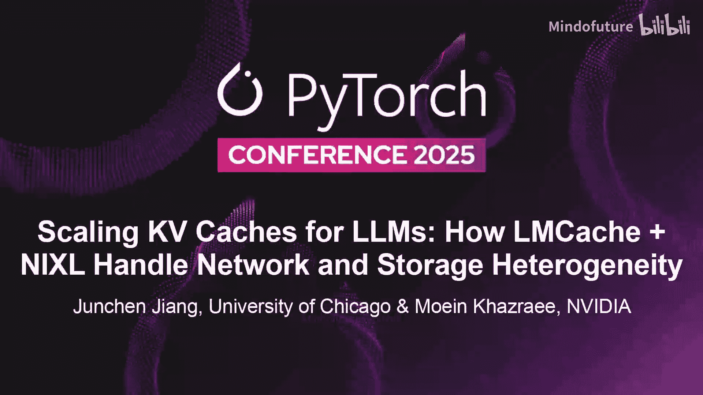
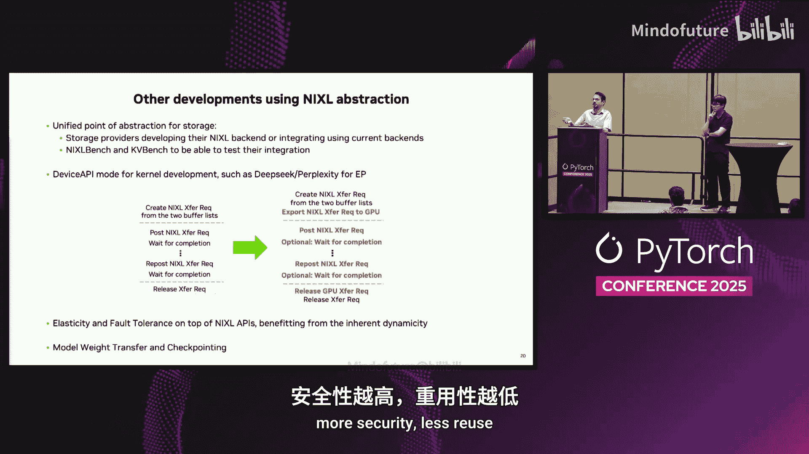

# 048：LMCache + NIXL 如何应对网络与存储挑战

在本节课中，我们将学习如何扩展大语言模型推理中的键值缓存，并了解 LMCache 与 NIXL 库如何协同工作，以应对异构网络与存储环境带来的挑战。我们将深入探讨长上下文推理的系统瓶颈、KV 缓存共享的价值，以及一个统一、高效的传输抽象层如何简化跨设备的数据移动。

## 概述：长上下文推理的系统挑战

大家好，我是来自 Nvidia 的 Moine，今天将与 Junchen 一起为大家介绍如何扩展大语言模型的键值缓存。

我们将探讨 LMCache 和 Nixel 如何应对网络与存储的异构性。让我们开始吧。

我是 Junchen，是芝加哥大学的教员，也是 Arc 实验室的负责人。我们最近基于这个开源项目创立了 Tensor Mesh 初创公司。Arc 项目解决了当前大规模 AI 模型推理中的一个关键问题，我稍后会解释原因。我们在展区有一个展位，欢迎大家前来与我们的工程师交流，体验加速效果。展位就在出口大厅领取免费物品的旁边，欢迎大家前往。

LMCache 的重要性源于一个事实：推理的规模将远大于训练。众所周知，如今只有少数几家公司关心训练新模型，而大多数公司都在运行这些模型的推理，即提供服务。例如，微软预测今年将有数亿个应用程序运行 AI 推理，主要是某种形式的大语言模型推理。业界普遍认识到，如今的应用程序如果不包含基于大语言模型推理的组件，将是不可思议的。这就是为什么市场对大语言模型推理和服务的热情如此高涨。

从系统角度来看，我们系统研究员和工程师之所以如此关注，是因为大语言模型的推理使系统变得复杂了数百万倍。在这些为各种目的预训练或训练的大语言模型背后，是一个非常复杂的系统。特别是，从系统可扩展性的角度来看，大语言模型如此有趣的一个原因是所谓的**长上下文推理**。

长上下文推理是这些大语言模型能够在现实世界中生存的根本原因。人们想使用大语言模型，不是因为其规模庞大，而是因为模型有能力从你提供的任何内容中学习。你可以提供一份长文档作为模型回答问题前的上下文；你可以要求它在编写测试用例前处理一个大型代码仓库；你可以让它观看你迄今为止收集的所有视频以生成摘要。所有这些多模态应用，最终都归结为长上下文推理，即模型理解长上下文的能力。优秀的工程师会充分利用上下文窗口。

但结果是，上下文变长了。上下文越长，系统问题就越具挑战性，特别是推理速度越慢，成本越高。速度慢是因为输入中的令牌越多，需要为这些额外令牌进行的计算就越多。成本高是因为需要更多的 GPU 周期来处理所有这些输入。更糟糕的是，在用户看到模型生成的第一个令牌之前，模型必须完成**预填充阶段**。

这确实是一个非常棘手的问题，因为上下文越长，模型越有用，但用户的首次响应等待时间也越长。这就是我们所说的**首令牌时间**。更糟糕的是，想象一下，如果你运行一个大规模推理服务，系统中有多个推理引擎在运行。

不同用户带着不同的查询和不同的上下文到来。例如，每次让模型读取上下文，可能需要几秒到几十秒。正如你在这个动画中看到的，这确实非常慢。

但一旦你意识到一点：这些上下文是可以共享的。通常，同一份文档会被用作不同查询的上下文；同一段视频会被用作不同查询的上下文；同一用户历史会被用作不同查询的上下文。这种共享性使得在不同引擎、不同查询之间共享中间数据结构成为可能。具体来说，我们谈论的这个可共享的东西就是 **KV 缓存**。

KV 缓存与键值存储无关。KV 缓存是两个被称为 K 张量和 V 张量的大张量。它们是大型张量，可以在不同查询之间重用。想象一下，如果你为被重复使用的共享上下文（例如同一份文档）存储了 KV 缓存，那么这个 KV 缓存可以直接发送给推理引擎。引擎不再需要处理上下文，而是直接将 KV 缓存加载到 GPU 内存中。如果处理得当，这会非常快。这样，所有这些查询都可以非常迅速地完成，前提是你能高效地将 KV 缓存传输到 GPU 内存中。

这个理念的口号是：**你只需预填充一次**。你预填充某些内容，然后在不同查询、不同引擎之间重用这个 KV 缓存。

显然，对于系统研究员和工程师来说，接下来会问：如何在不同引擎之间移动 KV 缓存？对于专家来说，问题会更深入：这些 KV 缓存非常大，如何在不同设备、不同 GPU 内存、不同 CPU 内存等之间高效地移动它们？这正是当前工业界正在发生的趋势。

传统上，KV 缓存由大语言模型内部创建，并在每次查询后被丢弃。这限制了 KV 缓存仅能存储在单个查询时间跨度内的 GPU 内存中。现在的趋势是将 KV 缓存移出 GPU 内存，用于各种目的。有些优化将 KV 缓存存储在 CPU 内存、磁盘或本地存储中，以便同一模型、同一引擎稍后可以重用。有些优化通过网络在不同引擎之间共享 KV 缓存。还有一些更复杂的优化，例如预填充与解码分离。我们没有时间深入细节，但其核心思想是在同一查询的两个阶段（运行在不同引擎上）之间共享 KV 缓存。

所有这些优化都有一个共同的需求：需要一个支持 KV 缓存在不同位置分布式共享的语义层。它需要支持 GPU 到 GPU 的传输，需要支持 GPU 到 CPU 的卸载，需要支持 CPU 到 CPU 跨存储的卸载。

从视觉上看，这就是它的样子：需要一个通信层，支持推理引擎之间、GPU 内存之间（通过 CPU、以太网、RDMA 等）的通信，并作为一个中间层，连接所有这些复杂的存储设备、存储服务和推理引擎。无论是垂直还是水平方向，都需要支持 KV 缓存优化的语义。

LMCache 是当前流行的库之一，也可能是应用最广泛的。它被广泛用于不同的引擎，支持 VM、S 以及上面列出的所有推理框架。该项目最近也成为了 PyTorch 基金会生态项目。许多公司不仅在测试，也在生产环境中使用它。

那么，我们今天为什么要进行这场对话？我和 Moine 想特别谈谈这类库在现实世界中面临的一个挑战，这不一定是速度问题，而是**兼容性**问题。因为这个库并非存在于真空中，它需要与各种引擎、各种网络设备、各种存储服务协同工作。需要有一个统一的解决方案，让这个库能与所有这些环境和生态系统组件完美、顺畅地工作。这就是接下来 Moine 要讲的内容。

## 异构环境下的新挑战与需求

正如前面提到的，网络和存储设备的异构性给推理带来了新的挑战和需求。

首先，我们不仅存在内存的异构性，存储也可能是异构的。计算资源也可能是异构的，例如不同版本的 GPU。因此，我们寻求**资源解耦**。正如 Junchen 所说，我们需要一个统一的 API，能够跨越所有这些异构资源，消除负担。这个 API 需要能够跨网络和存储工作。

除此之外，推理还有一个新的特定需求：工作负载非常**动态**。例如，用户需求在一天中可能发生变化。在运行过程中，我们可能发现需要更多的预填充节点或解码节点，并希望动态调整。因此，我们需要**细粒度的资源分配**和**自动扩缩容**。

当然，我们始终面临**大规模**的挑战。我们有数百万用户和请求，数十万个节点。我们需要一个具有低延迟和高吞吐量的分布式计算方案。

为此，我们引入了 **Nvidia 推理传输库 NIXL**。它通过统一的 API 实现高性能和低延迟，支持这种异构性，并支持细粒度的动态扩缩容。

## NIXL 设计：统一抽象与高效传输

为了实现大规模和高性能，我们做了以下工作：使所有操作都是**异步非阻塞**的，这样你可以重叠计算和通信。同时，我们支持**非连续内存**和**零拷贝**。这意味着，例如，你可以直接对另一个节点进行读写，而无需在内核缓冲区中进行额外的拷贝。

现在让我谈谈 NIXL 的设计，我们如何提供一个非常简单的抽象来涵盖所有这些功能。

我们引入了尽可能简单的 **BufferList** 原语。想象一下，你有 8 个 GPU，你可以说“在这个 GPU 的这个地址，有这些链接”。如果你有一个这样的列表，你就可以描述 GPU 内存。类似地，如果你有一些文件，你可以说“在这个文件的这个地址，有这些链接”。我们提出了这个 BufferList 原语。

具体操作是：假设你在多个节点上有多个进程，你在每个进程上实例化一个 NIXL 代理。这个代理可以管理一个或多个 GPU。在这个 NIXL 代理内部，你可以声明“这是一个 GPU 的 BufferList”，“这是一个 CPU 的 BufferList”。然后，当你给 NIXL 两个 BufferList（例如一个来自本地代理，一个来自另一个代理）时，你可以说“我想在它们之间进行传输”。

如前所述，所有操作都是异步的。NIXL 会异步地返回一个传输句柄给你。然后你可以提交这个传输，这意味着开始传输，并可以异步检查传输何时完成。我们将创建和提交分离，原因是一些工作负载可能希望更新内存中的同一位置，我们不需要重新创建传输，这称为**重新提交**。

此外，我们还有一些 API，即使你只是想估算传输时间，以决定是应该重新计算还是应该传输。操作包括读和写。当你进行读写操作时，一方面你可以检查操作何时完成，另一方面（可选）你可以发送一个操作完成的通知。

通过这个跨越所有异构设备的抽象，LMCache 就可以使用 NIXL。现在让我深入一点，看看 NIXL 在底层是如何工作的。

我们有两个主要组件：用于本地注册内存和簿记的**内存部分**，以及用于远程代理的**元数据处理器**。这就是我们实现动态性、轻松添加和移除节点的方式。

至于我们如何实现传输效率，我们是站在巨人的肩膀上，不重复造轮子。已经有一些库可以实现接近光速的传输，例如 UCX。我们所做的是为这些库编写一个轻量级的插件或包装器，为特定库准备传输。当传输开始时，我们告诉该库为我们执行传输，以达到最佳速度。这里我展示了当前可用的传输后端（已在 GitHub 开源）以及即将推出的后端。

其中，UCX、Moongen 和 Libfabric 用于网络传输，例如，如果你想在预填充节点和解码节点之间进行解耦，或者想为强化学习更新模型。我们也有用于其他场景的设备 API，正在开发中。例如，如果你想在 GPU 上运行某些操作，我们也支持 GPU 直接启动的流式传输。

最后，我们有几个存储后端：通过 Linux 的 GPU 直接存储访问项目、用于对象存储的 S3 FS，以及 A3RDA 和块存储后端即将推出。此外，一些合作伙伴可能希望为其特定用例定制后端，他们仍然可以使用 NIXL 库。

说到这里，现在让我稍微介绍一下内存部分和抽象。

向 NIXL 注册时，我们并不分配内存，只是**注册**，意味着你获得了使用这块内存的权限。我们有五种类型的内存空间：`HOST` 用于主机内存，`CUDA` 用于 GPU，`FILE` 用于文件，`NVME` 和 `BLOCK` 用于 SSD，`OBJECT` 用于对象存储。

我提到的抽象可以这样理解：假设我们有块设备、CUDA 和主机内存。卷 ID、GPU ID 可以作为设备 ID。对于主机内存，我们可以使用 0，或者如果你想分配区域，可以指定一些数字作为设备 ID。地址和长度则用于指定内存中的具体位置。

对于文件和对象存储，文件描述符或对象键可以作为设备 ID。由于它们是更高级的抽象，你有两种使用模式：一种是将地址和长度设为零，这意味着你将任意追加到文件中；另一种是指定从某个偏移量开始、特定长度的部分进行访问。如前所述，向 NIXL 注册就是授予访问权限。

另一点是，在注册过程中，我们有时需要一些额外信息。例如，对于文件，你可能需要传递文件路径。对于对象存储，通常有很多存储桶，每个桶里有一些对象，每个对象有多个可能很长的键（比如 1KB 或 8KB）。我们的做法是：设备 ID 是一个 64 位的值。在注册时，你传递这个 64 位值（它可以是实际键的一部分），然后说明完整的键是在哪个桶、哪个对象、哪个键下。当你想进行传输时，就用这个设备 ID 来引用它们。因此，这个抽象可以覆盖所有这些不同类型的内存。

好处是，你可以为 GPU 内存、主机内存、SSD 或网络存储等分别创建一个 BufferList。当你想进行传输时，只需使用其中两个 BufferList 并发出指令即可。这样，你就可以轻松实现多级缓存。需要澄清的一点是：**NIXL 负责为你执行数据传输**，而像 LMCache 这样的库则决定数据需要去哪里。我们提供跨越所有这些类型网络设备和存储的抽象。

下一个重要部分是**元数据处理器**，这是我们实现动态性的方式。假设两个节点想要相互通信，我需要一些连接信息和已注册的内存信息。如果我想向别人写入或读取，我需要一些密钥，我不希望任意的人都能写入。因此，我们将所有必要的信息抽象成我们称之为**元数据**的东西。

简单来说，如果代理 A 想与代理 B 通信，我们在注册后从代理 B 获取元数据，然后交给代理 A，代理 A 就能与代理 B 通信了。我们也可以说“忘记代理 B”，这样它就无法再通信了。我们称之为**直接路径**。此外，作为附加功能，你还可以使用套接字模式，监听某个端口以便在代理之间传递元数据；或者使用 ETCD，如果你想使用一个中心化位置（例如我们的测试引擎就使用了这种方式）。

我们考虑了最小信息暴露。如果一个节点只是内部代理，我们不会将信息暴露给外部。我们甚至支持保护机制，如果你只想将部分内存的访问权限授予特定代理。

## 示例与应用集成

我将通过两个例子来说明。

例如，假设我们有两个节点，以 UCX 为例。你初始化代理，代理名称可以是任意字符串。然后初始化后端，注册内存以授予访问权限。注册后，你获取元数据，将其交给另一个代理，并发送数据接收位置信息。你创建两个 BufferList，然后提交传输，等待完成。假设我们使用同一个传输句柄，我们可以重新提交并等待。可选地，可以设置通知。一个好处是，在接收端获取通知时，你甚至不需要知道是谁发送的数据，只需调用获取通知的 API，发送方代理的名称就会出现，无需任何中心化的同步。最后，你可以释放传输、注销内存并使对方的元数据失效。使元数据失效可以在运行时任何时刻发生，这就是我们在 NIXL 中实现轻松弹性的方式。同样，所有操作都是异步的，因此你可以同时进行多个传输请求。

当我们涉及存储时，我们不想重复造轮子，也不意味着存储点必须运行 NIXL 代理。我们的做法很简单：我们已经有了分布式存储，只需将其本地挂载。然后，和之前一样，我们创建一个指向该分布式存储的文件，然后说“从 GPU 复制到那个文件”。在底层，由于使用了分布式存储，它会直接进入分布式存储。从用户的角度看，API 是完全相同的。

回到正题，我们与 LMCache 进行了集成。简单来说，在配置文件中，除了设置块大小等参数，你还可以设置缓冲区设备（可以是 CPU，如果使用 GPU 直接存储也可以是 GPU）。你可以启用 NIXL，指定要使用的存储后端。例如，你可以说后端使用 `Posix`，池大小为 64，挂载点在某个位置。或者，如果你想使用对象存储，可以说后端是 `Object`，然后传递访问密钥、秘密密钥、存储桶和区域信息。就这么简单，你就可以连接到你所拥有的存储设备了。

为了展示一些结果，我们在 100 个 GPU 和分布式存储上运行了 Qu3 模型（未使用预填充缓存）。即使在 1K 输入序列长度下，首令牌时间也显示出使用存储的优势。正如 Junchen 提到的，如果我已有 1000 输入序列长度的结果，我就已经赢了。如果我有一个非常快的存储，那么随着输入序列长度的增加，优势会变得更大。

## 未来工作与总结

我们正在考虑和进行中的与 NIXL 相关的工作包括：首先，正如所说，它是一个统一的抽象点。我们正与不同的存储提供商合作，要么他们为我们开发新的插件，要么使用我们现有的插件来访问。我们提供了 NIXL 基准测试和 KVBch 工具供他们进行初步测试。

设备 API 模式，例如用于 GPU 直接启动的 CUDA 流，我们昨天已经为此提交了拉取请求。同样，API 非常相似，只是你将传输句柄导出到 GPU，然后在 GPU 本身上执行提交和其他操作。

如前所述，NIXL 本身具有动态性，因此弹性和容错是可实现的。我们需要一些软件支持来为不同平台启用这些功能。

此外，还有其他工作，例如模型权重传输（在开始时）、将模型扩展到更多节点，或者用于检查点保存。对于所有这些用例，你也可以使用 NIXL。

本节课中，我们一起学习了扩展大语言模型 KV 缓存的重要性，特别是针对长上下文推理带来的系统挑战。我们探讨了 KV 缓存共享如何显著提升效率，并深入了解了 NIXL 库如何通过其统一的 BufferList 抽象和异步、零拷贝传输机制，为 LMCache 等系统提供强大的跨异构网络与存储的数据移动能力。这种结合使得构建高效、弹性且兼容性强的分布式大语言模型推理服务成为可能。