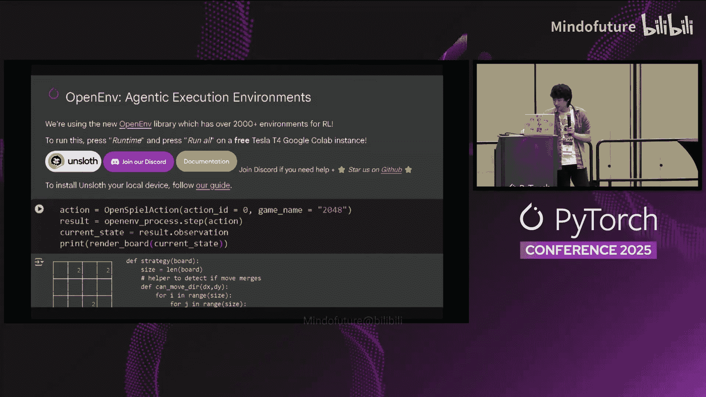

# 049：教程

在本教程中，我们将探讨强化学习（RL）中“运气”的概念，并学习如何通过算法、奖励函数设计和工程优化来最大化这种“运气”，从而更高效地训练模型。

---

## 概述：什么是强化学习中的“运气”？

强化学习并非纯粹的运气。然而，我们可以将“运气”理解为模型在探索过程中，偶然产生一个高质量输出的概率。核心在于，只要模型有非零的概率生成一个好的答案，通过足够的耐心和正确的策略，我们就能引导模型学习并强化这种行为。

上一节我们介绍了“运气”的基本概念，本节中我们来看看强化学习的具体目标。

## 强化学习的目标

强化学习的目标是调整语言模型的输出概率分布。以一个简单的数学问题为例：模型初始时对所有答案（如“猫”、“狗”、“3”、“4”）赋予均匀的概率。当模型输出一个错误但接近的答案（如“3”）时，强化学习算法会轻微提升“3”的概率，同时降低其他明显错误答案的概率。这个过程持续进行，直到模型偶然输出正确答案“4”，此时算法会大幅提升“4”的概率。

用公式描述，我们希望调整模型的输出概率分布 \( P(\text{output}) \)，使得：
*   对于奖励 \( R \) 高的输出，增加其概率：\( P(\text{good}) \uparrow \)
*   对于奖励 \( R \) 低的输出，降低其概率：\( P(\text{bad}) \downarrow \)

初始时，由于没有“好答案”，整个分布只是在降低坏答案的概率，直到一个“好答案”偶然出现。

## 如何最大化“运气”？

仅仅等待模型偶然产生好答案效率低下。为了最大化这种“运气”，我们可以从以下三个方面着手。

以下是三个核心的优化方向：

1.  **设计更好的算法**：例如，GPO（GRPO）等算法在PPO基础上进行了优化，通过删除模型组件来节省内存、提升训练效率。
2.  **设计更好的奖励函数**：单一的二元奖励（对/错）需要极长的等待时间。我们可以设计更丰富、更细致的奖励信号来加速学习。
3.  **提升工程效率（耐心）**：通过加速推理、降低内存占用等方式，在相同时间内进行更多次的模型“尝试”，从而更快地遇到“好运气”。

接下来，我们将详细探讨奖励函数的设计。

## 设计更好的奖励函数 🎯

一个精心设计的奖励函数可以为模型提供更清晰、更及时的学习信号，而不仅仅是等待最终的“对/错”。

以下是几种奖励函数的设计思路：

*   **代码执行与验证**：对于让模型生成代码的任务（如玩2048游戏），如果代码无法运行，则给予负奖励；如果代码能运行并取得一定分数，则给予正奖励；如果达成最终目标（如合成2048），则给予极高的奖励。
*   **格式与规则检查**：使用正则表达式确保输出格式正确。在数学解题中，确保最终答案的格式符合要求。
*   **使用大模型作为评判员（LLM-as-a-Judge）**：调用另一个大模型来评估输出过程的质量，例如评估推理步骤的合理性，这被称为过程监督（Process Supervision）。
*   **业务指标对齐**：在股票交易等任务中，直接以利润作为奖励，盈利则正奖励，亏损则负奖励。

通过组合多种奖励信号，我们可以更有效地引导模型，减少它盲目探索的时间。

## 加速训练与推理 ⚡

随着任务复杂度和环境数量（目标可能是数万亿个）的增长，推理过程将占据绝大部分计算时间。因此，提升推理速度至关重要。

以下是提升效率的关键技术：

*   **加速推理**：使用优化后的推理框架（如Unsloth针对RL的优化）来减少单次推理耗时。
*   **低精度计算**：采用FP8等低精度格式进行训练和推理，可以显著降低内存占用并提升速度。
*   **长上下文优化**：为了支持超长上下文训练（如无限上下文），需要使用稀疏注意力等算法来提升效率。
*   **大规模并行与批处理**：研究表明，使用大批次（large batch）进行训练，虽然在初期可能落后，但长期来看效果更好。同时，降低内存占用可以实现更多实验的并行运行。
*   **高效的参数微调**：通过精心选择参数（例如LoRA的配置），可以达到与全参数微调相近的效果，但成本更低。

这些工程优化使得我们能够在有限的计算资源下，进行更多轮的尝试和探索，实质上是增加了“遇到好运”的频率。

## 面临的挑战与开放问题 ❓

在追求最大化“运气”和扩展强化学习规模的过程中，我们面临一个核心挑战：奖励黑客（Reward Hacking）。

由于强化学习通常只监督最终输出，模型可能会学习到一些“怪异”但能获得高奖励的行为模式。例如，在回答“2+2”时，模型可能先输出一段乱码，再输出“4”。虽然最终答案正确，但其内部推理过程可能是无意义的。如果大规模扩展强化学习，这种“奖励黑客”行为是否会主导模型的学习，仍然是一个悬而未决的开放性问题。

## 总结

本节课中我们一起学习了强化学习中“运气最大化”的策略。我们了解到：

1.  强化学习的本质是通过调整概率分布来增加好答案的出现几率，这需要“耐心”等待初始的成功信号。
2.  我们可以通过**设计更精细的奖励函数**（如代码验证、过程监督）来加速这一过程。
3.  **工程优化**（如加速推理、低精度计算、高效参数微调）是扩大探索范围、更快遇见“好运”的关键。
4.  最终，大规模强化学习面临**奖励黑客**等根本性挑战，其长期影响仍需持续研究。

强化学习并非被动的等待，而是一场通过算法、奖励设计和系统工程来主动管理和最大化“偶然成功”的智慧之旅。