# 050：从模型到信任——构建防篡改机器学习元数据记录

在本教程中，我们将探讨机器学习模型在供应链中面临的安全风险，并学习如何使用模型签名技术来验证模型的完整性和来源，从而构建防篡改的机器学习元数据记录。

## 问题背景：AI供应链的安全挑战

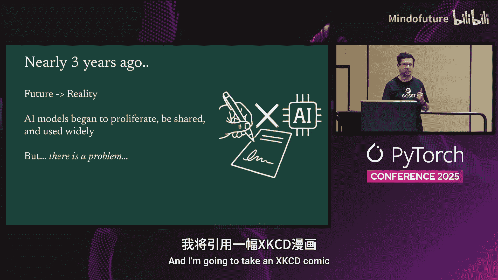

大家好。欢迎来到本次分享。这将是另一个关于安全和机器学习的演讲，类似于你们从Donsng那里听到的主题演讲。

我是来自谷歌开源安全团队的Mihai Maruseac。我将在我的个人主页上撰写博客，并讨论我们如何驯服机器学习的“狂野西部”。

问题在于，大约三年前，确切地说是一个月零一周前，当ChatGPT发布时，我们在科幻书籍和电影中看到的许多未来场景变成了现实。我们开始看到AI模型激增、被分享、被公开使用。但问题依然存在。

我将引用一个XKCD漫画来开始：顶部是我们这三周、这些年看到的所有酷炫的AI项目。但底部那一小块是AI供应链安全。这就是我在这里需要解决的问题。而Don S正在解决的是，一旦我们构建了AI，如何安全地使用它。

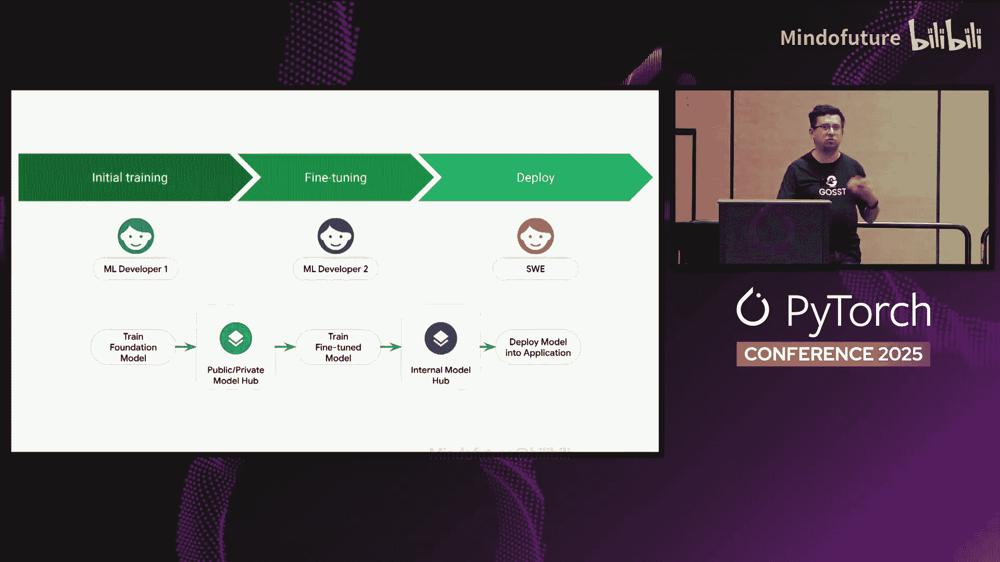

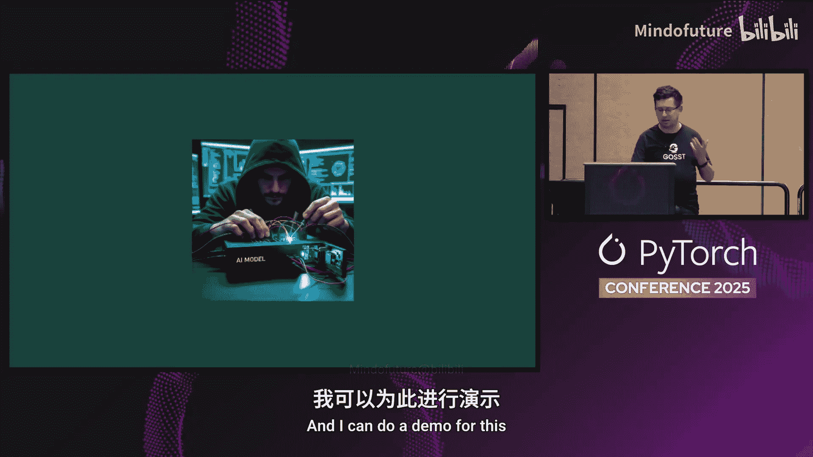

## 为什么这是个普遍问题？

当有人将AI产品用于应用程序时，他们通常不会自己训练模型、微调模型并完成所有工作。通常，你有大公司对模型进行微调。然后有一个中间层，其他公司或同一家公司为特定应用微调模型。最后，模型被部署到应用程序中，升级为生产模型并投入应用。

在这些阶段之间，有三个独立的团队，他们通过将模型放入一些模型中心来进行沟通，而不是通过U盘在内部传递模型。

现在，拥有存储权限的人可以在模型存放处篡改模型。微调模型的人可能在微调过程中注入恶意行为。训练模型的人，如果他们像国家行为体或被国家行为体收买，也可能注入恶意行为。这就是我们想要解决的问题。

## 演示：一个简单的攻击场景

我可以为此做一个演示。希望它能成功。假设我是一个训练者，我将训练一个简单的...

PyTorch模型。好的，这是一个用于数字识别的简单PyTorch模型，因为我们不想在演示中花费太多时间训练。所以它只训练了5个epoch来进行数字识别。训练完成后，我将把它上传到我拥有的一个模型中心，以展示某人如何破坏它。

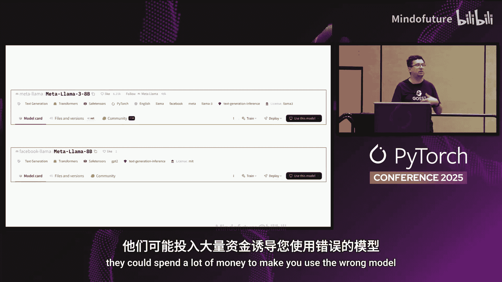

再有两个epoch。快一点运行。好的，现在训练完成了。我将运行 `upload.py`。以及模型的名字。将其复制到中心。

现在模型在中心里了，我可以切换到用户角色。下载模型。他们下载模型。然后，使用它。使用PyTorch模型。好的，在这个脚本中，我基本上取一张图片并运行模型来识别图片中的数字。因为成功了，它告诉我图片是7。

好的，现在因为这是一个我可以访问的模型中心，让我实际攻击这个模型。所以运行 `hack_pytorch_model.py`。这个脚本在我拥有存储访问权限时，修改模型使其行为异常，不仅仅是进行数字识别。

现在，切换回用户，假设用户刚刚下载模型。他们不知道模型已被我破坏。他们得到模型，当他们尝试运行时，数据就泄露了。而模型仍然识别数字是7。所以从用户的角度来看，一切正常。但数据泄露了。

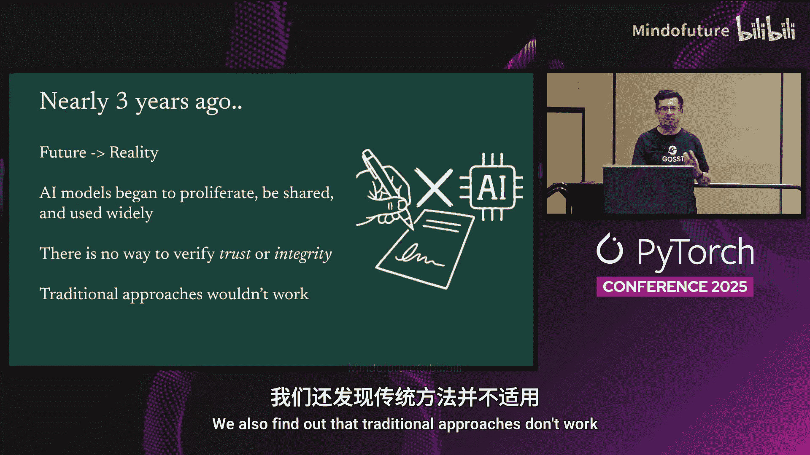

这就是我试图解决的问题。这不仅仅是我在这里创建的一个假设场景。这实际上发生过。去年，TikTok解雇了一名实习生，因为该实习生破坏训练过程以损害另一名实习生正在训练的模型，只是为了取得领先。

这是现实中发生的事情。我们正试图防止这种情况发生。

即使你访问Hugging Face，也有两个名为“meta-llama”的模型提供者。一个是meta-llama，另一个是Facebook-llama。只有其中一个是真正的Meta公司。另一个是一些研究人员试图证明仅依赖模型名称对于安全原因来说是不够的。所以你可能会受到损害，得到一个不按预期工作的模型。

当然，现在如果你查看所有其他指标，比如星标数量、模型中的文件等等，你可以猜出这两个模型中哪一个是真正的。但所有这些其他指标都是可被操纵的。所以有人可以操纵它们，特别是国家行为体。他们可以花很多钱让你使用他们自己的模型。

## 核心结论与挑战

结论是，尽管三年前随着GPT的发布和LLMs的爆发，未来变成了现实，但我们仍然无法验证正在使用的模型的完整性。我们无法验证正在使用的模型就是被训练的那个模型。同时，我们也无法验证模型生产者的可信度。我们从某个地方得到一个模型，但我们无法知道给我们模型的身份就是实际训练模型的那个身份。

这就是我们试图解决的问题。我们还发现传统方法不起作用。这是因为模型有点不同。模型不仅仅是一个单一文件。而且还有多种格式。通常作为训练者，你试图以尽可能多的格式存储权重。例如PyTorch的 `.pt` 或 `.pth` 文件，TensorFlow的SavedModel，GGUF格式等等。

但作为用户，你只关心你正在使用的格式。所以如果我使用PyTorch框架，我只关心PyTorch格式的权重，不关心所有其他格式的权重。

因此，为了提供完整性，作为训练者，你必须为你支持的所有格式生成完整性检查。但作为用户，你只关心特定的框架。此外，当模型发生变化时，比如微调、量化等，只有模型的部分发生变化。因为通常模型很大，你不想花费时间在每次只有特定部分变化时重新计算模型的完整性（重新哈希）。

由于这些原因，我们实际上必须实施一个不同的解决方案。

## 解决方案：基于证明的模型完整性

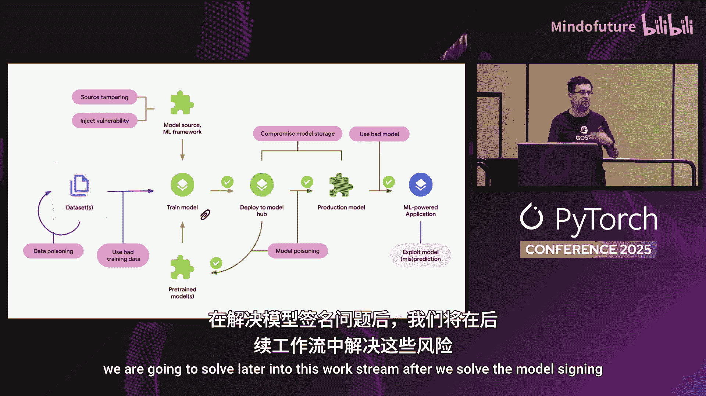

我们从零开始，首先思考我们需要答案的问题。其中之一是：谁训练了模型？我们想确保声称训练了模型的人就是实际训练它的人。我们想确定模型自训练以来是否被微调过，或者是否被篡改过。对于所有这些答案，我们希望确保它们是防篡改的，没有人可以仅仅提出一个声明（比如README文件中的一行，其他人以后可以编辑）。

我们回顾了传统软件（不使用ML的软件）。它们有“证明”这个概念。基本上，证明是关于一个工件的声明。在传统软件中，我们有两种类型的声明。一种是完整性声明，在ML世界中就是“这个模型有这个特定的哈希值”。另一种是来源声明，在ML世界中就是“这个模型是由这个特定的训练者在特定的数据集上、使用特定的框架、在这个提交版本上、通过这个流程训练的”。

同样，你有哈希值。对于ML，我们有另一种类型的证明，即通用级别的属性。我们可以说这个模型在特定的基准数据集上表现如何，或者特定于模型的模型卡是这个。一旦你使其防篡改，你就不能再为了吸引更多用户而事后修改模型卡。

对于所有这些声明，其基础是关于“此声明由特定身份证明”的部分，基本上是一个加密签名，这就是你在这里试图解决的问题。

回顾模型是如何开发的：你从数据集开始，可以对其进行迭代、清理等。然后在某个时刻，你开始训练模型，使用像PyTorch这样的ML框架将模型架构写入某个Python文件，你可能从一些预训练模型开始（特别是如果你在进行微调），你将所有这些部分组合在一起并训练一个模型。

在完整性保护方面，这就是我们想要对模型进行签名的地方。所以生成模型上的签名，对模型进行哈希处理并签署该哈希值。然后，一旦模型训练完成，模型被放入模型中心以供后续使用，无论是用于进一步的训练轮次，还是你可以将模型升级到生产环境。另一个团队接手并将其投入生产。然后它被用于AI应用程序。对于所有这些阶段，我们都希望实际验证模型的完整性以验证签名。

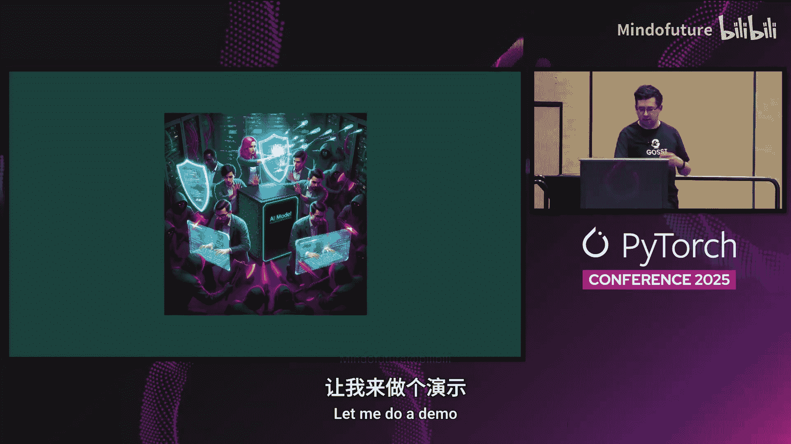

在这个图表中，我们还有其他供应链风险，我们将在解决模型签名问题之后，在这个工作流中稍后解决。

## 现状：模型签名技术

好的，现在让我们看看我们今天的进展。我说过三年前，ChatGPT开启了这个世界。现在，AI已成为我们大多数软件开发工作的内在组成部分，模型的签名和验证也出现了。这是在开源安全基金会下完成的工作的一部分。四月我们发布了模型签名1.0，两周前发布了1.1。同样在五月，我们将模型签名规范分离到一个单独的仓库中，这样直接使用Go和C++处理模型的人也可以直接验证完整性，而不依赖于Python项目。

通过这种方式，我们也可以朝着来源追溯的方向构建。一旦你有了一个模型，你就可以自动获得用于微调以得到此模型的所有先前使用过的模型的谱系、所有先前使用过的数据集、所有用于清理数据的流程。

还有合规性。例如在欧洲，有AI法案，在美国有一个版本要求你拥有AI物料清单。所有这一切，一旦你拥有了所有这些自动化信息，就可以由工具链生成，而不是你必须监控电子表格。当你收到法律部门的请求“告诉我你用什么训练了这个模型”时，你只需运行一个流程，它就会给出完整的规格说明。

现在，还需要推动这项技术的采用，然后在此基础上进行构建。

让我做一个演示。

## 演示：使用模型签名

回到演示，让我确保我处于训练者角色。这次不仅仅是训练模型，我将在训练的同时对模型进行签名。

基本上，这作为训练管道的一部分。在完成模型训练后，它将连接到CA（证书颁发机构），使用训练者的身份。在这种情况下，因为这不是一个自动化的过程，是我本人，我将必须进行一个OIDC流程。一旦我到达那个点，我会告诉你它做了什么。一旦我连接到那个CA，我会得到一个在短时间内有效的证书。有了这个证书，我就可以对模型进行签名。

好的，现在我正在做OIDC流程。让我看看我的鼠标在哪里。好的，我基本上必须去浏览器打开这个链接。然后登录GitHub。我复制这个代码。然后返回并粘贴在这里。好的，现在模型已经签名了。

我将上传。上传演示模型。我还要上传签名。现在，作为用户，我将下载模型。我将下载签名。然后下一步将是验证这个。与其我输入所有内容，我将直接使用之前的命令。等一下，这应该是模型，不是数据集。所以是演示模型。然后是签名。抱歉，这个。应该是签名。`model.sig`，然后是演示模型。作为训练模型的身份，我使用了在OIDC流程中在GitHub上使用的确切身份。所以我传递了我的GitHub邮箱和身份提供者，下一行说它是 `github.com/oauth`。

一旦我这样做，它将验证模型并告诉我验证成功。所以现在，如果有人拥有模型中心的访问权限并篡改了模型，他们将无法为该模型生成签名。签名验证会失败。假设他们实际运行了OIDC流程并自己生成了一个签名，他们将不得不使用不同的身份。所以我将在这里捕获这一点。假设我不用 `mihamarac`，而是用我的Gmail账户。或者直接放一个 `do` 在那里。这次，你会看到一个错误，说证书不匹配。

这就是我们为模型实施供应链完整性的方式。

如果我切换回幻灯片。应该是这些。这就是我作为工作负载身份运行的流程。作为训练者，我将我的工作负载身份发送给CA，并得到一个在短时间内有效的证书。我使用该证书对模型进行签名，签名事件被放入透明日志中。这个透明日志可以被训练者监控。所以你会知道，如果你知道你发布了1个版本的模型，然后在透明日志中发现了11个版本，那就意味着有人以你的名义训练了模型。所以你可以声明这个模型被破坏了，不是我的。但也可以被用户监控，如果你怀疑你使用的模型对你的应用程序至关重要，并且你想确保该模型不被破坏，你可以监控透明日志。如果你看到有一个新的签名事件，比如Meta发布了一个新的Llama模型，但没有伴随的博客文章，你就会知道这个模型实际上不是Meta发布的，而是有人盗用他们的身份并以他们的名义发布模型。

一旦签名事件被放入透明日志，你会得到一个日志包含证明。现在你可以将签名的模型、日志包含证明和签名一起上传到模型中心。这是这里第二个好的部分。模型中心可以为你运行验证。它可以验证签名。如果模型验证通过，签名验证通过，它可以在模型上显示一个已验证的徽章。

现在作为用户，如果你信任模型中心并且你看到了已验证的徽章，你可以直接从那里获取模型，不需要自己运行验证。如果你不信任模型中心，你下载模型，下载工具链，然后自己验证这个签名。所以你有一个选择。

我也可以为此做一个演示。首先这里有一些二维码，二维码指向库。如果你看到楼下也有一个带有相同链接的海报，我也留在这里。你可以安装它。安装 `modelsigning` 会给你一个CI，就像我刚才在这里运行的那样，还有一个库，我们现在将用它来将模型上传到Kaggle。

所以我切换回训练者。这次当我运行上传时，我还要传入另一个标志，说 `kaggle`。这次，我将把这个模型上传到Kaggle。所以这实际上是给模型签名。你会在某个时候看到那里有一个 `model.sig`。这个，`m.signing Do Jason`。你看不到我底部的鼠标。然后你会看到模型上传到Kaggle的链接。所以如果我打开它。好的，这是Kaggle为你生成的签名。

如果我打开这个。现在在Kaggle上，你会看到有六颗星的状态“待处理”。这是Kaggle正在验证模型的完整性是否正确。与其等待，让我切换到另一个标签页。那里我有这个旧的保存。这个。所以这是我之前上传的一个模型。你会在这里看到，六颗星状态“已签名”和证明的链接。如果你部分信任Google，你可以去证明并运行它。如果你完全信任Google，你只需下载模型。如果你完全不信任Google，你会下载模型，在它里面有一个 `.kaggle` 文件夹，里面有签名。你可以直接在本地验证模型。

我在这里显示的签名是一个Json文件，包含了我们迄今为止构建的所有这些信息。

好的。让我切换回去。实际上，当我还在这个页面时，我也想向你展示签名中的验证材料，这样你就知道如何验证签名。我有这个 `st_log_entry`。这是透明日志。如果我打开这里，我复制日志索引，这个数字。我实际上可以打开这个页面记录。并在这里粘贴那个数字。然后选择那个。这是日志索引。一旦我搜索这个，它正好给了我那个签名事件的包含证明。

你会在这里的证书上看到。希望它是可见的。这个证书只对10分钟有效，实际上只对10秒有效。同样重要的是底部的这里。这是签署模型的用户。所以Kaggle实际上使用我在Kaggle的私有用户ID以我的名义签署了它。

如果你只期望由特定用户发布的模型，你可以编写一个策略，在你的控制平面中只接受来自这些用户或来自这个正则表达式的签名证书，其他所有证书都会被你的基础设施中的控制平面自动拒绝。

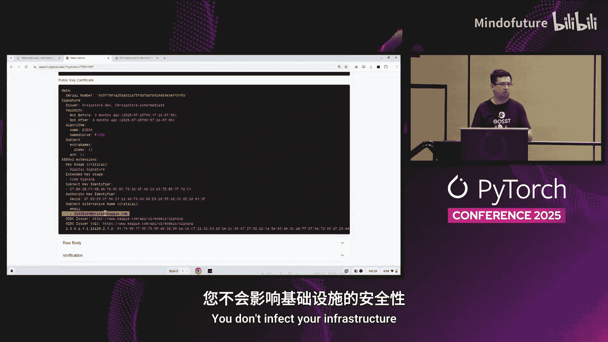

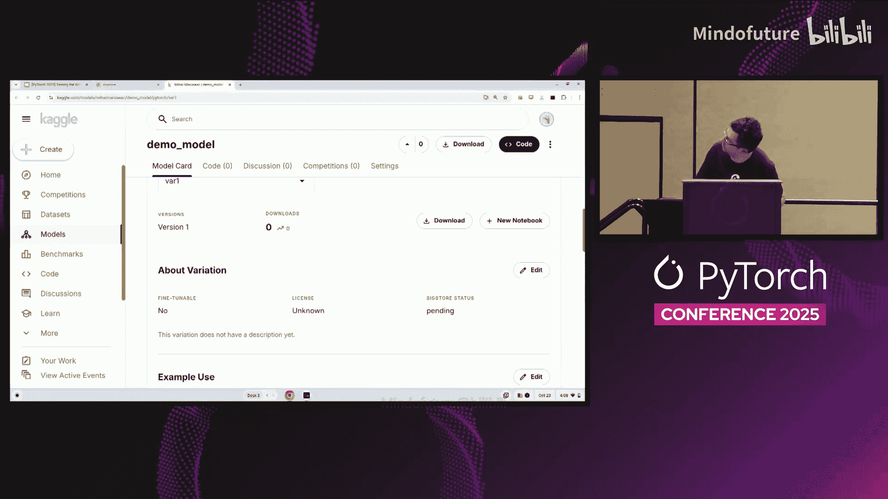

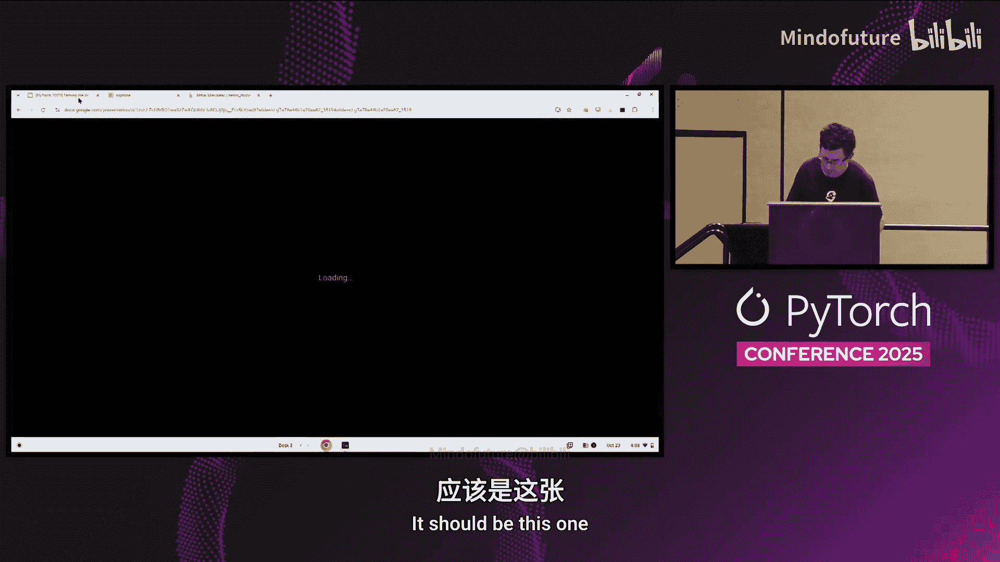

好的，现在让我回到幻灯片。

应该是这个。

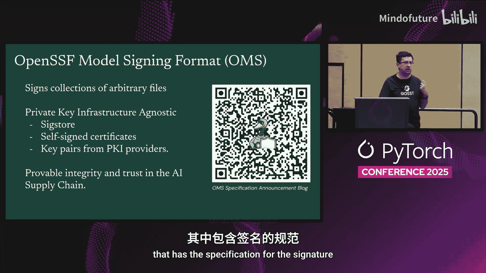

好的。所以现在，我向你展示的所有演示都是使用Sigstore进行签名的。Sigstore是一种新的签名证书方式，旨在成为HTTPS的Let's Encrypt，而不是你自己维护密钥和签名基础设施，然后在密钥泄露时不得不运行单独的流程。Sigstore的做法是，你有一个仅10分钟有效的证书，你有透明日志、包含证明等等。

但由于公司也有自己的签名基础设施，我们也希望满足他们的需求。所以我们也支持使用传统方法进行签名，比如使用签名密钥、签名证书、PKCS#11等等。

此外，与其为每种模型格式单独处理并将签名集成进去，我们是对作为模型的文件集合进行签名。这也使我们能够对数据集进行签名，因为最终，数据集仍然是目录中使用相同库的文件。

如果你扫描这个二维码，它会给你包含签名规范的报告。

好的。这是我向你展示的与Kaggle的演示。同样在NVIDIA，从一开始或从发布起，他们也集成了模型签名。他们使用签名证书进行签名。如果你去NVIDIA模型中心，你会看到四月份发布的所有模型都有这个“已签名”徽章，表明NVIDIA看到了签名并验证了模型的签名和签名路径。

如果你不信任NVIDIA，但想自己运行验证，我可以切换回这里的用户。我可以从NVIDIA下载模型。比如说我下载 `dashgnet`。一旦我下载了模型，然后我运行另一个命令来获取签名，然后我可以在本地验证它们。所以这下载了模型，然后下载。那个应该。我搞错了。好的，所以我正在下载签名。最后一部分是验证。NVIDIA模型。所以这次我验证的是其他证书。所以不是Sigstore，我验证的是由证书生成的签名。我必须传入证书链。所以是NVIDIA公共签名证书的公共部分，我从NVIDIA网站获取。一旦我运行这个命令，它会告诉我验证成功。这个来自NVIDIA的模型自放入模型中心以来没有被篡改过。

切换回幻灯片。所以我们现在的进展如何？我们有了模型的签名，但我们实际上希望进入一个未来，我们可以对ML工作流生成的所有内容进行签名。所以模型、数据集、模型卡、智能体、智能体卡等等。为了做到这一点，必须采取几个步骤。我们必须首先扩展签名采用。所以模型中心应该集成签名并验证，如果这个模型签名了，应该验证签名，但ML框架也应该支持签名和验证。所以当你用 `torch.save` 保存模型时，它应该在那个点生成签名，而不是让你必须更改你的管道来生成签名。当你用 `torch.load` 加载模型时，例如，如果模型有签名，PyTorch应该验证签名，如果失败，它应该停止加载模型并询问你是否想继续（通过传递一个额外的标志），否则它将停止在那里，从而防止损害。

我们还需要与IT管道集成，比如Jupyter笔记本等等。基本上，我们希望满足ML开发者的需求，而不是要求他们转换到更安全的管道。

然后这也进入了下一步，我们都希望确保一个ML供应链透明项目，而不仅仅是确保工件的完整性，我们还希望确保来源。所以一旦我有了这个工件，我知道是谁生成的，它是如何生成的，然后对于那些工件，它们又是如何生成的等等。

因为一旦你拥有了所有这些，你就可以对整个ML供应链有一个透明的视图。你可以把所有东西都放入一个像Wac这样的工具中，你就可以对整个链条有一个完整的视角。例如，如果一个模型在生产中行为异常（以Google为例），如果模型说你应该把胶水放在披萨上，你可以自动检查这是如何产生的，并发现这是因为用于训练初始模型的数据集是Reddit数据集，该模型后来被微调等等。

此外，当政府机构要求你生成AI物料清单时，你只需运行一个命令，它就会直接为你生成AI物料清单。这就是我们想要构建的未来。为了做到这一点。我们实际上需要帮助。所以如果你有兴趣提供帮助，有两个工作组在做这件事。一个叫做OpenSSF（开源安全基金会）。它有一个AI/ML工作组。另一个是安全AI联盟，我列出了它们各自的下次会议日期。

OpenSSF工作组还有几个与AI和安全相关的项目，一个是我刚刚谈到的模型签名，另一个是用于智能体安全的SAM C P，最后一个是AI安全，从AICC决赛的SA DRP开始，我们现在正尝试使用模糊测试系统来发现开源中的漏洞，修复开源中的漏洞等等。

底部的二维码是来自COSI关于模型签名的论文，也推荐了这种方法。

说到这里，我将停下来回答一个问题，因为我们时间不多，但我们也可以在会后交流。我想现在没有问题，我们可以在外面交流。好的，谢谢。

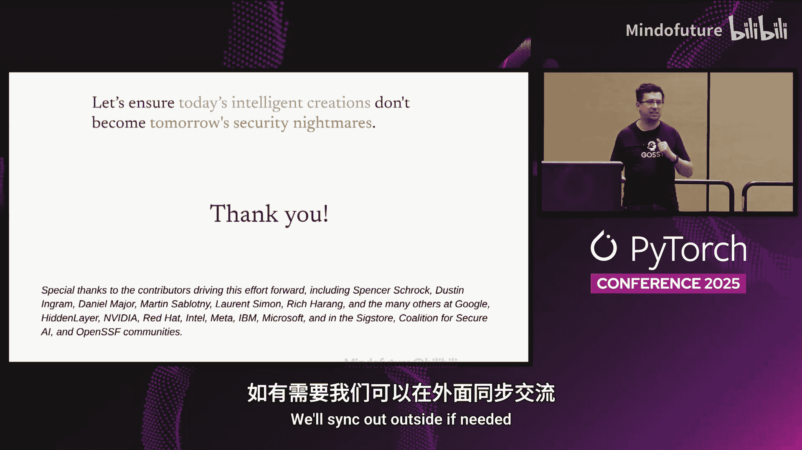

## 总结

在本节课中，我们一起学习了机器学习模型在供应链中面临的安全风险，特别是模型被篡改和身份冒用的风险。我们探讨了传统完整性验证方法（如哈希）在ML领域的局限性。核心解决方案是引入基于加密签名的“证明”机制，它不仅能验证模型文件的完整性（哈希），还能验证模型的来源（谁、何时、如何训练）。我们介绍了使用Sigstore等工具进行模型签名的具体工作流程，包括短期证书、透明日志和包含证明。最后，我们展望了未来，希望将签名和验证集成到整个ML工作流和框架中，以实现端到端的供应链透明和安全。