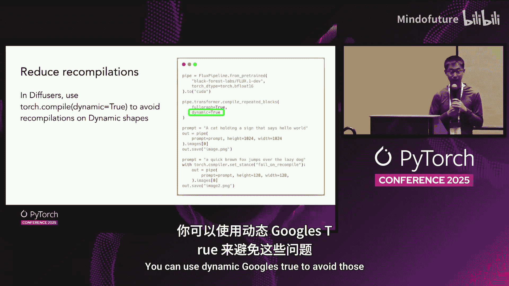
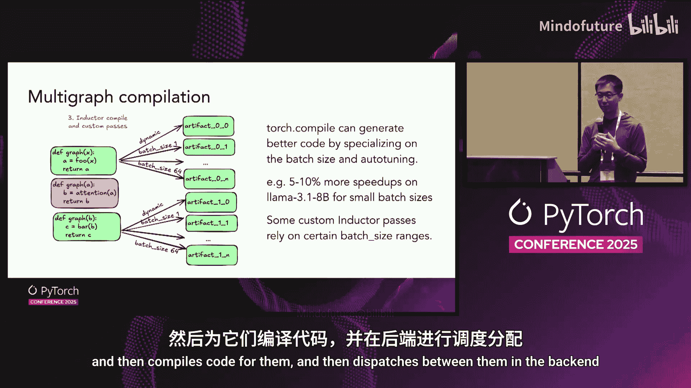
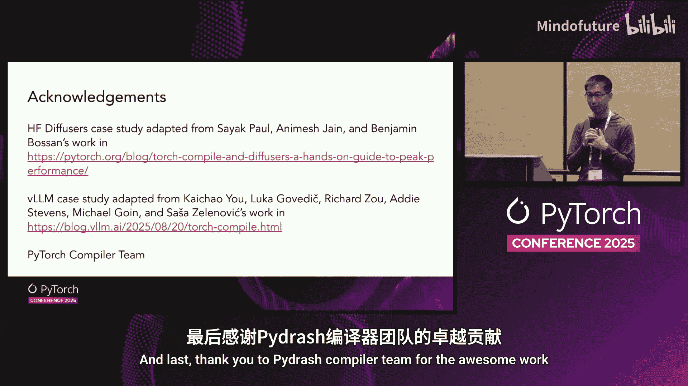

# 051：使用 Torch.compile 实现极速生成式 AI 推理 🚀


在本教程中，我们将学习如何使用 PyTorch 的 `torch.compile` 功能来显著提升生成式 AI 模型的推理速度。我们将从基础概念开始，逐步深入到在 Hugging Face Diffusers 和 VLLM 等实际库中的应用，并探讨如何通过管理编译过程来最大化性能。

---

## 1️⃣：Torch.compile 简介 🔧

上一节我们概述了本课程的目标，本节中我们来看看 `torch.compile` 的核心概念。

`torch.compile` 是一个即时编译器。它捕获可优化的直线计算图。当你对一个函数应用 `torch.compile` 时，它会进行前端捕获以生成计算图，然后将此图传递给后端 Inductor。Inductor 会生成高效的输出代码，形式通常是融合的 Triton 内核。

**核心公式/代码描述：**
```python
# 基本用法
compiled_fn = torch.compile(your_function)
result = compiled_fn(your_inputs)
```

使用 `torch.compile` 的价值在于，它为你提供了快速的基线性能，从而节省了手动调整模型性能的开发时间。

以下是 `torch.compile` 带来性能提升的一些例子：
*   **案例一**：在 GEMMA 模型上启用 `torch.compile` 后，获得了约 60% 的加速。
*   **案例二**：PyTorch 编译团队维护的基准测试显示，模型加速范围从 1.02 倍到 2.7 倍不等。
*   **案例三**：VLLM 默认使用 `torch.compile`，观察到的性能提升范围在 1.05 倍到 1.9 倍之间。

在本讲中，我们将探讨 `torch.compile` 如何生成快速内核、降低 CPU 开销以及自动化自定义优化。

需要强调的是，`torch.compile` 是一项可学习的技能。开箱即用可能不会总是让你的代码更快。要真正发挥其威力，你需要学习管理编译过程，特别是以下几点：
*   图中断
*   编译时间管理
*   重编译
*   动态形状
*   自定义算子

我们将在后续幻灯片中看到这五个方面的例子。

---

## 2️⃣：案例研究一：LayerNorm 核函数 ⚙️

上一节我们介绍了 `torch.compile` 的基本原理和优势，本节中我们来看一个简单的 LayerNorm 核函数案例，重点讨论如何减少图中断和重编译。

这个例子代码简单。一个 LayerNorm 核函数接收输入张量，返回输出张量。

如果直接对函数应用 `torch.compile`，在示例机器上，常规调用的耗时是 1.4 毫秒，而应用 `torch.compile` 后降至 0.5 毫秒，这已经是很大的加速。但我们还能做得更好。

第一件事是注意代码中可能存在的图中断。例如，如果在函数中间插入一个 `print` 语句，前端 Dynamo 会在任何它不支持的操作处创建图中断。在这里，`torch.compile` 决定在 `print` 函数处中断。

Dynamo 不支持 `print` 函数的原因是它非常保守。它可能无法确定 `print` 的确切执行时机，因此选择中断以保证语义正确。图中断意味着实际上捕获了两个计算图，分别发送到后端进行编译。

要定位图中断，你可以使用 `torch.compile` 并设置 `fullgraph=True`。如果遇到图中断，它会直接报错，并显示与 TL-Parse 工具相同的错误信息。TL-Parse 是一个可以查看 `torch.compile` 内部过程的工具。

移除 `print` 语句后，耗时降至 0.25 毫秒。所有操作融合进一个内核，这很棒。但还需要处理重编译问题。

关于 `torch.compile` 的一个重要特性是，它专门针对你的输入形状进行优化。这意味着它会为确切的输入形状编译内核。这在某些情况下并不理想，例如在文本生成中批次大小或令牌数量会变化，或在图像生成中图像尺寸会变化。

在这个 LayerNorm 例子中，如果我们改变第一个维度的大小，`torch.compile` 就会重编译，而重编译的代价很高。解决方案是使用动态形状。如果你知道哪个维度会变化，可以使用 `mark_dynamic` API 告诉 `torch.compile`。

**核心公式/代码描述：**
```python
import torch

def layer_norm(x):
    # ... layer norm 实现 ...
    return output

# 标记第一个维度为动态
torch._dynamo.mark_dynamic(x, 0)
compiled_ln = torch.compile(layer_norm)
```

如果你不知道哪些维度是动态的，或者只想快速尝试，可以设置 `dynamic=True`。但这会带来编译时间增加和生成代码可能不是最优的缺点。




---

## 3️⃣：案例研究二：Hugging Face Diffusers 🎨

上一节我们通过 LayerNorm 了解了图中断和动态形状，本节中我们来看一个更复杂的案例：Hugging Face Diffusers 库，学习如何应用 `torch.compile`、改善编译时间并进一步探讨动态形状。

Diffusers 是一个用于生成图像、视频和音频的库。我们将讨论如何在其上应用 `torch.compile`。

首先，在启用 `torch.compile` 时，你需要决定将其应用在何处。由于图中断和代码可能不适合编译，你希望将精力集中在最有价值的部分。

对于图像扩散流水线，它通常不是单一模型，而是多个模型拼接而成。流程是：输入文本，经过文本编码器得到嵌入向量，将嵌入向量和潜在张量输入去噪器逐步去噪，最后将最终的潜在张量输入图像解码器生成 RGB 图像。

在 Diffusers 流水线中，扩散变换器（去噪器）耗时最多，因此 Diffusers 推荐在此处使用 `torch.compile`。Hugging Face Diffusers 将扩散变换器暴露为流水线中的 `pipe.transformer` 对象，你可以直接对其调用 `compile` 并设置 `fullgraph=True`。

这样做能带来一定加速，但一个不幸的缺点是，与生成单张图像的时间相比，编译时间可能非常高。

根据模型结构，有几种方法可以减少编译时间。这里介绍一种称为“区域编译”的技术。其基本思想是将重复的模块块分开编译。假设一个模型有多个相同的块重复多次（参数可能不同），与其将所有块一起编译成一个巨大的计算图，不如将每个块分开编译。这样，你只需编译第一个块一次，然后在后续块中复用。

Diffusers 提供了一个选项来实现这一点，称为 `compile_repeated_blocks`。这不是 PyTorch API 的内置部分，但 Diffusers 将其 API 集成到了它们的随机模块中。这可以大幅削减编译时间。

最后再谈一下动态形状。如果你在多个文本提示上进行推理以生成多张图像，或者生成的图像尺寸不同，不同的形状会导致重编译，因为 `torch.compile` 会专门优化。你可以使用动态形状来避免这些重编译。

---

## 4️⃣：案例研究三：VLLM 文本生成库 📖

上一节我们探讨了在 Diffusers 中的应用，本节中我们来看一个更复杂的用例：VLLM 文本生成库。

VLLM 是一个 LLM 推理服务引擎。它默认利用 `torch.compile`，大约 95% 的文本生成模型都使用它。在 VLLM 中，我们看到了使用 `torch.compile` 带来的显著性能加速。

VLLM 支持非常广泛的模型，可以对这些模型进行多种优化，但手动优化所有模型并不现实。同时，标准的 `torch.compile` 还不足以满足 VLLM 的性能要求。但这并没有阻止 VLLM 使用 `torch.compile`。

VLLM 创建了一个自定义编译器，它利用了 `torch.compile` 的组件来构建符合其需求的编译器。我们将探讨这种集成如何工作，包括自定义内核、分片计算图、自定义融合传递，以及 VLLM 如何使用这种集成来精确控制编译时间、重编译，并为同一模型处理多个计算图。

以下是 VLLM 中编译模型的主要步骤：

1.  **图捕获**：使用 `torch.compile` 的前端 Dynamo 捕获一个单一的计算图，该图在输入批次大小上是动态的。VLLM 控制其所有模型的源代码，确保没有图中断并能与动态形状协同工作。
2.  **自定义内核**：对于像注意力机制这样的操作，`torch.compile` 目前还无法生成足够高效的内核。为了避免图中断，VLLM 将自定义内核包装在自定义算子中。
3.  **CUDAGraphs**：为了减少 CPU 开销，VLLM 使用 CUDAGraphs 技术。它将从 Dynamo 获取的计算图分割成 CUDAGraph 安全区域和不安全区域。安全区域可以应用 CUDAGraphs，不安全区域则直接运行。
4.  **Inductor 编译与自定义传递**：调用 Inductor 编译计算图，生成融合内核。此外，VLLM 应用自定义的 Inductor 传递来实现 LLM 特定的优化，例如融合特定操作。
5.  **后端整合**：VLLM 的自定义后端将编译产物拼接起来，并应用 CUDAGraphs。

接下来，我们看看 VLLM 的自定义编译器如何精确控制编译过程：

*   **控制重编译**：VLLM 使用自定义的 Dynamo 钩子来剥离导致重编译的守卫，从而在服务过程中几乎从不重编译。
*   **控制编译时间**：VLLM 利用 `torch.compile` 的编译器缓存来保存编译产物。目前可缓存的主要是后端编译部分。未来，PyTorch 正在开发的 AOT 预编译功能将允许缓存前端编译部分，实现近乎零的预热启动时间。
*   **多图编译**：为了在特定批次大小上挤出更多性能，VLLM 不仅编译一个动态形状图，还会根据用户提供的多个批次大小专门化并编译代码，然后在后端在这些变体之间进行切换。

最后，由于训练后量化变得越来越重要，PyTorch 计划很快提供一种新的“运行间确定性”模式，以及一种为 `torch.compile` 生成高效量化变体内核的模式。最终将无需手动编写这些量化内核。



---

## 总结 🎯


本节课中我们一起学习了 `torch.compile` 在各种用例中的工作原理，包括简单的 LayerNorm、Hugging Face Diffusers 以及 VLLM。

`torch.compile` 通过生成更快的融合内核、降低 CPU 开销以及提升开发速度，来帮助改善性能和开发效率。PyTorch 编译团队一直致力于与社区开发者交流，整合到他们的库中，使他们更快、更高效。




**致谢**：
*   Hugging Face Diffusers 部分基于 Saaket Ganjugunte 和 Benjamin 的工作。
*   VLLM 案例研究基于 Kaichao You、Luca Wehrstedt 等人的工作。
*   感谢 PyTorch 编译团队的出色工作。