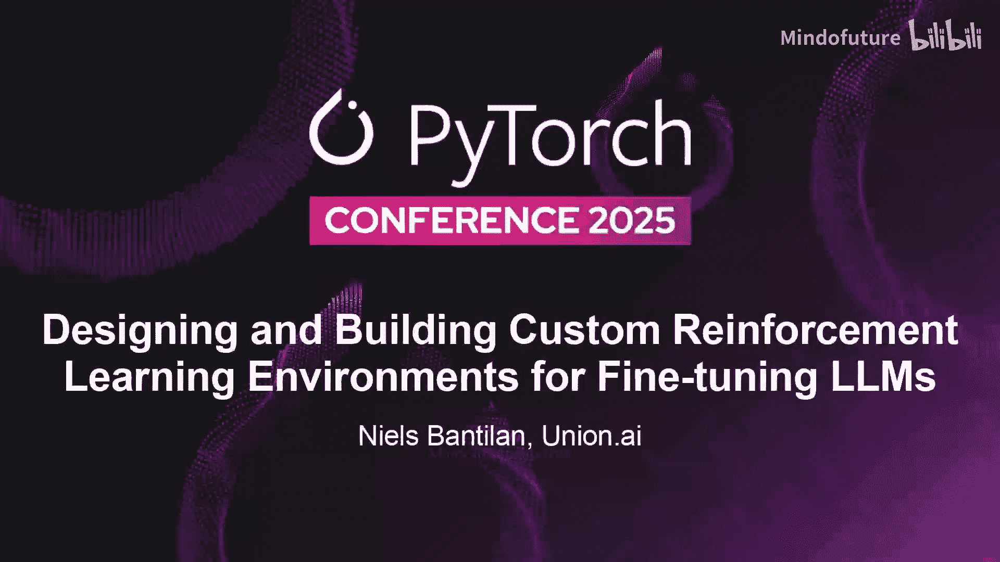
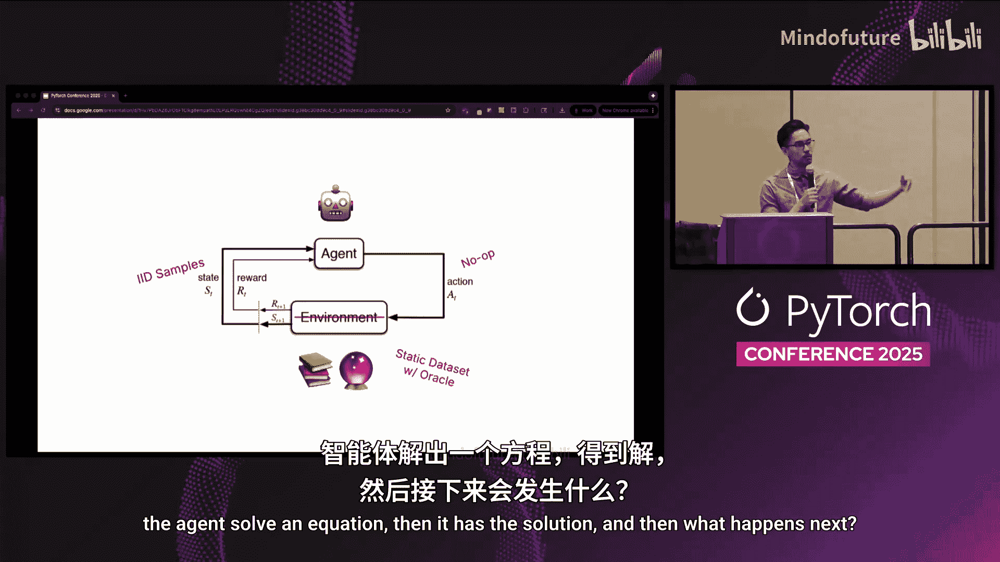
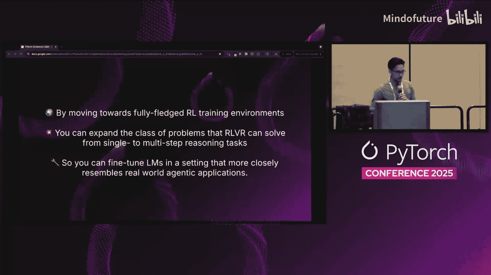
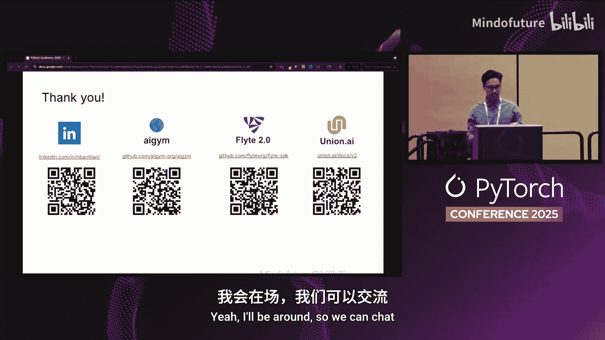

# 052：从静态数据集到动态环境 🎮



## 概述
在本节课中，我们将学习如何为大型语言模型（LLM）的微调设计和构建定制的强化学习（RL）环境。我们将探讨如何超越传统的静态数据集，转向能够激发多步推理的动态环境，从而让LLM学会解决更复杂的现实世界问题。

---

## 当前RLHF的瓶颈与机遇 🧠

上一节我们介绍了本次分享的背景。本节中我们来看看当前RLHF（人类反馈强化学习）领域面临的主要挑战。

我们拥有强大的训练工具和基础设施，但要充分发挥这些RLHF系统的潜力，仍然面临一个主要瓶颈：**缺乏能够激发多步推理轨迹的多样化RL训练环境**。这些环境对于让语言模型在推理时执行有用的生产任务至关重要。

当前许多训练框架和代码并未充分利用完整的RL API，即智能体-环境交互循环。在这个循环中，智能体采取的行动会影响环境，进而影响它接下来看到的数据点。





我们目前看到的大部分情况是使用静态数据集，例如数学或编程问题与解决方案的配对数据集。从本质上讲，这类似于从数据中进行独立同分布（IID）采样。智能体采取的行动在环境中几乎是“无操作”的，它们并不会真正改变智能体接下来会遇到什么。在一次“rollout”（轨迹展开）中，智能体解决了一个有答案的方程，然后接下来发生的事情基本上就是获取下一个数据点。


## 核心理念：迈向成熟的RL环境 🚀

上一节我们指出了当前方法的局限性。本节的核心论点是：


通过转向功能完备的RL训练环境，我们可以扩展RLHF所能解决的问题类别，使其超越数学和编程这类单步推理任务，进而解决多步推理任务。这样，我们可以在更贴近现实世界智能体问题的环境中微调语言模型。

## 背景知识：GRPO与静态数据集 📊

为了让所有人理解一致，我们先简要回顾GRPO（Group Relative Policy Optimization）和当前的数据集范式。

与顶部的近端策略优化（PPO）相比，GRPO简化了训练循环。PPO通常包含策略模型、参考模型和价值模型。GRPO去掉了价值模型，转而使用一批rollout来获取奖励，并据此计算优势函数。优势函数衡量了在某个平均行动的基础上，特定行动能带来多少改进。

以下是当前数据集（如Numino数学数据集）的典型设置：
*   **数据**：问题-解决方案对。
*   **奖励函数**：一个负责解析智能体生成的答案、解析解决方案，并根据答案匹配程度给予奖励的函数。例如：
    ```python
    def accuracy_reward(completion, solution):
        # 解析completion和solution
        if parsed_completion == parsed_solution:
            return 1.0
        else:
            return 0.0
    ```

在这个设置中我们缺失了什么？
1.  **静态数据集与“预言机”**：我们有一个静态数据集和一个“预言机”（算法推导的或人工标注的正确答案）。
2.  **行动是“无操作”**：rollout轨迹结束时的行动不会影响智能体的下一个状态。
3.  **无法建模时序依赖**：由于只是从静态数据集中采样问题，智能体无法对行动和状态之间的跨时间依赖关系进行建模。

## 灵感来源：自监督RL环境 💡

基于以上分析，我们的工作围绕一个问题展开：**超越数学和编程的、“自监督”RL环境可能是什么样子？**

我们主要从两个方面汲取灵感：

**1. 下一个词预测（Next Token Prediction）**
下一个词预测任务在产生丰富的语言表示方面取得了惊人的成功。观察一段文本，例如《双城记》的开头，我们可以从中轻松提取出大量的训练样本。这允许我们大规模扩展，并从海量数据中轻松获取标签。

那么，对于需要进行多步推理、执行多组行动的语言模型智能体，其自监督预训练会是什么样子？

**2. 经典RL网格世界（Grid World）**
在网格世界中：
*   **状态**：是智能体在网格上位置的局部表示（上下左右的格子）。
*   **行动**：选择向上、下、左、右移动。
*   **奖励**：可以设计为智能体未到达目标状态时，每一步给予-1的奖励，激励其尽快到达目标。

## 构建测试平台：维基百科作为图环境 🌐

结合以上灵感，我们引入第三个数据点：**维基百科引用图**。这是一个由人类编写、注释并构建结构的大规模图。

想象一下“维基百科游戏”：你从两个随机节点开始，只能通过点击页面上的链接，尝试找到从一个页面到另一个页面的路径。例如，从“泰坦尼克号”页面如何通过点击链接到达“超级名模”页面？

对于预训练语言模型来说，这可能是一个有趣的任务，因为模型已经在维基百科数据上训练过。

将维基百科视为RL环境：
*   **节点是状态**。
*   **智能体通过行动遍历边**（选择上下文中的URL）。
*   **奖励根据目标节点进行塑造**（奖励工程更像一门艺术，后面会提及）。

已有相关工作（如《通过随机游走学习导航维基百科》），但它们使用Transformer为节点和链接创建嵌入，再使用自定义MLP生成链接的概率分布。我们更倾向于一种更通用、纯粹基于**令牌输入和输出**的方法（令牌既是状态空间也是行动空间）。

## 环境设计：智能体-环境交互循环 🔄

回到智能体-环境交互循环图，我们将其具体化：

*   **状态**：当前页面内容 + 目标URL。例如，起始页面是“泰坦尼克号”，目标是“超级名模”。
*   **智能体**：一个语言模型。
*   **行动**：一段推理轨迹，以及对其当前上下文中应点击哪个链接以到达目标页面的答案。
*   **环境**：接收行动，返回下一个状态（新页面）和关联的奖励。

这是一个用于LM智能体微调的简单测试平台。从简单开始有助于验证想法的价值。

**提示模板**：经过多次试验才最终确定。它包含最少的指令集，告诉智能体应该在`<think>`和`<answer>`标签中放入什么内容。注意，目标URL直接放在上下文中，因此需要设计奖励来惩罚智能体选择不在当前页面内容中的目标URL。

**奖励函数示例**：
*   如果智能体选择了目标URL，但该URL不在上下文中：`reward = -1`
*   如果输出乱码：`reward = -5`
*   如果选择了通往目标URL路径上的下一个“检查点”URL：`reward = +0.5`
*   如果到达目标：`reward = +1`

**训练架构**：与之前展示的GRPO高级架构非常相似。环境为每个“回合”生成一条旅行路径（例如，从图中随机选取一个节点，进行N步随机游走，得到目标节点）。智能体从起始节点开始，生成补全内容，进入更新循环，策略被更新后，再用于选择下一个行动，如此循环，直到推理出到达目标节点的路径。

## 实现与实践 🛠️

从实现角度看：
*   **基础设施**：使用Union AI的Flyte（一个开源ML/AI编排器）来协调所有流程。可以将其视为与Ray类似但细节不同的工具。
*   **核心库**：正在积极开发一个名为**AIGym**的库来测试这些想法。目标是最终能泛化到任意图结构。
*   **技术栈**：使用PyTorch、Transformers和PEFT（参数高效微调）来方便地加载、保存模型及使用LoRA适配器。也计划集成VLLM等推理框架。
*   **内存优化**：使用LoRA等技术，在固定GPU预算下容纳更大模型，可训练参数数量级更少。

以下是AIGym库的简单使用示例：
```python
# 实例化策略（rollout函数）
policy = YourPolicy()
# 实例化维基百科环境，参数N表示跳数
env = WikipediaGymEnv(n_hops=5)
# 进行rollout（无策略更新）
trajectory = rollout(policy, env)
```

**训练栈组件**：
*   **AIGym**：负责设置每个回合的旅行路径、确定奖励和节点间的链接。
*   **策略模型**：仅用于推理，无需跟踪梯度。
*   **参考模型**：始终冻结，仅用于推理。
*   **奖励模型**：通常只是一个评估函数，也可以是语言模型。
*   **策略模型（更新用）**：需要跟踪梯度。

## 实验、挑战与调试 🧪

**初始实验**：从小规模实验开始。例如，使用Gemma 3 2B模型，以“哺乳动物”页面为锚点，在其周围进行两跳的随机游走，设置每个回合的尝试预算。

**实现挑战**：
1.  **数据与环境设计**：设计提示词和行动空间需要大量试错，很大程度上依赖于经验。
2.  **状态表示与验证**：选择Markdown还是HTML作为上下文？需要进行大量预处理和验证，以确保链接被正确提取和连接。
3.  **本地开发**：在低容量小模型上开发困难，如果提示词不好，可能永远无法产生有效行动。可以使用量化的大模型（如Ollama）在本地进行测试。
4.  **上下文长度管理**：维基百科文章长度差异很大，可能导致内存不足。需要设计策略来限制上下文长度。
5.  **奖励工程**：这是一门艺术，需要大量试验来确定何时给予正奖励，何时给予负奖励。

**调试与可观测性**：使用Flyte提供的可 hack 的调试和可观测性层非常有价值。可以生成丰富的HTML报告，查看每个步骤智能体采取的行动、其视野中的上下文内容，这对于发现bug和模型奇怪行为至关重要。

## 未来研究方向与泛化 🗺️

**研究路线图**：
1.  **并行化多步Rollout**：对于多步推理问题（例如，智能体多次选择URL），目前文献中还没有很好的并行化方法。
2.  **离策略GRPO**：研究如何让大模型将其知识蒸馏到小模型中。
3.  **多样化的RL任务类型**：基于图可以创建多种任务，而不仅仅是图遍历。例如：
    *   节点重建/校正
    *   边重建
    *   类别重建
    *   节点演化（维基百科页面会随时间变化）

**泛化到现实问题**：我们最终关注的是浏览器使用智能体、深度研究环境和商业分析智能体等。关键挑战在于**如何将这些问题转化为图结构**，从而能用RL进行训练。

**AIGym的目标**：弥合图与RL训练之间的差距。未来，希望AIGym能够接收任何表示为图的智能体应用，并从中提取出一套RL任务进行训练，同时与TRL、Verl等框架集成，用户无需从头实现智能体训练循环。

## 相关项目与总结 📚

**相关项目**：已经有一些围绕构建成熟RL环境理念的项目，例如`X`、`Y`、`Z`（具体名称请参考原演示文稿幻灯片）。

**主要收获**：
*   我们应该致力于**构建RL环境**，而不是依赖带有“预言机”的静态数据集。
*   通过设计动态、交互式的环境，我们可以训练LLM解决更复杂的多步推理任务，使其更贴近实际应用场景。

## 总结
本节课我们一起学习了为LLM微调设计定制强化学习环境的核心思想。我们从分析当前静态数据集的局限性出发，探讨了从“下一个词预测”和“网格世界”中获得的灵感，并详细介绍了如何将维基百科构建成一个图环境作为测试平台。我们还讨论了实现细节、遇到的挑战以及未来的研究方向。希望这些内容能启发你探索如何为你的LLM应用创建更丰富、更有效的训练环境。



---
*演讲者：Niils Bantilan | Union AI 首席ML工程师*