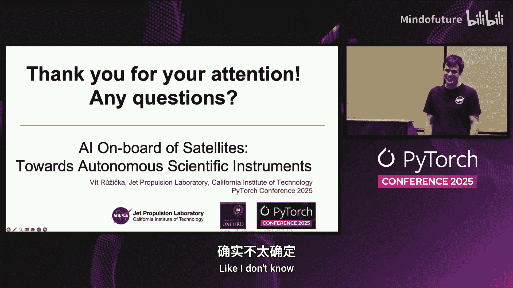

# 053：迈向自主科学仪器 🛰️🤖

## 概述
在本教程中，我们将学习如何将人工智能模型部署在环绕地球的卫星上，以实现自主科学仪器的目标。内容分为两部分：首先介绍在卫星上部署图像嵌入模型的先前工作；其次探讨当前处理高光谱数据的研究，包括其优势、挑战及实际应用。

---

## 第一部分：在轨AI部署的背景与动机

### 1.1：为何需要星载AI？
当前，卫星观测数据通常需要先下传到地面站，再通过有限通信通道传输至处理中心。这一过程可能导致数天甚至数周的延迟，对于火灾、洪水或甲烷泄漏等紧急事件的响应来说为时已晚。

通过将AI部署在卫星上，我们可以将数据处理从地面边缘计算前推到卫星端。这带来了多种可能性：
*   **实时警报**：检测到事件（如火灾）后立即发送警报。
*   **智能数据选择**：仅通过有限的通信带宽下传相关数据。
*   **自动化任务编排**：在卫星星座中，指示其他卫星或仪器对感兴趣区域进行后续、更高分辨率的观测。
*   **在轨自主反应**：检测到事件后，立即启动某些机动操作。

### 1.2：太空环境带来的挑战
尽管太空探索令人兴奋，但其工作环境极为严苛。部署在卫星上的硬件通常是低算力环境，这主要受限于功耗以及芯片的可用性。目前，很少有卫星使用能够运行机器学习模型的处理器，因为像GPU这样的设备通常不具备足够的抗辐射能力，太空中的随机粒子可能导致比特翻转和计算错误。

---

## 第二部分：基于无监督学习的在轨应用

上一节我们探讨了星载AI的必要性与挑战，本节中我们来看看一个具体的应用实例：利用无监督学习方法进行在轨数据处理。

### 2.1：图像嵌入与压缩
这项研究利用变分自编码器等无监督学习模型，将输入图像（如Sentinel-2多光谱数据，格式为32x32像素的图块）编码为潜在的表示向量。

**核心思想**是，在这个潜在向量中保留了图像最重要的特征。因此，可以仅下传这些向量而非原始数据，实现有损数据压缩。另一种用途是变化检测：卫星无需存储整个地球的先前状态，只需记住这些潜在向量，就能进行变化检测预测。

### 2.2：在轨学习演示
从潜在向量的可视化中可以观察到，代表洪水事件的图块在潜在空间中与其他数据形成了较好的分区。这引出了一个想法：我们可以在卫星上进行某种训练。

如果存在外部的地面真值仲裁器（例如卫星飞越已知事件类型的校准区，或星座中其他仪器提供标签），我们可以利用这些标签在卫星上训练一个小型分类器。这样做的原因可能是卫星传感器随时间退化，图像特征发生变化，但我们仍希望这颗性能逐渐下降的卫星能保持检测事件的能力。

以下是实现方式：
*   使用预训练的编码器-解码器模型，其权重被冻结。
*   大部分计算发生在编码器和解码器部分，这部分可以通过ONNX等高效推理引擎加速。
*   训练仅针对一个非常小的分类头模型进行，这部分计算量小，可以直接在CPU上用PyTorch完成。

这是一个概念验证演示。任务示例是仅用6张标注图像（标记了云层）训练模型，模型能够学习并推广模式，检测出较微弱的事件。

### 2.3：部署与硬件
该模型部署目标是一个拥有专用视觉处理单元的设备。实验在与英国航空航天公司Orbit合作的“Ding Through the Star”任务中进行，在其IN-CVV004卫星的硬件上运行。

**性能结果**：
*   **变化检测**：处理近5x5公里区域的数据，耗时少于0.11秒。
*   **在轨训练**：编码整个训练数据集并进行10个周期的训练，在约1.55秒内即可得到一个全新的模型。这展示了在有限硬件上实现快速适应的潜力。

---

## 第三部分：处理高光谱数据的前沿工作

上一部分我们介绍了利用无监督学习进行在轨数据处理的初步探索，现在我们将目光转向更复杂的数据类型：高光谱数据。

### 3.1：什么是高光谱数据？
在计算机视觉领域，模型通常处理类似人眼感知的RGB三通道图像。而卫星观测则更为复杂。典型的多光谱卫星（如Sentinel-2）有数十个波段。**高光谱数据**则将波段数量提升到数百个，例如NASA最近的EMIT任务拥有285个波段。

高光谱数据的价值在于，每个波段覆盖非常窄的波长范围，使我们能够探测地面物体独特的光谱“指纹”，从而识别在普通数据中难以察觉的信号，例如甲烷的特定吸收特征。

### 3.2：星载甲烷检测与自主响应
为什么要在卫星上检测甲烷？理论上，卫星在扫描时若能实时检测到甲烷羽流，可以触发以下自主操作序列：
1.  **触发**：检测到甲烷泄漏事件。
2.  **机动**：指令卫星旋转，对同一事件路径进行第二次观测。
3.  **恢复**：触发指令，使卫星返回正常处理模式，从而获得对同一事件的第三次记录。

为何需要多次观测？最新研究表明，对甲烷羽流进行多次成像，结合风速信息，可以量化泄漏速率，将估算误差从±50%显著降低到约±15%。目前这种方法需要飞机特殊机动才能完成，而通过卫星实现则更具可扩展性。

### 3.3：处理瓶颈与优化方案
在卫星上处理此类数据面临的主要问题源于有限的计算资源。典型处理流水线存在多个瓶颈：
1.  **数据定标**：将传感器原始数字信号转换为物理辐射值，步骤繁琐且缓慢。
2.  **特征提取**：使用匹配滤波等算法生成突出甲烷的产品，速度较慢。
3.  **事件检测**：使用机器学习模型判断是否存在泄漏，这反而是相对较快的部分。

我们提出的优化方案旨在绕过这些瓶颈：
*   **简化定标**：使用近似方法快速获取辐射数据，可能会丢失一些细节，但在甲烷敏感的波段可以保留关键信息。
*   **端到端模型**：直接将原始或简化后的数据（例如甲烷敏感的几个波段）输入机器学习模型，省去中间产品生成步骤。

### 3.4：面向高光谱数据的模型设计
直接将数百个波段输入为RGB设计的模型会导致问题。例如，语义分割模型的首个操作通常是2D卷积，它会将高维波段数据压缩到固定的输出通道数，如果处理不当，在小型硬件上容易导致内存或计算爆炸。

为此，我们设计了一种新的架构，在数据输入主流网络之前，添加专门的层（如1x1卷积）来高效提取和压缩光谱维度的信息，并对模型进行了一些调整，以适应遥感数据的特点，避免过度下采样导致的光谱信息丢失。

### 3.5：性能评估
在代表星载硬件的Jetson Orin Nano开发板上进行测试（该硬件已实际应用于太空任务）：
*   **检测效果**：优化后的流水线仍能有效检测到甲烷事件。
*   **处理速度**：
    *   完整地面流水线处理一帧数据需超过2分钟。
    *   **星载优化流水线**处理时间降至约0.3秒。
    *   避免了匹配滤波计算的8秒。
    *   总体处理时间减少了**99%以上**。
    *   关键指标：EMIT仪器获取新数据块的时间约为1.12秒，我们的优化方案已远低于此阈值，满足实时处理需求。

---

## 第四部分：应用前景与总结

### 4.1：广泛的应用场景
高光谱数据具有高度通用性，可应用于众多领域：
*   **大气科学**：温室气体检测、云检测。
*   **地质学**：矿物探测，特别是在稀土元素勘查中。
*   **水文学与植被监测**：通过光谱特征区分健康与不健康的植被。

需要星载快速检测能力的场景通常包括：
*   **灾害事件**：如火灾、气体泄漏。
*   **深空探测**：在无法将海量原始数据全部传回地球的情况下，先在轨生成初步产品，供科学家筛选，再决定下传哪些原始数据。

### 4.2：问答环节要点整理
1.  **数据分辨率**：当前高光谱卫星像元分辨率约为60米，未来计划提升至30米。也可将传感器部署于无人机，获得更高分辨率。
2.  **在轨训练实现**：通过Docker容器化环境，使用PyTorch在卫星CPU上进行小模型训练。实际任务中可能更倾向于将模型固化到FPGA或编译成更高效的代码。
3.  **深空探测应用**：该技术非常适合火星车或深空探测器，可用于筛选感兴趣目标（如特殊岩石）、捕捉瞬变事件，克服通信延迟，实现自主反应。
4.  **仪器自主控制**：自主性不仅指检测，还包括触发后续动作，如控制卫星姿态旋转或调整仪器内部光学元件，具体取决于任务设计。
5.  **遥远天体事件检测**：原理上可用于检测超新星爆发等遥远瞬变事件，但需考虑探测器的具体能力和科学目标。

---

## 总结
在本教程中，我们一起学习了将AI部署于卫星以实现自主科学仪器的完整脉络。我们从星载AI的必要性和挑战出发，探讨了利用无监督学习进行在轨数据压缩和快速适应的早期工作。接着，我们深入研究了处理高光谱数据这一前沿方向，了解了其在精准检测（如甲烷泄漏）方面的巨大潜力，以及为克服星载算力限制而设计的模型优化和流水线简化方案。最后，我们展望了该技术在灾害管理、深空探索等领域的广阔应用前景。星载AI正推动着我们从“被动收集数据”迈向“主动智能感知”的新时代。