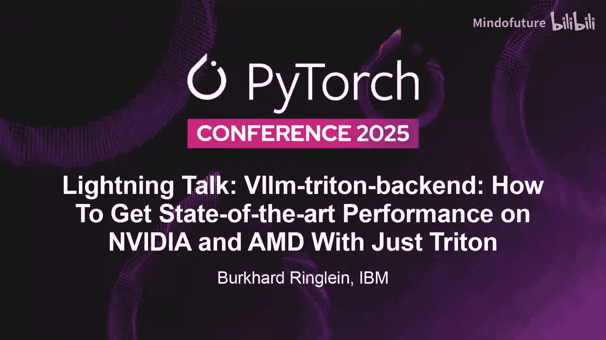
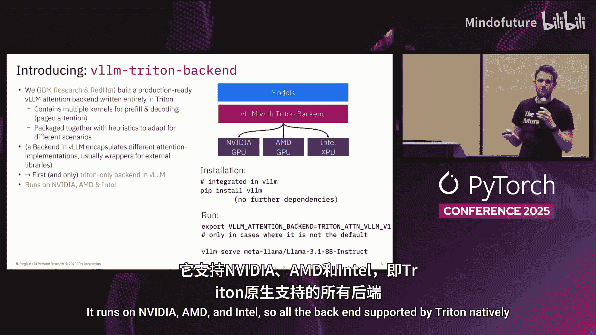
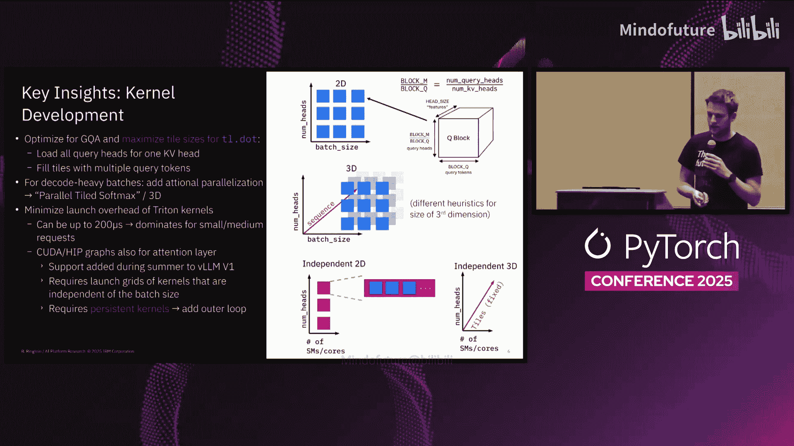
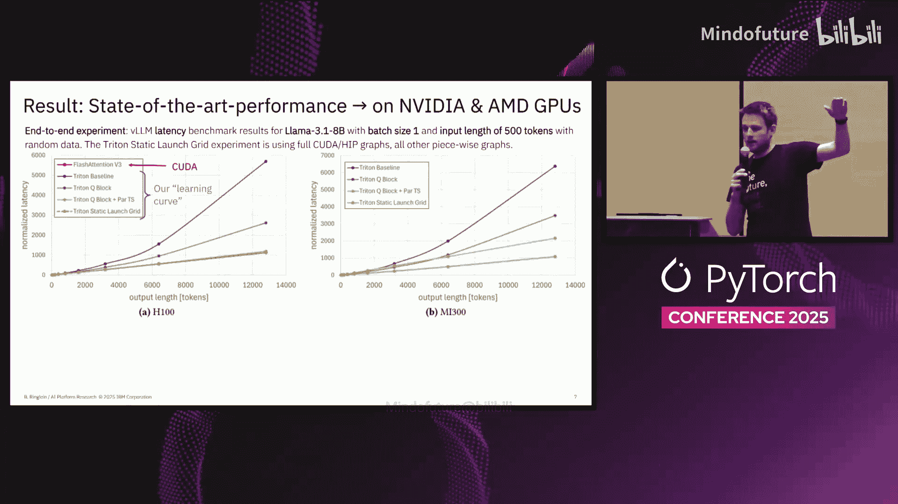
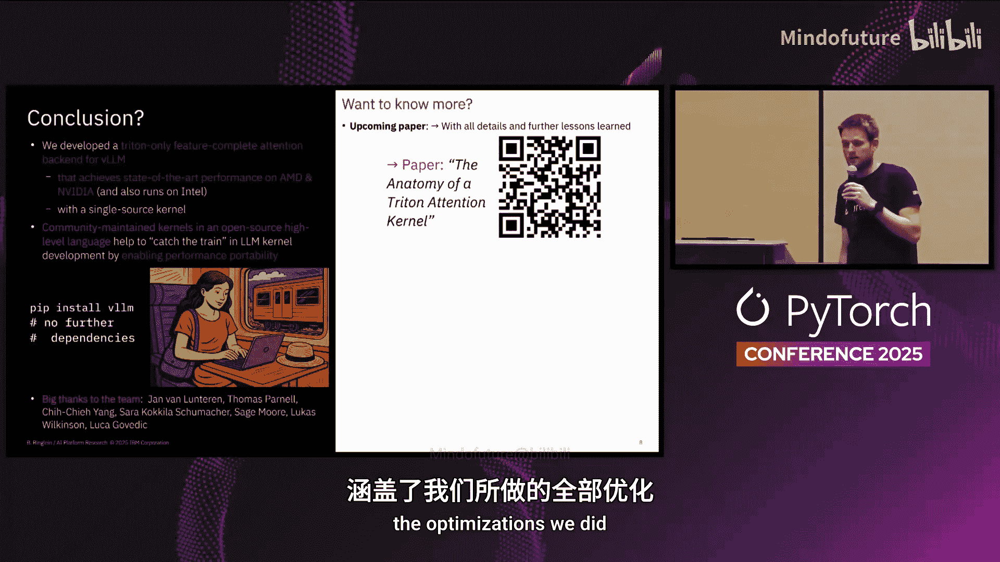

# 054：使用Triton后端实现跨硬件尖端性能 🚀



在本教程中，我们将学习如何利用Triton后端实现大语言模型推理的性能移植。我们将探讨性能移植的概念，了解Triton如何通过其硬件无关的编程模型简化这一过程，并回顾一个具体实现案例——vLLM的Triton注意力后端，它如何在NVIDIA、AMD和Intel GPU上实现接近或达到最先进的性能。

## 背景：什么是Triton？🔧

上一节我们介绍了性能移植的目标，本节中我们来看看实现这一目标的关键工具——Triton。

Triton是一种编程模型和编译器，它工作在合适的抽象层级上。开发者可以编写复杂的优化代码，但这些代码是硬件无关的。例如，在实现注意力机制时，开发者可以操作一个二维的块（Tile）。

```python
# 这是一个Triton中2D块的抽象表示
tile = Block([TILE_M, TILE_N])
```

Triton编译器可以针对特定GPU，决定将这个块分割成两个更大的块，或者针对另一个GPU，将其分割成许多更小的块。程序员无需关心这些硬件细节，因为编译器可以自动调整（Auto-tune）以适应不同的GPU。

## 实现：vLLM的Triton注意力后端 🛠️

上一节我们了解了Triton的抽象能力，本节中我们来看看如何将其应用于实际项目。

我们与IBM Research和Rhead的团队共同为vLLM的页面注意力（Paged Attention）构建了一个功能完整的Triton注意力后端。它包含多个内核（Kernel）以及在这些内核之间切换的启发式算法。

对于不熟悉vLLM注意力后端的开发者，它是一个对注意力计算库的封装。通常它封装外部依赖（如FlashAttention），但我们的Triton注意力后端完全基于Triton，并且已经随vLLM的Python包一起发布，因此安装后即可使用。



该后端原生支持所有Triton兼容的硬件，包括NVIDIA、AMD和Intel GPU。它在AMD和NVIDIA GPU上提供了最先进的性能，并且在Hopper架构上甚至比FlashAttention-3略快。在Intel GPU上，我们仍在进行一些性能调优。

## 经验与优化 📈

在为期约半年的开发过程中，我们从社区贡献者那里学到了很多，并进行了多次关键优化。

以下是我们在开发过程中遇到的主要挑战和解决方案：

*   **从2D启动网格到3D瓦片**：我们最初为普通模型使用2D启动网格。但后来发现，对于具有分组查询注意力（GQA）的模型，这不足以有效利用GPU的矩阵乘法单元。因此，我们最终采用了3D瓦片结构，同时处理多个令牌和属于某个特定KV头的所有查询头，从而提高了内存复用率和矩阵计算单元的利用率。
*   **解码密集型负载的并行化**：对于解码密集型工作负载，我们需要额外的并行化层级。我们实现了跨序列长度的并行化，称为“并行紧致Softmax”。这类似于“Split-K”的概念。当然，这需要针对不同的批处理大小设计不同的启发式策略。
*   **集成CUDA Graph**：即使进行了上述优化，我们仍未达到最先进的性能。我们研究了CUDA Graph，并在vLLM夏季的重大重构后成功集成。这要求我们的内核兼容CUDA Graph，并拥有独立于批处理大小的启动网格，这意味着我们使用了持久化内核（Persistent Kernels）的概念。内核会动态迭代多个查询块，而CUDA Graph则动态决定需要多少个实例。
*   **启发式与自动调优**：我们最终为3D情况实现了静态瓦片划分。我们进行了大量的启发式规则设计和自动调优，以驱动不同配置和不同GPU的最佳参数选择。最终证明，结合启发式的方案比纯粹的自动调优有更好的权衡。

## 性能结果 📊



我们使用Llama 3 8B模型在H100和MI 300X上进行了基准测试。结果以标准化延迟展示，数值越低越好。

在NVIDIA H100上，我们的实现（最终版本）比基线（一个简单的实现）快6倍，并且比FlashAttention-3略快约7%。我们的内核代码量也少了两个数量级，更易于阅读和维护。



在AMD MI 300X上，目前没有其他成熟的页面注意力实现可供比较，因此我们的后端是vLLM在AMD平台上的默认选择。

最重要的是，所有这些结果都来自同一套内核代码。我们在NVIDIA和AMD GPU上没有修改任何一行内核代码，这标志着我们成功实现了针对该问题的性能移植。

## 总结与展望 🎯

本节课中我们一起学习了如何利用Triton实现大语言模型推理的性能移植。

我们成功展示了Triton能够帮助交付单一代码源的性能移植方案。通过社区维护的内核和开源编译器，我们可以更容易地跟上每一次新LLM技术和硬件的浪潮，而无需过度关注底层的硬件细节，也没有引入额外的依赖。



这是一个团队合作的成果。如果你想了解更多细节，我们有一篇即将发表的论文，详细介绍了所有的优化。此外，我将在11月底举办一个关于此主题的完整长度的vLLM线上分享会。我们在开放环境中完全开发了此项目，相关代码、微基准测试和开发环境设置都可以公开访问。

最后，我鼓励大家开始参与贡献。对于学习Triton而言，尝试修复一些简单的问题是最好的入门方式。