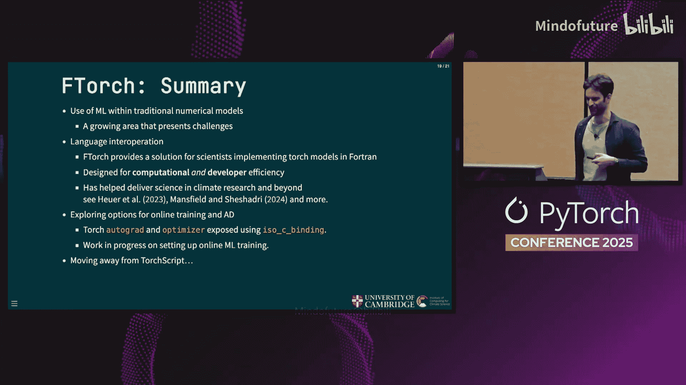

# 055：连接PyTorch与Fortran气候模型的桥梁


## 概述
在本教程中，我们将学习一个名为 **FTorch** 的库。这个库由剑桥大学气候科学计算研究所开发，旨在解决一个特定但重要的问题：如何将用PyTorch编写的机器学习模型，无缝集成到用Fortran编写的气候与天气模型中。我们将了解其设计动机、核心原理、使用方法以及未来的发展方向。

---

## 气候与天气模型简介 🌍

上一节我们介绍了FTorch要解决的核心问题，本节中我们来看看它要对接的对象——气候与天气模型。

气候和天气模型是非常复杂的多组件系统。其核心是一个**动力核心**，用于随时间演化温度、速度、压力等各种守恒量。这个核心被降水、多物理过程、化学过程等其他组件所包围，这些组件会与动力核心相互反馈。这只是一个大气模型的简化视图，完整的模型还包括陆地、海洋等众多需要耦合的复杂部分。


由于计算资源的限制，我们将地球网格化为许多立方体，但这些立方体的尺寸仍然可能达到约30公里，分辨率非常粗糙。因此，我们依赖于一种称为**参数化**的子网格过程，它允许我们在动力核心的尺度之下解析物理现象。

问题是，这些参数化是模型中不确定性的主要来源之一。例如，我们无法模拟大气中的所有水滴，必须依赖经验、数值或基于数据的模型来模拟降雨。

## 用机器学习增强气候模型 🤖

了解了传统模型的局限性后，本节我们探讨如何用机器学习来增强它。


回到大气气候模型，我们的目标是用机器学习模型替换其中一个参数化模块。这样做有几个原因：我们可以利用海量的可用数据，并且机器学习模型可能比某些数值模型运行得更快。


这与最近新闻中出现的许多端到端模型（如Aurora、GraphCast、ForecastNet等）形成对比。我们目前关注的不是用数据完全替代整个模型，气候科学比天气预报更复杂，目前还无法仅靠数据实现端到端的流程。

## 核心挑战：语言互操作性 🔗

上一节我们看到了机器学习的潜力，但实现它面临诸多挑战，本节我们聚焦于最关键的技术挑战之一：语言互操作性。

机器学习模型通常使用PyTorch等框架编写，而许多重要的气候模型代码（如英国气象局的COSMO、德国的ECMWF、ICON等）是用Fortran编写的。因此，我们需要一座桥梁来连接PyTorch和Fortran。

这就是我们开发 **FTorch** 库的原因。

## FTorch的设计与原理 ⚙️

面对语言互操作的挑战，FTorch提供了一个优雅的解决方案。以下是其核心工作原理：

研究人员在线下开发和训练他们的神经网络模型。FTorch则提供了一个从Fortran到PyTorch的接口。我们将PyTorch视为一个高度优化的C++后端**LibTorch**的Python前端。利用Fortran 2003的C语言绑定功能，我们可以轻松地将LibTorch与Fortran结合。

具体做法是，我们直接为LibTorch提供一个Fortran API，这为用户抽象了所有复杂的细节，使得从Fortran集成PyTorch变得非常简单。

用户只需要将他们的机器学习模型输出为**TorchScript**格式（昨天有一个关于TorchScript部署的精彩演讲，但其原理相对简单）。这个模型可以通过LibTorch在序列化后运行。

我们的方法相当简单：完全绕过Python，直接从Fortran连接到LibTorch。这避免了在高性能计算或集群环境中使用Python可能带来的诸多麻烦。

## FTorch的主要特点 ✨

了解了FTorch的原理后，我们来看看它有哪些具体优势。

以下是FTorch库的一些亮点：
*   **易于构建和链接**：我们开发了工具，允许用户非常快速、轻松地编写模型脚本。
*   **全面的示例套件**：我们开发了非常全面的示例套件，引导用户从简单示例过渡到更复杂的使用场景，在整个过程中为用户提供手把手的指导。
*   **完善的文档**：我们拥有非常完善的文档。
*   **免费与开源**：采用MIT许可证，我们欢迎社区的贡献。

我们努力兼顾开发效率和计算效率：
*   我们在底层使用了PyTorch/LibTorch的所有实现，因此结果应该是可复现的，并能支持未来的新功能。
*   你可以保证，在Fortran中运行模型与通过PyTorch运行能得到相同的结果。
*   我们使用了Torch对各种GPU架构的后端支持。

你可能会想到，Fortran与Python在内存中的数组表达方式非常不同。Fortran是**列优先**语言，而Python（NumPy）是**行优先**。我们通过使用`torch::from_blob`和Tensor访问器来抽象这一切，从而避免了整个难题。我们在内存中实现**无拷贝访问**，因此没有不必要的拷贝，也避免了可能导致完全错误结果的数据转置。

## 如何使用FTorch：代码示例 💻

理论介绍完毕，本节我们通过一个简单的代码示例来看看如何在Fortran中使用FTorch。

我将跳过TorchScript的细节（大多数人应该了解TorchScript，不过未来几年似乎有**Executorch**要取代它）。生成TorchScript模型有两种方式：追踪和脚本化，但这相对容易做到。

我想展示一点Fortran代码：

```fortran
program example
  use, intrinsic :: iso_c_binding
  use ftorch

  implicit none

  ! 声明输入和输出张量
  type(torch_tensor) :: input_tensor, output_tensor

  ! 创建一些输入数据（例如密度、压力等）
  real(c_float), dimension(10, 20) :: input_data
  ! ... 填充 input_data ...

  ! 将输入数据与我们的输入张量关联（无拷贝）
  input_tensor = torch_from_blob(c_loc(input_data), [10, 20], torch_kFloat32)

  ! 加载已保存为TorchScript格式的模型
  type(torch_module) :: model
  model = torch_jit_load("my_model.pt")

  ! 运行推理
  output_tensor = torch_forward(model, [input_tensor])

  ! 清理（因为Fortran不是Python，没有垃圾回收，我们需要手动管理引用计数）
  call torch_delete_module(model)
  call torch_delete_tensor(input_tensor)
  call torch_delete_tensor(output_tensor)

end program example
```

## 前沿探索：在线训练与自动微分 🔄

之前讨论的所有工作都涉及运行线下保存的模型并进行推理。但有些情况下，我们可能希望进行**在线训练**。

最近气候科学界发表的一些论文表明，如果线下训练模型然后投入生产，它们可能会在很长的时间尺度上完全失效或发散。因此，进行在线训练有很好的理由，这样我们可以随着时间的推移“微调”这些脆弱的模型。

在线训练还能避免保存大量数据。如果你愿意，可以完全避免线下训练，直接在气候模型中边运行边训练。你无需在Python和Fortran数据格式之间转换。此外，还有可能将损失函数扩展到包含下游模型代码，这是我们非常感兴趣的方向。

在大多数框架中实现这一点很困难。我们的做法依然是充分利用PyTorch的功能。

简要扩展一下损失函数的概念：我们的神经网络可能输出一些“倾向”，这些是领域研究人员无法直接解释的抽象量。研究人员更关心的是降水量或辐射量等可观测变量。我们希望做的是，将这个模型与所有PyTorch操作（或张量操作和类型）链接起来，直到得到最终输出。然后，我们可以从这个量通过模型反向传播，从而随着时间的推移优化我们的模型。

这种自动微分功能已经以类似之前描述的方式实现。我们基本上是基于PyTorch，暴露了Torch中所有的autograd功能（如`requires_grad`、`backward`方法、SGD、Adam等）。

一个非常好的地方是，我们暴露了适用于Torch张量的数学运算符，这使得在Fortran中编写类似PyTorch的表达性代码变得容易。这项工作仍在进行中，我们在损失函数方面还有一些工作要做，但大部分构建模块已经就位。

## 总结 🎯

本节课中我们一起学习了**FTorch**库。

我们开发这个库是为了满足科学界，特别是气候学界在参数化方面的需求。我们努力优化了计算效率和开发效率。目前，我们正在探索在线训练和自动微分的可能性。

如果你有任何使用Fortran进行的科学示例，并且在尝试使用我们的FTorch库时遇到了障碍，欢迎来与我交流。此外，我们正在考虑从TorchScript迁移，如果有人对此有任何建议，我们也很乐意听取。



