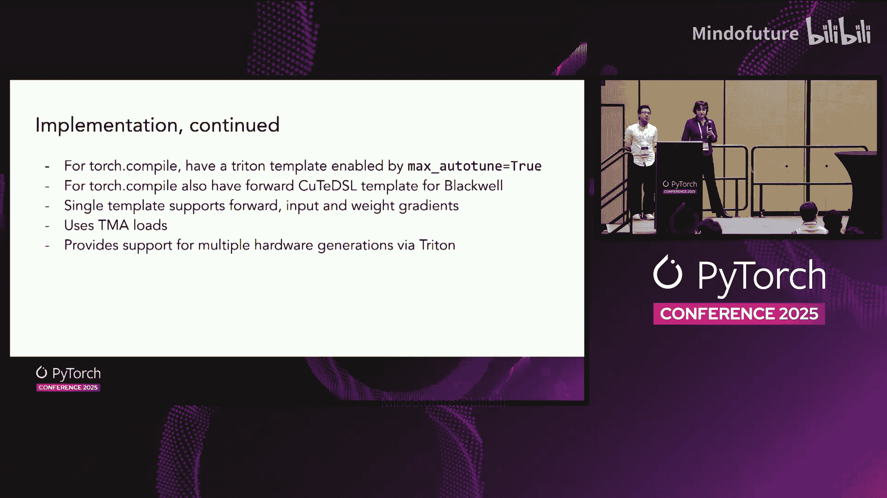
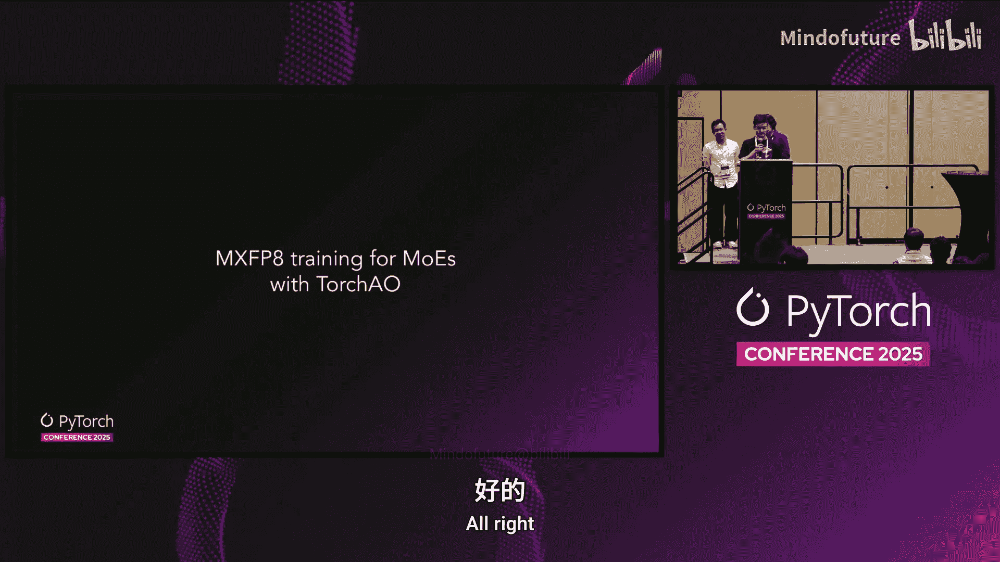
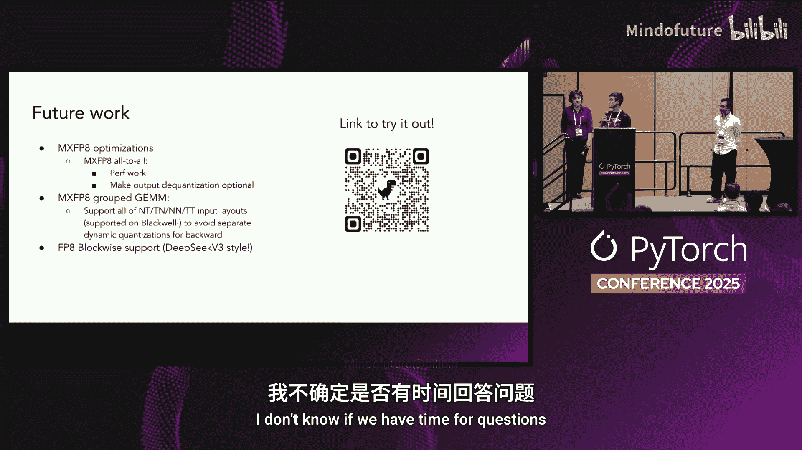

# 056：引言与目标


在本章中，我们将介绍混合专家模型的基本概念，并概述 PyTorch 团队为高效训练此类模型所设定的 API 设计目标。

混合专家模型包含一个路由器，它决定哪个特定的专家最适合处理某个特定的令牌。模型不会将所有令牌都通过同一个大型线性层，而是将令牌路由到不同的专家。这使得专家可以更小，计算更轻量。同时，模型变得更强大，因为专家数量更多，通常能比单个线性层存储更多信息。

下图展示了路由器如何计算应将令牌路由到哪些专家，然后令牌执行计算。一个令牌不一定只发送给一个专家，实际上，最强大的模型通常会将令牌发送给前 K 个专家。


接下来，我们来看看 PyTorch 的目标以及我们希望 API 支持的功能。

以下是我们的主要设计目标：

*   **支持专家并行**：模型可能包含许多专家，将它们全部放在同一个 GPU 上可能不切实际。因此，我们需要能够将专家分布在多个 GPU 上，并高效地支持这种模式。这需要一个能够实现此功能的令牌路由机制。
*   **路由必须高效**：路由必须能够按照我们在结果 GPU 中期望的顺序放置令牌。
*   **避免主机-设备同步**：如果模型编写方式允许，我们的 API 应支持避免主机-设备同步。这对于性能、模型编译以及避免 GPU 受 CPU 限制至关重要。这可能需要令牌丢弃，但我们的 API 应使其成为可能。
*   **支持量化格式**：在 NVIDIA 和 AMD GPU 上，低精度格式的性能远高于高精度格式。因此，我们提供的混合专家 API 需要支持这些低精度格式，同时确保用户能获得准确的结果，且精度不会因使用量化 API 而受损。

在下一章中，我们将深入探讨如何通过令牌洗牌来实现这些目标。

# PyTorch 高性能混合专家模型：第 2 章：高效的令牌洗牌

上一章我们介绍了混合专家模型的目标，本章中我们来看看实现高效训练的第一个关键技术：令牌洗牌。

令牌洗牌在混合专家模型中面临几个挑战。首先，令牌的分割由运行在 GPU 上的路由器动态决定。每个 GPU 的输入缓冲区总长度是固定的，但分配给每个专家的令牌长度在每次迭代中都会变化。更复杂的是，这些元数据是 GPU 上的张量。

如果使用传统的 `torch.distributed` API 执行 `all-to-all` 操作，一个大问题是我们必须将分割长度从 GPU 同步回 CPU，然后发起 NCCL `all-to-all` 调用。这会导致 CPU 停顿，并最终在 GPU 流中产生间隙。

第二个挑战是，假设每个 GPU 有多个专家。如果只执行传统的按秩 `all-to-all`，那么到达 GPU 0 的所有专家数据会作为一个大块到达。当你打开 GPU 0 接收到的数据时，会发现令牌是以交错方式排列的。这对于专家处理来说是噩梦，因为专家需要去随机的内存位置获取令牌。

那么，如何避免这两个挑战呢？

我们的解决方案称为 **2D 或 2R-V**。我们绝对希望专家令牌以连续的方式到达接收缓冲区，这样专家处理令牌时，只需获取一个大的连续块。我们通过利用 GPU 内核本身的内存操作进行分割交换来实现这一点。通过交换分割，我们可以执行完美的求和来计算令牌块到达的偏移量。

接收方利用这些元数据，可以从对等节点的对称内存中，将令牌提取到接收缓冲区的首选位置。

以下是我们在 PyTorch 2.9 版本中提供的两个 API：

*   **`all_to_all_vd_2d`**：调度 API。
*   **`all_to_all_2d_v_dev_offset`**：组合 API。

其中，`V` 代表向量分割，`dev` 代表分割信息驻留在 GPU 设备上，`2d` 代表每个 GPU 有多个专家，因为数据很可能以二维形式存在。

这两个 API 的美妙之处在于，它们会将输出分割偏移返回给用户。你不仅获得了令牌交换，还获得了额外的偏移信息。这个偏移对专家处理非常有用：首先，调度操作的输出偏移与组合操作所需的输入分割偏移完全相同；其次，偏移信息对于后续的分组矩阵乘法至关重要。

我们还提供了一个称为 **对齐** 的便利功能。如果你提供此参数，我们将在输出缓冲区中自动为你设置每个专家块的对齐方式。

对于异构网络结构，我们设计了一种称为 **拉取然后推送** 的算法。其思想是，一个内核将沿节点内方向拉取令牌。一旦令牌到达，它将根据前 K 个索引，请求节点内内核将其发送出去。

从跟踪信息可以看到，我们计划在 2.1 版本中提供原型。两个内核（一个用于节点内方向，一个用于节点间方向）能够相互重叠。为了让它们知道令牌已到达，我们在这两个内核之间有一个信号来指示生产者和消费者关系。

接下来，我们将讨论如何处理这些令牌。

# PyTorch 高性能混合专家模型：第 3 章：分组矩阵乘法处理

上一节我们介绍了令牌洗牌，本节中我们来看看混合专家计算的核心：如何执行所需的矩阵乘法。

经过上一节描述的步骤后，我们拥有了需要在本地 GPU 上处理的所有数据。这些数据已经按照便于后续矩阵乘法内核处理的顺序排序。对我们来说，控制通信例程而不依赖预设的、无法满足所有需求的 `all-to-all` 操作至关重要。

数据就绪后，接下来做什么？每个 GPU 通常需要处理多个专家，数量从 4 到 16 不等。每个专家需要处理动态数量的令牌，因此我们无法预测哪些令牌会被路由到每个专家。

下图展示了正在进行的计算，它很好地说明了为什么混合专家模型常被称为稀疏计算：因为并非每个令牌都经过所有专家，只有最终乘积的某些块需要被计算。



那么，PyTorch 提议并支持什么呢？

原型 API 如下所示，它有两个参数用于处理所需的数据和权重，以及一个偏移向量，用于指示每个专家处理的令牌起始位置。

```python
# 原型 API 示意
grouped_gemm(input_2d, weights_3d, offsets)
```

其中，`input_2d` 的第一个维度是到达该设备的所有令牌，第二个维度是输入特征维度。对于权重，它是传统的 `[num_experts, input_dim, output_dim]` 形状。`M` 和 `N` 是输出矩阵的尺寸，`K` 是收缩维度。在我们的例子中，`N` 和 `K` 是模型维度，我们在 CPU 上知道它们，不是动态的。`M` 可以是动态的，我们必须处理它。

我们如何决定使用偏移还是大小来处理动态尺寸？逻辑是：如果你有偏移，计算每个特定矩阵乘法的大小很容易，只需一个减法操作。如果你只有大小，并且需要知道从哪里开始读取，你需要对特定组之前的所有大小求和，这是一个 `O(n)` 操作，不太方便。因此，作为通用规则，我们希望 API 接受偏移量，而之前的令牌洗牌步骤正好能产生我们这里所需的偏移向量。

前向计算很好，但如果要训练，我们还需要通过这个矩阵乘法进行反向传播。幸运的是，矩阵乘法是线性操作，分组矩阵乘法只是矩阵乘法的一个轻微变体。因此，我们可以重用所有现有的矩阵乘法反向传播公式。如果我们支持足够的输入变体，那么反向公式将自动适用于我们反向传播所需的所有情况。

具体来说，对于常规训练，如果计算关于输入的梯度，它将是一个类似的核函数，将一个二维梯度输出与转置的权重相乘。关于权重的梯度则略有不同，因为在这种情况下，我们必须相乘的两个张量中，其中一个维度是动态的。尽管如此，它仍然非常相似，并且可以以非常相似的方式编写所有这些内核，而无需为所有情况复制粘贴代码。

我们如何实现这些内核？我们在核心中提供了预编译的 cuBLAS 实现，为计算密集型情况提供了良好的性能。作为所有 PyTorch 的即时操作，它们几乎可以用于任何尺寸，并且不会因动态尺寸或更改模型尺寸而产生任何惩罚。


H100 对数据在内存中的布局方式有一些限制，因此用户必须负责按照 H100 的要求放置数据。在 B200 上，这些限制被取消，但由于一些遗留原因，我们尚未实现这些内核的更通用版本。



除了预编译的 cuBLAS 实现，我们还通过 `torch.compile` 提供了一些 Triton 版本的内核。这些内核遵循我们所需的所有变体的相同模板，没有任何代码差异，并且在许多情况下，对于带宽受限的情况，它们提供了显著更好的性能。

我们也正在努力支持 QDSL 模板，但目前仍在进行中。

最后，我们将讨论如何在 TorchTune 训练中实际使用这些 API。

# PyTorch 高性能混合专家模型：第 4 章：MXFP8 量化训练

前面我们讨论了分组矩阵乘法的实现，本节中我们来看看如何利用 MXFP8 量化格式来加速混合专家模型的训练。

首先，快速回顾一下 MXFP8。对于不熟悉的人来说，它是一种低精度数值格式，在 Blackwell GPU 上对某些操作具有原生加速功能。它由几个关键部分组成：数据本身是浮点格式，具体是 E4M3；缩放因子也是浮点格式，但是 E8M0 格式。另一个关键特性是缩放因子非常细粒度，为 1/32。这对于在训练期间保持数值精度很有好处。

那么，我们如何使用它来加速训练呢？我们正在进行一种称为 **动态量化** 的操作。基本上，对于路由后的专家计算，我们不是使用 BF16 分组矩阵乘法，而是动态量化输入，然后使用 MXFP8 分组矩阵乘法，速度最高可提升 2 倍。只要量化内核足够快，我们就能获得净加速。


这就是我们在 TorchTune 中实现的内容。我们有了第一个量化的混合专家构建块，现在可供使用。第一个叫做 `scaled_group_gemm_mxfp8`，它完全实现了前面幻灯片展示的功能，并且我们处理了反向路径，因此它是完全可微分的。它的 API 也与 `torch.group_gemm` 相同，因此可以直接替换使用。最后，它也原生集成到了 TorchTune 中。

我们运行了一些基准测试，使用了一些 Llama 4 和 DeepSeek 的形状。在各个测试中都看到了显著的加速。对于单个操作，微基准测试显示比 BF16 基线有 1.6 到 1.8 倍的加速。在单个设备上，对于 Llama 4 的单个混合专家层，我们获得了 1.42 倍加速，对于 DeepSeek 获得了 1.18 倍加速。

在端到端训练方面，目前只在 Llama 4 上进行了测试。在训练的早期阶段，当专家负载不平衡时，我们看到了接近 1.5 倍的非常高速度。随着训练稳定，专家负载更加平衡，速度稳定在 1.21 倍左右。

接下来，我们也考虑了通信优化。混合专家模型以通信密集著称，优化的一种方法是减少通过网络发送的字节数。因此，我们基于之前讨论的内容，提供了一些实验性的 API，用于在 MXFP8 中执行 `all_to_all` 调度或组合操作，即低精度通信。

现在，让我们快速图解一下这是如何工作的。这是之前展示的动态量化 MXFP8 分组矩阵乘法。在前向传递中，我们从二维输入和偏移开始，然后是我们的三维专家权重。

第一步是动态量化为 MXFP8。然后，我们需要将缩放因子转换为 **块交换** 格式。实际用于运行块缩放矩阵乘法的 PTX 指令 `TCG05_MM` 有一些特殊要求：缩放因子必须位于 TM 中，并且必须采用这种特殊的块交换布局。

“块”部分意味着缩放因子需要被填充，以便可以均匀地划分为图中所示的 128x4 块。然后，在这些 128x4 块内，需要使用 NVIDIA 规定的交换公式执行交换，以避免在矩阵乘法操作期间获取缩放因子以重新缩放输出时发生存储体冲突。

这对于分组矩阵乘法来说尤其棘手，因为这必须按组进行，而不是对整个张量进行。解决方案是，我们有一个自定义内核以高性能的方式完成此操作。我们以一种有趣的格式写出输出，我称之为 **每组的行块主序格式**。

然后，我们可以执行 Natalia 讨论过的 2D-3D 分组矩阵乘法，得到二维输出。

在反向传播过程中，2D-2D 分组矩阵乘法变得特别有趣，因为分组现在是沿着收缩维度进行的。我们最喜欢的每组分块交换也变得特别有趣。点运算变得有点棘手，我们必须动态计算这些虚拟步幅。然后我们执行 2D-2D 分组矩阵乘法，得到三维输出，即权重的梯度。

未来的工作包括添加对 Hopper 架构的块缩放支持，以及对分组矩阵乘法进行改进以使其更通用。



# 总结

在本教程中，我们一起学习了 PyTorch 如何通过一系列创新的 API 和优化来支持高性能混合专家模型的训练与推理。

我们从混合专家模型的基本概念和设计目标开始，了解了支持专家并行、高效路由和避免主机-设备同步的重要性。接着，我们深入探讨了 **令牌洗牌** 的挑战与解决方案，特别是 `all_to_all_vd_2d` 和 `all_to_all_2d_v_dev_offset` 这两个 API，它们高效地处理了动态、设备端的令牌路由。

然后，我们聚焦于模型计算的核心——**分组矩阵乘法**。我们看到了 PyTorch 如何提供灵活的 API 来处理动态数量的令牌，并支持高效的前向和反向传播，无论是通过预编译的 cuBLAS 实现还是 Triton 内核。

最后，我们探索了利用 **MXFP8 量化** 来进一步加速训练。通过动态量化和专门优化的块交换格式处理，我们能够在保持精度的同时，显著提升计算和通信效率。


这些技术进步共同构成了 PyTorch 生态系统中高效、灵活且面向未来的混合专家模型训练基础。