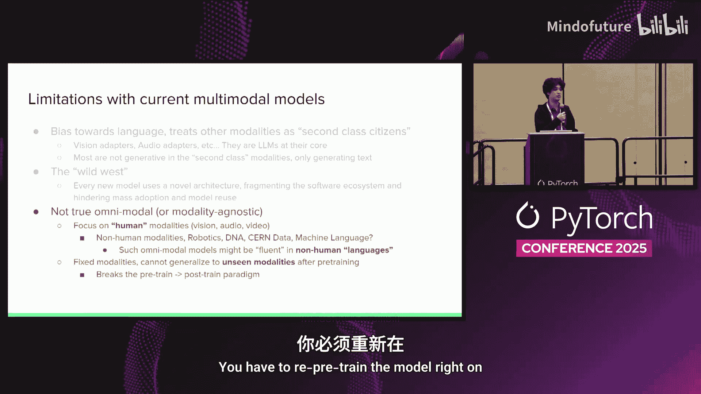
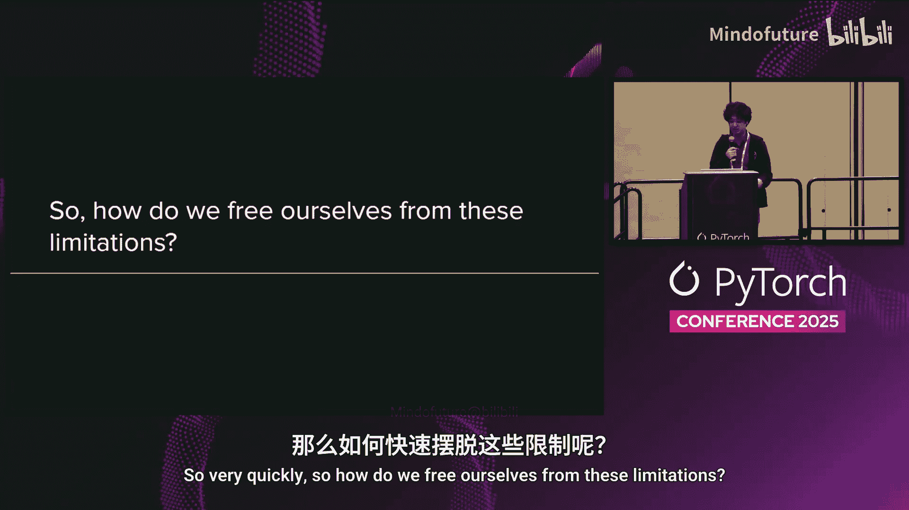
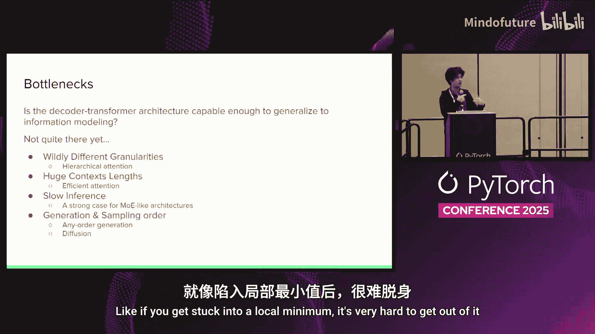
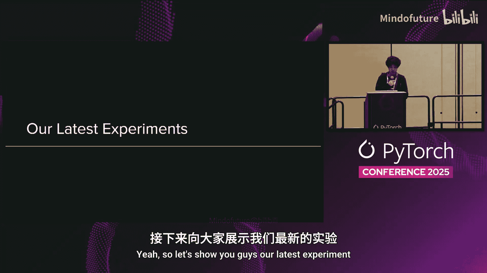
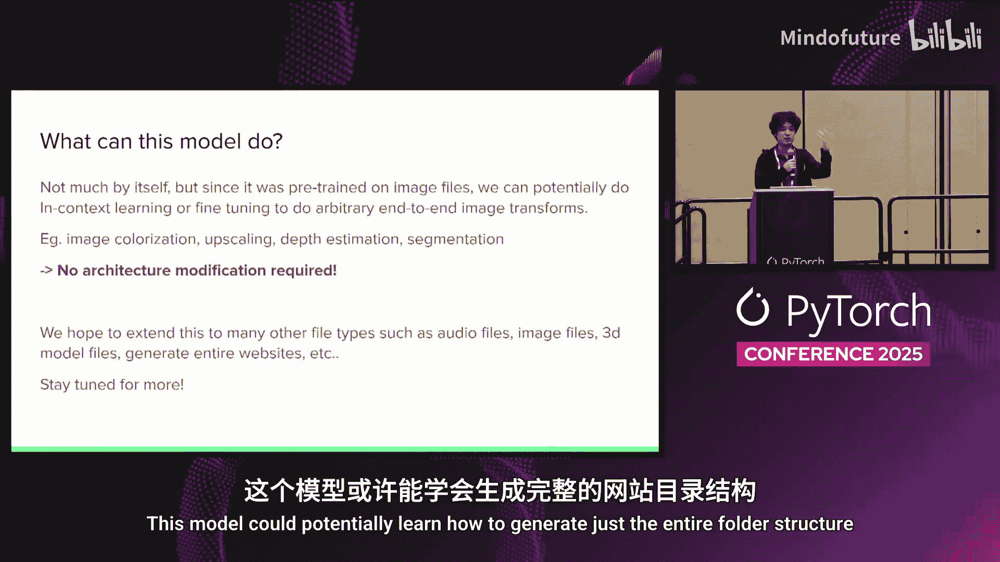
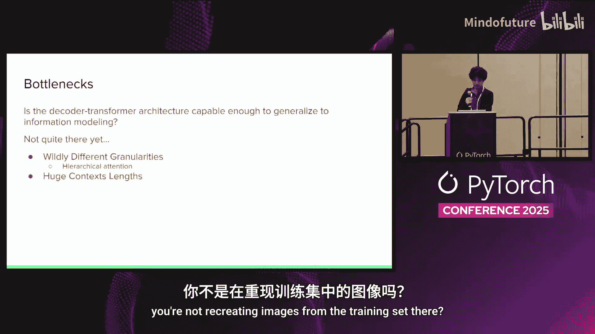

# 057：迈向原生多模态架构

## 概述

在本节课中，我们将探讨如何超越当前以语言为中心的Transformer架构，迈向一种能够原生处理多种数据模态（如图像、音频、DNA序列等）的新范式。我们将分析现有方法的局限性，并提出“信息建模”这一新方向，旨在直接对原始字节数据进行建模，从而解锁更广泛的下游能力。

---

## 章节 1：当前多模态模型的局限性

上一节我们概述了课程目标，本节中我们来看看当前主流多模态模型面临的主要挑战。

当前的多模态架构存在显著偏见，它们将语言视为一等公民，而将其他模态（如图像、音频）视为二等公民。这些模型通常采用文本解码器作为核心，而通过视觉适配器、音频适配器或扩散模型等附加组件来处理其他模态。这意味着文本解码器本身并未真正理解其他模态的本质。

此外，当前的多模态领域处于一种“蛮荒西部”状态，每天都有新的、互不兼容的架构被提出，这严重碎片化了软件生态系统，阻碍了大规模应用。例如，像Llama.cpp这样的推理引擎很难跟上所有最新视觉编码器和扩散模型的实现。

最后一个关键局限是，现有模型并非真正的“全模态”模型。它们主要关注人类可感知的模态（如文本、图像、语音），而忽略了大量其他类型的数据，例如机器人控制信号、DNA序列或机器语言。更重要的是，一旦模型完成预训练，就很难再扩展到这些新的模态，这破坏了“预训练-后训练”这一高效范式。

---

## 章节 2：新范式：信息建模

在认识到现有架构的局限后，本节我们将探索一种新的扩展范式——信息建模。

信息建模的核心思想是，我们不再将语言视为智能的唯一代理，而是直接对宇宙中的原始信息本身进行建模。这可以被视为向“大型信息模型”的过渡。其优势在于，通过直接对底层信息进行建模，而非经过人类语言这一层“过滤”，模型有望解锁前所未有的下游能力。

以下是信息建模潜力的一些示例：
*   **跨模态生成**：例如，根据一幅手绘动物草图，生成理论上可能存在的该动物的DNA序列。
*   **原生网络交互**：模型可以直接发送和接收网络数据包，从而在多人游戏等环境中自主行动，无需复杂的编程接口。
*   **直接机器人控制**：模型可以直接输出数字控制信号来操控机器人。
*   **数据压缩与算法发现**：模型可以学习压缩数据，进而通过强化学习发现新的、更高效的压缩算法。
*   **与计算机的原生接口**：模型可以直接与操作系统或硬件进行交互。

支持这一方向的理论依据包括“苦涩的教训”，该观点认为，拥有更多计算和数据的简单通用系统，最终会胜过复杂、特化的系统。

---

## 章节 3：实现信息建模的技术瓶颈

尽管前景广阔，但实现真正的信息建模仍面临诸多技术挑战。本节我们来详细分析这些瓶颈。

首先，一个根本问题是：**现有的解码器Transformer架构是否具备足够强的泛化能力来适应这一新范式？** 目前尚无定论。例如，让Transformer直接学习解压ZIP文件（即理解霍夫曼编码等算法）而不借助外部解压器，仍然非常困难。

以下是几个主要的技术瓶颈：

1.  **数据粒度差异巨大**：不同模态的信息密度天差地别。一段描述世界的文本非常密集，而表达相同内容的语音波形文件则可能达到兆字节级别，信息非常稀疏。如何让一个模型同时高效处理如此稀疏和密集的数据是一大难题。一种可能的解决方案是**分层注意力机制**，让模型的不同部分关注不同粒度的信息。

2.  **超长上下文与效率问题**：处理图像、音频、视频等原始字节数据需要极长的上下文窗口。虽然RNN等架构能处理长序列，但Transformer的注意力复杂度是**O(n²)**，这成为主要瓶颈。我们需要既能处理长上下文，又能在短上下文中保持高性能的高效注意力算法（如线性注意力）。

3.  **推理速度缓慢**：如果对每个字节都进行自回归生成，意味着要为每个字节遍历整个庞大的模型，这极其低效。可能的解决方案包括采用**混合专家模型**，这样在推理时，每个输入只需激活模型的一小部分。

4.  **生成顺序限制**：并非所有数据类型都适合从左到右的顺序生成。例如，绘画时，先画主体再画背景可能更合理。这要求模型支持**任意顺序生成**。扩散模型虽然能一步生成整个序列，但在处理离散数据（如字节）时容易陷入局部最优，难以调整。

---

## 章节 4：初步实验：基于字节的图像建模

在讨论了理论框架和挑战后，本节我们来看一个具体的初步实验，展示信息建模的可行性。

我们进行了一项实验：训练一个直接读取原始BMP图像文件字节的模型。在这个模型中，**1个字节就对应1个token**，词汇表大小为256（对应所有可能的字节值）。模型规模为6亿参数，在包含3000亿token（约300GB图像数据）的数据集上进行了训练。

以下是该实验的关键细节：
*   **数据处理**：图像被调整为约8KB大小（如48x48像素），以32K上下文长度进行训练，每个样本包含约4张图像。
*   **注意力机制**：实验采用了一种名为“灯塔注意力”的新型高效注意力机制，它与FlashAttention兼容，相比完全注意力带来了约4倍的训练加速。
*   **训练资源**：在64张B200 GPU上训练了约1天。

实验结果表明，模型能够成功生成结构正确的BMP文件。生成的图像虽然分辨率低、内容模糊，类似于早期DALL-E的效果，但这证明了模型学会了BMP文件格式（包括正确的文件头）和基本的图像内容分布。

我们还可以进行一些有趣的扩展实验：
*   **文件补全**：给定一个被截断的BMP文件（如只有上半部分），模型可以补全出合理的下半部分。
*   **条件生成**：给定一个指定生成“宽幅”或“竖幅”图像的文件头，模型能生成符合该尺寸分布的图像内容（例如，宽幅图中更多出现建筑和汽车，竖幅图中更多出现人物）。

这个初步模型仅预训练于图像文件，但理论上，通过微调，它可以扩展到图像编辑、上色、超分辨率、深度估计、分割等多种任务，而**无需改变模型架构**。未来，我们希望将这种方法扩展到音频、文本、3D模型文件乃至整个网站文件夹结构等更多数据类型。

---

## 总结

本节课中，我们一起学习了重构Transformer架构以迈向原生多模态的必要性和可能性。我们回顾了当前多模态模型的局限性，提出了“信息建模”这一新范式，它旨在直接对原始字节数据进行建模，从而解锁更通用、更强大的能力。我们分析了实现这一目标所面临的技术挑战，如数据粒度差异、长上下文效率和生成顺序等。最后，我们通过一个直接对BMP图像字节进行建模的初步实验，展示了这一方向的可行性和潜力。未来，沿着信息建模的道路探索，或许能让我们突破现有以语言为中心的AI范式，构建出真正理解并生成多种信息形式的通用智能系统。