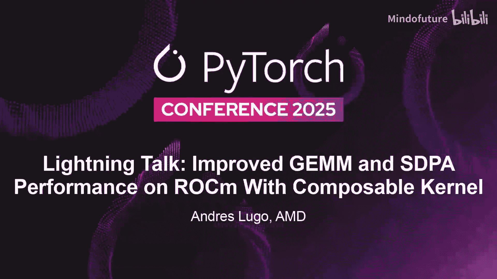
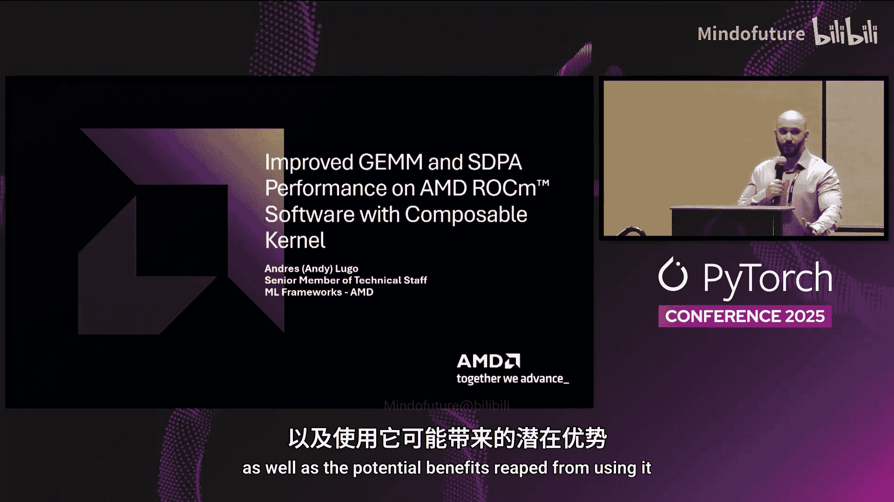
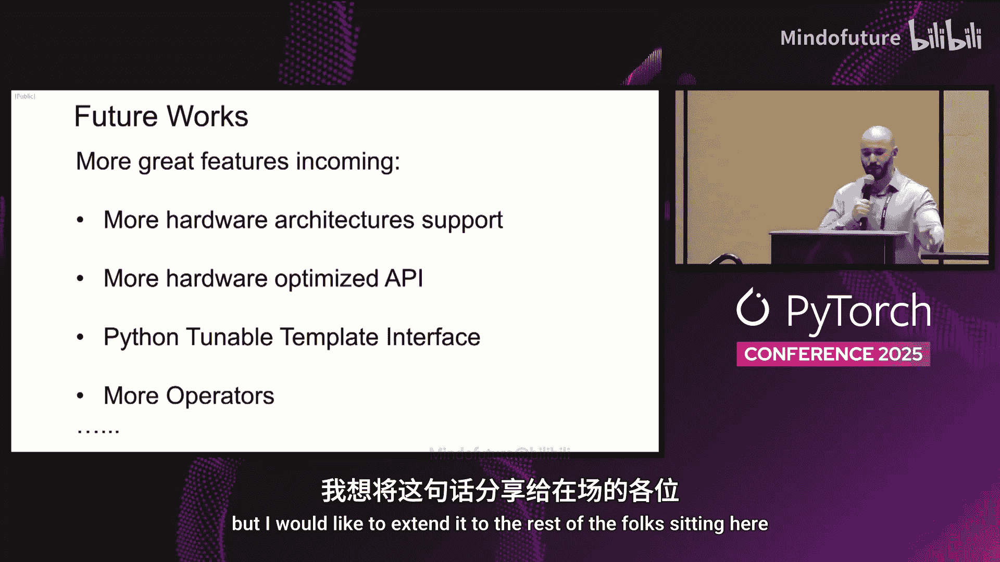
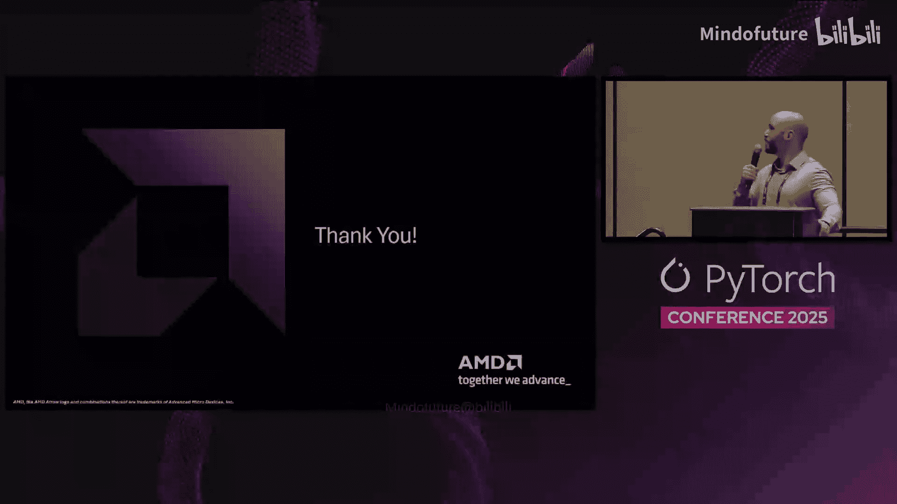

# 058：通过 Composable Kernel 提升 ROCm 上的通用矩阵乘法与自注意力性能 🚀

在本教程中，我们将学习如何利用 AMD 的 **Composable Kernel** 库来显著提升 PyTorch 在 ROCm 平台上的性能，重点关注两个核心操作：通用矩阵乘法与缩放点积注意力。



---

## 概述与致谢 🙏

大家好，我是 Andres Lugo，在 AMD 担任高级技术成员，专注于将数学库集成到 PyTorch 中。




本次分享的成功离不开众多 AMD 工程师的辛勤工作。左侧是核心 CK 团队，他们指导我正确使用该库；右侧是我的框架团队同事，我们共同完成了与 PyTorch 的集成。此外，还有无数硬件和固件工程师为 CK 所依赖的 AMD GPU 做出了贡献。正是他们的努力，才使这一切成为可能。

---

## 什么是 Composable Kernel？🤔

**Composable Kernel** 是一个强大的库，允许用户编写自定义的、针对特定供应商优化的内核，并将其集成到各种应用中。这些内核利用底层的 ROCm 软件栈，高效分配片上资源以最大化性能。

CK 支持多种算子，包括但不限于：
*   各种类型的 GEMM
*   融合多头注意力
*   平滑量化

CK 旨在抽象化张量坐标变换等基础操作，从而加速为机器学习工作负载定制的高性能线性代数内核的开发。它在**融合操作**方面尤其出色，这使其有别于 HIPSOLVER 等其他线性代数库。

其主要优势包括：
*   **接近理论极限的性能**
*   **可自定义的 C++ 算子**，用户可根据特定需求进行修改
*   **可调优的模板实例**，用于从 AMD 硬件中榨取尽可能多的性能

我们已经开始将这个强大的库作为后端，集成到 PyTorch 的各种机器学习算子中。本次分享将聚焦于两个算子：**GEMM** 和**缩放点积注意力**。

---

## GEMM 的集成与启用 ⚙️

上一节我们介绍了 CK 的基本概念，本节中我们来看看如何在 PyTorch 中启用 CK 作为 GEMM 的后端。

启用 CK GEMM 从构建时开始，它由环境变量 `USE_ROCM_CK_GEMM` 触发，目前默认已启用。

在运行时，用户可以通过调用 `torch.backends.rocblas.set_preferred_library('ck')` 来将首选的 BLAS 后端设置为 CK。之后，GEMM 操作（例如使用 `@` 运算符时）将正常使用 CK。集成的批处理 GEMM 在正常的 BMM 情况下也会类似地被使用。

在 Python 层设置好首选后端后，该变量会在 C++ 层被读取，此时 PyTorch 原本需要在 HIPSOLVER 和 hipBLASLt 之间做选择。现在，逻辑会流经一个启发式算法，该算法根据输入的各种因素（如 M、N、K 的大小、数据类型以及输入是否需要填充）来选择最佳的 GEMM 内核。

我们目前正在进一步调整这个启发式算法，以持续提升性能。

---

## GEMM 性能表现 📊

在性能方面，以下数据是在基于 AMD MI300X 的系统上，使用 Bf16 数据类型运行 GEMM 得到的。X 轴是一组常见形状，Y 轴是每次 GEMM 操作所花费的时间。


经过多次预热迭代后，橙色柱状图代表使用 CK 的情况，蓝色代表不使用 CK 的情况。如图所示，两者之间存在显著的性能差异。这些数字代表了 CK 在成功调优和优化后的强大能力。

需要指出的是，这些数据是使用针对所示形状高度优化的专用 CK 流水线测得的。它并非“一刀切”的解决方案，但这表明，当调优适当时，性能提升可能是巨大的。每个 GEMM 时间仅为之前的一小部分，在本例中平均带来了 **78.9%** 的加速。此数据基于 ROCm 6.4.2 版本，我们旨在随每个后续版本持续改进 CK 和 hipBLASLt 的性能。

以下是相同形状下的各种输出吞吐量对比：



差异依然非常明显，CK 是橙色柱状图，hipBLASLt 是蓝色。这里数值越大越好，代表更高的吞吐量。

再次强调，这些示例是经过专门调优的。在某些调优不足或缺乏合适 CK 流水线的情况下，hipBLASLt 可能表现出更好的性能。因此，为了真正发挥 Composable Kernel 的潜力，**调优和分析是必需的**。

---

## 使用 CK Profiler 进行调优 🔧

上一节我们看到了调优的重要性，本节将介绍实现调优的工具：CK Profiler。

这种调优得益于 **CK Profiler**。CK Profiler 是 CK 代码库中附带的一个实用工具，你可以构建并使用它来为你的特定问题选择最佳流水线。

运行它会输出你想要使用的流水线、该流水线的版本以及其他最适合你需求的平铺模板参数。使用方法相当简单，如下所示：

```bash
# 基本用法示例
./ck_profiler gemm [options] -m <M> -n <N> -k <K> -d <data_type> ...
```

用户只需指定要分析的张量操作类型（可以是各种类型的 GEMM，如批处理、分组等），然后提供张量的转置布局、数据类型、M/N/K 的值以及输入的步长。不同的张量操作需要不同的参数，但你可以通过运行可执行文件后跟张量操作和 `-h` 参数来轻松找到用法。

GitHub 代码库的 README 中更详细地描述了用法，请查阅。这个工具极其重要，是用户为其任务选择最佳 GEMM 内核的方式。

---

## 缩放点积注意力的集成 🧠

现在让我们继续讨论下一个操作：缩放点积注意力。

对于 SDPA，之前在 ROCm 上使用的库是 AO Triton。启用后，逻辑会简单地路由到 CK。与 GEMM 类似，此功能仅在环境变量 `USE_ROCM_CK_SDPA` 设置为 true 时才会被构建。但与 GEMM 不同的是，**它默认未启用**。我们目前正在完善实现，以期默认启用，敬请期待。

一旦 PyTorch 成功构建了这些新内核，将 CK 设置为注意力后端只需在模型中添加一行代码：

```python
torch.backends.cuda.sdp_kernel(enable_flash=True, enable_math=False, enable_cudnn=False)
# 注意：具体 API 可能随 PyTorch 版本更新，请参考最新文档。
```

然后，在你的代码常规调用缩放点积注意力的任何地方，都将使用 CK 后端。需要注意的是，它目前同时作为 Flash Attention 和 Efficient Attention 的后端实现。在需要数学后端或显然需要 CUDNN 后端的场景中，CK 将不会被使用。

下图说明了这一点：



在 PyTorch 的不同情况下，Flash 和 Efficient Attention 会使用不同的算法，但在 CK 的情况下，它为两者都提供了后端。每个入口点接受不同的参数，例如，Efficient Attention 接受注意力偏置，而 Flash Attention 不接受。CK 能够在任一场景下工作。

---

## SDPA 性能表现 📈

关于 SDPA 性能，我们使用 PyTorch 在 `benchmarks/transformers` 目录下提供的开源基准测试收集了这些数据。此数据同样在 MI300X 上使用 BF16 数据类型收集。在接下来的几张图表中，我们将观察 X 轴作为 Q 的序列长度，Y 轴作为时间。蓝色柱状图代表在未使用 CK 的 ROCm 上运行的基准测试，橙色柱状图代表使用 CK 时收集的数据。

在此图表中，数值越小越好，代表每个内核花费的时间更少。在所有情况下，CK 都优于现有的 AO Triton。这张特定的图表是前向传播，代表了 **19%** 的速度提升。


紧随其后的是相同数据的反向传播图表。同样，CK 的表现优于 AO Triton。

下一张图表显示了随着 Q 序列长度增加，吞吐量或每秒浮点运算次数的变化。在这种情况下，数值越大越好，代表每秒执行了更多的浮点运算。同样，第一张图表显示 CK 在前向传播中再次表现更优。

最后，我们有相同数据的反向传播图表，其速度要快得多，平均代表了 **98%** 的速度提升。

---

## 更广泛的集成与未来展望 🔮

CK 的集成不仅限于 PyTorch，它也被许多其他流行的机器学习框架所采用，包括但不限于：
*   **FBGEMM**：集成了多种 GEMM 变体。
*   **xFormers** 和 **Triton Flash Attention**：两者都有选项可以使用 CK 的融合多头注意力。
*   **Torch Inductor** 内部集成。

由此可见，CK 持续在多个平台上被广泛采用，并且集成数量不断增长。

展望未来，我们目前正在将 GEMM 迁移到一个新的、更简化的 API 和模板库，形式是 **CK Under Tile**。我们还希望增加对更多硬件架构的支持，持续优化 API，并在 Python 层面提供可调优的模板接口，敬请期待这些改进。

---

## 总结 🎯

本节课中，我们一起学习了如何利用 AMD 的 **Composable Kernel** 库来优化 PyTorch 在 ROCm 平台上的性能。我们详细探讨了：

1.  **CK 的核心概念**：一个用于编写高性能、可定制化内核的库，特别擅长融合操作。
2.  **GEMM 的集成**：如何通过环境变量和运行时设置启用 CK 后端，并展示了其带来的显著性能提升（平均 **78.9%** 加速）。
3.  **性能调优的关键性**：介绍了 **CK Profiler** 工具，它是为特定工作负载选择最佳内核的必要手段。
4.  **缩放点积注意力的集成**：如何将 CK 设置为 SDPA 的后端，并在前向和反向传播中均观察到可观的性能提升（前向 **19%**，反向平均 **98%**）。
5.  **广泛的生态系统**：CK 已被集成到多个主流 ML 框架中，展现了其生命力和实用性。
6.  **未来发展方向**：包括 API 简化、硬件支持扩展和更高级的调优接口。

本演示代表了 AMD 在此领域持续推动的正在进行的工作，我们期待继续努力，以改善 PyTorch 在 ROCm 平台上的表现。正如 AMD 的内部格言，也适用于在场的各位以及在线聆听的朋友们：

**Together, we advance.**


