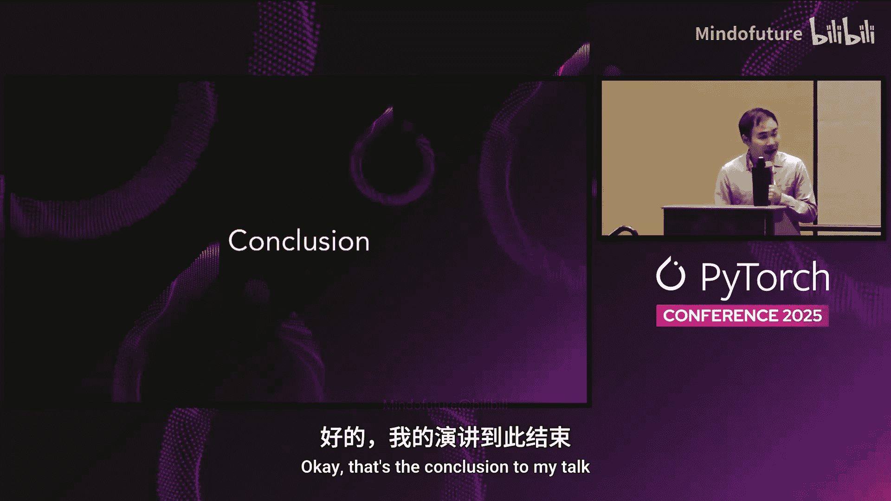

# 060：动态形状重编译问题详解 🚀


在本教程中，我们将学习PyTorch中的动态形状概念，理解其如何解决静态编译带来的重编译问题，并探讨性能与通用性之间的权衡。我们将通过一个LLM服务的例子，逐步解析动态形状的原理、守卫机制以及相关的API使用。

---

## 概述

动态形状是一种符号化表示张量的方式，它允许张量的某些维度（如批次大小）在运行时变化，而无需为每个新形状重新编译模型。这对于需要处理可变输入大小的服务（如LLM推理）至关重要，可以避免因频繁的形状变化导致的性能损失。

---

## 什么是动态形状？ 🤔

在构建LLM服务（例如聊天机器人）时，我们通常会将多个用户请求批处理成一个张量，然后通过网络运行。批次大小可能因请求数量而异。

动态形状允许我们使用符号来代表张量的某个维度。例如，批次大小可以用符号 `S0` 表示，那么输入张量的形状就是 `[S0, 3]`。

**为什么需要动态形状？**
默认情况下，`torch.compile` 进行的是静态编译。这意味着每次遇到新的输入形状，它都会触发一次重编译。例如：
*   首次遇到批次大小为10时，可能进行一次耗时10分钟的编译。
*   随后遇到批次大小为2时，会再次进行10分钟的编译。
*   遇到批次大小为5时，又会进行一次编译。

动态形状旨在解决这个问题，它允许编译一次代码，就能处理该维度上不同的尺寸。

---

## 如何启用动态形状？ ⚙️

启用动态形状非常简单，通过 `torch._dynamo.mark_dynamic` API 实现。

该API接收一个张量和您希望设为动态的维度索引。在底层，它会注解该张量，提示编译器：未来此维度可能会发生变化。

```python
import torch
# 假设 input_tensor 的形状为 [batch_size, 3]
# 我们将第0维（批次维度）标记为动态
torch._dynamo.mark_dynamic(input_tensor, 0)
```

启用后，在首次编译时，编译器会生成一个能处理动态维度的代码区域。之后，当接收到不同的批次大小时（如2或5），将不会触发重编译，而是复用已编译的代码，从而提升效率。

---

## 理解守卫机制 🛡️

为了理解守卫，我们设想一个场景：一位优秀的实习生为我们的LLM服务设计了一个新算法，该算法能极大提升推理速度，但**仅当批次大小能被8整除时**才有效。

一个合理的实现方式是在推理函数中添加条件判断：如果批次大小能被8整除，则使用新算法；否则，使用普通算法。

以下是 `torch.compile` 处理此类代码的流程示意图（时间自上而下，输入批次大小从5递增到11）：

1.  **首次运行（批次大小=5）**：触发首次编译。由于5不能被8整除，因此编译并执行“慢速推理算法”。同时，编译器会为这段代码区域添加一个**守卫**：`batch_size % 8 != 0`。
2.  **后续运行（批次大小=6, 7）**：输入通过守卫检查（6和7均不能被8整除），因此直接复用已编译的代码区域，无需重编译。
3.  **触发重编译（批次大小=8）**：输入无法通过现有守卫（因为8能被8整除），发生**守卫失败**。此时触发重编译，编译并执行“快速推理算法”。同时，为新区城添加新的守卫：`batch_size % 8 == 0`。
4.  **再次运行（批次大小=9, 10, 11）**：这些输入无法通过新守卫（不能被8整除），但可以通过第一个守卫（不能被8整除），因此系统会回退并使用第一个编译的代码区域。

守卫机制确保了只有在输入特性（如形状）满足特定条件时，才会使用为其专门优化的编译代码。

---

## 重编译的价值权衡 ⚖️

理解了守卫和重编译后，我们需要思考：何时进行重编译是值得的？这通常涉及**性能与通用性**的权衡。

*   **高度特化的优化**：例如，一个仅在批次大小等于8时才有效的优化内核。它的**通用性很低**，但可能获得**极高的性能**。
*   **较为通用的优化**：例如，一个在批次大小为任意偶数时都有效的优化。它的**通用性很高**，但性能提升可能比特化内核要**差一些**。

评估是否值得为某个特化场景进行重编译，可以考虑以下公式：

```
预期总收益 = 预期调用次数 × 每次调用的速度提升
```

决策逻辑是：如果 **预期总收益 > 重编译耗时**，那么进行重编译是值得的；否则，就不值得。

**举例说明：**
*   **优化A**：仅在 `batch_size == 8` 时有效，每次调用加速20毫秒。
    *   如果预期只调用100次，总收益为 `100 * 20ms = 2秒`。
    *   如果重编译需要5秒，那么净损失3秒，**不值得重编译**。
*   **优化B**：在 `batch_size % 2 == 0`（任意偶数）时有效，每次调用加速5毫秒。
    *   如果预期调用8000次，总收益为 `8000 * 5ms = 40秒`。
    *   即使重编译需要5秒，净收益35秒，**值得重编译**。

---

## 重编译的其他考量与风险 ⚠️

重编译并非没有代价，在分布式训练等场景下尤其需要谨慎。

考虑一个真实案例：一位机器学习工程师实现了一个图变换（FX Graph Pass），根据矩阵形状决定是否进行分解优化。这导致了不可预测的重编译。

在分布式环境中，多个GPU需要通过集合通信进行同步。如果100个GPU中有一个触发了重编译，其余99个都必须等待它完成。这会严重拖慢整体性能。更糟糕的是，如果图很大，重编译可能超过10分钟，导致NCCL超时，进而使整个训练任务崩溃，引发可靠性问题。

---

## 如何防止重编译？ 🚫

既然重编译可能带来问题，如何防止它呢？一种方法是使用 `torch._dynamo.mark_unbacked` API。

这个API与 `mark_dynamic` 类似，但它更严格。如果一个张量被标记为“unbacked”，那么在编译过程中，**一旦尝试根据其具体值进行任何特化优化，编译器将直接抛出错误**，并指出特化发生的位置。这迫使开发者要么重写代码以避免特化，要么实现一个自定义算子（custom op）来保持图的通用性。

```python
# 提示编译器，此张量的维度不应在编译时被特化
torch._dynamo.mark_unbacked(tensor, dim)
```

---

## 核心权衡总结 🎯

回顾整个讨论，动态形状的核心在于**通用性与性能**的权衡光谱：

*   **静态形状**：位于光谱一端。通常能获得**峰值性能**，但**通用性最差**，每个新形状都可能引发重编译。
*   **标记为非背景（Mark Unbacked）**：位于光谱另一端。保证**只有一个计算图**，通用性最高，但可能无法实现某些**特定形状下的极致性能**。
*   **动态形状（Mark Dynamic）**：位于中间。允许你**控制特化的程度**，在性能与通用性之间探索帕累托前沿，找到最适合你应用场景的平衡点。

---

## 总结

本节课我们一起深入探讨了PyTorch中的动态形状。我们学习了：
1.  动态形状如何通过符号化维度来解决静态编译的频繁重编译问题。
2.  如何使用 `mark_dynamic` API 来启用动态形状。
3.  守卫机制的工作原理及其如何管理不同特化版本的代码。
4.  如何通过简单的公式权衡重编译的成本与收益。
5.  在分布式等复杂场景中，不受控的重编译可能带来的风险。
6.  如何使用 `mark_unbacked` API 来强制通用性，避免重编译。
7.  动态形状技术的本质是在性能与通用性之间寻找最佳平衡点。



掌握这些概念，将帮助你更有效地使用 `torch.compile` 来优化PyTorch模型的性能，尤其是在处理可变输入大小的生产环境中。