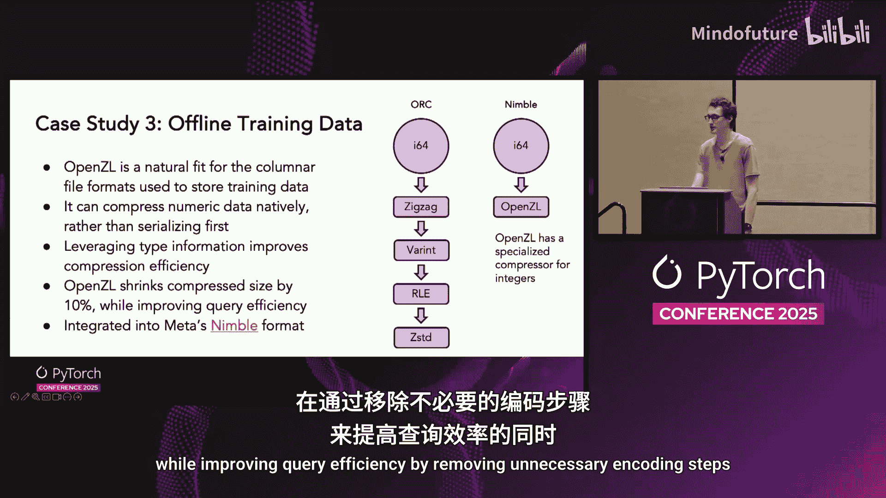
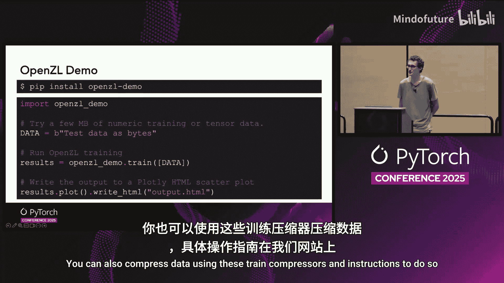

# 061：基于OpenZL的模型检查点压缩 🚀

在本教程中，我们将学习Meta开源的新型压缩工具包OpenZL，并探讨它如何通过理解数据格式来显著提升AI全栈的效率，特别是在模型检查点压缩方面的应用。

## 1. 传统压缩的局限与OpenZL的核心理念

上一节我们介绍了本教程的主题。本节中，我们来看看传统压缩方法的局限性。

传统的压缩器（如Zstandard、GZ、XZ等）对输入数据一无所知，它们只能看到原始的字节流。这限制了它们的压缩效率。

基于神经网络的压缩器虽然能克服这一障碍，但代价是计算速度极其缓慢，缺乏实用性。

OpenZL的核心思想是：**通过让压缩器了解数据的格式，可以在不增加额外计算量的情况下，实现压缩效率的飞跃式提升**。这一点对于数值型数据尤其明显。

例如，一个递增的整数序列对Zstandard来说完全无法压缩，因为其中没有重复模式。但只需进行一个简单的增量变换（即用当前值减去前一个值），这个序列就变得极易压缩。

## 2. OpenZL简介：一个构建专用压缩器的工具包

上一节我们了解了传统压缩的瓶颈。本节中，我们来认识OpenZL。

OpenZL是一个用于构建和部署专用压缩器的工具包。它采用一种基于图的通用压缩模型。

以下是OpenZL的核心工作流程：

1.  **代码库**：OpenZL拥有一套用于操作、转换和压缩数据的“编解码器”。
2.  **构建图**：压缩器将这些编解码器组合成一个有向无环图（DAG）。
3.  **输出**：压缩后的数据就是这个DAG的输出结果，同时附带了图结构本身。

这意味着压缩器可以随时改变其压缩图，同时保持与现有解压器的兼容性，这为我们如何压缩数据提供了极大的灵活性。

通常，OpenZL采用一种模式：**压缩器是智能的，它理解数据；而解压器只是遵循压缩器留下的指令执行操作，因此非常通用**。

## 3. 案例研究一：无损压缩模型检查点

上一节我们介绍了OpenZL的工作原理。本节中，我们来看看它在模型检查点压缩上的具体应用。

传统上，模型通过量化浮点张量（例如将`float32`截断为`bfloat16`）进行有损压缩。然而，这会**影响模型质量**，因此必须在应用前对每个模型进行质量影响评估，这使得在检查点保存时难以应用。量化仅应用于少数模型，虽然在这些模型上节省了50%的空间，但整体节省非常有限。

相比之下，**无损压缩**虽然节省的空间不如有损压缩多，但它能透明地应用于所有模型，且不影响质量。使用OpenZL，我们能够将存储和带宽减少**17%**。由于带宽是瓶颈，添加压缩还将检查点的保存和加载时间减少了**15%**，在存储和检查点开销上实现了双赢。

### 深入解析：如何压缩bfloat16张量

我们来深入了解一下OpenZL是如何实现这种压缩的，以`bfloat16`张量为例。

一个`bfloat16`包含：
*   1个符号位
*   8个指数位
*   7个小数位

我们通常观察到指数位高度集中，因为浮点数通常在-1到1之间呈正态分布。出于同样的原因，符号位和小数位基本上是噪声。小数位的最高几位可能包含一些信号，但非常微弱，通常不值得提取。

因此，为了压缩这些浮点数，我们执行以下步骤：
1.  **位重排**：将浮点数中的位进行重排，以将指数位与符号位、小数位分离开。
2.  **熵编码**：使用霍夫曼编码等熵编码器专门压缩指数位。
3.  **直接存储**：将符号位和小数位不经压缩直接存储。

这种分离使我们能够为指数位专门优化熵编码统计，而不会混入符号位和小数位的噪声。同时，这也加快了压缩速度，因为我们不需要压缩符号位和小数位。

这项技术相当简单，已在业界广泛应用（例如在NVIDIA的DALI库或ZNN中）。因此，OpenZL压缩浮点数的方法并非首创，但这并非它的全部。

## 4. 案例研究二：压缩PyTorch保存格式中的图像嵌入

上一节我们学习了如何压缩简单的张量。本节中，我们处理一个更复杂的格式。

在这个例子中，我们要压缩存储在PyTorch `torch.save`格式中的图像嵌入，该格式是一个未压缩的ZIP文件。我们希望以与检查点完全相同的方式压缩其中的张量数据，但它与ZIP文件元数据混合在一起，这造成了障碍。

为了处理这种情况，OpenZL中的`Split`编解码器发挥了作用。压缩器中的自定义代码会解析ZIP文件，将所有张量数据分组到一起以便压缩。虽然压缩器需要理解ZIP文件格式，但`Split`编解码器会记录其决策，因此**解压器对文件格式是无感知的**。这意味着我们可以随时更改解析方式。

使用这种技术，我们能够将这些嵌入的存储和带宽消耗减少**30%**，并且没有影响训练性能。由于能够复用现有组件，该压缩器的构建时间不到一周，并且可以在不修改解压器的情况下部署。

## 5. 案例研究三：压缩离线训练数据（列式存储格式）

上一节我们处理了混合格式。本节中，我们转向结构更清晰的离线训练数据。

离线训练数据通常以列式数据格式存储。在开源领域，这通常是Parquet格式。在Meta，过去是ORC，现在是Nimble。

从根本上说，列式格式将复杂的列（如映射）分解为原子数据类型（如`int64`或`float`）的列。此时，像ORC这样的格式需要对数据进行编码以减少占用空间，例如，在传递给Zstandard之前进行字典编码和游程编码。然而，Zstandard并不知道它正在压缩数值数据，只是将其视为字节。

OpenZL则不同。Nimble将列数据连同类型注解一起直接传递给OpenZL，这允许在更快的速度下实现显著改进的压缩。

与Zstandard相比，OpenZL能够将Nimble文件缩小**10%**，同时通过移除不必要的编码步骤提高了查询效率。

## 6. 案例研究四：压缩在线训练数据

上一节我们探讨了离线数据。本节中，我们看看对延迟更敏感的在线训练数据。

在线训练数据的量可能非常巨大，其传输通常是训练中的瓶颈。典型的解决方案是对训练数据进行子采样，但这会降低模型质量，因为你用更少的数据进行训练。

改进Meta在线训练数据流管道Scribe中的压缩，意味着我们丢弃的数据更少，从而提高了模型质量。对于训练数据，OpenZL能够提供与最强压缩器（如XC level 9或Zstandard level 19）相竞争的压缩比，但其速度足够快，可以用于在线训练场景（我们在此场景中替换的是Zstandard level 4）。

切换到OpenZL将Scribe的压缩带宽减少了**15%**，从而提高了效率和模型质量。

## 7. 动手实践：OpenZL演示

上一节我们了解了OpenZL在各种场景下的表现。本节中，我们来动手尝试一下。

你可以安装OpenZL演示包，并选择一些数据（例如数值训练数据、模型权重或任何简单的数值数据）进行压缩。

然后，简单地调用训练函数，可视化OpenZL可以提供的不同权衡选项。我们可以处理更复杂的结构，但这超出了这个简单演示的范围。如果你对该功能感兴趣，请查看我们网站上的链接（在文末）。

你也可以使用这些训练好的压缩器来压缩数据，具体操作说明也在我们的网站上。

运行演示后，你将得到类似下图的图表。这里我们看到的是压缩率、压缩速度和解压速度三者权衡的帕累托前沿。根据你的速度要求，不同的点可能具有参考价值。

*   如果你最关心压缩率，**点0**可能值得关注。
*   如果你想要压缩率与速度的平衡，**点4**可能值得关注。
*   如果你最关心速度，并且只想要一点压缩，**点8**可能值得关注。
*   如果你有更具体的要求，其他点可能提供最佳的权衡。

但请注意，具体的压缩率和速度在很大程度上取决于你的数据及其可压缩性。

## 8. 总结与资源

在本教程中，我们一起学习了Meta开源的OpenZL压缩工具包。我们了解到，通过让压缩器理解数据格式，OpenZL能够在保持高速的同时，显著提升压缩效率，并且无损压缩不会影响模型质量。我们探讨了它在模型检查点、PyTorch保存文件、离线列式数据以及在线训练数据流等多个AI栈关键环节的应用案例。

感谢聆听。请查看下面的链接，获取在你自己的数据上运行演示的说明，并了解更多关于OpenZL的信息。

（演示链接和团队致谢信息）

如果你有任何问题，我将在演讲结束后在外面等候解答，谢谢。