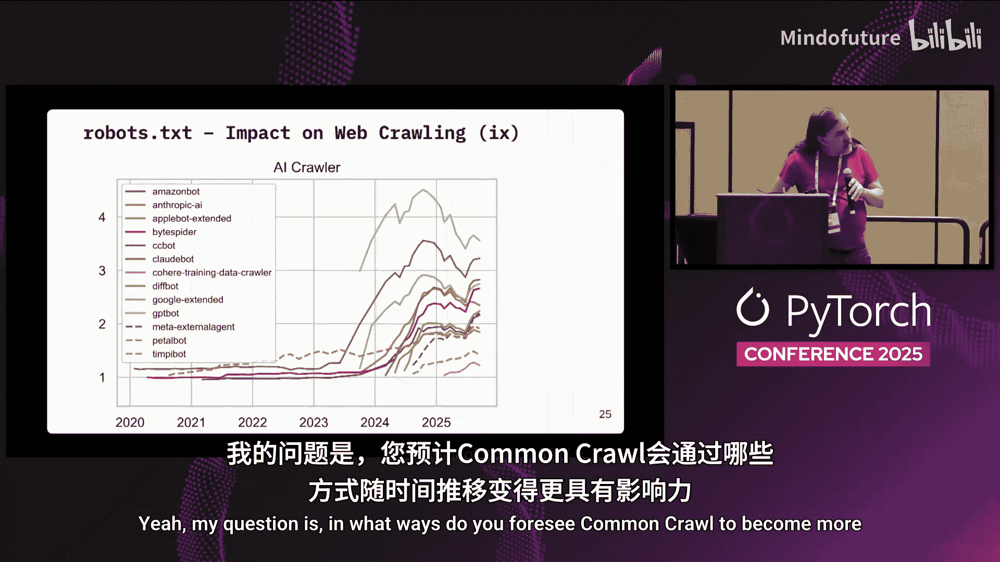
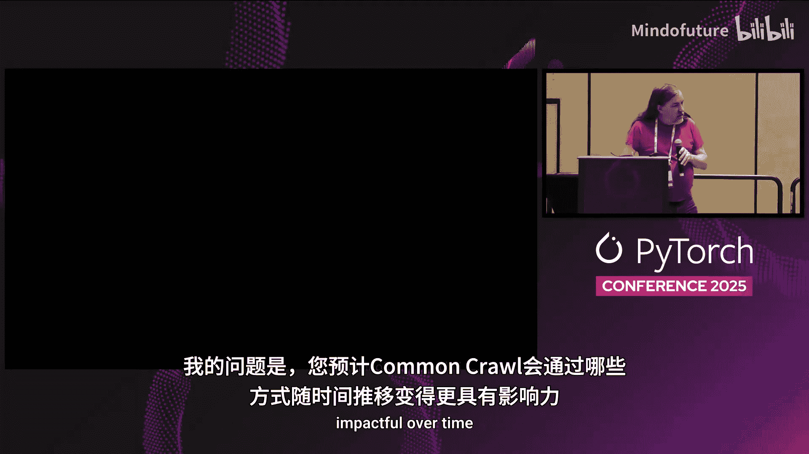
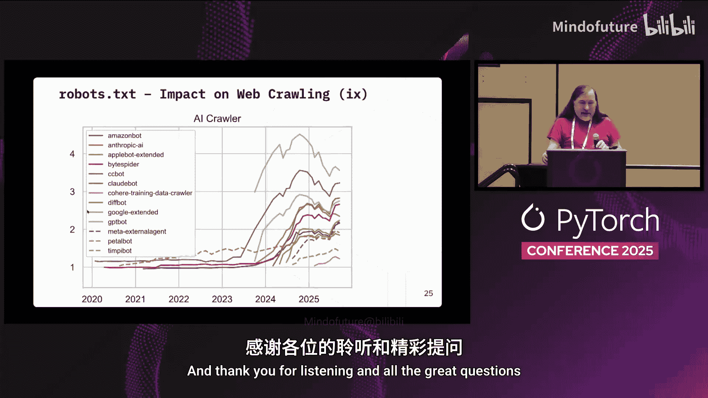

# 062：应对公共网络数据挑战

在本教程中，我们将学习 Common Crawl 基金会如何应对公共网络数据收集与使用所面临的挑战。我们将了解其使命、数据规模、面临的“AI恐慌”影响、法律政策问题，以及为改善语言和文化多样性所做的努力。

## 概述

Common Crawl 是一个非营利组织，致力于提供免费、开放的网络爬取数据集。该数据集被广泛用于人工智能、机器学习训练、数字人文研究等多个领域。然而，随着AI技术的兴起，网站对爬虫的抵制日益加剧，这给数据收集带来了新的挑战。本教程将详细解析这些挑战及其应对策略。

## Common Crawl 简介与使命

Common Crawl 基金会成立于2007年，由 Gil Elbaz 创立。其使命是提供开放的网络数据集，支持研究、创新和知识驱动型决策。该数据集被超过10,000篇研究论文引用，是许多AI项目（如 FineWeb）的基础数据源。

**核心数据规模**：
*   数据总量：**10 PB**
*   网页数量：**300亿**
*   每月新增：**约25亿页**
*   历史存档：**自2007年起，共108次独立爬取**

该数据集托管在亚马逊云上，可免费下载。去年，其下载量接近 **1 EB**，是AWS开放数据计划中带宽使用最活跃的数据集。

## 数据收集原则与“AI恐慌”的冲击

上一节我们介绍了Common Crawl的基本情况，本节中我们来看看其数据收集原则以及当前面临的最大挑战。

Common Crawl 致力于收集具有代表性、广度和深度的网络文本数据。它遵循严格的“礼貌”爬取策略：
*   爬取速度限制：**每秒不超过2个页面**。
*   严格遵守 `robots.txt` 协议。
*   使用固定IP地址和反向DNS，便于网站识别其爬虫 `CCBot`。

然而，自2022年底ChatGPT发布以来，引发了一场“AI恐慌”。许多网站开始大规模阻止被视为“AI爬虫”的代理。Common Crawl 的爬虫 `CCBot` 与 OpenAI 的 `GPTBot` 一同成为最常被封锁的对象之一。

以下是封锁情况的分析：
*   **按网站排名**：越重要的网站（如排名前5000），封锁 `CCBot` 的比例越高。
*   **按爬虫类型**：`GPTBot` 和 `CCBot` 是被封锁最严重的两个爬虫代理。
*   **按行业分类**：新闻媒体（尤其是中间派网站）的封锁率显著高于购物、拍卖类网站。这可能导致训练数据出现偏见。

## 对AI训练数据的影响与法律政策挑战

我们了解了数据收集受阻的现象，那么这对AI训练的实际影响有多大？Common Crawl又面临哪些法律问题？

尽管头部网站（如《纽约时报》）的覆盖率下降，但对整体AI模型训练质量的影响目前看来有限。消融研究表明，移除部分顶级新闻源对模型性能的损害较小。

在法律和政策层面，挑战主要来自版权方（尤其是新闻出版业）的退出请求。Common Crawl收到的数据删除请求数量呈指数级增长。作为非营利组织，Common Crawl认为其行为属于“合理使用”，但持续的法律骚扰构成压力。目前，关于网络爬虫和AI训练的标准化政策讨论（如在IETF的讨论）进展缓慢。

## 改善语言与文化多样性覆盖

除了应对封锁和法律问题，Common Crawl也在积极改善其数据集的代表性，特别是在语言多样性方面。

目前数据集在语言分布上存在偏差，英语内容占主导，未能充分反映全球数千种现存语言的网络存在。为了改善这一点，Common Crawl启动了“网络语言项目”。

**该项目旨在**：
1.  通过众包方式，收集不同语言、社区和文化的重要网站列表，以引导爬虫方向。
2.  开发更准确的语言识别工具，特别是针对非标准、口语化的语言变体。
3.  与欧盟等关注“主权AI模型”的实体合作，支持其地区性语言的覆盖。

例如，虽然中文内容在网络中占比很大，但由于“防火墙”等因素，Common Crawl对其覆盖不足。项目正尝试通过增加对台湾、新加坡等地中文网站的爬取来改善。

## 未来发展方向

最后，让我们展望一下Common Crawl的未来计划，看看它如何变得更具影响力。

Common Crawl计划通过提供新的数据产品和工具来增加其影响力：

**未来方向包括**：
*   **发布网络图数据**：将内部使用的网络链接图转换为标准格式（如Neo4j），供研究人员分析网络结构。
*   **支持数据标注**：允许用户为网页或主机添加自己的标注（如语言分类、主题分类），并共享这些元数据。
*   **创建易于使用的数据子集**：将大型爬取数据打包成更小的、易于在个人电脑上处理的数据包，方便数字人文等领域的研究者使用。

## 总结

在本教程中，我们一起学习了Common Crawl如何作为重要的公共网络数据源支持AI研究和创新。我们探讨了其面临的核心挑战：“AI恐慌”导致的爬虫封锁、法律政策的不确定性，以及数据中的语言多样性不足问题。尽管面临这些挑战，Common Crawl通过坚持开放原则、改进爬取策略、启动社区众包项目以及开发新数据产品，继续致力于为全球研究社区提供宝贵的网络数据资源。