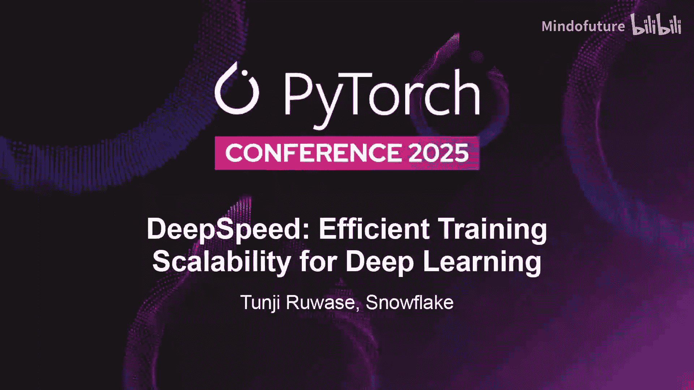
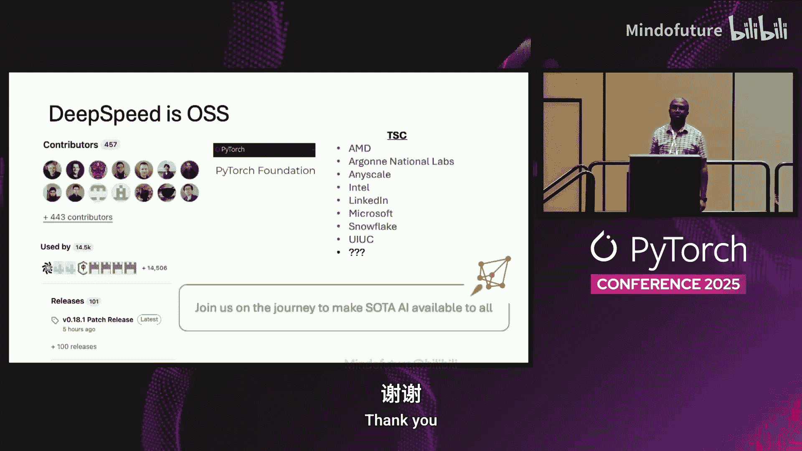

# 063：深度学习训练的高效可扩展性 🚀

在本教程中，我们将学习 DeepSpeed 库，这是一个用于优化大规模分布式深度学习训练的工具。我们将探讨其核心动机、解决的关键问题以及几项最新的优化技术，包括超级卸载、ZenFlow、长序列训练和编译器优化。这些技术旨在突破 GPU 内存限制、降低训练成本并支持超长上下文模型。

---

## 什么是 DeepSpeed？ 🤔

DeepSpeed 是一个优化库，旨在使大规模分布式训练变得高效、简单且有效。这意味着，无论你是在单个 GPU 还是多达 10 万个 GPU 上进行训练，使用 DeepSpeed 都能获得持续的高性能。它易于使用，开箱即用，并能通过降低 GPU 预算来“民主化”人工智能，让构建或使用最先进的 AI 模型变得更加容易。DeepSpeed 已于今年早些时候成为 PyTorch 基金会的一部分。

## 动机与核心挑战 📈

DeepSpeed 的创建动机源于一个观察：**扩展是推动深度学习达到最先进水平的关键驱动力**。这种扩展主要体现在两个维度：模型规模（参数量）和训练数据规模。从 2018 年至今，这两个维度都经历了三个数量级的增长，这给现代计算系统带来了巨大的可扩展性挑战。

我们首先需要解决的问题是 **GPU 内存墙**。这限制了模型规模的扩展，因为模型可能无法再装入单个 GPU 的内存中。

为了解决这个问题，我们创建了两个方向的优化。

以下是第一个方向的优化技术：

*   **ZeRO（零冗余优化器）**：这是一种内存优化技术，可以将模型状态（参数、梯度、优化器状态）在数据并行维度上进行分区，并可将部分状态卸载到 CPU 或 NVMe 硬盘上。这种组合意味着你几乎可以无限地扩展模型规模。

第二个方向的优化技术是：

*   **3D 并行**：这允许你将张量并行、流水线并行与 ZeRO 技术结合起来。这进一步增强了模型的可扩展性。

这些技术的成果是，我们有效地解决了 GPU 内存墙问题。例如，早在 2021 年，我们就已为**万亿参数**规模的模型提供了系统支持。此外，这些技术非常有效，已被其他主流的扩展框架所采纳。

现在，DeepSpeed 正在关注新的可扩展性挑战。今天我们将重点讨论其中的三个方面。

## 超级卸载：面向超级芯片架构的高效卸载 🚀

超级卸载是我们最新的工作之一，旨在为新兴的超级芯片架构（如 NVIDIA Grace Hopper）实现高效的卸载。

其动机在于，现有的卸载技术是为 PCIe 等松散耦合架构设计的，而超级芯片的 CPU 和 GPU 紧密耦合，通过更快的 NVLink C2C 互连。使用现有技术会导致效率低下，无法充分利用超级芯片的能力。

为了解决这个问题，我们创建了一系列利用超级芯片硬件特性的优化。其中一项关键技术是 **“推测然后验证”**。我们能够将优化器计算拆分到 GPU 和 CPU 上，而传统方法只在 CPU 上运行优化器计算。我们还设计了针对超级芯片架构优化的类型转换操作，并实现了一个能在 Grace CPU 上高效运行的 AdamW 优化器。

这项工作的关键成果是，我们能够在单个 GH200 上微调 GPT-2 20B 或 Cohere 40B 模型，在 4 个 GH200 上微调 LLaMA 70B 模型，并且在所有情况下都能达到超过 50% 的硬件峰值利用率（超过 600 TeraFLOPS）。

### 推测然后验证技术

上一节我们介绍了超级卸载的目标，本节中我们来看看其核心优化之一。

传统卸载方法的工作流程是：前向传播和反向传播在 GPU 上进行，此时 CPU 处于空闲状态。然后，梯度被复制到 CPU 上以执行优化器计算，而此时 GPU 又处于空闲状态。这是一个巨大的浪费。

我们需要这样做的原因有两个：1) 我们需要看到所有梯度，以检查是否存在数值溢出/下溢等问题；2) 我们通常需要进行梯度裁剪，这依赖于全局梯度范数信息。因此，传统方法串行化了反向传播和优化器计算。

在超级卸载中，我们找到了一种以推测方式重叠它们的方法。我们一旦有梯度可用，就开始以推测方式执行优化器计算。我们仍然会检查上述全局条件，如果出现问题，我们会执行回滚。通过这种方式，我们能让 GPU 和 CPU 都保持忙碌状态。我们还能在 GPU 上执行部分优化器计算，这提供了额外的加速。

如果回滚频繁发生，这将不是一个有效的优化。但我们利用了这样一个事实：在训练过程中，可能导致回滚的条件（如溢出或裁剪）并不经常发生。它们通常只发生在训练的开始和结束阶段。以 BLOOM 176B 模型为例，在 80,000 个训练步中，发生回滚条件的情况少于 1% 的时间，因此这不是一个性能开销。

### 类型转换优化

在混合精度训练中，前向/反向传播使用低精度（如 FP16/BF16），而优化器计算使用高精度（FP32）以保证数值稳定性。这意味着你需要在 GPU 和 CPU 之间切换时对梯度和参数进行类型转换。

在旧方法中，我们通常尝试最小化传输的数据量，因此在 GPU 上进行转换，并尝试仅以低精度传输数据。但通过对 GH200 架构的研究，我们观察到正确的方法实际上应该**总是在 GPU 上进行转换**，因为 GPU 上的转换非常快。由于 C2C 连接速度极快（双向 450 GB/s），通信量翻倍的影响并不大。因此，在 Grace Hopper 架构中，试图最小化通信量的方案并不那么重要。

此外，我们为 Grace CPU 实现的 AdamW 优化器充分利用了其可用的向量化单元（VE），这使其比 PyTorch 的实现快 3 倍。我们相信这是首个面向 Grace CPU 的开源 AdamW 实现。

总而言之，对于超级卸载，我们获得了相比基线约 4 到 5 倍的加速。该技术本身可与现有的 ZeRO 和 Ulysses 技术组合使用，这意味着你可以轻松地将其集成到现有的工作流程中。

## ZenFlow：基于梯度重要性的异步卸载优化 ⚖️

ZenFlow 是我们与学术伙伴合作创建的另一项卸载优化技术。

它试图解决的问题与超级卸载类似，但目标是解决在现有硬件上的效率问题。当你在 CPU 上进行优化器计算时，训练基本上会停滞。随着 GPU 和 CPU 速度差距的不断拉大，这种停滞只会越来越严重。

我们观察到的一个关键现象是：在预训练后的微调场景中，**并非所有梯度都同等重要**。只有少数梯度对模型的收敛至关重要。数据显示，仅 **1% 的梯度贡献了约 90% 的总梯度范数**。

这意味着我们可以将这 1% 的关键梯度放在 GPU 上更新，而其余不重要的梯度则在 CPU 上更新，并且我们甚至可以延迟更新这些不重要的参数，因为它们的梯度范数很小，延迟更新对收敛影响不大。

这就是 ZenFlow 的核心思想：我们提出了一种**异步更新机制**。部分梯度（关键的 1%）在每次迭代时都在 GPU 上更新，而其余梯度则以更慢的频率在 CPU 上“惰性”更新。

这样做的好处是，那 1% 的关键梯度在 GPU 上更新，由于数量少，不会显著影响模型的内存占用；而其余的慢更新则在 CPU 上处理。结果是，在保持甚至有时提高模型精度的同时，我们获得了相比基线约 **5 倍的加速**。

## Arctic 长序列训练：突破上下文长度限制 📏

这项工作的动机是，模型的上下文窗口正在快速增长。从 2018 年 BERT 的 512 个标记，到如今已出现约 1 亿个标记的上下文窗口。挑战在于：如何训练具有长上下文能力的模型？

随着上下文窗口的线性增长，**激活内存也会线性增长**，这导致即使在单个 GPU 上，内存墙问题也会再次出现。例如，一个 80 亿参数的 LLaMA 3 模型，在启用梯度检查点的情况下，单个 GPU 可能无法支持超过 32,000 个标记的上下文。

现有的多 GPU 解决方案试图将上下文窗口并行化到多个 GPU 上，但它们并不通用。它们通常不支持 Hugging Face 微调（这是当前的主流方式），也不支持更现代的注意力机制（如分组查询注意力 GQA 或多查询注意力 MQA）。

为了解决这些问题，我们创建了 **Arctic 长序列训练**。它是一套用于扩展上下文窗口的优化组合，主要包括三个方向：

以下是三个核心优化方向：

*   **序列分块**：将计算分解为更小的块，以减少中间张量的内存占用。这适用于那些中间张量大小与上下文长度成比例且没有跨块依赖的操作，例如损失计算和逻辑值计算。
*   **序列并行**：在 Ulysses 工作的基础上，将上下文序列并行到多个 GPU 上。我们通过复制键值对（KV）的方式，使其能够支持 GQA 和 MQA 等新型注意力机制。
*   **利用 PyTorch 最新内存优化**：集成 PyTorch 的最新特性以提升效率。

通过这些技术，我们能够在单个 GPU 上将上下文窗口从 32K 扩展到 **50 万个标记**，并且随着 GPU 数量的增加，上下文窗口能够线性扩展。

### 序列分块技术

上一节我们介绍了长序列训练的挑战，本节中我们来看看序列分块技术。

分块是计算机科学中的经典概念，通过将问题分解成更小的块来减少工作集的内存占用。在注意力计算中，有些操作的中间张量大小是上下文长度的函数，例如逻辑值或损失计算。

解决方案是：不是一次性在整个序列上计算，而是在序列的块上进行计算。这有助于减少中间张量的大小。需要指出的是，这种优化只适用于没有跨块依赖的操作，因此像因果注意力这样的操作不适合此优化。

但对于损失、逻辑值计算或嵌入层等部分，这项优化效果很好。以 80 亿参数模型的损失计算为例，启用分块后，内存分析图显示不仅内存使用量降低，峰值内存也显著减少。

### 序列并行技术

我们基于 Ulysses 进行序列并行，它将上下文序列并行到多个 GPU 上。

Ulysses 的挑战在于它只假设使用多头注意力（MHA），无法支持 GQA 或 MQA 等新型注意力机制。

在 Arctic 长序列训练中，我们通过**复制键值对（KV）** 来支持这些新机制。GQA 和 MQA 的优化目标是减少注意力机制的内存成本，而我们的方法则通过复制 KV 来兼容它们。

最终结果是，在单个 GPU 上，我们可以将上下文扩展 60 倍，并且实现了线性的上下文扩展。

## DeepCompile：自动化并行与优化的编译器 🛠️

这项工作的动机是，目前存在许多并行技术（如张量并行、流水线并行、专家并行），将它们集成到工作流程中并手动调优以获得高性能是非常具有挑战性的。

我们采取的方法是使用**编译器技术来自动化这一过程**。编译器会将你的单 GPU 模型转换为分布式模型，并在运行时分析（profile）你的模型和训练过程，然后进行重新优化。

例如，ZeRO Stage 3 是一种非常流行的并行技术。通过 DeepCompile，我们能够自动将你的模型应用 ZeRO-3 作为一个编译器过程。更有趣的是，我们还能通过观察训练过程中不同阶段可用的内存量，更智能地进行预取操作：在内存充足时积极预取，在内存不足时减少预取。这很难手动完成，但通过基于性能分析的优化，我们可以研究你的模型并应用这些优化。

结果是，与手动并行相比，我们在 ZeRO-3 上可以看到高达 **50% 的加速**。我们也将其应用于 ZeRO Stage 1 和普通卸载，通过编译器方法都获得了很好的加速效果。

我们还将其应用于强化学习，特别是强化学习的训练部分。与手动实现的 ZeRO-3 加 FlashAttention 基线相比，在编译器方法下，前向传播时间减少了一半，反向传播时间获得了约 60% 的改进。

## 总结与社区参与 🤝

本节课中我们一起学习了 DeepSpeed 的核心价值与多项前沿优化技术。

DeepSpeed 是一个开源项目，其成长和进步依赖于开源社区。我们拥有超过 400 名贡献者，被开源社区广泛使用。在 PyTorch 基金会下，我们最近成立了一个由多家领先公司组成的指导委员会。

我们的目标是让最先进的人工智能对所有人可用且免费。我们拥有良好的记录，并真诚地依赖社区的帮助来共同推进这一目标。

---

### 问答环节摘要

*   **DeepSpeed 会与 PyTorch 合并吗？**  
    不一定需要合并。DeepSpeed 更像是一个前沿试验场，尝试一些可能具有风险的新想法。其中一些成功的技术（如 ZeRO 的核心思想演变为 FSDP，通用检查点）已经融入到原生 PyTorch 中。PyTorch 的稳定性要求不允许它像 DeepSpeed 那样频繁地尝试和突破。

*   **DeepCompile 是否依赖于特定硬件架构？**  
    它是架构无关的，基于 `torch.compile` 计算图运行在 PyTorch 之上，并遵循其 API。

*   **ZenFlow 的异步更新原理是什么？**  
    它利用了**梯度独立性**。在反向传播中产生的梯度用于更新参数，但每个参数都可以独立地由其对应的梯度更新，而不依赖于全局信息（在忽略梯度裁剪等操作的情况下）。ZenFlow 正是利用了不同参数具有不同梯度且可以独立更新这一特性。