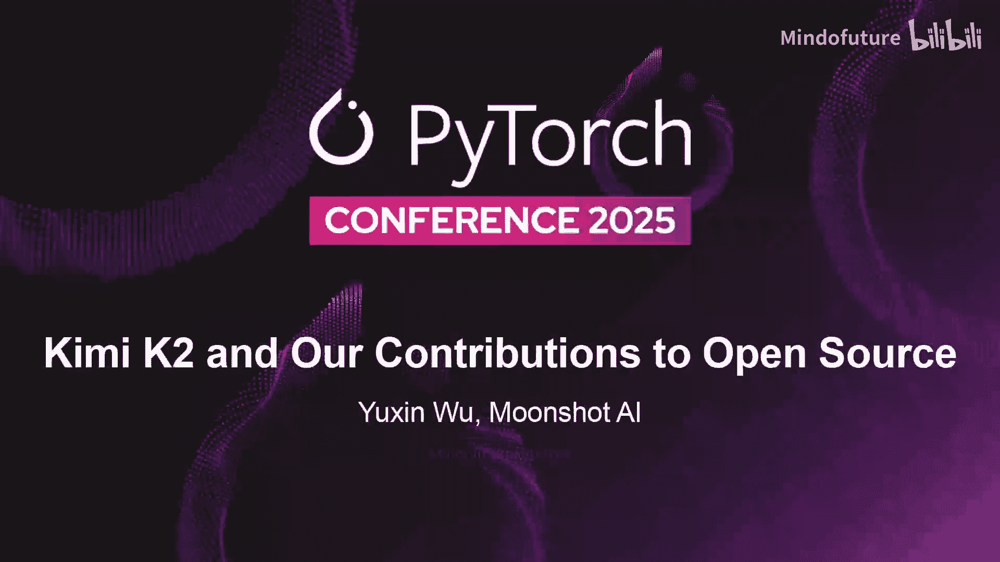
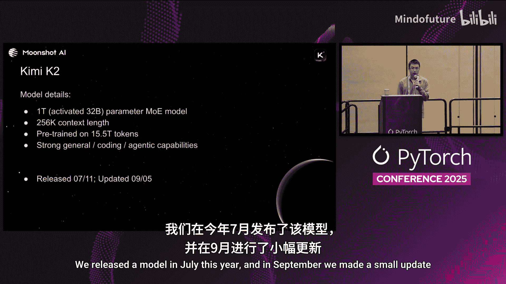
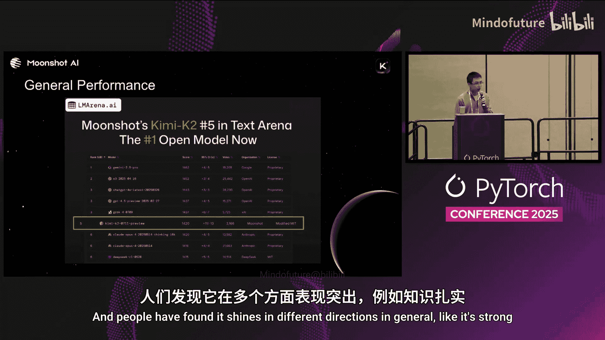
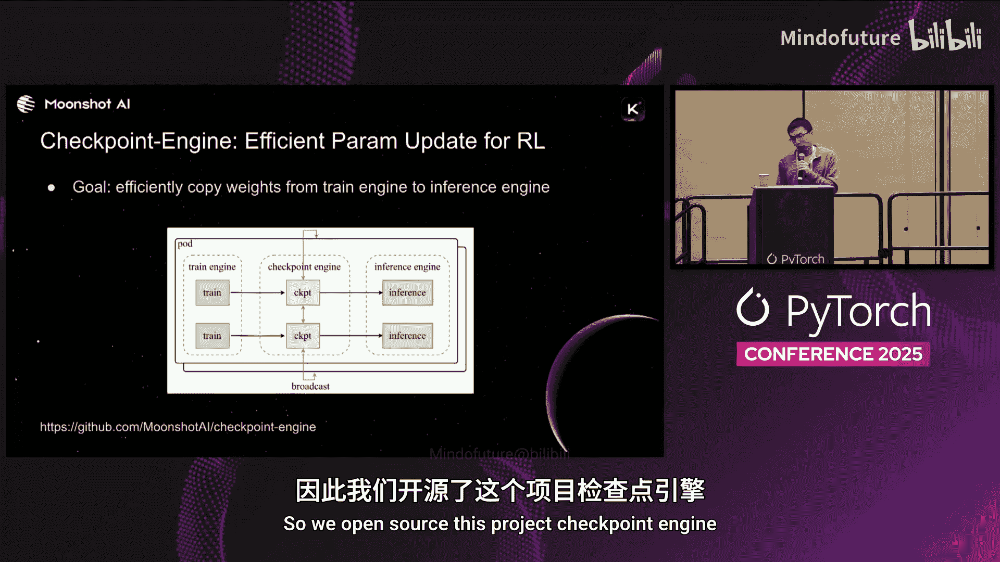
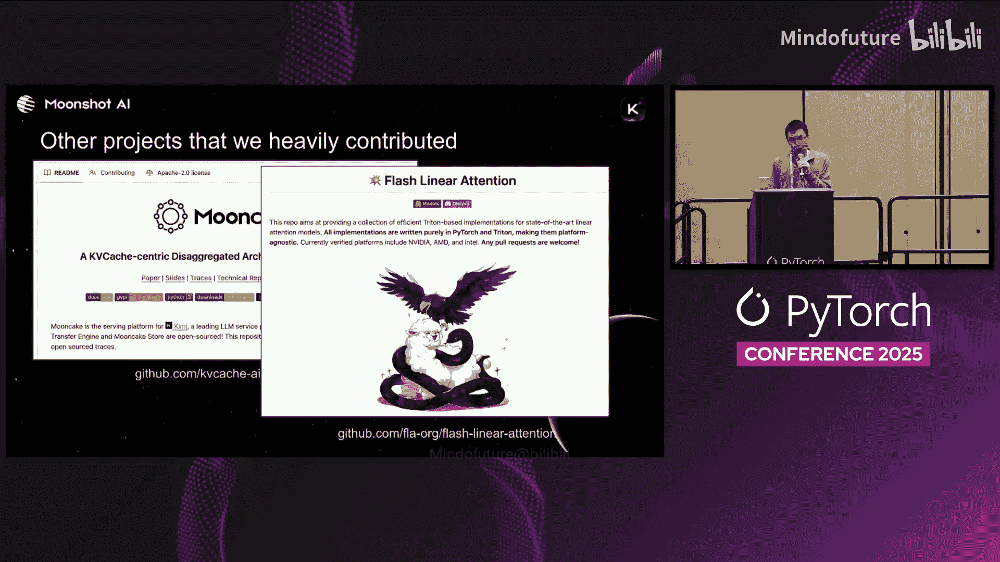
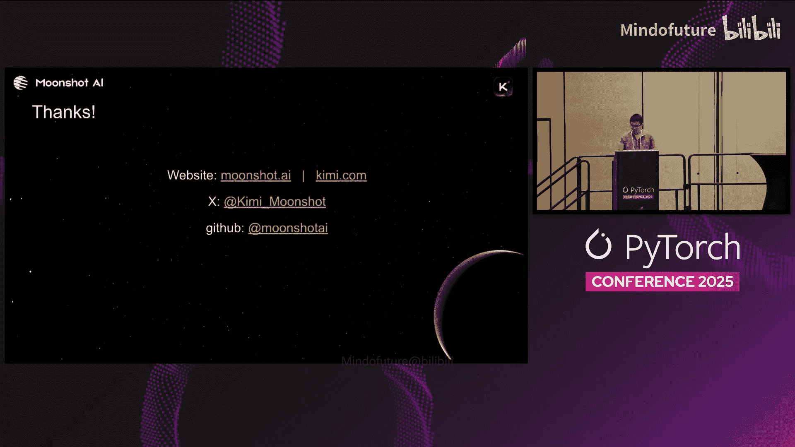

# 064：Kimi K2与我们对开源的贡献

大家好，我是月之暗面AI的联合创始人吴育昕。今天我将介绍Kimi K2模型。在本节中，我们将了解这个模型是什么，它能做什么，并重点介绍我们在今年为研究社区和PyTorch社区做出的几项重要技术贡献，涵盖我们在训练、强化学习系统和推理方面的创新。

Kimi K2是一个万亿参数的混合专家模型。对于每个生成的词元，它仅激活约320亿参数。因此，它不仅是目前最大的开源模型之一，也是最稀疏的模型之一。它拥有256K的上下文窗口，足以应对大多数任务，并在15万亿词元上进行了预训练。在后训练阶段，我们赋予了它在日常对话、代码生成以及智能体工具调用方面非常强大的能力。

我们在今年7月发布了该模型，并在9月进行了一次小更新。

根据ELO Arena排行榜，在7月发布时，它是当时最好的开源模型。人们发现它在多个方面表现出色，例如拥有强大的知识储备、出色的创意写作风格以及优秀的文本生成能力。

它同样具备优秀的代码能力。例如，它可以编写HTML网页。这里展示了一些用户利用该模型构建的令人印象深刻的网页演示。

今年的一大主题是智能体，这也是我们非常关注的方向。在训练过程中，我们为模型提供了大量不同的工具，使其学会了如何使用它们。当用户构建自己的智能体时，他们可以提供工具的良好描述，模型将知道调用这些工具的最佳时机。因此，我们看到许多公司开始使用这个模型来构建智能体。例如，左边是Tong最近的一篇播客，提到他们已将大量工作负载转向Kimi K2。右边是Veral的CEO在最近的帖子中表示，他们也在使用K2构建内部智能体，因为它更高效、更准确。

在这一切工作的背后，我们乐于为社区做出贡献。过去，我们已经发布了多个模型和一些有趣的开源项目。今天，我将重点介绍K2背后的几项创新。

## 第一部分：Moon优化器

上一节我们介绍了Kimi K2的概况，本节中我们来看看其背后的核心技术之一：Moon优化器。

首先，我将介绍Moon优化器。它是由Keller等人在去年年底的一篇个人博客文章中发明的一种新优化器。其核心思想是使用正交化更新。简单来说，当你获得一个梯度矩阵时，会对其进行奇异值分解，以从该矩阵中获取正交化分量。但在实践中，我们实际上不会进行SVD分解，因为计算成本太高。有一种方法可以通过称为牛顿-舒尔茨迭代的过程来近似实现，其本质就是大量的矩阵乘法运算。为了获得良好的结果，通常需要使用梯度矩阵及其转置进行大约15次矩阵乘法，并辅以一些其他小型计算。

因此，计算的主体部分就是一系列使用该矩阵的矩阵乘法。这种优化器与我们过去使用的其他优化器（如AdamW）有一个根本性的区别：使用Moon时，你确实需要一个完整的梯度矩阵。矩阵中不同元素之间的更新不再是独立的，你不能仅仅进行逐元素更新就使参数进入下一步，而是需要整个矩阵。这被认为是Moon能够表现如此出色的最重要原因之一。

今年2月，我们率先将Moon扩展应用于大型语言模型，在一个160亿参数的混合专家模型上进行了训练，并于2月发布了结果。这一点非常重要，因为每年实际上都有许多新的优化器被发明出来，但你可能没有听说过其中大多数。因为当你真正关心性能并投入大量资源认真训练模型时，你会使用最佳设置、最佳基线和最佳超参数，而AdamW通常仍然表现最好。这就是为什么拥有强大的基线并在大规模上进行训练如此重要。在小规模上，你可能能够调整很多参数来证明某个优化器比另一个更好，但在大规模上，真正胜出的才会脱颖而出。

我们是第一个证明Moon在大规模场景下确实有效的团队。在这项工作中，我们提出了一些改进方案，包括如何进行权重衰减以及如何正确控制每一步更新的幅度。我们证明了它是一种真正的“词元高效”优化器，这意味着使用相同的模型、相同的数据、训练相同的步数，最终能得到更好的结果。我们展示了它比AdamW基线高出20%到50%的词元效率，而且在这项工作中，我们甚至没有为Moon调整超参数。

同时，我们还在Megatron-LM中为此工作发布了一个开源参考实现。今年7月，我们发布了Kimi K2，这是一个万亿参数模型，同样使用Moon优化器进行训练。因此，这应该是一个非常有说服力的论据，表明Adam不再是训练大型语言模型的首选，而Moon确实表现得非常好。在这个过程中，我们还解决了在扩展过程中发现的一些其他不稳定性问题，稍后我们会谈到。

我们看到Moon优化器在社区中的采用率正在增长。8月，它被正式添加到PyTorch中，我们的一些团队成员也为此提供了一些帮助。我们看到越来越多的研究论文开始研究Moon的行为，一些其他流行的开源模型也开始采用Moon。

你可能会问，如果它效果这么好，代价是什么？我想简要地介绍一下。正如我刚才所说，Moon的计算只是一系列矩阵乘法。一个关键的见解是，计算可以被分片。你只有这么多参数，因此随着GPU数量的增加，你可以确保每个GPU只负责计算一小部分参数的更新，这很重要。人们可能担心的另一个问题是，矩阵乘法的复杂度是立方的，如果规模扩大，这会成为问题吗？如果你训练的是一个非常大的稠密模型，其中参数矩阵超级大，那确实可能是个问题。但今天我们看到了一个明显的趋势，即模型正朝着混合专家模型，特别是细粒度混合专家模型发展。例如，在K2中，总共有384个专家，这意味着每个单独的专家不会那么大。因此，随着规模的扩大，你的参数矩阵不一定变得异常巨大，所以立方复杂度在现实中并不是问题，更像是二次复杂度。

另一个需要付出一些努力来解决的问题是通信。请记住，Moon的特殊之处在于它需要完整的梯度矩阵来计算更新。但在现实中，你的梯度可能分布在多个GPU上。因此，你需要某种方式将它们汇集到同一个地方。具体的解决方案取决于你的系统以及你如何分片梯度和参数。例如，我在这里放了一些不同系统中不同实现的链接。Megatron-LM在其开发分支中有一个实现。如果你使用DeepSpeed，也有一些实现试图最小化通信成本。当然，你还希望将通信与计算重叠，这样当你在计算一个参数的更新时，你已经在为下一个参数收集梯度矩阵了。综上所述，这确实需要一些工程努力来解决，但人们正在努力使其更容易。如果处理得当，它不应该是一个很大的开销。特别是当你扩大规模时，通常每一步都有一个相当大的全局批次大小，比如每步一百万个或几百万个词元，这意味着你的优化器不会被频繁调用。因此，开销不会成为一个显著的障碍。在我们的训练中，从AdamW切换到Moon大约增加了3%的开销，但收益远大于此。

我们在扩展过程中看到的另一个问题是稳定性。我们观察到一种称为“注意力逻辑尖峰”的现象。我们会绘制训练过程中的注意力逻辑值，中间会出现一些尖峰。这不是一个新现象，人们已经研究了好几年。人们认为这与模型的稳定性或健康状态相关。虽然这不是新现象，但我们似乎发现它与Moon的相关性更强。关于为什么它们可能相关，有一些理论假设，但我们采用了一个相当直接的修复方法。注意力逻辑是通过查询和键的点积计算得出的。我们所做的只是，如果逻辑值变得太大，我们就裁剪查询和键的权重。这将稳定逻辑值，并使训练相当稳定。

这里我展示了Kimi K2从开始到结束，在15万亿词元上的训练损失曲线。这里没有进行任何下采样，每个损失点都被绘制出来。它非常稳定，没有尖峰，只是一条漂亮的大曲线。

关于Moon，我们相信它是扩展模型规模的优秀优化器。

## 第二部分：Checkpoint Engine

上一节我们探讨了Moon优化器，本节中我们来看看在强化学习基础设施中的另一个创新：Checkpoint Engine。

我想谈的另一个有趣项目是Checkpoint Engine。它是我们强化学习基础设施中的一个系统中间件。我们试图解决参数更新的问题。在强化学习中，当你训练模型时，必须同时使用模型的最新权重进行推理。这意味着你必须将权重从训练系统复制到推理系统。这是一个不平凡的任务，因为这两个系统通常都经过了高度优化。它们可能有不同的分片策略，可能有自己的内存管理策略。因此，这不是一个简单的内存复制任务，而且高效地完成它很棘手。

我们开源了这个项目Checkpoint Engine。它的一个很酷的特点是易于集成。

你只需从训练代码或强化学习控制器中导入并运行它。你可以说：“嘿，我刚完成一次训练迭代，这是最新的权重，请将它们发送给推理工作节点。”然后它会与推理工作节点通信。另一个很酷的特点是，这个实现对vLLM是非侵入式的。这意味着你不需要更改任何vLLM的源代码，它是通过一种称为“工作节点扩展”的机制实现的，这是vLLM提供的一个扩展点，允许你在推理过程中注入自定义代码。参数更新就在这里发生。

目前也有一个SGL集成正在开发中。

Checkpoint Engine在更新权重方面非常高效，即使是像K2这样拥有万亿参数的巨型模型，在256个GPU上更新一份权重副本也只需大约20秒。这对于我们关心的几乎所有强化学习工作负载来说都足够了。优化性能的关键思想首先是充分利用所有可用的带宽，无论是RDMA、NVLink还是其他。我们还大量使用了流水线技术，将不同参数的不同复制阶段进行流水线处理。

Checkpoint Engine带来的另一个好处是容错性。当你运行大规模的强化学习任务时，一些推理工作节点可能会崩溃。当它们重启时，需要某种方式获取最新的权重。不断地从磁盘保存和重新加载权重会很昂贵。Checkpoint Engine恰好也能很好地解决这个问题，因为每当一个推理工作节点重启时，它可以告诉Checkpoint Engine：“嘿，我是新来的，我没有权重，你能把最新的权重发给我吗？”这样你就可以相当高效地从Checkpoint Engine获取权重。它还进一步允许你在需要时动态地向系统添加更多的推理工作节点。

## 第三部分：Decode-Context Parallel

上一节我们介绍了Checkpoint Engine如何优化RL中的权重更新，本节中我们转向推理阶段的另一个重要贡献：Decode-Context Parallel。

我们今年做出的另一个贡献是称为“解码上下文并行”的功能。这是我们今年添加到vLLM中的一个特性。我们试图解决的问题是，如果你使用vLLM运行像Kimi K2或DeepSeek这样的模型进行推理，你会发现你的KV缓存会在所有张量并行工作节点上重复。

为什么会发生这种情况？因为这些使用多头潜在注意力或多查询注意力的模型，在推理时只有一个键头。通常，当你使用张量并行时，你可以将注意力头分散到不同工作节点以减少KV缓存的存储负担。但这里模型只有一个头。在推理过程中，每个工作节点都必须访问那个单一头的KV缓存。

因此，我们采用了不同的策略。我们在序列长度维度上对KV缓存进行分片。这类似于训练中人们使用的上下文并行，所以我们称之为解码上下文并行。在解码过程中，每个工作节点只存储上下文的一个子集。在计算注意力时，一个词元首先只关注历史上下文的本地子集，然后必须进行一些通信以获得准确的全局注意力结果。这可以通过类似于在线Softmax的技巧相当高效地完成，在这个过程中只有非常小的通信量。

这样做的好处是，你可以大大减少KV缓存的大小，通常是8倍甚至更多。这将使你在推理时能够使用更大的批次大小，从而获得2到3倍的吞吐量提升。这在那些你只想优化吞吐量的场景中非常重要，例如在强化学习中，延迟可能不重要，但你必须在数据生成阶段拥有非常高的吞吐量。

这个功能已经被上游合并，并且非常易于使用。你只需在服务模型时在命令行中添加一个参数即可。

## 第四部分：其他贡献与总结

除了上述直接与K2相关的贡献，我们还深度参与并贡献了其他一些项目。

Moonshine是我们创建的一个项目，它是我们生产推理系统背后的系统。它建立在“解耦服务”的理念之上，这意味着你使用不同的机器集来处理预填充和解码任务。今年，我们看到许多其他推理系统（如NVIDIA的TensorRT-LLM）也开始采用这种范式。因此，我们是率先提出这一理念并实际在超大规模生产系统中实施和部署的团队之一。这项工作现在由一组研究人员和社区与我们共同维护，并且今年获得了最佳论文奖。

我们赞助的另一个项目是FlashLinearAttention。线性注意力是注意力机制的一种变体，人们认为它可能成为Softmax注意力的替代方案，具有巨大潜力。FlashLinearAttention是一个库，包含了许多变体，为不同的线性注意力模型实现了许多高性能内核。它是线性注意力研究人员中非常受欢迎的库。我们对此方向也非常感兴趣，该库的几位主要贡献者也来自我们公司。作为一个预告，在接下来的几周内，我们还将在线性注意力领域发布我们最近的一些创新。

本节课中我们一起学习了Kimi K2背后的几项关键技术细节。我们探讨了Moon优化器如何提供更高效和稳定的训练，Checkpoint Engine如何优化强化学习中的权重更新和系统容错，以及Decode-Context Parallel如何提升大模型推理的吞吐量。这些贡献都已开源，旨在推动整个AI社区的发展。

如果你想了解更多关于我们的工作，可以通过以下方式找到我们。

谢谢。

---

**问答环节**

**问：** 关于Moon优化器，与AdamW相比，它在训练时是否也更节省内存？

**答：** 是的，因为AdamW需要保存更多的优化器状态，包括一阶和二阶梯度的动量缓冲区。但在Moon中，你只保存一个额外的状态。因此，它也更节省内存。

**问：** 关于您展示的损失曲线，我看到它没有任何尖峰。是您在15万亿词元的训练中真的没有遇到任何尖峰，还是被过滤掉了？

**答：** 为了曲线的清晰度，曲线是从第一次迭代之后一点开始显示的。初始时损失较高，就像在随机初始化模型中通常看到的那样，但这部分没有显示，因为它会是一个异常值，使图表看起来不清晰。至于训练尖峰，当训练LLM时，通常会因为数据批次不佳或学习率稍高而出现尖峰。但在我们展示的主要训练阶段，没有出现这种X轴方向的巨大尖峰，损失是持续下降的。

**问：** 您谈到了将小规模优化器研究扩展到大规模时面临的挑战，即它们不一定能很好地工作。您是如何预见到Moon能够良好扩展的？您是尝试扩展了许多最近的优化器研究，然后发现只有Moon效果最好，还是Moon就是效果最好的那个？

**答：** 这是一个非常重要的问题。我们如何识别有潜力扩展的事物？我认为这是多种视角的结合。首先，你必须能够快速在小规模上尝试新想法。这意味着你的基础设施和代码库必须为此做好准备。当我们看到Moon时，首先从理论角度我们就认为它是一种非常优雅的方法。所以我们想尝试它。我们能够快速地从原始实现中提取并将其放入我们的代码库进行尝试，这非常重要。我们很快发现它在小规模实验上似乎有一些好处。当然，我们知道这并不一定是成功的指标。因此，我们有一个扩展阶梯，我们会逐步增加模型规模，并验证它在每个规模上都运行良好，最终达到大规模。

**问：** 在预训练阶段，从数十亿参数扩展到万亿参数的过程是怎样的？特别是当你的调试周期很长，并且训练涉及数万亿词元，需要相当长的时间时，你的调试或验证过程是怎样的？

**答：** 这个问题与上一个类似。这不是关于出错时如何调试，而是关于在开始训练之前如何验证。关键在于在各个不同规模上都有非常好的基线。当你有一个想法时，你尝试在不同规模上验证，确保它始终有效，这将给你信心将其真正投入大规模运行。

