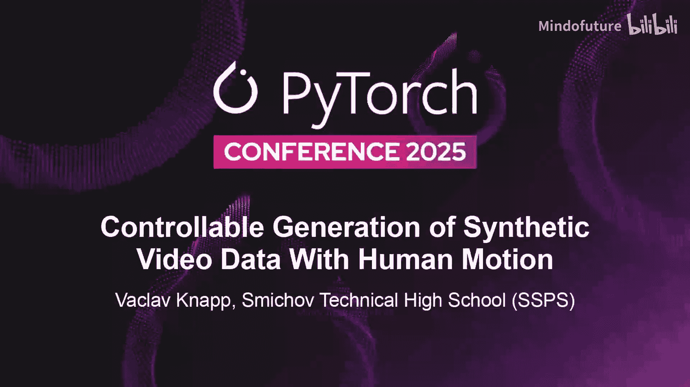
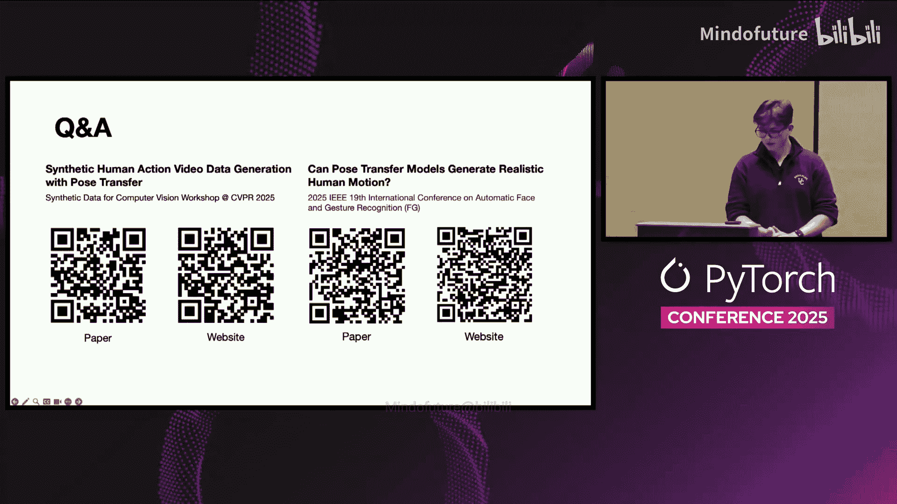

# 065：基于姿态迁移的合成数据生成教程 🎬

在本教程中，我们将学习如何利用姿态迁移技术，为人体动作识别等任务生成可控、多样化的合成视频数据。我们将探讨现有方法的局限性、评估标准，并详细介绍一个结合3D重建与扩散模型的新颖流程。

---

## 概述

大家好，我是Vaclav Knapp。本次分享将介绍我与斯坦福大学本科生、现谷歌DeepMind研究员Matthiaj Bahack共同完成的工作。我们提出了一种方法，通过姿态迁移技术，在保留原始动作语义的同时，为视频数据生成新的身份和背景，从而大规模扩展用于人体动作识别的数据集。

## 背景与动机

近年来，语言和视觉模型的进步主要得益于大规模、多样化的数据集，其中合成数据的作用日益凸显。

然而，用于动作识别或手语翻译等需要人体视频的任务数据集，往往规模不大、多样性不足。即便存在大规模数据集，也通常是网络爬取所得，质量不高，例如一个视频中出现多个人物，导致模型泛化能力差。

以NTU RGB+D数据集为例，其视频多在同一房间内拍摄，且常有多人出现。对于手语识别、动作识别或驾驶员监控等任务，真实数据往往稀缺、采集成本高昂，有时还受隐私限制约束。

你可能会想到使用Sora或Veo这类先进的文生视频模型。它们生成效果逼真且速度快，但缺乏对姿态的精确控制。正如Andrej Karpathy在播客中所说，大语言模型也存在于一个很小的流形上。例如，当你输入“跳跃”时，所有生成视频中的人物都会以几乎相同的方式跳跃，这对于需要泛化到不同动作变体的动作识别模型来说并不理想。

此外，早期的合成数据生成方法（如ElderSim或SyRIAC）使用传统的CGI或模拟方法，不够逼真，无法实现身份转换，多样性也有限，因为需要硬编码身份结构，难以扩展。

我们提出的解决方案是：**通过对现有数据进行姿态迁移来创建合成视频**，从而用新的身份和背景扩展数据集。

## 什么是姿态迁移？🤔

为了确保理解一致，我们首先明确姿态迁移的概念。

姿态迁移是指，给定一个**参考身份**（可以是一张人物图片、一段视频，或由扩散模型生成的形象）和一个**新颖姿态**（通常来自数据集中某人执行某个动作的视频），我们将参考身份的形象“重演”到新的姿态上，生成新的图像或视频。

## 方法评估：选择最佳姿态迁移技术

我们首先需要评估可用的姿态迁移方法。主要分为两类：生成式方法、基于3D的方法以及两者的混合方法。

为此，我们设计了一项人工评估任务，包含三个部分：
1.  **语义准确性**：评估者判断视频中展示的是什么动作，并计算正确识别的百分比。
2.  **运动一致性**：简单的“是/否”问题，判断动作在时间上是否连贯自然。
3.  **动作质量**：评估动作是否正确，是否存在随机移动或违反物理约束的情况。

评估任务很简单：我们有一个驱动姿态视频（例如，某人打高尔夫），并使用扩散模型生成一个目标身份形象。然后，我们使用当时最先进的三种姿态迁移方法进行处理：
*   **Animate Anyone**：基于扩散模型，通过从驱动视频提取的骨架进行控制。
*   **Magic Animate**：使用深度图和密集姿态进行控制。
*   **X-Avatar**：基于3D高斯溅射，创建一个可动画化的3D基础身份。

以下是定性结果。Magic Animate在基准测试上表现良好，但对于数据集中不干净的视频（如多人、人物未居中、面部有遮挡）处理不佳。Animate Anyone稍好，但仍存在许多物理不一致性。X-Avatar虽然仍在3D高斯模型上进行扩散，但因其3D基础而表现更优。

从参与者研究中我们发现，X-Avatar在语义准确性和运动一致性方面都取得了最佳结果。当然，即使是X-Avatar也会犯错误。

在质量方面，像Magic Animate或Animate Anyone这类较老的扩散模型常出现面部扭曲、出现额外人物或不够逼真等问题。

## 合成数据方法的核心目标 🎯

基于评估，我们确定了合成数据方法的主要目标：
1.  **姿态迁移质量**：根据人工评估，X-Avatar是目前姿态迁移的质量标杆。
2.  **身份多样性**：需要尽可能多的身份，使模型能够泛化到不同的种族、群体等。
3.  **场景多样性**：需要多样的背景，因为许多数据集都在同一房间录制。

我们发现，替代模型（如扩散模型）能提供真实感但控制力弱，模拟引擎控制力强但真实感差。X-Avatar结合了两者，虽不完美，但取得了最佳平衡。

## 实现多样性：Random People数据集

为了创建身份多样性，我们收集并创建了一个名为“Random People”的数据集，包含100个从互联网招募人员录制的身份视频。

为了让X-Avatar构建3D身份，录制者需要执行特定动作，例如进行两次360度旋转（一次手臂举起，一次放下）。我们已经将此数据集在Hugging Face上开源。

## 合成视频生成全流程 🛠️

上一节我们介绍了评估标准和数据准备，本节中我们来看看生成合成视频的具体三步流程。

整个方法包含三个核心步骤：

### 1. 虚拟形象创建
首先，我们输入身份视频。由于视频通常是20 FPS，我们将其降采样到2 FPS以节省计算。然后，从每一帧图像中提取多种特征：
*   **SMPL-X**：人体的3D姿态参数。
*   **深度图**：场景的深度信息。
*   **关键点**：人体骨架。
*   **分割掩码**：人物与背景分离。
*   **面部表情与手部姿态**：确保精确的手势和表情。

我们将所有这些信息组合成一个单一的**身体特征张量**。接着，训练一个神经网络，学习如何将纹理正确地映射到该人物的3D虚拟形象上。

### 2. 参考视频准备
我们从数据集的驱动视频中，提取执行目标动作的人物的姿态。同样，我们提取上述所有特征，得到另一个身体特征张量。

### 3. 合成视频生成
这是结合步骤。我们将训练好的身份虚拟形象，在新的背景图像上，重新演绎参考视频中的动作。通过结合源身份视频、随机背景图像和参考驱动视频，我们可以轻松、无限地扩展用于人体动作识别的数据。

## 实验验证与结果

为了验证这些合成视频是否真的有助于模型训练，我们在两个数据集上进行了测试：NTU RGB+D 和 Toyota Smart Home（后者是老年人在家中执行日常任务的视频）。

由于我们当前的方法尚不能处理视频中的多人互动或物体交互，我们筛选了16个符合条件的动作类别。为每个数据集生成了3600个合成视频。

结果虽然不完美，但显示出了潜力。合成视频在物理上可以保持一致性，身份和背景可以任意多样化，并且方法具有通用性。

以下是核心实验结果。由于计算资源限制（我们是学生），我们使用了225个真实视频和225个合成视频进行训练，测试在50个真实视频上进行。

我们训练了两种架构的模型：ResNet 和 SlowFast。结果显示，**结合使用真实视频和合成视频进行训练，模型性能得到了显著提升**。在Toyota数据集上，仅使用真实数据的基线准确率约为20%，而结合合成数据后，ResNet达到了50%。在NTU RGB+D数据集上提升更为明显。

我们还进行了少样本学习实验：
*   **单样本学习**：仅使用1个真实视频，通过不断增加合成视频数量，模型性能持续提升。
*   **五样本学习**：使用5个真实视频，同样通过添加合成视频，性能曲线持续增长，预示着如果继续增加数据，结果会更好。

## 局限性与伦理考量

我们的框架存在一些限制：目前只能处理视频中的单个人物，无法模拟与物体的交互。此外，由于模型规模限制，有时会出现错位，但我们可以通过筛选来剔除这些问题视频。有时，动作与场景可能不匹配（例如在客厅里“烹饪”）。

本项目采用MIT研究许可，完全开源。在收集身份视频时，经过了斯坦福大学的审查，并且我们注重人口统计多样性，以减轻数据集中潜在的偏见。

## 总结与贡献

本节课中，我们一起学习了如何通过姿态迁移技术生成可控的合成人体动作视频。

总结来说，我们的主要贡献包括：
1.  **工具包**：我们提供了一个通过姿态迁移生成合成人体动作视频的工具包。它可以轻松添加背景，使用简单快捷。
2.  **数据集**：我们开源了包含100个可控身份的“Random People”数据集，供研究使用。
3.  **实证结果**：我们在Toyota Smart Home和NTU RGB+D两个动作识别数据集上取得了强劲的实证结果，证明了合成数据的有效性。

这项工作已在今年的CVPR合成数据研讨会和FG手语与手势识别会议上发表。

---

**问答环节摘要**

问：您如何看待这项技术应用于美国手语（ASL）社区？如何提升其精度以用于AI手语翻译服务？

答：我们已就此进行了一些实验，相关成果也在2025年大阪世博会上展示。如果输入视频足够精确，生成的手势可以非常准确。而大多数手语视频本身录制就很精确。因此，这项技术潜力巨大，因为对于许多手语（如捷克手语或其他小语种手语）而言，数据集非常稀缺。我们可以通过创建合成数据来显著提升这些模型的性能。