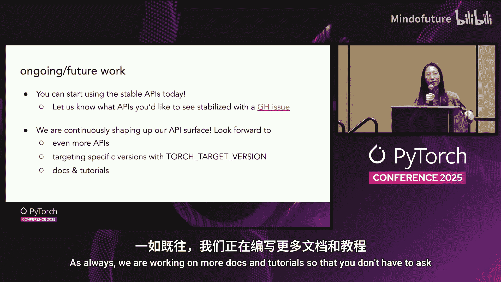

# 066：如何实现稳定的有限 LibTorch ABI 🛠️

在本节课中，我们将探讨为何需要为 LibTorch 建立一个稳定的有限应用程序二进制接口，以及实现这一目标的具体计划。我们将从当前面临的问题出发，逐步讲解解决方案的各个组成部分，并最终展示如何将现有代码迁移到新的稳定架构上。

## 当前的问题：脆弱的依赖栈

想象 LibTorch 是一个二进制模块，其顶部有许多依赖点。整个世界就像一个库的堆栈，这些库都建立在 LibTorch 之上。这里的问题是，每当升级 LibTorch 时，其 API 无法保证保持不变，因此整个堆栈中的所有内容也都需要升级。

如果一切都能像一个个可以随意替换的盒子那样就好了。那样的话，你可以随心所欲地升级 LibTorch，因为所有接口都是平滑的。然而，我们实际上无法做到这一点，并且我们也不希望如此。因为这意味着我们需要冻结库中的每一个 API，这不是一个好的计划，也没有人希望这样。我们希望继续改进、发展和修复之前未发现的错误。

## 解决方案：引入稳定的有限 ABI

那么，我们该怎么办呢？这就是我们引入“有限稳定 ABI”的原因。我们构建一个稳定的 API 子集，让扩展可以依赖它。如果你的代码建立在 LibTorch 的这个平坦部分之上，我们承诺即使我们升级，你也不需要重建你的扩展。

具体来说，要让 Flash Attention 3 这样的库实现 LibTorch ABI 稳定，我们需要问自己：为什么它一开始不稳定？它使用了哪些目前不稳定的 API？这些 API 对大多数人来说应该很熟悉：
*   **Tensor**：自定义算子会关心它。
*   **注册到 Torch 库**：自定义算子会涉及。
*   **ATen 算子**：如调用 `add`、`fill` 或 `matmul`。
*   **设备工具**：如 CUDA 事件、CUDA 守卫。
*   **数据类型**：如 BFloat16 等标量类型。

这些都是目前 LibTorch 中不保证稳定的 API。

## 实现路径：C 语言垫片与 C++ 包装器

我们的计划是铺平一条道路。具体来说，我们打算在底层不稳定的 API 之上，构建一个 C 语言垫片。这个垫片提供一个表面，扩展可以依赖它，而不会在每次升级时被破坏。

具体来说，这意味着为例如 Tensor 提供一个垫片 API，它在不稳定的 Tensor API 和用户代码之间充当联络人。这背后的原理并不神奇：我们不再传递一个大的 Tensor 对象，而是传递一个指针。得益于 AOTI 编译器团队的工作，我们已经拥有了这个能力。ATen Tensor 句柄就是一个不透明的 Tensor 指针。你会将这个指针传递给其他同样承诺保持稳定的 AOTI 函数。

然而，稍微思考一下，你就会发现这并不是一个易于使用的 API。你到处都在处理指针，所有东西都在 C 风格的 API 中。例如，原本三行的代码可能会变成十行，因为你需要分配一个 ATen Tensor 指针，传递它，并确保输出指针代表了你想要的结果。

考虑到用户体验，我们决定 C 垫片可能不是自定义算子开发者想要直接使用的。他们可能仍然喜欢 C++。因此，我们引入了 `torch::stable::Tensor`。它建立在垫片 API 的稳定部分之上，因此也保证 API 稳定。实际的 C++ API 本身并不稳定，但它承诺只使用垫片 API。你可以把它想象成包装了这个指针，并为你处理了所有逻辑。此外，当到处传递指针时，内存管理非常困难，而 `torch::stable::Tensor` 也会为你解决这个问题。

有了它，代码可以从十行变回两行，这要简洁得多。

## 扩展支持：Torch 库实现与 ATen 算子

接下来，我们看看 Torch 库实现。如果你维护自己的自定义算子，那么注册模式到 Torch 分发器的成本对你来说应该很熟悉。我们采用相同的策略：添加一个垫片版本的 Torch 库实现，然后在上面添加一个友好的宏，使你的用户体验相似。

这里的挑战在于，所有不同的模式都有不同的模式。我们如何让所有这些不同的模式适应一个统一的 AOTI Torch 库实现 C 垫片调用呢？答案是利用与“盒装内核”相同的思路。我们将所有参数转换为 IValue，一个稳定的 IValue。这样，所有东西都被简化为一个稳定的 IValue 栈。

对于 ATen 算子，也是同样的策略。例如，为 `fill` 添加一个垫片，然后在上面添加 C++ API。但这里有一个问题：ATen 算子有大约 2000 个，我们不想为每个都添加垫片。因此，我们引入了一个新的调用：`AOTI_torch_call_dispatcher`。这个 API 非常酷，它复用了分发器的思想。你可以传入任何你想要的 ATen 算子的模式，仅通过这一个 API 就能获得支持。这样，我们就不需要为每个算子都创建单独的垫片 API。

对于设备相关的工具，如 CUDA 事件或守卫，策略相同：在垫片中添加一个句柄，然后在上面添加一些友好的 C++ 包装器。

## 特殊情况：头文件专用 API

那么，对于像 BFloat16 这样的实用工具，我们是否也采用垫片策略呢？实际上，不需要。我们意识到 `half` 已经以头文件专用方式实现。这意味着 `half` 的实现完全存在于一个头文件中，并且这些 API 已经**不依赖**于 LibTorch。

因此，对于所有这类 API，我们正在形式化一个 `torch::header_only` 命名空间。这是一个你可以信任的命名空间，其中的 API 不依赖于 LibTorch。我们已经为此编写了测试，这是一个保证。`half` 现在位于那里。你仍然可以通过 `at::Half` 调用它，但如果你想要这些保证，请使用 `torch::header_only` 中的内容。

## 全新架构概览

现在，我们把所有部分放在一起，新的 LibTorch 看起来是什么样子？你仍然拥有旧的、可能发生变化的 LibTorch。但我们决定，在其顶部建立一个“接缝”，这个接缝建立在那些我们承诺会保持平坦和光滑的点之上，这样你就可以每次都依赖它。同时，我们意识到 C 垫片的用户体验不好，因此我们决定构建一个高级的便利包装器，它位于 `torch::csrc::stable` 中，并承诺只使用那些稳定的 API。除此之外，我们还有独立的 `torch::header_only` API，它保证完全不依赖 LibTorch。

这意味着，我们可以将 Flash Attention 3 从旧的不稳定部分迁移到这个新的、更稳定的堆栈上。需要注意两点：
1.  Flash Attention 现在直接位于平坦部分之上，这保证了它可以实现 ABI 稳定。
2.  由于我们的便利包装器，实际上我们不需要对 Flash Attention 3 做太多修改就能让它实现 ABI 稳定。

## 行动号召与未来工作

我们仍在进行这项工作。Flash Attention 3 只是第一步。你现在可以开始使用这些 API。许多在所有自定义算子中通用的功能已经得到支持。请使用它们，并告诉我们任何奇怪的地方。告诉我们你希望看到哪些 API。我们正在持续增加更多 API，并完善这个架构。

我们还在开发一个非常酷的功能：能够针对一个比你构建时所用版本更低或不同的 API 版本进行编译。当然，我们也在编写更多的文档和教程。

## 总结

本节课中，我们一起学习了为何需要稳定的有限 LibTorch ABI，以及如何通过引入 C 语言垫片、C++ 便利包装器和头文件专用 API 来实现它。新的架构旨在为扩展开发者提供一个可靠的、无需频繁重建的依赖基础，同时允许 PyTorch 核心持续演进。