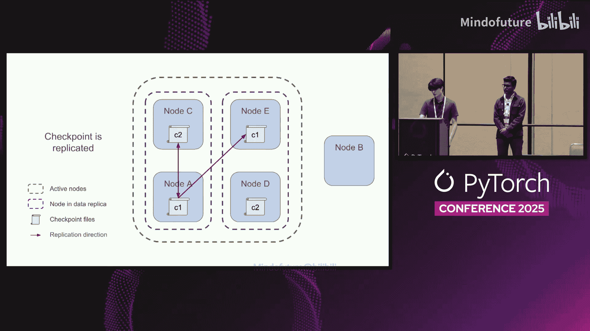
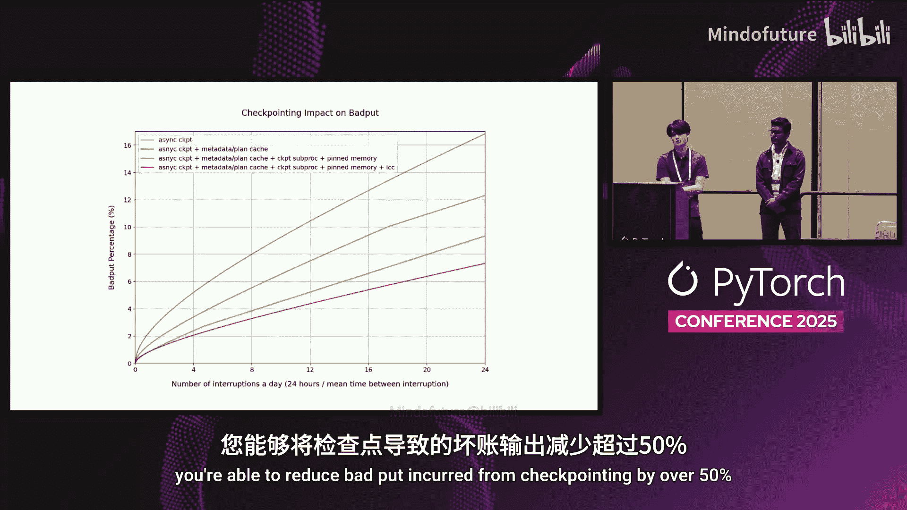

# 067：集群内分布式检查点教程

## 概述

在本教程中，我们将学习如何优化大规模PyTorch分布式训练中的检查点机制。我们将重点探讨检查点操作带来的性能开销、训练中断导致的进度损失，以及如何通过一系列优化技术（特别是**集群内分布式检查点**）来显著减少这些浪费，从而提升整体训练效率和资源利用率。

---

## 章节 1：检查点机制面临的挑战与权衡

在分布式训练任务中，即使我们定期保存检查点并在发生故障时恢复训练进度，仍然会浪费相当多的GPU计算小时。这主要有两个原因。

首先是**检查点开销本身**。频繁保存检查点会产生显著的开销，因此我们可能不希望保存太多检查点。

其次是**未受保护的训练进度**。如下图所示，在两次检查点之间的训练进度是“不安全”的，如果发生故障，这部分进度将丢失。这个不安全窗口的大小可能与检查点间隔时间一样长，并且需要乘以任务中GPU的数量。对于大规模任务，我们希望尽可能最小化这个检查点间隔，这意味着我们可能希望尽可能频繁地保存检查点。这里已经可以看到一个权衡。

更直观地说，如果我们绘制浪费的训练时间与检查点频率的关系图，曲线大致如下所示。

*   如果我们**检查点过于频繁**，那么由于检查点开销，浪费的训练时间会增加。
*   如果我们**检查点不够频繁**，那么由于不安全训练进度窗口变大，浪费的训练时间也会增加。

因此，对于大型任务，我们希望非常频繁地保存检查点，但同时希望将检查点开销降低到接近零。

---

## 章节 2：检查点过程中的主要开销分析

上一节我们介绍了检查点频率与训练效率的权衡，本节中我们来看看检查点操作本身具体有哪些开销。我们以异步检查点为例，因为关注训练效率的用户很可能已经在使用异步检查点了。除了数据暂存（staging）步骤外，检查点过程中的其他步骤（如元数据准备、规划、上传等）都是异步进行的。

以下是检查点过程中的主要开销：

1.  **数据暂存（Staging）开销**
    *   在此步骤中，我们将数据从GPU上传到主机内存。
    *   **内存开销**：我们为每次检查点保存分配和释放内存。
    *   **效率低下**：由于使用的是可分页内存，会发生页面错误，导致效率低下。
    *   **GPU阻塞**：此操作对GPU来说是阻塞的。

2.  **规划与元数据准备（Planning）开销**
    *   在此步骤中，我们规划不同数据类型如何序列化并保存到存储中，同时准备元数据。
    *   **元数据准备成本**：存在元数据准备的计算成本。
    *   **集体通信（Collective）瓶颈**：主要瓶颈在于集体通信。Rank 0 负责协调作业中的所有不同Rank，收集它们的本地元数据，然后进行验证、去重，创建描述整个检查点的全局元数据。我们观察到，这种集体通信的成本随着作业规模的增大呈**二次方增长**。

3.  **I/O 开销**
    *   **GIL争用**：我们观察到，由于训练线程和检查点线程之间的全局解释器锁（GIL）争用，GPU利用率会受到影响。在下图的右侧，您可以看到GPU利用率曲线，中间的红线标志着暂存步骤完成的时间。在此之后，GPU利用率应该恢复到之前的基线水平，但您可以看到它并未达到最优，低于预期。
    *   **存储带宽限制**：检查点的保存速度最终受限于存储带宽。

---

## 章节 3：针对各项开销的优化方案

针对上一节分析的各种开销，我们开发了多项优化技术。

**针对暂存（Staging）的优化**

*   **固定内存暂存**：我们现在使用基于固定内存的暂存方式。内存被页面锁定，因此不会遇到页面错误。
*   **与前向传播重叠**：另一个有趣的想法是，在训练的前向传播步骤中，模型权重不会改变。因此，我们将暂存步骤与前向传播步骤重叠。这样，暂存步骤实际上变得**部分异步**。

**针对规划（Planning）的优化**

*   **Rank本地检查点**：我们引入了Rank本地检查点机制，每个Rank保存和恢复自己的数据和元数据。
*   **元数据缓存**：另一个有趣的想法是，跨不同版本的检查点，描述检查点的元数据不会改变。因此，我们可以缓存这些元数据和所有运行时对象，从而在不同检查点保存之间**分摊元数据准备成本**。

**针对I/O的优化**

*   **基于进程的检查点**：我们构建了基于进程的检查点机制，完全消除了之前描述的GIL争用问题。
*   **集群内检查点**：针对存储带宽限制，我们构建了集群内检查点机制，在集群内部暂存和复制检查点。

为了提供更多技术细节，接下来将介绍集群内检查点方案及其在云环境中的价值。

---

## 章节 4：云环境中的训练效率与集群内检查点

我们与PyTorch团队合作的原因之一，是为了将一些最新、最先进的检查点优化技术带给Google Cloud的客户。

我想进一步说明在云上训练的情况以及如何衡量效率。云客户希望最大化投资回报，非常关心原始性能指标，如MFU（模型浮点运算利用率）、每秒处理的令牌数和每一步的训练时间。这些指标对于在短时间内理解模型的整体效率非常有用。

然而，随着训练任务规模扩大，由于这些工作负载的高度分布式特性，客户会遇到意外的故障和容错问题。由于AI工作负载的高度耦合性，当一个节点宕机时，整个训练任务将停止进展。这真正强调了**整体性能**的重要性。我们不仅关心单步的性能，更关心整个训练任务过程中的性能。

我们为此定义了一个指标：**良品率（Goodput）**。为了理解良品率，请看右侧的示意图。条形图代表训练花费的总时间，其中80%的时间用于峰值性能下的训练，剩余的20%时间则浪费在意外中断、故障和掉队节点等情况上。我们将良品率定义为用于生产性训练的时间百分比（即80%），剩余时间被视为**不良品率（Badput）**，即1 - 80% = 20%。

良品率对客户非常重要，因为它关系到产品上市时间，并可能节省数百万美元的成本。

现在，回到检查点，为什么检查点对良品率如此重要？原因有以下几点：

*   **保存开销**：在稳定训练期间，您保存的每个检查点都有一定程度的保存开销。这会导致步进时间变慢，并最终延长收敛时间。
*   **加载开销**：在这些意外中断期间，您必须将状态重新加载到HBM（高带宽内存）中。这是加载开销，本质上是没有用于训练的时间。
*   **进度丢失**：此外，您必须将状态回滚到旧的检查点。任何未保存的进度都被视为丢失，在这些丢失的步骤上花费的训练时间被视为**进度浪费**。

之前介绍的异步检查点优化对于最小化检查点带来的不良品率非常有效，但由于现有存储I/O瓶颈（尤其是在云环境中，存储位于持久化位置），仅靠这些优化还不够。

因此，我们共同合作为Google Cloud的客户开发了**集群内检查点**解决方案，旨在最小化检查点带来的不良品率。

我们将集群内检查点定义为：能够在**无需持久化存储**的情况下，在本地保存和加载检查点。如下图所示，您只需在集群本身内部管理所有检查点。

这样做的好处显而易见：由于可以利用RAM磁盘，读写速度要快得多。您还可以将其与更传统的基于持久化存储的检查点解决方案结合起来，形成一个**多层检查点解决方案**。即，您可以频繁地在本地保存检查点，并偶尔保存到持久化存储，以防发生任何灾难性的集群范围故障。

当结合之前介绍的PyTorch DCP异步优化时，您能够将保存开销推至接近零，从而充分利用并发挥频繁在本地保存检查点的能力。

---

## 章节 5：集群内检查点工作原理示例

我希望通过一个示例来直观说明集群内检查点的工作原理。

这里我们有一个简化的客户训练工作负载，包含四个节点、两个数据副本，并且有一个热备节点。请注意，热备节点没有检查点状态，因为检查点（或训练状态）是频繁更新的。

现在，假设一个节点宕机。为了尽快恢复训练，客户会预留一部分容量，这样当节点宕机时，可以立即替换。然而，您可以看到刚刚替换进来的节点E没有检查点状态。

此外，**原位重置（in-place reset）** 无法保证。这意味着，当您交换节点时，整体的网络拓扑结构会发生变化，这决定了您如何定义分布式集体通信和组。因此，在这个例子中，节点A和节点C在我们的网络拓扑中交换了位置，因此需要传输状态。

在我们的集群内检查点解决方案中，我们能够在**加载时复制状态**。我们看到节点A和C（两者都已存在于集群中）正在交换状态，同时节点A也将状态传递给节点E，使得节点E拥有所需的检查点，从而可以恢复训练。

在利用快速网络完成所有交换后，我们就能够恢复训练。

---

## 章节 6：优化效果与总结

我希望这能帮助大家理解集群内检查点的工作原理。我们也有一些实证结果。

下图显示了检查点对不良品率的影响。在Y轴上，我们绘制了由检查点引起的总体不良品率百分比；在X轴上，我们显示了一天内的中断次数。

我们可以看到，随着引入之前介绍的每一项异步检查点优化，我们能够降低不良品率百分比。此外，通过增加集群内检查点，我们能够进一步将不良品率百分比推至接近零。

这里的一个高级要点是：集群内检查点以及这些异步优化都很重要。根据您遇到这些中断的频率，您可能需要不同复杂程度的解决方案。在极端情况下，结合所有这些优化，您能够将检查点引起的不良品率降低**超过50%**。

**总结**

在本教程中，我们一起学习了大规模PyTorch分布式训练中检查点机制的核心挑战，包括检查点开销与进度丢失的权衡。我们深入分析了检查点过程中的主要性能瓶颈：数据暂存、规划通信和I/O限制。接着，我们探讨了针对性的优化方案，如固定内存、Rank本地检查点、元数据缓存等。最后，我们重点介绍了**集群内分布式检查点**这一高级解决方案，它通过在集群内部利用高速存储（如RAM磁盘）来频繁保存检查点，并结合异步优化，将检查点开销降至最低，从而显著提升了训练良品率，为大规模高效训练提供了关键支持。