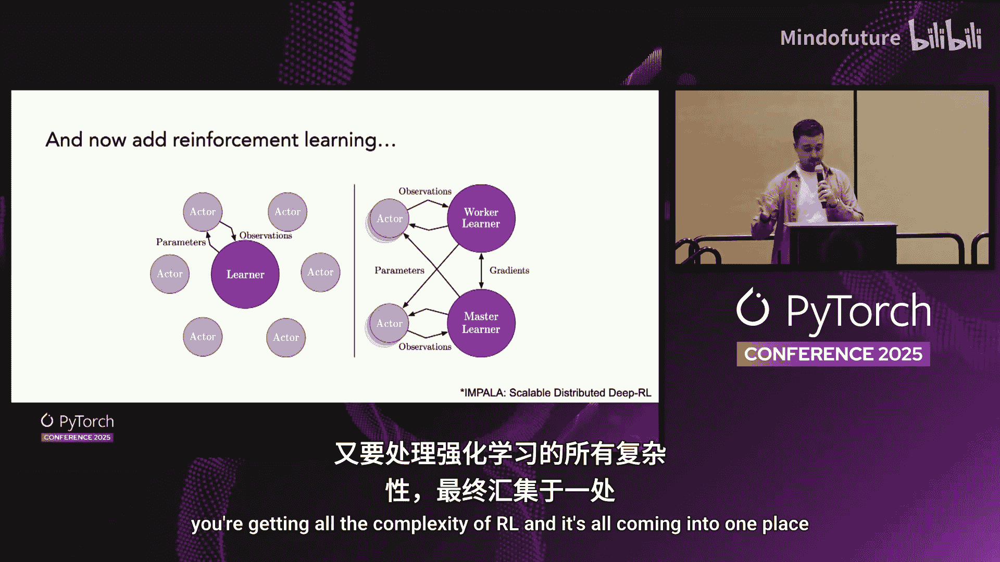
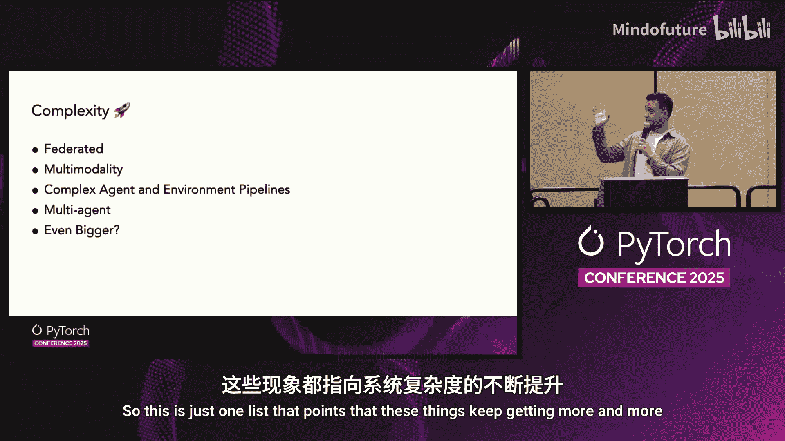

# 068：参数的生命周期

## 概述

在本节课程中，我们将跟随 Meta 的 Philip Bontrager，深入探讨在大规模强化学习场景下，模型参数从加载、训练到保存的完整生命周期。我们将看到，当模型规模扩展到万亿参数级别，并涉及复杂的分布式训练与推理协同工作时，即使是“创建参数、更新参数、保存检查点”这样基础的操作，也会变得异常复杂。我们将逐一拆解这个过程中的每个步骤，理解其背后的挑战与解决方案。

---

## 从单机到数据中心：规模的演变

回顾深度学习的发展历程，我们对参数的处理方式发生了巨大变化。

最初，我们只有简单的感知机，参数数量很少，可以在古老的 CPU 上运行。随后，模型发展为多层感知机，层数增多，但依然在 CPU 上运行，或许会用到多进程，但总体上仍可在个人电脑上完成。

大约15年前，我们进入了 GPU 时代，模型开始在 GPU 上运行。这引入了处理不同硬件类型（加速器）的额外复杂性，并且我们开始使用多 GPU。然而，只要更换后端，编程和开发方式基本保持不变。这仍然是一个人能够完成的工作。

而在最近五年左右，我们达到了一个新的阶段：模型在整个数据中心进行训练。正是在这里，情况开始发生根本性改变。模型分布在数据中心各处，这改变了许多先前的假设。如果一个模型有万亿参数，即使使用 FP8 精度，也需要处理 1TB 的数据，这无法在任何单块硬件上容纳。

除了规模，复杂性也在增加。常规训练（或称预训练）是进行前向传播、反向传播的监督学习。你有一批数据，然后更新模型权重。

但一直存在另一种训练范式，即强化学习。在这里，你是在训练数据的同时生成数据。为了获得训练所需的数据，你需要与环境进行交互。这就引入了多进程协调。这一直是一个复杂的领域。

而当前正在发生的是，这两者正在融合：你既在进行超大规模训练，又面临着强化学习的所有复杂性，它们汇聚到了一起。

---

## 聚焦核心：参数的生命周期

面对如此复杂的图景，我们选择聚焦于其中一个方面：参数的生命周期。参数可能是最平凡的部分，你几乎不会去思考它。训练时，你创建模型，初始化参数，进行一些更新，然后保存检查点。非常基础。

但是，当你在一个集群上处理万亿参数时，所有事情都变了。

以下是一个简化集群的示意图。你拥有存储权重的云端网络存储，以及集群中运行的所有不同节点。这里展示了四个节点，每个节点有多个 GPU 共享内存。随着硬件变化，布局也会不同，但这是一个常见布局。

我们将跟随一个特定的参数（图中红色高亮部分），看看它经历了什么。每个参数都有其键名、大小和数据类型。数据类型的多样性本身就是过去无需过多处理的新复杂度，你可能需要根据训练或推理的需求，处理高度量化或高精度的格式。

---

## 第一步：下载与加载

首先，你需要下载预训练好的权重。如果模型有 1TB，你不会想把它下载到每台单独的计算机上。因此，你需要网络存储。下载到网络存储是过程中最简单的部分。

接下来变得复杂的是：如何将这个庞大的模型加载到 GPU 上？在这个例子中，我们将集群的一半用于训练，有两个节点。在确定参数存放位置之前，我们需要先分配它们。

如果你只是简单地创建并实例化所有张量，它们无法放入任何单个进程的内存中。每个 GPU 运行一个独立的进程。因此，你需要创建一个虚拟的“元张量”来规划一切，并只将一小部分内存分配给每个进程。

现在，你准备好实际加载参数了。读取检查点时，你拥有的检查点格式可能与训练器内部的格式不匹配。你不能直接读取，因为可能为了加速训练，你在训练器中合并了检查点里原本分开的张量，或者名称不同。因此，你需要跟踪所有这些变化的映射关系，并在读取时应用它们。

下一个部分是分片。如前所述，模型被分割到所有 GPU 上。因此，你不需要为每个 GPU 读取整个文件。你需要能够只读取文件的一小部分，并有效地将其拆分，以便每个进程只读取它需要的数据。每个进程都需要读取同一个文件，并知道它们各自获取的是不同的数据片段。

最后一步可能是处理反量化。例如，检查点可能是 FP8 格式（用于推理），但训练时你可能需要 BF16 甚至 FP32 以获得更稳定的梯度训练。因此，在读取数据的同时，你需要实时进行反量化，以便将实际参数放入分配好的内存空间中。

---

## 参数分片策略

我们提到了分片，但如何实际分片参数呢？以下是四种流行的分片策略及其工作原理和选择考量。这高度依赖于你的模型架构和集群布局。

**1. 流水线并行**
这种策略并不拆分具体的张量，而是将模型的层拆分到不同的计算单元上。例如，一个节点处理前半部分层，另一个节点处理后一半。这对于连接延迟较高的环境很有效，但难点在于需要保持所有计算单元同时忙碌，协调前向和反向传播的时间，以避免出现空闲。

**2. 专家并行**
这是混合专家架构特有的并行方式。在 MoE 中，一个层实际上有一组可选的矩阵。你可以将每个专家（即层的变体）放在不同的 GPU 上，然后通过路由将数据发送到需要的 GPU。这对延迟也不敏感，但缺点是不是通用架构，仅适用于 MoE。

**3. 数据并行**
这是最简单的形式：每个 GPU 上都有完整模型的一个副本，处理不同的数据。这很简单，但要求模型能完整放入单个 GPU 内存，对于大模型不适用。因此，衍生出了**分片数据并行**，如 FSDP。在这种方式下，每个 GPU 只保存每个参数的一部分。当需要计算某一层时，收集该层的所有分片，计算完整层，然后释放。这需要较低的网络延迟，但可以通过预取下一层参数来缓解。

**4. 张量并行**
这种策略将一切彻底分片。GPU 不仅只保存分片，在计算前向传播时也只计算该分片对应的部分矩阵乘法。这非常高效，GPU 负载更轻。但缺点是，输出结果必须与其他所有 GPU 的输出拼接后，才能传递给下一层，因此需要极低的网络延迟。

每种策略都有其优势和权衡。你需要根据具体的硬件和架构，决定哪种组合能带来最少的权衡。

---

## 训练与权重同步

完成分布式设置后，在加载检查点的最后，还需要处理反量化。将参数保持在低精度格式下，可表示的值范围较窄。技巧是将每几个参数分组为一个块，并为该块保存一个标量值，使数值归一化到低精度可表示的范围内。当需要以更高精度使用时，乘以该标量即可得到实际数值。块大小的选择是一种权衡：块太小则节省内存有限；块太大则若块内数值差异大，表示精度会下降。所有这些转换都在加载模型权重到训练器时实时发生。

现在，训练器可以开始训练了。就参数移动和变化而言，训练步骤本身很复杂，但我们可以简化理解为：数字发生了变化。进行了前向传播，计算了激活值，获得了梯度，参数得到了更新。

在我们的设置中，参数被分到四个 GPU 上（张量并行度为4），同时这些 GPU 组处理不同的数据（数据并行度为4）。模型正在训练，权重正在更新。

对于强化学习，一个新的独特需求是：必须将数据（即更新后的模型）同步到推理侧。推理侧进行解码生成，其模型定义可能针对自回归生成进行了优化（如使用 KV 缓存），与训练侧不同。

因此，当需要将权重推送回去时，我们必须以相反的顺序重复之前的所有步骤：将未量化的数据重新量化，转换回检查点格式，然后为推理侧期望的格式重新分片。

在这个例子中，我们将权重推送到训练节点的 CPU 内存中，然后移动到推理模型的 CPU 内存，最后加载到推理引擎。注意，推理侧可能有不同的布局（例如张量并行度为2），因为推理对内存和计算的要求与训练不同。

这种异步权重同步方式的好处是，训练器只需暂停很短的时间将权重推送到本地 CPU 内存，推理侧也只需暂停进行本地 GPU 内存拷贝，两者几乎可以持续运行。但异步训练可能存在数据陈旧性问题。

另一种选择是同步训练，目标是最大限度地减少数据从训练器移动到推理模型的时间。这时可以采用**直接 GPU 传输**，绕过 CPU 内存。但这需要处理不同分片布局之间的映射，并且训练器和推理侧必须在传输的整个过程中同时暂停。虽然总暂停时间更短，但两者都需要停止。

此外，你还可以选择保存到存储再读取（速度慢但简单），或者如果模型足够小，将训练和推理放在同一个节点上。优化的方式多种多样。

---

## 保存与总结

完成生成新数据、训练、更新参数的循环后，当我们对结果满意时，可以将权重推送回内存，最终保存到存储中。现在，我们有了一个可用的检查点。同样，我们需要量化权重，将其转换回原始格式，并合并成一个完整的模型。然后，我们可以上传、评估或用于任何目的。

总结所有这些步骤：
1.  从完整检查点开始。
2.  下载检查点。
3.  加载参数，进行所有转换，设置模型。
4.  更新并训练模型。
5.  将参数推送到 GPU 或暂存区。
6.  在推理侧完成同步，使其获得更新后的权重以生成更多数据。
7.  保存检查点。
8.  上传并评估。

这个“创建模型、更新权重、保存”的简单过程，如今已变得异常复杂，需要解决一系列基础设施问题，才能再次让人们易于使用。

---

## 未来展望

未来将走向何方？虽然无人能给出确切答案，但一些趋势表明情况可能会更加复杂。一旦跨越单个数据中心，涉及多个数据中心，它们之间的延迟将非常糟糕。可能需要联邦学习，或者允许数据中心之间短暂不同步后再同步。如果你处理多模态或视频数据，大量数据移动会与参数传输和分布式更新竞争带宽。同时，在 CPU 上运行的环境也会竞争 CPU 内存。可能还存在多个智能体，拥有不同的参数集，需要走不同的路径。规模还可能继续增长。这个列表只是表明，这些事物正变得越来越复杂。

---

## 本节课总结

本节课中，我们一起深入探讨了在大规模强化学习背景下，模型参数从加载、分布式分片、训练、跨训练/推理侧同步到最终保存的完整生命周期。我们看到了随着模型规模（万亿参数）和系统复杂性（强化学习、多节点集群）的急剧增长，即使是最基础的参数操作也演变为涉及网络存储、多精度转换、多种分片策略权衡、实时量化/反量化以及复杂通信模式的一系列复杂工程挑战。理解这个生命周期有助于我们把握现代大规模 AI 系统构建的核心难点与设计思路。