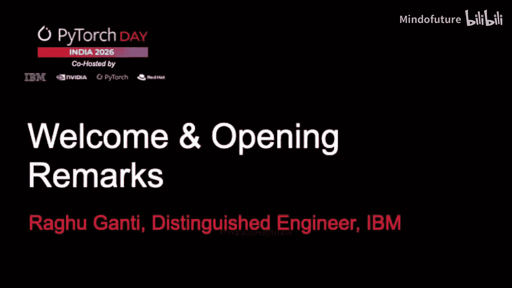
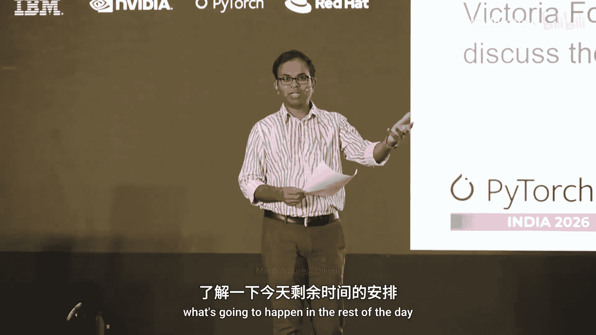
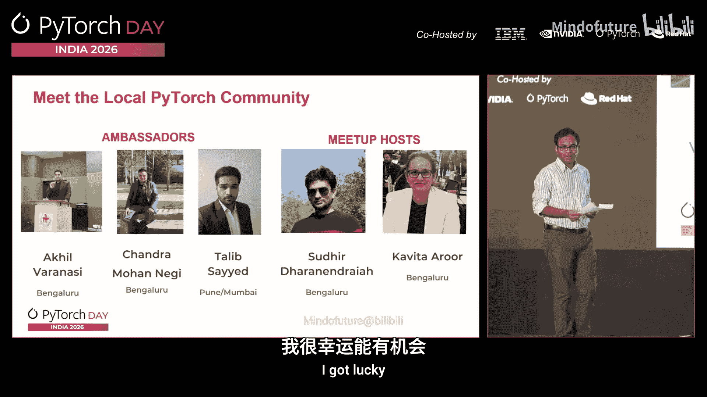
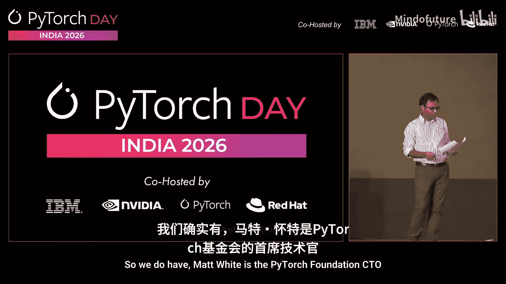

# 001：欢迎致辞与活动概览

在本节课中，我们将学习如何参与一场大型技术会议，了解活动的基本流程、组织架构以及如何从中获取最大价值。课程内容基于 PyTorch Day India 2026 欢迎致辞整理而成。

## 活动开场与欢迎

大家好，欢迎来到 PyTorch Day。

这是 PyTorch 基金会首次在印度举办 PyTorch Day 活动。看到整个会场座无虚席，令人惊叹。据了解，还有大约 200 人在等待名单中。希望下次我们能找到一个更大的场馆。

在这里，我看到了来自不同公司、不同领域的众多参与者。会场中有 AI 研究员、AI 从业者，以及以各种方式使用 PyTorch 的开发者。见到大家非常棒。

今天将是充满能量的一天，大约有 10 场演讲。你们将了解到集成到 PyTorch 中的加速器、大规模训练等话题，并聆听一些特邀嘉宾分享的最新动态。今天将充满乐趣和大量的学习机会，希望每位参与者都能从中收获颇丰。

现在，我们将从介绍今天的活动安排开始。

## 活动日程与社交安排

以下是全天的基本活动安排。

*   **上午和下午**：在 Grand Victoria 门厅提供咖啡和茶歇。
*   **社交聚会**：在一天活动接近尾声时，同样在 Grand Victoria 门厅，会有一个社交聚会，提供茶点。大家可以借此机会放松并相互交流。

今天现场大约有 500 到 600 人，来自各行各业。请大家充分利用机会，积极交流，拓展人脉。

## 活动组织团队介绍

接下来，向大家介绍促成这次活动的核心团队。

首先是主办方 **Sudhir** 和 **Kavita**。Sudhir 就在现场，请他上台让大家认识一下。Kavita 来自英伟达，她也会到场。

此外，我们还有本次活动的**大使**，他们是大家联系本地资源的桥梁。他们是 **Akil**、**Chandra** 和 **Tlib**。如果你们在现场，请举手示意。

好的，看到了一位。现在大家认识了他们的面孔，他们是你们遇到任何问题时可以求助的人。有任何疑问，请随时联系他们中的任何一位。

## 特别致辞与开场

最后需要说明的是，我原本并未计划上台为会议开幕。我很幸运能站在这里，因为 **Matt White**——PyTorch 基金会的首席技术官—— unfortunately 未能亲临现场。

为此，他准备了一段简短的视频，将为大家介绍 PyTorch 的总体情况。

---

本节课中，我们一起学习了如何参与技术会议：从感受热烈的欢迎氛围，到了解全天的日程与社交安排，再到认识活动的组织团队。理解这些环节能帮助你更有效地规划会议时间，主动交流，并充分利用活动资源进行学习与 networking。